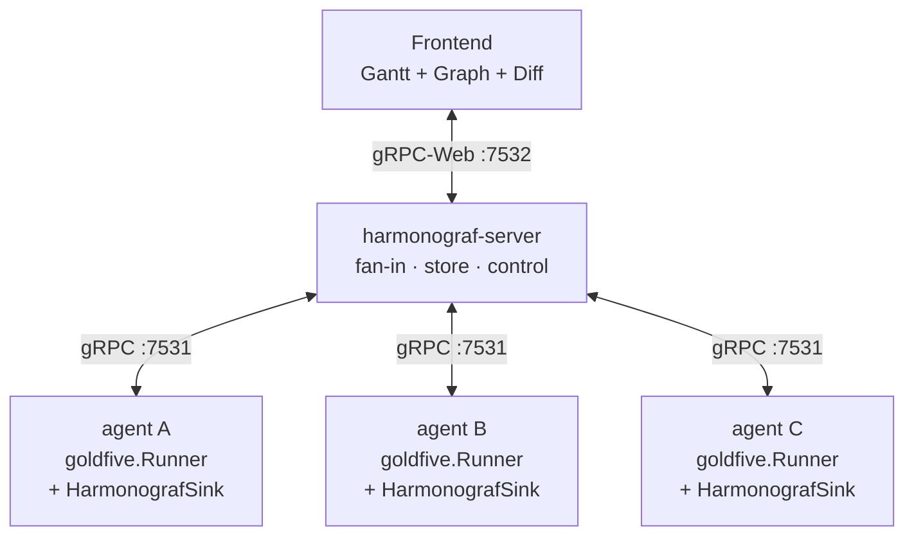

# Harmonograf

**The observability + HCI companion to [goldfive](https://github.com/pedapudi/goldfive)
for multi-agent orchestration.**

Harmonograf renders agent activity as a Gantt-style timeline, surfaces the
plan / task / drift story goldfive emits, tracks every human intervention
chronologically in a dedicated Trajectory view, and lets operators push back —
pause, resume, steer, cancel — on the same connection it observes runs on.

Three integration modes, same server, same UI:

- **`goldfive.wrap` + `HarmonografTelemetryPlugin`** — full orchestration
  observability + steering. Plans, tasks, drift, per-ADK-agent Gantt rows,
  and the full intervention history all light up. See
  [`docs/goldfive-integration.md`](docs/goldfive-integration.md).
- **Observation-only via `HarmonografTelemetryPlugin` on a bare ADK App** —
  no orchestration, no plans/tasks, just per-invocation / per-model-call /
  per-tool-call spans on the Gantt. Useful when you already have your own
  orchestrator and just want the console.
- **Standalone (non-ADK)** — construct a `harmonograf_client.Client` directly
  from any Python process and call `emit_span_start/update/end`. The home
  session auto-creates on first emit; no ADK, no goldfive usage surface.
  See [`docs/standalone-observability.md`](docs/standalone-observability.md).

Goldfive owns the plan / task state machine / drift taxonomy / reporting
tools. Harmonograf is the screen you watch those run on — and the keyboard
you reach back through.

---

## What is Harmonograf?

Multi-agent systems break every assumption that single-agent observability tools
are built on. A chat completion is no longer an "operation" — it is one beat
inside a rollout that may span five sub-agents, parallel branches, mid-flight
replans, and tool calls whose outputs feed tasks nobody planned ten seconds
earlier. Span trees flatten that structure into nested boxes and then ask you to
reconstruct the story.

Goldfive provides the orchestration primitives that make the story first-class —
plans are data, task state is explicit, drift is a first-class event, and
reporting tools are the contract between agent and framework. Harmonograf is the
screen you watch that story on:

- **One canonical timeline.** The server terminates goldfive event streams from
  every participating agent and fans them out to any number of frontend
  subscribers. One server, many agents, many viewers.
- **Plan-aware UI.** The Gantt, the inspector, the task strip, and the
  Trajectory view all render goldfive's plan / task / drift semantics
  directly. When goldfive fires a `PlanRevised` event, the frontend shows the
  diff side-by-side and logs it in the intervention timeline.
- **Per-ADK-agent rows.** Under `goldfive.wrap`, every ADK agent in the tree
  (coordinator, specialists, AgentTool wrappers, sequential/parallel
  containers) gets its own Gantt row, auto-registered the first time it
  emits. You see the tree, not a collapsed root (harmonograf#74 / #80).
- **Intervention history, first class.** The Trajectory view lists every
  point where the plan changed direction — STEER / CANCEL / PAUSE from the
  UI, autonomous drift, plan revisions — on one merged chronological ribbon
  (harmonograf#69 / #71 / #76).
- **Bidirectional by default.** The same connection that streams telemetry up
  also streams control down — pause, resume, steer, cancel, annotate — so the
  UI is a coordination surface, not a read-only dashboard.
- **Lazy Hello, unified sessions.** Under ADK, the client defers its Hello
  until the first real emit, so there are no ghost `sess_…` rows in the
  session picker. Goldfive events and spans route together onto the ADK
  session id the user sees in `adk web` (harmonograf#66 / #85).

Integration is a two-line install: `runner = harmonograf_client.observe(goldfive.wrap(root_agent))`
and the run's plans, tasks, drift, spans, and steering wire all light up at once.

### Views

Harmonograf has six views in the nav rail:

| View | What it shows |
|---|---|
| **Sessions** | Session picker — one row per session (post-lazy-Hello) with agent counts, attention badges, time-ago labels. |
| **Activity** (Gantt) | Per-ADK-agent rows, time on X, bars for every LLM call / tool call / transfer / invocation. The task strip at the bottom shows current stages with per-task status chips. Minimap, live-tail cursor, transport bar. |
| **Graph** | Agent topology — nodes are agents, edges are transfers and tool invocations. Minimap in the corner. |
| **Trajectory** | Intervention history ribbon (harmonograf#69 / #76) — one marker per intervention (STEER, CANCEL, drift, plan revision), glyph-by-kind, color-by-source (user vs. autonomous), severity ring, density clustering. Click any marker to see who, when, why, and what happened next. |
| **Notes** | Session-wide annotation stream. |
| **Settings** | Server URL, theme, keyboard shortcuts reference. |

### Screenshots

**Gantt timeline** — five agents running a multi-task research workflow. The task plan strip at the bottom shows stages with per-task status chips.


**Agent topology graph** — the same session viewed as an agent graph with transfer arrows, task chips, and a minimap in the corner.


**Session picker** — browse all sessions with agent counts, attention badges, and time-ago labels. One row per session post-lazy-Hello (harmonograf#85).


**LLM call popover with thinking** — click any span to see a floating popover. LLM calls surface the model's chain-of-thought in an expandable thinking section.


**Inspector drawer** — the drawer shows span details across Summary, Task, Payload, Timeline, and Links tabs. Here the Payload tab reveals the tool-use schema sent to the model.


---

## Get running in 10 minutes

### Hello world — `make demo`

The fastest path to a live multi-agent rollout on screen: boot the
server + frontend + `adk web` and drive the `presentation_agent_orchestrated`
reference agent.

```bash
git clone https://github.com/pedapudi/harmonograf
cd harmonograf
git clone --depth 1 https://github.com/google/adk-python.git third_party/adk-python
make install
make demo                        # server + frontend + adk web
```

Then open:
- Harmonograf UI at <http://127.0.0.1:5173>
- `adk web` at <http://127.0.0.1:8080>
- Pick `presentation_agent_orchestrated` in the ADK picker and drive a prompt.

The agent tree + goldfive wrap come from the `presentation_agent_orchestrated`
reference (see [`tests/reference_agents/presentation_agent_orchestrated/`](tests/reference_agents/presentation_agent_orchestrated/README.md)).
Plans, tasks, drift, per-ADK-agent rows, and intervention markers all light
up live. Set `$OPENAI_API_KEY` / `$GOOGLE_API_KEY` for live LLM use; leave
them unset and the orchestrated agent falls back to a canned mock plan.

### Standalone (no goldfive, no ADK)

Emit synthetic spans from a plain Python script:

```bash
make demo-standalone    # server + frontend + spans_only.py
```

The frontend renders a session with a Gantt; Tasks panel stays empty.
Full walkthrough: [`docs/standalone-observability.md`](docs/standalone-observability.md).

### Observation-only (bare ADK, no goldfive.wrap)

Attach a `HarmonografTelemetryPlugin` to an `App`'s `plugins=[…]`. See
[`examples/standalone_observability/adk_telemetry.py`](examples/standalone_observability/adk_telemetry.py).

---

## Architecture

Harmonograf is three components that share one data model. Telemetry (spans +
goldfive events) flows up from agents through the server to the browser;
control messages flow back down on the same connections.



| Component | Path | Language | Role |
|---|---|---|---|
| **Frontend** | `frontend/` | TypeScript / React / Vite | Sessions list, Activity (Gantt), Graph, Trajectory (intervention history), Notes, Settings. Talks gRPC-Web to the server. |
| **Server** | `server/` | Python / asyncio / grpcio | Terminates connections from every client, owns the canonical timeline, stores it (SQLite or in-memory), fans out live updates to any number of frontend subscribers, aggregates interventions, and routes control. |
| **Client library** | `client/` | Python | Embedded inside each agent. Provides `Client` (span transport, payload upload, control handlers), `HarmonografSink` (a `goldfive.EventSink` that forwards plan / task / drift events), and `HarmonografTelemetryPlugin` (ADK `BasePlugin` emitting per-callback spans with per-ADK-agent attribution). |

Orchestration semantics — plans, tasks, drift kinds, reporting tools, refine
pipeline, session-state protocol — live in [goldfive](https://github.com/pedapudi/goldfive).
Harmonograf consumes them, it does not define them.

The data model shared between client, server, and frontend is defined in
`proto/harmonograf/v1/*.proto`. Goldfive's `Event` envelope is imported from
`goldfive/v1/events.proto` and rides through harmonograf's `TelemetryUp` as a
first-class variant. Regenerate stubs with `make proto`.

---

## Quickstart

Five steps from clone to a running demo. Detailed walk-through with troubleshooting
and local-LLM wiring in [docs/quickstart.md](docs/quickstart.md).

**Prerequisites:** Python 3.11+ with [`uv`](https://github.com/astral-sh/uv), Node
20+ with `pnpm`, `git`, and either a reachable OpenAI-compatible endpoint or
`GOOGLE_API_KEY` for the default Gemini model.

```bash
# 1. Clone and enter
git clone https://github.com/<your-org>/harmonograf.git
cd harmonograf

# 2. Install all three components + pull the ADK submodule
make install

# 3. Regenerate proto stubs (only needed after .proto edits; first clone is fine)
make proto

# 4. Point at a local OpenAI-compatible LLM (optional — skip if you have GOOGLE_API_KEY)
export OPENAI_API_BASE=http://localhost:8080/v1
export OPENAI_API_KEY=dummy
export USER_MODEL_NAME=openai/qwen3.5:122b

# 5. Boot the full demo stack
make demo
```

`make demo` starts three processes in one foreground shell: `harmonograf-server`
on `127.0.0.1:7531` (gRPC) + `:7532` (gRPC-Web), the Vite frontend on
`http://127.0.0.1:5173`, and `adk web` hosting two reference-agent variants on
`http://127.0.0.1:8080` — `presentation_agent` (observation; plain ADK +
`HarmonografTelemetryPlugin`) and `presentation_agent_orchestrated` (the same
tree wrapped with `goldfive.wrap(...)` so you see the full plan / dispatch /
drift stream, per-ADK-agent Gantt rows, and intervention history). Pick a
variant in the ADK picker, drive a rollout, and watch the timeline
materialise live in the harmonograf tab. Ctrl-C tears all three down.

---

## Documentation

| Doc | Purpose |
|---|---|
| [docs/tour/](docs/tour/index.md) | Start-here tour: three doors, 15-minute walkthrough, mental model, terminology map. |
| [docs/quickstart.md](docs/quickstart.md) | Step-by-step from clone to running demo, with troubleshooting and local-LLM wiring. |
| [docs/overview.md](docs/overview.md) | Longer-form writeup: motivation, design principles, current features, non-goals, roadmap. |
| [docs/goldfive-integration.md](docs/goldfive-integration.md) | How harmonograf consumes goldfive: `HarmonografTelemetryPlugin`, `HarmonografSink`, `observe()`, `goldfive_event` envelope, per-ADK-agent rows, session unification. |
| [docs/standalone-observability.md](docs/standalone-observability.md) | Non-ADK flow: emit spans from any Python process with `harmonograf_client.Client`. |
| [docs/operator-quickstart.md](docs/operator-quickstart.md) | Flags, retention, health probes, bearer-token auth, STEER from the UI — the ops-facing reference. |
| [docs/reporting-tools.md](docs/reporting-tools.md) | Redirect to goldfive's reporting-tool reference (owned there post-migration). |
| [docs/user-guide/](docs/user-guide/) | Navigating the UI: Gantt, graph, trajectory, inspector, transport bar, keyboard shortcuts. |
| [docs/dev-guide/](docs/dev-guide/) | Building from source, adding a storage backend, wiring a new framework adapter, writing tests. |
| [docs/protocol/](docs/protocol/) | Wire protocol, proto reference, span lifecycle, control stream. |
| [docs/design/](docs/design/) | Per-component design notes — data model, client library, server, frontend, human-interaction model, information flow. |
| [docs/runbooks/](docs/runbooks/) | Triage for common failures — drift not firing, task stuck, demo-wont-start, etc. |
| [docs/internals/](docs/internals/) | Annotated tours of hot paths (ingest bus, sqlite, session store, renderer, drift catalog). |
| [docs/milestones.md](docs/milestones.md) | Shipped + in-flight incremental delivery. |
| [docs/goldfive-migration-plan.md](docs/goldfive-migration-plan.md) | Design record for the harmonograf → goldfive migration. COMPLETED 2026-04-18. |

Orchestration references (reporting tools, drift taxonomy, task state machine,
session-state protocol) now live in the [goldfive](https://github.com/pedapudi/goldfive)
docs. Pages under `docs/` that described those topics in the standalone era
carry a DEPRECATED banner pointing to goldfive.

---

## Status

Harmonograf is pre-1.0 and under active development. The demo flow (`make demo`
against the reference goldfive agent) is the canonical smoke test — if it runs
green, the ingest → storage → bus → frontend pipeline is healthy for both spans
and goldfive events.

Deliberate non-goals for v0 are listed in
[docs/overview.md](docs/overview.md#non-goals); notable ones include TLS,
clustering, and multi-tenant auth.

---

## Contributing

Contributions are welcome. Before starting non-trivial work, read
[AGENTS.md](AGENTS.md) for the project vision and the component split between
harmonograf and goldfive, and [docs/design/](docs/design/) for the component the
change touches. A developer guide with local-dev workflows, test matrix, and
release process is landing as [docs/dev-guide/](docs/dev-guide/).

Ground rules: don't invent features when existing features can be extended,
prefer editing existing files over creating new ones, keep orchestration changes
in goldfive and observability changes in harmonograf, and if you change the
proto run `make proto` and commit the regenerated stubs alongside the source
change.

---

## License

Apache License 2.0. See [`LICENSE`](LICENSE) for the full text.
