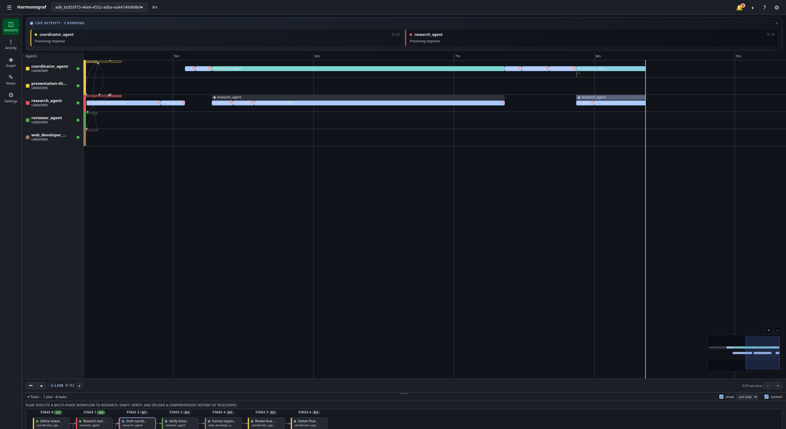
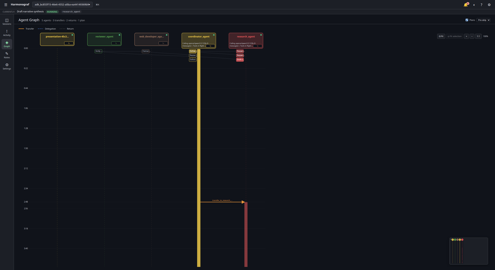
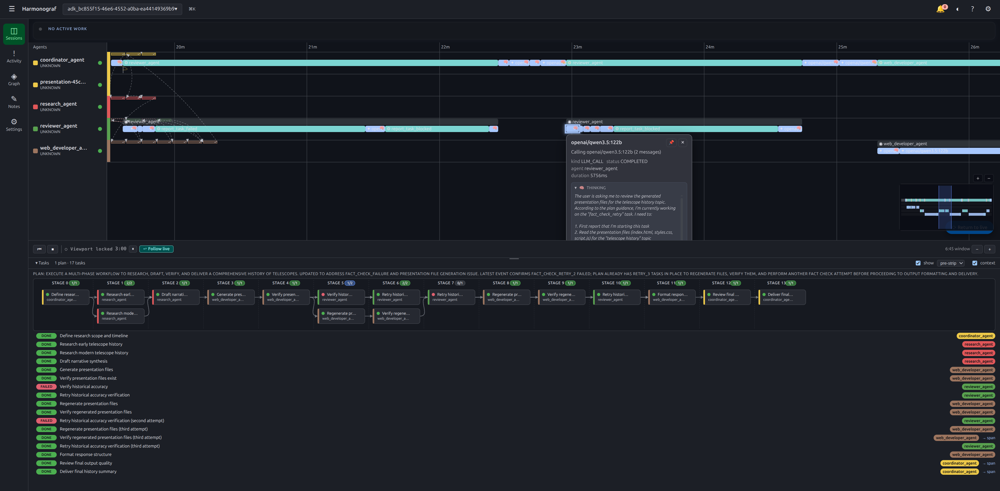
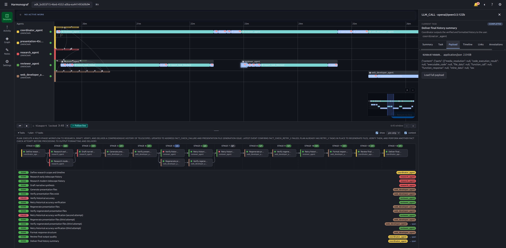
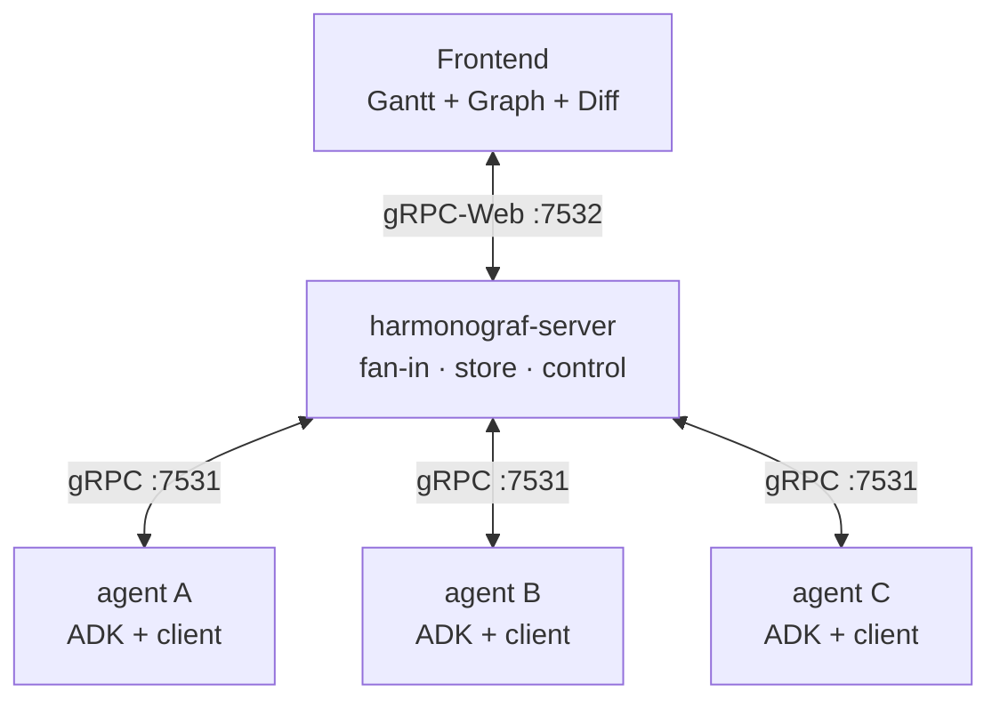

# Harmonograf

**A console for observing, understanding, and coordinating multi-agent systems.**

Harmonograf gives you a Gantt-chart-style view of what a fleet of agents is doing in
real time — who is running, which task they are on, what tool they just called, where
the plan has drifted, and which runs are stuck. It is not a passive log viewer: the
server terminates bidirectional connections from every participating client, so the
UI can steer agents back through the same channel it observes them on.

The first-class integration target is [Google's Agent Development Kit
(ADK)](https://github.com/google/adk-python). Harmonograf ships with an ADK plugin
that wires up telemetry, reporting tools, and bidirectional control with one line of
code and no changes to your agent graph.

---

## What is Harmonograf?

Multi-agent systems break every assumption that single-agent observability tools are
built on. A chat completion is no longer an "operation" — it is one beat inside a
rollout that may span five sub-agents, parallel branches, mid-flight replans, and
tool calls whose outputs feed tasks nobody planned ten seconds earlier. Span trees
flatten that structure into nested boxes and then ask you to reconstruct the story.

Harmonograf keeps the story first-class:

- **Plans are data.** Every run starts with a plan, every task has an explicit
  lifecycle, and the state machine is monotonic and driven by the agent itself, not
  inferred from when a span closed.
- **Drift is a first-class event.** Tool errors, refusals, new work discovered,
  plan divergence, and ~20 other drift kinds fire a deferential "refine" call that
  produces a revised plan, live in the UI, with a visual diff against the old one.
- **The UI talks back.** The same connection that streams telemetry up also streams
  control down — pause, resume, send a note, steer, cancel. The frontend is a
  coordination surface, not a read-only dashboard.

### Screenshots

**Gantt timeline** — five agents running a multi-task research workflow. The task plan strip at the bottom shows stages with per-task status chips.



**Agent topology graph** — the same session viewed as an agent graph with transfer arrows, task chips, and a minimap in the corner.



**Session picker** — browse all sessions with agent counts, attention badges, and time-ago labels.


**LLM call popover with thinking** — click any span to see a floating popover. LLM calls surface the model's chain-of-thought in an expandable thinking section.



**Inspector drawer** — the drawer shows span details across Summary, Task, Payload, Timeline, and Links tabs. Here the Payload tab reveals the tool-use schema sent to the model.



---

## Architecture

Harmonograf is three components that share one data model. Telemetry flows up from agents through the server to the browser; control messages flow back down on the same connections.



| Component | Path | Language | Role |
|---|---|---|---|
| **Frontend** | `frontend/` | TypeScript / React / Vite | Gantt timeline, agent topology graph, plan-diff drawer, inspector, transport bar. Talks gRPC-Web to the server. |
| **Server** | `server/` | Python / asyncio / grpcio | Terminates connections from every client, owns the canonical timeline, stores it (SQLite or in-memory), and fans out live updates to any number of frontend subscribers. Also the control bridge. |
| **Client library** | `client/` | Python | Embedded inside each agent. Ships with an ADK plugin (`attach_adk`), reporting tools, a DAG walker for parallel mode, session-state protocol, and a buffered transport that survives server restarts. |

The data model (`Session`, `Agent`, `Task`, `Plan`, `Span`, `Payload`, `ControlMessage`)
is defined once in `proto/harmonograf/v1/*.proto` and regenerated into all three
components via `make proto`.

### Orchestration modes

`HarmonografAgent` can run an ADK agent graph in one of three modes, selected by
`orchestrator_mode` and `parallel_mode`:

| Mode | Flags | How the plan executes |
|---|---|---|
| **Sequential** (default) | `orchestrator_mode=True, parallel_mode=False` | The plan is fed as one user turn and the coordinator LLM executes it; per-task lifecycle is reported via the reporting tools. |
| **Parallel** | `orchestrator_mode=True, parallel_mode=True` | A rigid-DAG batch walker drives sub-agents directly, respecting plan edges as dependencies and using a forced `task_id` ContextVar so parallel branches never race. |
| **Delegated** | `orchestrator_mode=False` | A single delegation with an event observer scanning for drift afterward; the inner agent is in charge of its own task sequencing. |

Full protocol reference: [docs/protocol/](docs/protocol/).

---

## Quickstart

Five steps from clone to a running demo. Detailed walk-through with troubleshooting
and local-LLM wiring in [docs/quickstart.md](docs/quickstart.md).

**Prerequisites:** Python 3.11+ with [`uv`](https://github.com/astral-sh/uv), Node
20+ with `pnpm`, `git`, and either a reachable OpenAI-compatible endpoint or
`GOOGLE_API_KEY` for the default Gemini model.

```bash
# 1. Clone and enter
git clone https://github.com/<your-org>/harmonograf.git
cd harmonograf

# 2. Install all three components + pull the ADK submodule
make install

# 3. Regenerate proto stubs (only needed after .proto edits; first clone is fine)
make proto

# 4. Point at a local OpenAI-compatible LLM (optional — skip if you have GOOGLE_API_KEY)
export OPENAI_API_BASE=http://localhost:8080/v1
export OPENAI_API_KEY=dummy
export USER_MODEL_NAME=openai/qwen3.5:122b

# 5. Boot the full demo stack
make demo
```

`make demo` starts three processes in one foreground shell: `harmonograf-server`
on `127.0.0.1:7531` (gRPC) + `:7532` (gRPC-Web), the Vite frontend on
`http://127.0.0.1:5173`, and `adk web` hosting `presentation_agent` on
`http://127.0.0.1:8080`. Drive a presentation from the ADK tab; watch the timeline
materialise live in the harmonograf tab. Ctrl-C tears all three down.

---

## Documentation

| Doc | Purpose |
|---|---|
| [docs/overview.md](docs/overview.md) | Longer-form writeup: motivation, design principles, current features, non-goals, roadmap. Start here after this README. |
| [docs/quickstart.md](docs/quickstart.md) | Step-by-step from clone to running demo, with troubleshooting and local-LLM wiring. |
| [docs/operator-quickstart.md](docs/operator-quickstart.md) | Flags, retention, health probes, bearer-token auth — the ops-facing reference. |
| [docs/reporting-tools.md](docs/reporting-tools.md) | The reporting-tool protocol agents use to communicate task state. |
| [docs/user-guide/](docs/user-guide/) | Navigating the UI: Gantt, graph, inspector, diff drawer, transport bar, keyboard shortcuts. |
| [docs/dev-guide/](docs/dev-guide/) | Building from source, adding a storage backend, wiring a new framework adapter, writing tests. |
| [docs/protocol/](docs/protocol/) | Wire protocol, proto reference, session-state schema, drift taxonomy, plan-diff semantics. |
| [docs/design/](docs/design/) | Per-component design notes — data model, client library, server, frontend, human-interaction model, information flow. |
| [docs/milestones.md](docs/milestones.md) | Incremental delivery plan. |

---

## Status

Harmonograf is pre-1.0 and under active development. The demo flow (`make demo`
against `presentation_agent`) is the canonical smoke test — if it runs green, the
core pipeline is healthy.

Deliberate non-goals for v0 are listed in
[docs/overview.md](docs/overview.md#non-goals); notable ones include TLS,
clustering, and multi-tenant auth.

---

## Contributing

Contributions are welcome. Before starting non-trivial work, read
[AGENTS.md](AGENTS.md) for the project vision and the plan-execution protocol, and
[docs/design/](docs/design/) for the component the change touches. A developer guide
with local-dev workflows, test matrix, and release process is landing as
[docs/dev-guide/](docs/dev-guide/).

Ground rules: don't invent features, prefer editing existing files over creating new
ones, and if you change the proto run `make proto` and commit the regenerated stubs
alongside the source change.

---

## License

Apache License 2.0. See [`LICENSE`](LICENSE) for the full text.
