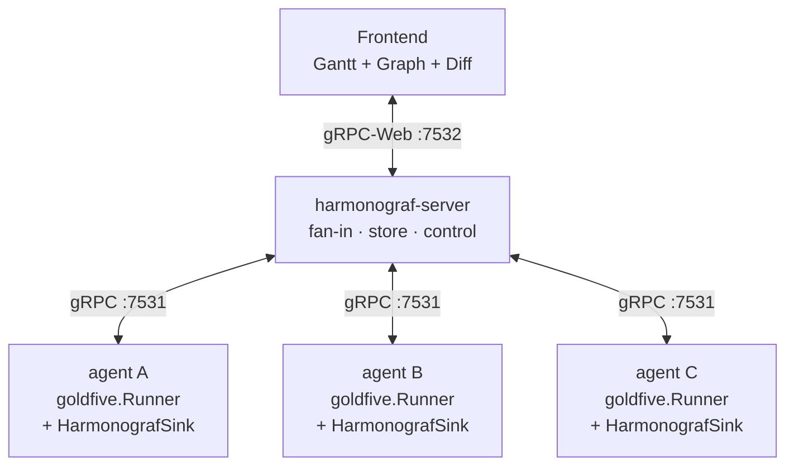

# Harmonograf

**The observability console for multi-agent workflows.**

Harmonograf renders agent activity as a Gantt-style timeline, lets humans
intervene with control events on the same connection it observes them on, and
works two ways:

- **Standalone** — emit spans from any agent, from any framework, via the
  `harmonograf_client.Client`. No orchestration. The Gantt, inspector, and
  control surfaces light up; the Tasks panel stays empty. See
  [`docs/standalone-observability.md`](docs/standalone-observability.md).
- **With [goldfive](https://github.com/pedapudi/goldfive)** — opt in to the
  orchestration extra (`uv sync --extra orchestration`) and harmonograf also
  shows plans, tasks, and drift. Goldfive owns the plan / task state machine /
  drift taxonomy / reporting tools; harmonograf is the screen you watch it on.
  See [`docs/goldfive-integration.md`](docs/goldfive-integration.md).

Both modes target the same server, the same wire format, and the same UI —
the difference is purely which panels populate.

---

## What is Harmonograf?

Multi-agent systems break every assumption that single-agent observability tools
are built on. A chat completion is no longer an "operation" — it is one beat
inside a rollout that may span five sub-agents, parallel branches, mid-flight
replans, and tool calls whose outputs feed tasks nobody planned ten seconds
earlier. Span trees flatten that structure into nested boxes and then ask you to
reconstruct the story.

Goldfive provides the orchestration primitives that make the story first-class —
plans are data, task state is explicit, drift is a first-class event, and
reporting tools are the contract between agent and framework. Harmonograf is the
screen you watch that story on:

- **One canonical timeline.** The server terminates goldfive event streams from
  every participating agent and fans them out to any number of frontend
  subscribers. One server, many agents, many viewers.
- **Plan-aware UI.** The Gantt, the inspector, and the plan-diff drawer all
  render goldfive's plan / task / drift semantics directly. When goldfive fires
  a `PlanRevised` event, the frontend shows the diff with the old plan side by
  side.
- **Bidirectional by default.** The same connection that streams telemetry up
  also streams control down — pause, resume, steer, cancel, annotate — so the
  UI is a coordination surface, not a read-only dashboard.

Integration is a single-line install: construct a `goldfive.Runner`, attach a
`HarmonografSink`, and the run's events start materialising in the UI.

### Screenshots

**Gantt timeline** — five agents running a multi-task research workflow. The task plan strip at the bottom shows stages with per-task status chips.


**Agent topology graph** — the same session viewed as an agent graph with transfer arrows, task chips, and a minimap in the corner.


**Session picker** — browse all sessions with agent counts, attention badges, and time-ago labels.


**LLM call popover with thinking** — click any span to see a floating popover. LLM calls surface the model's chain-of-thought in an expandable thinking section.


**Inspector drawer** — the drawer shows span details across Summary, Task, Payload, Timeline, and Links tabs. Here the Payload tab reveals the tool-use schema sent to the model.


---

## Get running in 10 minutes

### Standalone (no goldfive)

The shortest path: boot the server + frontend, and emit synthetic spans
from a plain Python script. Nothing else.

```bash
git clone https://github.com/pedapudi/harmonograf
cd harmonograf
git submodule update --init --recursive
git clone --depth 1 https://github.com/google/adk-python.git third_party/adk-python
uv sync
make demo-standalone    # server + frontend + spans_only.py
```

The frontend renders a session with a Gantt; Tasks panel stays empty.
Full walkthrough: [`docs/standalone-observability.md`](docs/standalone-observability.md).

### With goldfive orchestration

The fastest path to see plans + tasks + drift is the goldfive
observability quickstart. It installs goldfive + harmonograf, boots this
stack via `make demo`, runs a CallableAdapter agent in a second shell,
and shows the events flowing into the UI — no LLM credentials required.

1. `make install` in this repo (see the full [quickstart](docs/quickstart.md) for prereqs).
2. `uv sync --extra orchestration` to opt in to the goldfive API.
3. `make demo` to bring up the server + frontend + ADK web.
4. In a second shell run `examples/harmonograf_observed/agent.py` from the goldfive repo.

Full walkthrough (lives in the goldfive repo): **[observability-with-harmonograf.md](https://github.com/pedapudi/goldfive/blob/main/docs/guides/observability-with-harmonograf.md)**.

---

## Architecture

Harmonograf is three components that share one data model. Telemetry (spans +
goldfive events) flows up from agents through the server to the browser;
control messages flow back down on the same connections.



| Component | Path | Language | Role |
|---|---|---|---|
| **Frontend** | `frontend/` | TypeScript / React / Vite | Gantt timeline, agent topology graph, plan-diff drawer, inspector, transport bar. Talks gRPC-Web to the server. |
| **Server** | `server/` | Python / asyncio / grpcio | Terminates connections from every client, owns the canonical timeline, stores it (SQLite or in-memory), and fans out live updates to any number of frontend subscribers. Also the control bridge. |
| **Client library** | `client/` | Python | Embedded inside each agent. Provides `Client` (span transport, payload upload, control handlers) and `HarmonografSink` — a `goldfive.EventSink` that forwards goldfive plan / task / drift events into the harmonograf telemetry stream. |

Orchestration semantics — plans, tasks, drift kinds, reporting tools, refine
pipeline, session-state protocol — live in [goldfive](https://github.com/pedapudi/goldfive).
Harmonograf consumes them, it does not define them.

The data model shared between client, server, and frontend is defined in
`proto/harmonograf/v1/*.proto`. Goldfive's `Event` envelope is imported from
`goldfive/v1/events.proto` and rides through harmonograf's `TelemetryUp` as a
first-class variant. Regenerate stubs with `make proto`.

---

## Quickstart

Five steps from clone to a running demo. Detailed walk-through with troubleshooting
and local-LLM wiring in [docs/quickstart.md](docs/quickstart.md).

**Prerequisites:** Python 3.11+ with [`uv`](https://github.com/astral-sh/uv), Node
20+ with `pnpm`, `git`, and either a reachable OpenAI-compatible endpoint or
`GOOGLE_API_KEY` for the default Gemini model.

```bash
# 1. Clone and enter
git clone https://github.com/<your-org>/harmonograf.git
cd harmonograf

# 2. Install all three components + pull the ADK submodule
make install

# 3. Regenerate proto stubs (only needed after .proto edits; first clone is fine)
make proto

# 4. Point at a local OpenAI-compatible LLM (optional — skip if you have GOOGLE_API_KEY)
export OPENAI_API_BASE=http://localhost:8080/v1
export OPENAI_API_KEY=dummy
export USER_MODEL_NAME=openai/qwen3.5:122b

# 5. Boot the full demo stack
make demo
```

`make demo` starts three processes in one foreground shell: `harmonograf-server`
on `127.0.0.1:7531` (gRPC) + `:7532` (gRPC-Web), the Vite frontend on
`http://127.0.0.1:5173`, and `adk web` hosting two reference-agent variants on
`http://127.0.0.1:8080` — `presentation_agent` (observation; plain ADK +
telemetry plugin) and `presentation_agent_orchestrated` (the same tree wrapped
with `goldfive.wrap(...)` so you see the full plan / dispatch / drift stream).
Pick a variant in the ADK picker, drive a rollout, and watch the timeline
materialise live in the harmonograf tab. Ctrl-C tears all three down.

---

## Documentation

| Doc | Purpose |
|---|---|
| [docs/overview.md](docs/overview.md) | Longer-form writeup: motivation, design principles, current features, non-goals, roadmap. Start here after this README. |
| [docs/quickstart.md](docs/quickstart.md) | Step-by-step from clone to running demo, with troubleshooting and local-LLM wiring. |
| [docs/goldfive-integration.md](docs/goldfive-integration.md) | How harmonograf consumes goldfive: `HarmonografSink`, the `goldfive_event` envelope, the split of responsibilities. |
| [docs/goldfive-migration-plan.md](docs/goldfive-migration-plan.md) | The design record for the harmonograf → goldfive migration; what moved, what stayed, what was deleted. |
| [docs/operator-quickstart.md](docs/operator-quickstart.md) | Flags, retention, health probes, bearer-token auth — the ops-facing reference. |
| [docs/user-guide/](docs/user-guide/) | Navigating the UI: Gantt, graph, inspector, diff drawer, transport bar, keyboard shortcuts. |
| [docs/dev-guide/](docs/dev-guide/) | Building from source, adding a storage backend, wiring a new framework adapter, writing tests. |
| [docs/protocol/](docs/protocol/) | Wire protocol, proto reference, span lifecycle, control stream. |
| [docs/design/](docs/design/) | Per-component design notes — data model, client library, server, frontend, human-interaction model, information flow. |
| [docs/milestones.md](docs/milestones.md) | Incremental delivery plan. |

Orchestration references (reporting tools, drift taxonomy, task state machine,
session-state protocol) now live in the [goldfive](https://github.com/pedapudi/goldfive)
docs. Pages under `docs/` that described those topics in the standalone era
carry a DEPRECATED banner pointing to goldfive.

---

## Status

Harmonograf is pre-1.0 and under active development. The demo flow (`make demo`
against the reference goldfive agent) is the canonical smoke test — if it runs
green, the ingest → storage → bus → frontend pipeline is healthy for both spans
and goldfive events.

Deliberate non-goals for v0 are listed in
[docs/overview.md](docs/overview.md#non-goals); notable ones include TLS,
clustering, and multi-tenant auth.

---

## Contributing

Contributions are welcome. Before starting non-trivial work, read
[AGENTS.md](AGENTS.md) for the project vision and the component split between
harmonograf and goldfive, and [docs/design/](docs/design/) for the component the
change touches. A developer guide with local-dev workflows, test matrix, and
release process is landing as [docs/dev-guide/](docs/dev-guide/).

Ground rules: don't invent features when existing features can be extended,
prefer editing existing files over creating new ones, keep orchestration changes
in goldfive and observability changes in harmonograf, and if you change the
proto run `make proto` and commit the regenerated stubs alongside the source
change.

---

## License

Apache License 2.0. See [`LICENSE`](LICENSE) for the full text.
