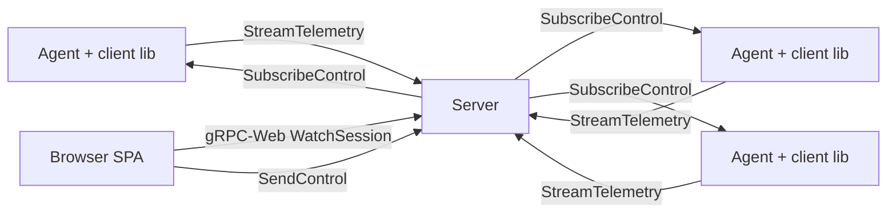

# ADR 0002 — Three-component architecture

## Status

Accepted.

## Context

Harmonograf needs to observe and coordinate multi-agent systems. The three
forcing functions at the top of the design space are:

1. **Where the agent code runs.** Agents are long-lived Python processes (or
   similar) executing LLM calls and tools. They are written by users, not by
   harmonograf, and they live inside whatever environment the user deploys
   them to.
2. **Where the operator sits.** A human opens a browser, watches the timeline,
   pins notes, and occasionally nudges the system. The operator has no terminal
   access to the agents and no appetite for per-agent CLIs.
3. **Fan-in of many agents onto one timeline.** A plan execution typically
   involves a coordinator agent plus several specialist sub-agents. They run
   concurrently — often on the same machine, sometimes on different ones — and
   they need to share a canonical, totally-ordered view of the session.

The question is how to split the software across these three responsibilities.

## Decision

Harmonograf is three components, named by who they run under:

1. **Client library** — embedded inside each agent process. Emits telemetry,
   hosts the reporting-tool plumbing, handles session-state bookkeeping, and
   holds the local task-state machine. Library, not daemon: it runs in the same
   process as the agent so it sees every callback synchronously.

2. **Server** — a single process per deployment. Terminates all client
   telemetry streams, persists the canonical timeline (SQLite today; see [ADR 0007](0007-sqlite-over-postgres.md)), fans out live updates to any number of frontend subscribers, and
   routes control events from the frontend back to the correct agent. One
   server, many clients, many viewers.

3. **Frontend** — a browser SPA served by the server. Gantt canvas, graph view,
   inspector drawer, transport bar, annotation and steering UI. Connects to the
   server over gRPC-Web on the same port surface the agents use, just under a
   different RPC.

The boundaries are drawn so that:
- the data model (`proto/harmonograf/v1/types.proto`) is defined once and shared
  across all three — there is no "server-internal model" distinct from the wire
  model;
- the server has no user code in it — it is a fan-in router + store;
- the frontend talks only to the server, never to client libraries directly;
- the client library talks only to the server, never to other clients.

## Consequences

**Good.**
- One topology. No peer-to-peer, no gossip, no leader election, no "which
  server owns this agent" question. The operator always points the browser at
  one address.
- The client library can ship as a normal Python package without a daemon
  side-car, which matters for ADK integration — ADK agents are often run as
  short-lived CLI invocations and a side-car would double the setup burden.
- The data model is shared, so adding a new field touches one proto file and
  regenerates into all three components (`make proto`).

**Bad.**
- The server is a single point of failure. If it dies, live telemetry has
  nowhere to land. The client library buffers up to a configurable limit and
  reconnects (see [ADR 0005](0005-acks-ride-telemetry.md) on ack semantics), but a long outage drops data.
  v0 accepts this — HA is explicitly a non-goal (see [ADR 0020](0020-no-auth-in-v0.md) and
  [overview](../overview.md#non-goals)).
- "Library in every agent" means any fix to the instrumentation layer requires
  re-deploying the agent, not just the server. We mitigate by keeping the wire
  protocol additive and evolving the server independently where possible.
- Three components means three test surfaces and three code styles (Python
  library, Python server, TypeScript frontend). The build system and CI have
  to handle all three. `make proto` is the seam that keeps them coordinated.

The split pays off the moment you have more than one agent: the server is the
only thing that can own "one canonical timeline," and the library is the only
thing close enough to the agent to catch synchronous ADK callbacks. The
frontend being web-based means an operator can open it anywhere without
installing anything.

## Implemented in

- [Design 03 — Server](../design/03-server.md)
- [Design 11 — Server architecture deep-dive](../design/11-server-architecture.md)
