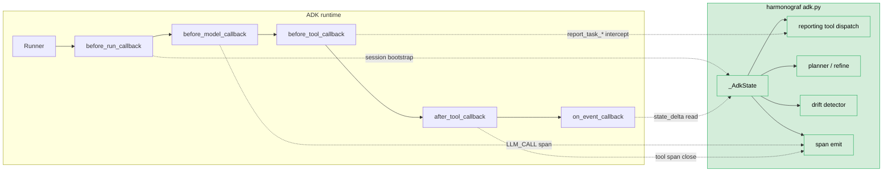

# ADR 0003 — ADK as the first-class integration target

## Status

Accepted.

## Context

"Multi-agent framework" is a broad category. Candidates for first-class
integration in early 2026 include Google's ADK, OpenAI Agents SDK, Strands,
LangGraph, CrewAI, AutoGen, and a long tail of research frameworks. Each has
its own execution model, its own lifecycle hooks (or lack thereof), and its
own conventions for where agent state lives.

Harmonograf cannot be meaningfully useful on top of *all* of them at once.
The instrumentation layer — where task state transitions, where session state
flows, where tools get injected — is unavoidably framework-specific. A shim
that works with every framework would be so shallow it could not drive the
plan-execution protocol ([ADR 0011](0011-reporting-tools-over-span-inference.md)) at all, because the reporting-tool
interception depends on framework-native tool callbacks.

The design question is which framework to commit to first, and how
framework-specific the commitment is.

## Decision

Harmonograf ships with **ADK as its only first-class adapter in v0**. The
reasons, in order of weight:

1. **ADK exposes exactly the seams we need.** Its plugin manager and
   lifecycle callbacks (`before_run_callback`, `before_model_callback`,
   `before_tool_callback`, `after_tool_callback`, `on_event_callback`) give a
   synchronous, ordered hook into every meaningful agent event. We do not need
   to monkey-patch, wrap the Runner, or spin up a side-channel. The `adk.py`
   module in `client/harmonograf_client/` is the whole integration.

2. **ADK has `session.state`.** ADK agents share a mutable dict across turns.
   This gives harmonograf a bidirectional coordination channel that already
   exists in the framework — we did not invent it (see [ADR 0014](0014-session-state-as-coordination-channel.md)). Agents read
   the active task out of `session.state["harmonograf.*"]`; when they write
   back via ADK's `state_delta` event mechanism, we pick up the writes in
   `on_event_callback`. No other mainstream framework has this exact pattern.

3. **ADK treats tools as first-class.** Reporting tools
   (`report_task_started`, `report_task_completed`, …) are injected as normal
   ADK tools into every sub-agent wrapped by `HarmonografAgent`. The tool
   bodies are no-ops that return `{"acknowledged": True}`; the real side
   effect happens in `before_tool_callback`, which inspects the tool name and
   routes into `_AdkState`. This mechanism only works in a framework where
   tools have a callback you can intercept.

4. **Google ships it.** ADK has a plausible path to becoming a common ground
   — `adk web`, `adk run`, `adk api_server` are entry points that walk the
   agent tree, so `HarmonografAgent` being a subclass of `BaseAgent` means
   every ADK entry point picks it up transparently. Integration comes "for
   free" for anyone already using ADK (see the class docstring at
   `client/harmonograf_client/agent.py`).

**ADK seam map** — every harmonograf hook lands on an official ADK callback.
Nothing is monkey-patched; `_AdkState` is the convergence point that the
reporting tools, the planner, and the drift detector all read from.

At the same time, the client library's *core* is framework-agnostic. Transport,
buffering, span schema, task-state machine, invariants, and planner protocols
all live outside `adk.py`. A future Strands or OpenAI Agents adapter is a
sibling module, not a rewrite.

## Consequences

**Good.**
- The v0 integration is tight. `attach_adk(runner, client)` is a one-line
  call; no configuration files, no sidecars, no monkey-patching.
- ADK's sandbox is expressive enough that every feature on the roadmap
  (including plan-diff replan and steering) can be built on official seams.
- By committing to one framework we can ship deeply — ADK-specific features
  like the `task_id` ContextVar in parallel mode and the reporting-tool tool
  injection are not gated on a framework-neutral abstraction that doesn't
  exist yet.

**Bad.**
- Anyone using a different framework sees "no adapter yet" and goes elsewhere.
  This is the main cost of the decision. The mitigation is that the
  framework-agnostic core is real and documented so a second adapter does not
  require rewriting the client library.
- Some ADK-specific design leaks into core concepts (e.g., the state-protocol
  schema uses "session.state" terminology in docs and code). These will need
  renaming if a second framework ships, or the concept will stay generic and
  the ADK adapter will translate.
- ADK itself is young. Lifecycle hook signatures have shifted during
  harmonograf's development; the `adk.py` module has had to track changes
  carefully. Each ADK release is a compatibility review.
- ADK's plugin manager does not guarantee plugin ordering with respect to
  other plugins a user may install. In practice we have not hit a conflict,
  but the contract is not written down and we do not own it.

The bet is that shipping one deep integration now is more valuable than
shipping three shallow ones. The core stays agnostic so the bet is
reversible.

## Implemented in

- [Design 02 — Client library](../design/02-client-library.md)
- [Design 12 — Client library + ADK integration](../design/12-client-library-and-adk.md)
