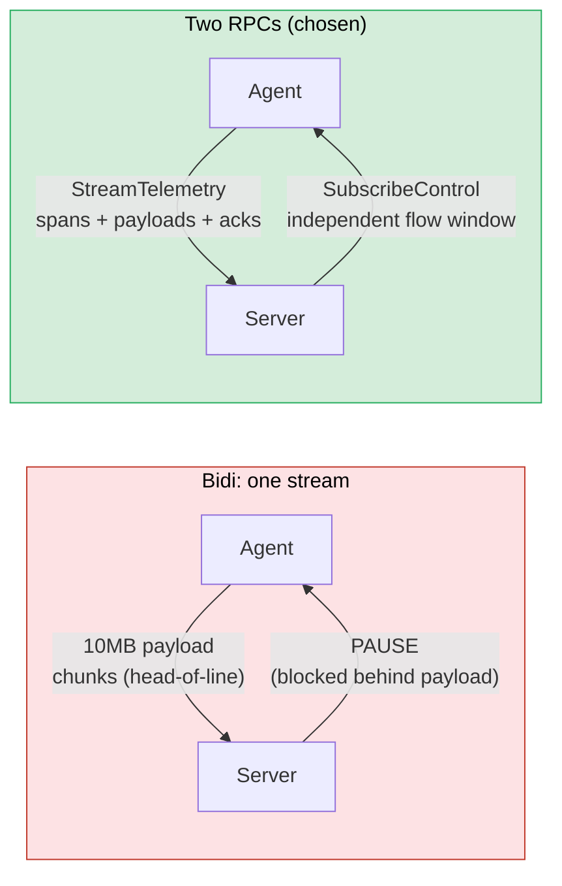

# ADR 0004 — Telemetry and control are separate RPCs

## Status

Accepted.

## Context

Harmonograf needs two logical channels between an agent and the server:

- **Telemetry** (agent → server, high volume): spans, payload chunks,
  heartbeats, task-state updates. Bursts of kilobytes to megabytes per
  second during LLM streaming and tool calls.
- **Control** (server → agent, low volume): pause, resume, cancel, steering
  messages, human-in-the-loop responses, status queries. A few bytes, a few
  times a session, but must arrive *now* when they arrive.

Both channels run over the same gRPC transport (see [ADR 0006](0006-grpc-over-other-transports.md)). The design
question is whether they share one bidirectional RPC or live on two separate
RPCs.

Options considered:
1. **One bidi RPC** — `StreamTelemetry` is bidirectional; telemetry flows up,
   control events flow down on the same stream.
2. **Two server-streaming RPCs** — `StreamTelemetry` client-streaming for
   telemetry, `SubscribeControl` server-streaming for control.
3. **Three RPCs** — `StreamTelemetry` (up), `SubscribeControl` (down), and a
   third dedicated ack RPC (up) for acking control events.

## Decision

Two RPCs: `StreamTelemetry` (bidirectional, but the downstream is reserved
for handshake + flow control) and `SubscribeControl` (server-streaming,
server → agent only). Acks ride back upstream on `StreamTelemetry` instead
of a third RPC (see [ADR 0005](0005-acks-ride-telemetry.md)). The split is declared in
`proto/harmonograf/v1/service.proto` and explained in the file header of
`proto/harmonograf/v1/control.proto`.

The reasons are per-stream flow control and independent reconnect. gRPC/HTTP2
gives each stream its own flow-control window. If telemetry and control
shared one stream, a stalled payload upload (a 10 MB blob being chunked
through a congested link) could block a `PAUSE` control event arbitrarily
long behind the payload bytes. Splitting gives control its own window: a
stuck telemetry upload cannot delay a pause.

Independent reconnect is the other half of the story. The telemetry stream
can die and reconnect without disturbing the control subscription, and vice
versa. In practice the two streams usually die together (the network blip
affects everything), but the decoupling means neither side of the client is
forced to re-open both streams as a single atomic operation.

**One stream vs two streams** — left: a 10 MB payload upload starves a PAUSE
control event behind its bytes. Right: control gets its own gRPC flow window
and arrives immediately.

## Consequences

**Good.**
- A high-volume telemetry burst cannot starve control delivery. This is not a
  hypothetical — early testing with 5 MB payload chunks surfaced exactly this
  kind of stall on a bidi RPC before the split was introduced.
- Each stream can reconnect independently. The client library's transport
  layer (`client/harmonograf_client/transport.py`) treats them as separate
  loops.
- Control delivery has a clean schema: `ControlEvent` is the only message
  type on the server → agent direction, which simplifies the agent-side
  handler. No "oneof dispatch" is needed on the downstream.

**Bad.**
- Two streams means two places to hold state per agent on the server. The
  server has to correlate `(agent_id, stream_id)` across the two RPCs, and
  `SubscribeControl` must reference a `stream_id` that was minted by an
  already-live `StreamTelemetry` (see `control.proto`). A crash between the
  telemetry welcome and the control subscribe produces a short window where
  control is not yet wired up.
- Two reconnect loops means two places to get reconnect logic wrong. The
  client library's transport layer is larger because of this.
- A naïve client that opens `SubscribeControl` before `StreamTelemetry` (or
  uses a stale `stream_id`) gets rejected; the ordering is a contract on top
  of the gRPC service and is easy to misimplement in a third-party client.
- The server must fan control events out to all concurrent telemetry streams
  under one `agent_id` (see `control.proto` comments). Multiple streams per
  agent is an uncommon case but has to be handled, adding a small amount of
  bookkeeping.

The split is cheap to build and pays for itself the first time a large
payload upload coincides with a needed PAUSE. It also leaves room for
SubscribeControl to become a distinct auth or rate-limit unit later if we
want, without disturbing telemetry.

## Implemented in

- [Design 01 — Data model & RPC](../design/01-data-model-and-rpc.md)
- [Design 14 — Information flow](../design/14-information-flow.md)
