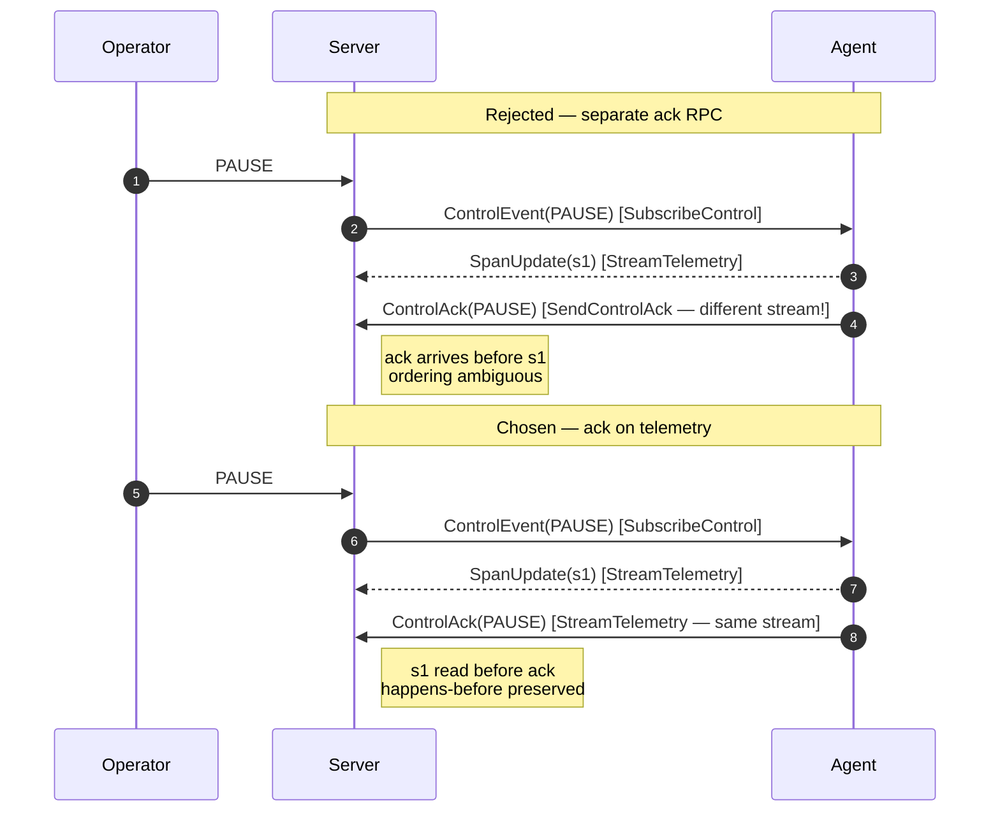

# ADR 0005 — Control acks ride upstream on the telemetry stream

## Status

Accepted.

## Context

With telemetry and control on separate RPCs (see [ADR 0004](0004-telemetry-control-split.md)), the remaining
question is where the *acknowledgement* for a control event goes. When the
server pushes a `PAUSE` ControlEvent to an agent over `SubscribeControl`,
the agent's "paused" ack needs to travel back upstream. There are three
places it could go:

1. A **third RPC** dedicated to acks — e.g., `SendControlAck`, unary.
2. The **same `SubscribeControl` stream**, reversed — i.e., make it
   bidirectional so the client can write ack messages upstream on the same
   stream it reads control from.
3. Folded into `StreamTelemetry` as a new variant on the existing upstream
   oneof.

The hard requirement is **happens-before ordering**. When the operator
clicks "pause" and then reads back the timeline, they need to know which
spans happened *before* the pause and which happened *after*. If the ack
for pause can overtake spans that preceded it, the UI would have to
re-derive happens-before from wall-clock timestamps — which is not safe
across clock skew between the agent and server.

## Decision

Acks travel back on **`StreamTelemetry`** as `ControlAck` inside the
`TelemetryUp` oneof. Defined in `proto/harmonograf/v1/types.proto`
(`ControlAck`) and `proto/harmonograf/v1/telemetry.proto` (added to the
`TelemetryUp` oneof alongside `SpanStart`, `SpanUpdate`, etc.).

The comment in `types.proto` states the property directly:

> ControlAck rides upstream on StreamTelemetry (NOT on a separate stream).
> This colocation gives us happens-before for free: when the server sees
> an ack, every span the client emitted before the ack is already on the
> wire ahead of it.

The guarantee is a consequence of gRPC preserving ordering within a single
stream. The client processes the `PAUSE` control event, synchronously flushes
any spans it has buffered for the telemetry stream up to that point (or at
minimum writes the ack *after* any already-enqueued span frames), and then
writes the `ControlAck` to the telemetry stream. When the server reads the
ack, it has necessarily already read every span that was enqueued ahead of
it on the same stream.

Options 1 and 2 were rejected because neither preserves ordering. A separate
ack RPC or a separate reversed control stream delivers acks on a different
gRPC stream from the telemetry, which has its own flow-control window and no
ordering relationship to telemetry. The operator would see pause-acked while
still receiving spans that "happened before pause" on a different stream,
with no way to tell the two apart.

**Happens-before on one stream vs split across two** — left: separate ack RPC
lets PAUSE-ack overtake an in-flight span, leaving the operator unable to tell
"before pause" from "after pause." Right: ack rides telemetry, so any span
ahead of it on the wire is necessarily "before."

## Consequences

**Good.**
- Happens-before is a transport property, not an application-level invariant
  we have to police. The server does not need to reorder events or apply
  heuristics — the order on the wire is the truth.
- No third RPC. The service surface stays small (two agent-facing RPCs,
  everything else frontend-facing).
- Reconnect is simpler. There is one upstream stream to resume, and the
  resume token in the client's `Hello` message covers every upstream event
  type uniformly.

**Bad.**
- A telemetry stream that is stalled (for example, waiting on flow control
  because a payload upload is backed up) cannot deliver acks either, because
  they share the window. This is an ordering/latency tradeoff we accept —
  pause-ack latency inherits the worst case of the telemetry stream. In
  practice the client is expected to keep the telemetry upstream drained
  (see the buffer design in `client/harmonograf_client/buffer.py`).
- Conceptually "control" and "telemetry" mix on one stream, even though the
  protocol split in [ADR 0004](0004-telemetry-control-split.md) tried to keep them separate. The split is
  therefore one-way: control flows down on its own stream, but acks flow up
  on telemetry. Anyone reading the service definition has to understand both
  decisions together.
- Clients implementing the protocol in a different language have to know
  that `ControlAck` goes on `TelemetryUp`, not on a separate `Ack` endpoint.
  It is a non-obvious wire-level rule that lives in proto comments and this
  ADR; a new implementer could miss it.
- The happens-before guarantee only holds for spans and acks on the *same*
  telemetry stream. If a client opens multiple concurrent telemetry streams
  (which is allowed; each gets its own `stream_id`), then ack ordering
  across streams is undefined. Users with one client and one agent are fine;
  users multiplexing across streams must be aware.

The guarantee is worth the coupling. Fixing ordering after the fact via
server-side reordering would require buffering, reconciliation, and
clock-skew tolerance that we would rather not own.

## Implemented in

- [Design 01 — Data model & RPC](../design/01-data-model-and-rpc.md)
- [Design 14 — Information flow](../design/14-information-flow.md)
