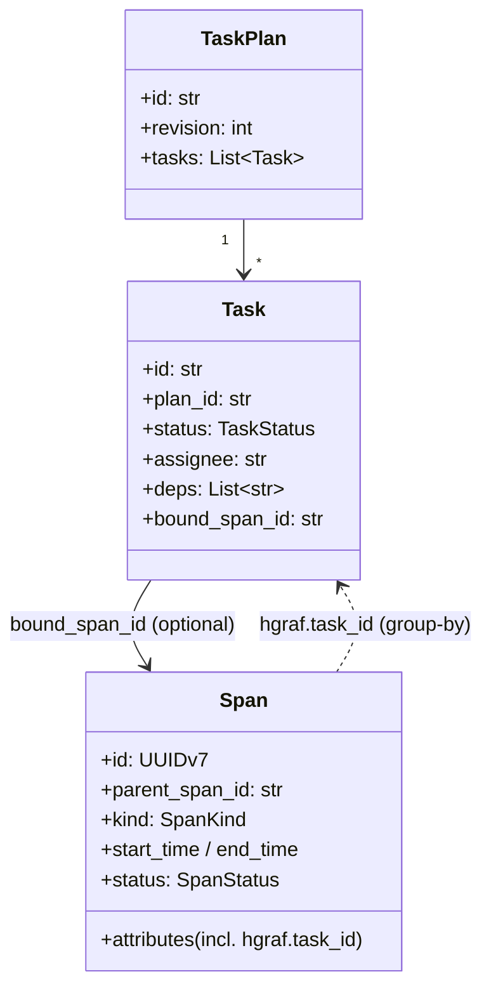

# ADR 0010 — A span is not a task

## Status

Accepted.

## Context

A natural question when modeling agent execution is: do we need two concepts,
or is a span enough? Spans already have start time, end time, status,
hierarchy via `parent_span_id`, and attributes. Why not just attribute spans
with "this is a task" and be done?

The question matters because at a glance, a task in an agent plan *looks*
like a span: it has a start, it has an end, it may succeed or fail, and it
is run by an agent. Conflating the two would cut the data model in half.

We tried the conflation (in earlier iterations) and it broke. The reasons:

1. **Plans exist before spans do.** A plan is emitted at the start of an
   invocation, before any task has started executing. The UI needs to render
   the plan as greyed-out chips *now*, not wait for spans to start. A pure
   span-only model would have no way to represent "planned but not yet
   started" without inventing a separate concept — which is the task.

2. **One task ↔ many spans.** A single task ("implement the sort function")
   is typically executed across multiple LLM calls, tool calls, and
   transfers. All of those emit spans. If the task *is* a span, you either
   (a) nest child spans under a task-span, which forces the task-span to
   start and end in a particular place, which does not match how agents
   actually work, or (b) pick one of the child spans as "the task," which
   is arbitrary and fragile.

3. **Tasks move.** During a replan (see [ADR 0013](0013-drift-as-first-class.md)), a task can be reordered,
   reassigned to a different agent, or removed entirely. A span is an
   append-only record of something that already happened — it cannot be
   "moved" in any sensible sense. Plan diffs would be unrepresentable.

4. **Task state is not span state.** Task status is a monotonic state
   machine with COMPLETED as terminal (see [ADR 0017](0017-monotonic-task-state.md)). Span status is also a
   lifecycle, but COMPLETED on a span means "the span stopped recording" —
   not "the thing the span was trying to do succeeded." An LLM call span
   can reach COMPLETED while the task it was working on stays RUNNING
   because more LLM calls are needed.

## Decision

**Tasks and spans are separate first-class primitives in the data model.**
Both live in `proto/harmonograf/v1/types.proto`; neither is derived from
the other.

- `Span` is the unit of *activity*: a single LLM call, tool call, transfer,
  invocation, etc. Append-only, framework-callback-driven, telemetry only.
- `Task` is the unit of *intent*: a step in a plan, with status, assignee,
  dependencies, and an optional binding to the span currently executing it
  via `bound_span_id`. Mutable, agent-driven, owned by the plan.

The binding goes one way: a task may reference a bound span (`bound_span_id`
in `Task`), and a span may optionally carry a task reference as an attribute
(`hgraf.task_id`, as documented in `types.proto`'s `TaskPlan` comment block)
so the server and frontend can group spans by task. But neither is derived
from the other — the task's status transitions come from reporting tools
([ADR 0011](0011-reporting-tools-over-span-inference.md)), not from inspecting `bound_span_id`'s span status.

**Two primitives, one-way binding** — Task carries intent and is mutable;
Span records activity and is append-only. The only edge between them is
`Task.bound_span_id` plus the `hgraf.task_id` span attribute used for
grouping.

## Consequences

**Good.**
- Plans can be rendered before any span exists. The "planned but not yet
  running" state has a natural home on `Task.status = PENDING`.
- Replan diffs are a thing we can compute (see `frontend/src/gantt/index.ts
  :: computePlanDiff`) because tasks have identities that persist across
  revisions.
- Task state cannot be corrupted by span lifecycle quirks. A span reaching
  FAILED does not automatically fail the task — the agent has to
  explicitly call `report_task_failed`.
- Spans stay simple. They remain the "what actually happened" record.
  Anyone reading the spans alone still gets a coherent trace, just without
  the plan overlay.

**Bad.**
- **Two concepts to explain.** New users have to learn the distinction.
  The glossary and user guide carry explicit "task vs. span" callouts
  because the conflation is tempting.
- **Two state machines to keep in sync.** The server has to persist both
  and the frontend has to render both. Bugs where they diverge (a task
  stays RUNNING after its bound span has ended) are a category of defect
  that would not exist under the unified model.
- **Hgraf attribute leakage.** The `hgraf.task_id` span attribute exists
  because the frontend wants to highlight "all spans belonging to task X."
  That's a back-reference from span to task that we tried to avoid, but
  the alternative was iterating all tasks for every span click.
- **More wire traffic.** `TaskPlan`, `UpdatedTaskStatus`, and plan
  revisions are additional message types on the telemetry stream.

The conflation looks cheap on the whiteboard and blows up on first contact
with real agent behavior. Keeping the two separate is the price of not
lying about task state.

## Implemented in

- [Design 01 — Data model & RPC](../design/01-data-model-and-rpc.md)
- [Design 12 — Client library + ADK integration](../design/12-client-library-and-adk.md)
