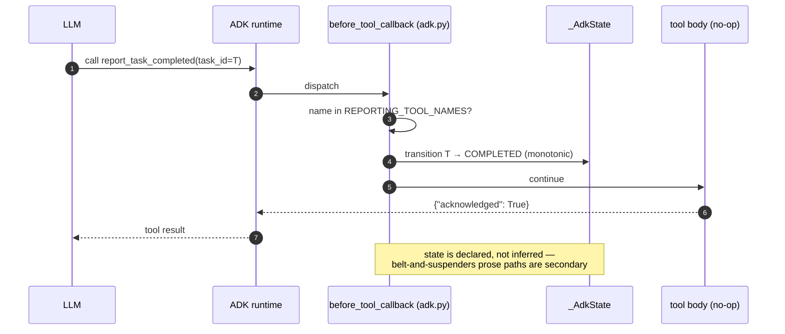

> **DEPRECATED (goldfive migration).** Reporting-tool ownership and task-state
> logic now live in [goldfive](https://github.com/pedapudi/goldfive). This ADR
> records the reasoning as it stood when harmonograf owned orchestration; the
> decision itself stands (reporting tools beat span inference), it is just
> expressed in goldfive now. See
> [../goldfive-integration.md](../goldfive-integration.md) and
> [../goldfive-migration-plan.md](../goldfive-migration-plan.md).

# ADR 0011 — Reporting tools drive task state, not span lifecycle

## Status

Accepted. **Supersedes the iter14 "span-lifecycle inference" approach.**

## Context

Iter 14 of harmonograf tried to drive task state transitions by inspecting
span lifecycle events. The rule set was roughly:

- when an agent's invocation span starts: task → RUNNING
- when the span ends COMPLETED: task → COMPLETED
- when the span ends FAILED: task → FAILED
- when certain prose markers appear in the model output ("Task complete:",
  "✅ done"): task → COMPLETED as a fallback

This broke on every real multi-agent run. The specific failure modes are
documented in [`docs/overview.md`](../overview.md) and in the module docstring of
`client/harmonograf_client/adk.py`:

1. **Spans don't close when tasks finish.** A sub-agent whose top-level
   span closed had sometimes returned control to its parent while a
   long-running background tool call continued. Marking the task COMPLETED
   at span close shipped a lie to the UI.
2. **Prose parsing is ambiguous.** An LLM writing "I will complete the
   task" and an LLM writing "task complete" look almost identical to a
   regex. False positives were common.
3. **Parallel mode races.** In the DAG walker ([ADR 0012](0012-three-orchestration-modes.md)), multiple
   sub-agents run concurrently. Span-close callbacks fire in arbitrary
   order, and tying state transitions to them produced ordering bugs
   where a later task's COMPLETED overwrote an earlier task's
   RUNNING when the order on the wire contradicted the plan order.
4. **Inference can't express "blocked" or "new work discovered."** The
   agent knows when it is blocked by a tool error or has discovered a
   sub-task not in the plan; the span lifecycle does not carry that
   information, so the iter14 system had no way to trigger a refine for
   drift kinds that did not correspond to a span state change.

## Decision

In iter 15 we replaced inference with **explicit reporting tools**, each a
normal ADK function tool injected into every sub-agent wrapped by
`HarmonografAgent`:

- `report_task_started`
- `report_task_progress`
- `report_task_completed`
- `report_task_failed`
- `report_task_blocked`
- `report_new_work_discovered`
- `report_plan_divergence`

Each tool body returns `{"acknowledged": True}` and does nothing else. The
real work happens in `before_tool_callback` in `adk.py`, which intercepts
reporting-tool calls by name (`REPORTING_TOOL_NAMES`) and applies the
resulting state transition directly to `_AdkState`. The state machine is
monotonic, single-writer per task, and walker-owned in parallel mode.

Belt-and-suspenders paths still exist: `after_model_callback` parses
response content for structured signals, and `on_event_callback` watches
for transfer / escalate / state_delta events. These exist for models that
describe work in prose instead of calling the tools, but they are
secondary — the reporting tools are the source of truth.

Spans are still emitted for every ADK callback, but they are **telemetry
only**. See the "Plan execution protocol" section of `AGENTS.md`:

> Spans are still emitted for every ADK callback (INVOCATION / LLM_CALL /
> TOOL_CALL / TRANSFER / etc.), but they are **telemetry only** — they no
> longer drive task state. The state machine is monotonic, walker-owned
> for parallel mode, and callback-driven for sequential/delegated modes.

The original iter14 inference approach is filed as [ADR 0011a](0011a-span-lifecycle-inference-superseded.md) (Superseded by
this ADR) — it remains for historical record but should not guide new work.

**Reporting-tool intercept path** — the LLM calls a normal ADK tool;
`before_tool_callback` recognises the name in `REPORTING_TOOL_NAMES` and
applies the transition to `_AdkState` synchronously, *before* the no-op tool
body returns `{"acknowledged": True}`.

## Consequences

**Good.**
- Task state is declared, not inferred. The UI does not lie.
- Parallel races disappear because the reporting tools are intercepted in
  the synchronous `before_tool_callback`, and the walker owns the state
  transitions per task with no cross-task ordering ambiguity.
- Drift kinds ([ADR 0013](0013-drift-as-first-class.md)) have a natural home: the tools
  `report_task_blocked`, `report_new_work_discovered`, and
  `report_plan_divergence` each fire a refine with a specific drift kind,
  something inference had no mechanism for.
- The tool bodies being `{"acknowledged": True}` no-ops means an agent
  that calls them in the wrong shape still gets a successful tool
  response — the orchestrator's policing happens in the intercept, not in
  the tool execution.

**Bad.**
- **Agents have to cooperate.** An agent that never calls
  `report_task_completed` will have its task stay RUNNING forever unless
  a belt-and-suspenders path picks it up. We mitigate with instruction
  augmentation (`tools.augment_instruction`) that tells the model what
  tools are available and when to call them, but LLMs ignore instructions
  sometimes.
- **Prompt bloat.** Injecting reporting tools into every sub-agent plus
  instructing the agent to use them adds ~500-1500 tokens to every agent's
  system prompt. This is a real cost on every LLM call.
- **Inference fallback is still there.** `after_model_callback` and
  `on_event_callback` still have code paths that look at prose and
  state_delta. These have been retained for robustness but add surface
  area and have their own failure modes (the same prose ambiguity that
  killed iter14 is not gone, only demoted).
- **One more thing to document.** [`docs/reporting-tools.md`](../reporting-tools.md) exists because
  without it, nobody would know what the tools do or when to call them.
  Every new drift kind is a doc update in two places.

The pivot was the single biggest rewrite in harmonograf's history. It
replaces a comfortable architectural shortcut with an explicit protocol,
and the explicit protocol is correct where the shortcut was not.

## Implemented in

- [Design 12 — Client library + ADK integration](../design/12-client-library-and-adk.md)
