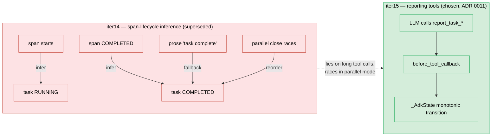

# ADR 0011a — Span-lifecycle inference for task state (Superseded)

## Status

**Superseded by ADR 0011.** This ADR records the decision as it stood in
iter 14 of harmonograf so that future readers can understand what was
tried, why it was attractive, and what broke.

## Context (as of iter 14)

Harmonograf needed to display task state on the Gantt: which tasks are
pending, which are running, which are done. The data model already had
spans for every agent activity (LLM call, tool call, invocation,
transfer). Adding a parallel "tasks have their own state machine"
mechanism looked like duplicated bookkeeping for something the spans
already implied.

The appealing observation was that for a simple agent:

- when the agent's invocation span starts, the task it was assigned
  has effectively started;
- when the span ends COMPLETED, the task has effectively completed;
- when the span ends FAILED, the task has failed.

This is a natural mapping — agents execute tasks, spans record agent
execution, so task state should follow from span state. The code is
small, the mental model is one concept instead of two, and the LLM does
not need to cooperate for the state to be visible.

## Decision (iter 14)

Drive task state transitions from span lifecycle events:

1. When a span with attribute `hgraf.task_id = T` transitions to
   RUNNING, mark task T RUNNING and set `bound_span_id` to the span id.
2. When the bound span transitions to COMPLETED, mark T COMPLETED.
3. When the bound span transitions to FAILED, mark T FAILED.
4. As a safety net, parse `after_model_callback` output for explicit
   prose markers like "Task complete:" or structured status writes into
   `session.state`, and apply the implied transition.

Task state was not owned by any single writer — whichever callback fired
first applied its transition. Parallel sub-agents would race through
span-close callbacks, which was understood but considered acceptable at
the time.

## Consequences (observed, which is why this decision was superseded)

**Where it worked.**
- Single-agent, single-task rollouts were fine. The span lifecycle and
  task lifecycle agreed almost always.
- The code was about 60% smaller than the iter15 reporting-tool path.

**Where it broke.** These are the reasons the decision was reversed; each
is also listed in ADR 0011 as the motivation for the pivot.

- **Span closes without task finishing.** Sub-agents whose top-level span
  closed had sometimes returned control to the parent while a
  long-running background tool call continued. Iter 14 flipped the task
  to COMPLETED the instant the span closed, which was a lie.
- **Prose ambiguity.** The safety-net parser for phrases like "task
  complete" could not distinguish "I will complete the task" from
  "Task complete." False positives corrupted task state nondeterministically.
- **Parallel races.** When the DAG walker was introduced for parallel
  mode (ADR 0012), span-close callbacks fired in arbitrary order across
  concurrent sub-agents. Task states transitioned in orders that
  contradicted the plan DAG, and there was no way to recover the correct
  order from the span data alone.
- **No home for drift signals.** Drift kinds like `task_blocked`,
  `new_work_discovered`, and `plan_divergence` require an explicit
  channel from the agent to harmonograf; a span lifecycle has no place
  for them. Iter 14 could only detect "task failed" via span status,
  never "task blocked on human input."
- **Debuggability.** When state went wrong, there was no single place to
  point at and say "here is the transition that was incorrect" — the
  state was an emergent property of several async callbacks racing.

**Iter14 (rejected) vs iter15 (chosen)** — the span-lifecycle path on the
left races on parallel mode and lies on long-running tool calls; the
reporting-tool path on the right declares state from a single
synchronous intercept.

## What replaced it

ADR 0011 describes the replacement: explicit reporting tools intercepted
in `before_tool_callback`, with spans demoted to telemetry-only. Task
state became a monotonic state machine with declared transitions. The
change is recorded in `AGENTS.md`'s "Plan execution protocol" section
and in the module docstring of `client/harmonograf_client/adk.py`.

This ADR remains in the archive so future contributors considering a
"just infer it from spans" shortcut can read why it did not work the
first time.
