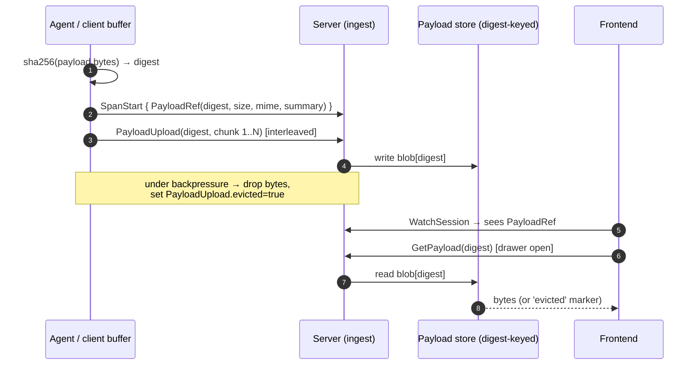

# ADR 0016 — Content-addressed payloads with eviction semantics

## Status

Accepted.

## Context

Spans carry payloads: LLM prompts, completions, tool arguments, tool
results, binary artifacts. A single LLM call easily produces 10 KB of
prompt and 5 KB of completion; tool calls that return PDFs or images
can produce payloads in the megabytes.

Three design questions:

1. **Where do the bytes go in the wire protocol?** Inline on the span
   message, or out-of-band?
2. **How are payloads identified?** By span id + role, or by a content
   address?
3. **What happens under backpressure?** If the client is producing
   payload bytes faster than it can upload them, what gets dropped?

Inlining means a single large payload stalls the entire span's
ingestion. Identifying by (span, role) makes deduplication of
identical payloads across spans impossible — if an agent passes the
same 200 KB tool result to three downstream steps, the bytes go over
the wire three times. Unbounded buffering means OOM; unbounded drop
means the operator has no idea which spans are missing their data.

## Decision

- **Out-of-band uploads.** Payload bytes travel as `PayloadUpload`
  chunks interleaved on the telemetry stream. Chunks are up to 256
  KiB. Spans reference payloads by `PayloadRef`, not by embedding
  bytes directly. The telemetry stream carries spans and payload
  chunks in parallel; a span can land before, during, or after its
  payload bytes finish uploading.
- **Content addressing.** `PayloadRef.digest` is a sha256 hex digest
  of the payload bytes. The client computes the digest locally and
  ships the `PayloadRef` in `SpanStart` / `SpanUpdate` / `SpanEnd`
  before (or concurrent with) the bytes. Multiple spans referencing
  the same payload share the digest, so the bytes move once. The
  server's payload store is keyed by digest.
- **Lazy fetch by the frontend.** `PayloadRef` carries summary,
  size, mime, and role — enough to render a tooltip and a drawer
  header. The actual bytes are fetched via `GetPayload(digest)`
  when the inspector drawer opens. The frontend never pulls payload
  bytes it doesn't need to render.
- **Eviction as a first-class state.** If the client's buffer is
  full, payload bytes can be dropped under backpressure. The
  client marks the digest evicted (`PayloadUpload.evicted = true` on
  the last chunk, or `PayloadRef.evicted = true` on the reference).
  The server records the digest as permanently unavailable; the
  frontend shows the summary and renders the drawer with an
  "evicted" marker instead of the bytes.

All of this is in `proto/harmonograf/v1/telemetry.proto` and
`types.proto` — see the comments on `PayloadRef`, `PayloadUpload`,
and the `PayloadRequest` downstream message.

The server can also request a payload the client has not yet
uploaded via `PayloadRequest` — used when the frontend opens a
drawer for a span whose bytes never arrived. This is best-effort:
if the client has already evicted, the request gets an eviction
ack.

**Payload lifecycle** — span and bytes travel as separate frames on the
same telemetry stream, joined at the server by sha256 digest. The frontend
fetches lazily; under backpressure the client marks `evicted` instead of
blocking.

## Consequences

**Good.**
- Large payloads do not stall span ingestion. A 10 MB tool result
  uploading over a slow link does not delay the surrounding span
  timeline from appearing in the UI.
- Deduplication is free. An agent that passes the same result to
  three downstream spans uploads the bytes once. Storage is keyed
  by digest; multiple refs share one blob.
- Eviction is observable. The UI can distinguish "we never got the
  bytes" from "we got the summary but the bytes were dropped under
  backpressure." The operator knows which is which.
- Lazy fetch keeps the frontend bundle small. An operator who never
  opens a drawer never pulls payload bytes.

**Bad.**
- **Two channels to reconcile.** A span can land before its
  payload bytes (or vice versa), so the server and frontend have
  to handle "payload arrived, no span yet" and "span arrived, no
  payload yet" as transient states. The store has logic to carry
  a payload ref whose bytes are pending.
- **Eviction is lossy.** Once evicted, the bytes are gone. The
  operator who opens a drawer five minutes later sees the
  summary but cannot inspect the result. This is the intentional
  backpressure story but it's still a functional loss.
- **Backfill can be subtle.** We shipped a bug where `PayloadRef`
  metadata (mime, size) was not preserved through the backfill
  path; see commits `68477ad fix: backfill payload mime/size from
  payloads table` and `01ef11e server+frontend: preserve
  PayloadRef metadata end-to-end`. The content-addressed indirection
  makes it easy to lose auxiliary metadata when refactoring.
- **Sha256 is not free.** The client computes digests on every
  payload. For very chatty agents this is measurable CPU. We have
  not profiled it as a problem, but it is a cost that inline bytes
  would not pay.
- **No replication.** One server, one disk (see [ADR 0007](0007-sqlite-over-postgres.md)). Payloads
  persist only as long as the session does.

The content-address + eviction design is what keeps the telemetry
channel from either OOMing or stalling under real agent load. It
costs us some metadata discipline and is worth it.

## Implemented in

- [Design 01 — Data model & RPC](../design/01-data-model-and-rpc.md)
- [Design 11 — Server architecture deep-dive](../design/11-server-architecture.md)
- [Design 14 — Information flow](../design/14-information-flow.md)
