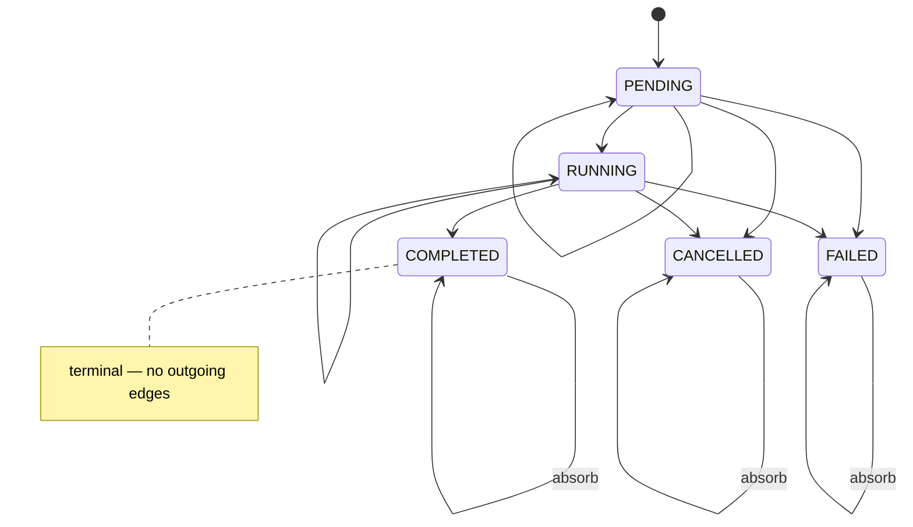

# ADR 0017 — Task state is monotonic; terminal states absorb

## Status

Accepted.

## Context

Task state needs rules about which transitions are legal. The obvious
rules — "PENDING can go to RUNNING, RUNNING can go to COMPLETED" — are
easy. The hard question is what to do when something tries to write a
state that contradicts a state the task is already in.

Specific cases that come up in practice:

1. A task is already COMPLETED. An agent calls `report_task_started` on
   it (maybe the model got confused, maybe a stale message arrived
   after reconnect). What should happen?
2. A task is FAILED. The walker sees a `task_progress` update come in
   from an earlier turn. What should happen?
3. A task is CANCELLED. A belt-and-suspenders path in
   `after_model_callback` parses prose and thinks the task completed
   successfully. What should happen?
4. Two concurrent sub-agents in parallel mode each report a different
   state for the same task (shouldn't happen if the walker is correct,
   but racey bugs exist).

Options:

1. **Last write wins.** Whichever message arrives last sets the state.
   Simple, and wrong — it means a stale retransmit can un-fail a
   failed task.
2. **First write wins.** First terminal state sticks; later writes
   noop. Correct for terminal states but too restrictive for
   non-terminal transitions (PENDING → RUNNING → more PENDING should
   be allowed).
3. **Monotonic state machine with terminal absorption.** Each state
   has an explicit allowed-transition set. Terminal states
   (COMPLETED, FAILED, CANCELLED) have no outgoing edges — they
   absorb all further writes.

## Decision

**Monotonic state machine with terminal absorption.** Defined in
`client/harmonograf_client/invariants.py`:

```python
_TERMINAL_STATUSES = frozenset({"COMPLETED", "FAILED", "CANCELLED"})
_ALLOWED_TRANSITIONS = {
    "PENDING":   frozenset({"PENDING", "RUNNING", "CANCELLED", "FAILED"}),
    "RUNNING":   frozenset({"RUNNING", "COMPLETED", "FAILED", "CANCELLED"}),
    "COMPLETED": frozenset({"COMPLETED"}),
    "FAILED":    frozenset({"FAILED"}),
    "CANCELLED": frozenset({"CANCELLED"}),
}
```

Rules in plain English:
- PENDING can move to RUNNING, FAILED, CANCELLED, or stay PENDING.
- RUNNING can move to COMPLETED, FAILED, CANCELLED, or stay RUNNING.
- Once in a terminal state, the task stays there. Any write that
  tries to change it is a no-op at the per-write guard layer and a
  logged warning at the invariant-validator layer.
- A task cannot go RUNNING → PENDING. Backwards transitions are
  structurally disallowed.

The guard lives in `_set_task_status` (the per-write enforcement) and
is cross-checked by `check_plan_state` (the aggregate invariant, see
[ADR 0015](0015-invariants-as-safety-net.md)).

**Task state machine** — only forward edges; terminal states absorb. A
late retransmit cannot un-complete a COMPLETED task or un-fail a FAILED
one.



## Consequences

**Good.**
- **Stale messages can't corrupt state.** A retransmit of an old
  RUNNING after the task has reached COMPLETED is ignored, not
  applied. This matters more than it sounds — reconnect replay
  + parallel races made this a frequent failure mode in iter14
  (see [ADR 0011a](0011a-span-lifecycle-inference-superseded.md)).
- **Terminal states mean something.** When the UI shows a task
  COMPLETED, the operator can trust that no later message will
  un-complete it. The Gantt does not have to render "was
  completed, maybe still running, we'll see."
- **Cancellation is definitive.** An operator who cancels a task
  gets a state that cannot be clobbered by an in-flight message
  from the agent.
- **Invariant checkable.** The invariant validator walks the
  transition history and asserts monotonicity. A bug that tries to
  write RUNNING after COMPLETED is caught in CI.

**Bad.**
- **"Pause and resume" doesn't fit.** Harmonograf's capabilities
  include `PAUSE_RESUME`, but our task state machine has no PAUSED
  state. We rely on the span lifecycle for pause (spans carry
  AWAITING_HUMAN as a status) and let task state stay RUNNING
  during a pause. An operator who thinks "paused" should be a task
  state will not find one.
- **Recoverable failures need drift, not state.** A task that failed
  and was retried via refine produces a new task (in a new plan
  revision), not a transition on the old one. The old task stays
  FAILED and the UI needs to render both the old (FAILED) and the
  new (RUNNING) sides of the refine. Users who expect "the task
  resumed" have to learn to read plan diffs.
- **"Un-fail" is impossible.** If a FAILED write was an incorrect
  classifier call, the state cannot be corrected in place — the
  only way forward is a refine that replaces the task. In practice
  this is rare, but when it happens the fix is conceptually heavier
  than "correct the classifier."
- **Terminal absorption hides bugs.** A per-write guard silently
  dropping an illegal transition is correct behavior, but it means
  a broken classifier writing COMPLETED in the wrong place is not
  loud. The invariant validator at least logs it, but only if the
  validator is running in the mode that saw the transition.

Monotonicity is the property the iter14 pivot was missing (see [ADR 0011](0011-reporting-tools-over-span-inference.md) and [0011a](0011a-span-lifecycle-inference-superseded.md)). Shipping it is what made the state machine reliable
at all.

## Implemented in

- [Design 11 — Server architecture deep-dive](../design/11-server-architecture.md)
- [Design 12 — Client library + ADK integration](../design/12-client-library-and-adk.md)
