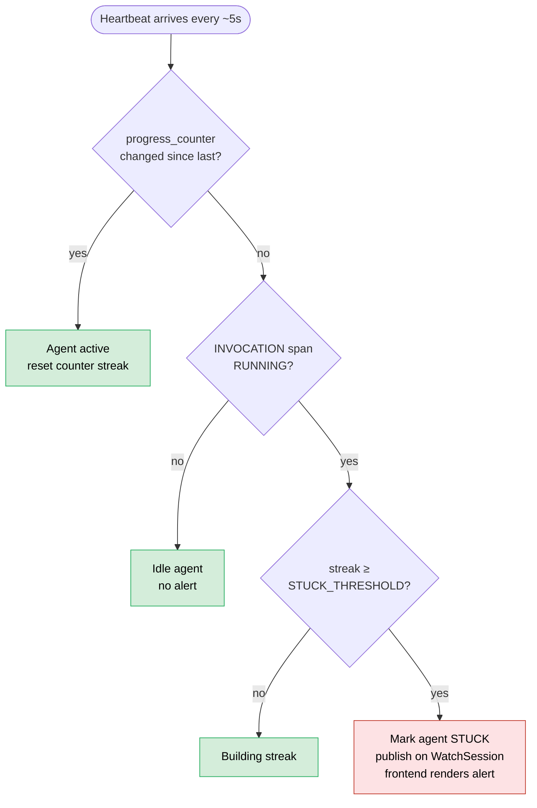

# ADR 0018 — Heartbeat + progress_counter for stuck detection

## Status

Accepted.

## Context

An agent can go "silent" in two different ways:

1. **Network silence.** The process is alive and working, but the
   telemetry stream has stalled (slow network, congested wire, paused
   by flow control). Span bytes are not flowing. The operator should
   not be alarmed — the agent is fine.
2. **Process silence.** The agent is spinning on a tool call that
   never returns, or is stuck in an LLM request that never completes,
   or has entered an infinite loop in its own code. Spans are not
   flowing because nothing is happening.

Distinguishing these matters for the UI. The operator needs to know
"your agent has been stuck for two minutes; do you want to nudge it"
and not "your network is slow." Timestamps on span ends can not tell
them apart: both cases produce a gap in span arrivals.

Options:

1. **Detect based on span end-time freshness.** If no span has ended
   in N seconds, the agent is stuck. Simple, but a long-running tool
   call looks identical to a stuck process by this metric.
2. **Require agents to emit an application-level "still alive"
   signal** periodically, independent of whether work is progressing.
   Separates liveness from activity.
3. **Emit a progress counter alongside the liveness signal** so the
   server can distinguish "agent is alive but doing nothing" from
   "agent is alive and doing work." The latter is a slow operation;
   the former is stuckness.

## Decision

The client library emits a periodic `Heartbeat` message on
`StreamTelemetry` (default every 5 seconds). The heartbeat carries
two liveness-related fields defined in `proto/harmonograf/v1/
telemetry.proto`:

```protobuf
// Monotonically increasing counter incremented on every meaningful
// action (span start/update/end, tool call, LLM call, etc.). The
// server compares successive heartbeats: if progress_counter has
// not changed for STUCK_THRESHOLD consecutive heartbeats while an
// INVOCATION span is RUNNING, the agent is declared stuck and the
// frontend is notified.
int64 progress_counter = 8;

// One-sentence description of what the agent is currently doing,
// suitable for display in the popover summary and graph view
// tooltip. Set by the client adapter.
string current_activity = 9;
```

Rules:
- Heartbeat interval: 5 seconds by default, configurable.
- `progress_counter` is incremented on every span start, span update,
  span end, tool call begin/end, LLM call begin/end. Anything that
  counts as "the agent did something meaningful."
- Server tracks per-agent heartbeats. If `STUCK_THRESHOLD` consecutive
  heartbeats arrive with the same `progress_counter` *and* an
  `INVOCATION` span is RUNNING on that agent, the agent is declared
  stuck. The server publishes the stuck state on `WatchSession` and
  the frontend renders a visual alert on the agent row.
- `current_activity` carries a one-sentence prose description of what
  the agent is doing ("Calling tool search_web with query: climate
  change"). Rendered in the popover and graph tooltip.
- A heartbeat whose `progress_counter` is zero or unset is treated as
  "not populated" and ignored for stuck detection; this is the escape
  hatch for clients that don't yet implement the counter.

See commit `1424e35 feat: progress/liveness tracking + stuckness
detection end-to-end` for the implementation landing.

**Stuck-detection decision** — the server compares successive heartbeats;
unchanged `progress_counter` for `STUCK_THRESHOLD` beats while an INVOCATION
span is RUNNING is the canonical "stuck" signal.



## Consequences

**Good.**
- **Distinguishes "slow" from "stuck".** A long-running tool call
  still ticks `progress_counter` (because the underlying tool is
  emitting span updates), so it is not flagged as stuck. A process
  in an infinite loop that is not calling tools and not emitting
  spans *is* flagged.
- **Heartbeat does double duty.** It already carries buffer stats,
  payload drop counters, CPU percent, and context window tokens.
  Adding `progress_counter` + `current_activity` is incremental.
- **No agent cooperation needed beyond "instrument your tool
  callbacks".** The client library increments the counter from
  inside its own ADK callbacks; the agent does not have to call
  anything explicitly.
- **Frontend can render "what is the agent doing" in realtime.**
  `current_activity` powers the popover and graph tooltip without
  requiring the frontend to reconstruct the agent's state from
  span data.

**Bad.**
- **Stuck detection is a heuristic.** `STUCK_THRESHOLD` is a tuning
  knob; set too low and legitimate long operations get flagged; set
  too high and real stuckness takes minutes to surface. Current
  default is a few heartbeats, which means a stuck agent is
  flagged in tens of seconds.
- **Progress counter is per-agent, not per-task.** A parent agent
  whose children are making progress looks "active" even if the
  parent itself is stuck waiting on a child. Stuckness at the
  granularity of one task within a plan is not detected.
- **Heartbeat cost.** Heartbeats add a constant baseline of
  telemetry traffic, even for agents that are idle. At 5s interval
  this is fine, but it is non-zero.
- **`current_activity` is prose.** Good for display, bad for
  programmatic use. We cannot filter or aggregate on it. A future
  structured field would be better for analytics.
- **Heartbeat can itself hang.** If the client's heartbeat loop is
  blocked (thread deadlock, GIL starvation), heartbeats stop
  arriving. The server then falls back to "no heartbeat at all for
  N seconds" = agent disconnected, which is a different code path
  and a different UI indication. Users see "disconnected" for what
  is actually "stuck in a way that blocks the heartbeat thread."
- **ADK-only activity population.** `current_activity` is set by
  the adapter; a framework without the same set of hook points
  would have a blank string here.

The progress-counter + heartbeat design is the least assumption-heavy
way to reconcile the two failure modes. It doesn't require agent
cooperation and it reuses a channel we already had.
