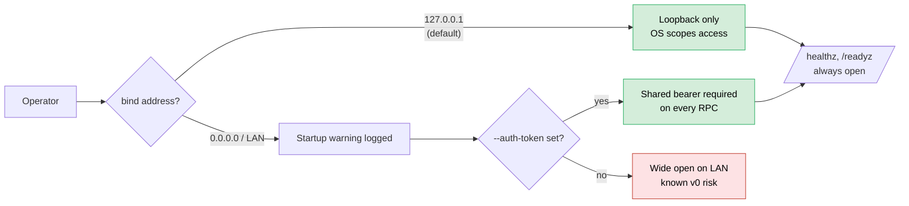

# ADR 0020 — No authentication or multi-tenancy in v0

## Status

Accepted.

## Context

Harmonograf is a console with real capabilities: the frontend can issue
`SendControl` RPCs that pause, resume, cancel, rewind, and inject
messages into running agents. The telemetry stream receives payloads
that likely contain sensitive content (tool results, LLM completions,
user inputs). A careful reading of the feature list says "this needs
auth."

The counter-reading says: v0 ships to a very specific operator
profile. A developer who is running multi-agent workflows on their own
machine, pointing a browser at `localhost:7532`, watching an agent
execute, and closing the tab when done. At that scale, auth adds setup
friction to the quickstart, and the threat model it protects against
("a hostile process on the same loopback interface") is not the threat
we are worried about.

Real auth means one of:

1. **OAuth / SSO.** The gold standard. Requires an identity provider,
   token storage, session management, and per-user state in every RPC
   handler. Weeks of work before an operator can run a demo.
2. **Per-user static tokens.** Less work than OAuth but still requires
   a token store, rotation story, and a way to tell agents which
   token to use.
3. **Shared bearer token.** Everyone with the token is "the operator."
   Simple to implement and to document. Not a multi-tenant story, but
   workable for a shared team deployment.
4. **Loopback-only, no auth.** Bind only to `127.0.0.1`; trust the
   local operating system to scope access.

## Decision

Harmonograf v0:

- **Default bind is loopback-only.** Binding to a non-loopback address
  emits a warning on startup. An operator has to explicitly pick
  a non-loopback address to expose the console on a network.
- **Optional bearer-token auth** via `--auth-token <token>` (see
  commits `400db9c server: optional bearer-token auth + healthz/readyz`
  and `a1ed997 client: bearer-token auth on StreamTelemetry +
  SubscribeControl (task #17 client side)`). When set, every RPC
  (both agent-facing and frontend-facing) requires the header.
- **No OAuth, no SSO, no per-user RBAC, no audit log.** Explicitly
  listed as non-goals in `docs/overview.md`.
- **Health probes (`/healthz`, `/readyz`) are always open**, no auth.

v0 operators who need auth at all use the bearer token; everyone else
runs on loopback and trusts the OS.

**v0 access matrix** — loopback is the default; `--auth-token` adds a
shared bearer; everything else is documented as a known gap until auth v1.

## Consequences

**Good.**
- **Quickstart is one command.** `make demo` and the operator
  quickstart don't have to explain how to set up a login before an
  agent can be seen. This matters for adoption more than it feels
  like it should.
- **The shared-token path exists as a safety valve.** Small teams
  deploying to a shared dev box can use `--auth-token` and get a
  single shared credential. Not great security, but much better
  than nothing.
- **No auth means no auth bugs.** Security bugs in auth code are
  a category we don't ship, because we don't have auth code of
  interesting complexity.
- **Loopback warning is loud.** An operator who binds to 0.0.0.0
  without a token sees a warning and has to acknowledge it. We
  don't silently ship a wide-open console.

**Bad.**
- **Cannot be safely exposed on a shared network without the
  bearer-token flag.** "Anyone on the LAN can pause your agents"
  is the shape of the threat this does not protect against.
  Operators who forget the warning and bind externally are exposed.
- **Payload bytes are not encrypted at rest.** SQLite files and
  payload blobs on the server's disk are plaintext. A user running
  on a multi-tenant machine and trusting filesystem ACLs is exposed
  to anyone with disk access.
- **No audit of who did what.** `PostAnnotation`'s `author` field is
  free-form and self-reported. There is no way to prove who issued
  a `SendControl(CANCEL)`. Teams that care about this have to wrap
  harmonograf in an auth proxy themselves.
- **The bearer token is shared.** Anyone with the token is every
  user. There is no per-session token, no rotation, no revocation.
  Losing the token means restarting the server.
- **No TLS.** The server does not speak HTTPS/TLS. Operators
  exposing harmonograf on a network path that requires TLS have to
  terminate TLS at a reverse proxy in front of the server.

**What flips the decision.** Any of: (a) the product starts being
used for hosted demos where "anyone who hits the URL" is hostile;
(b) deployment to shared-tenant infrastructure (non-dev machines);
(c) a compliance requirement that demands audit logging or SSO;
(d) per-session tokens become a product feature people want in the
UI. Until then, auth stays a non-goal, and the loopback warning +
optional shared token are enough.

The cost of being wrong here is real — an operator who ignores the
warning and gets pwned is a bad outcome. The cost of over-engineering
auth for v0 would have been delaying every other feature in the
overview by weeks. We take the risk knowingly, document it loudly,
and plan auth v1 for after the v0 scope.
