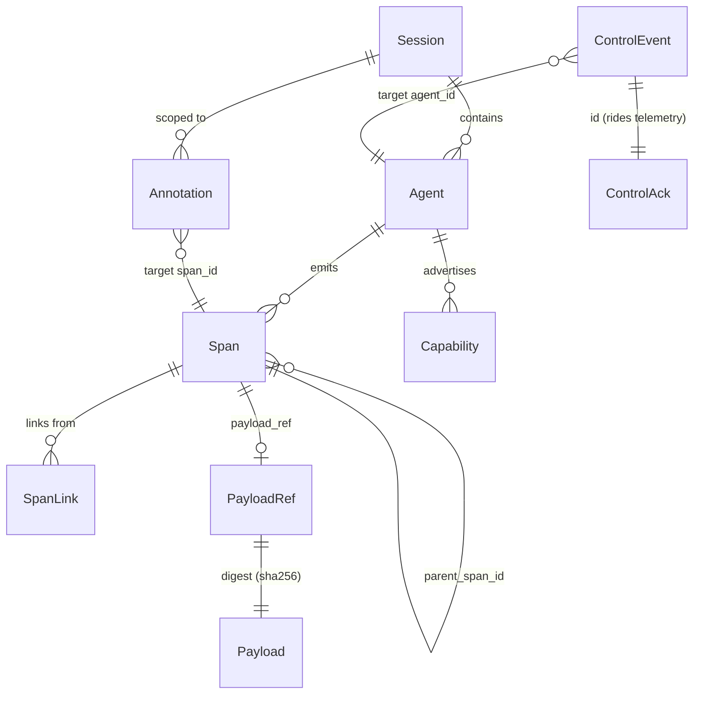
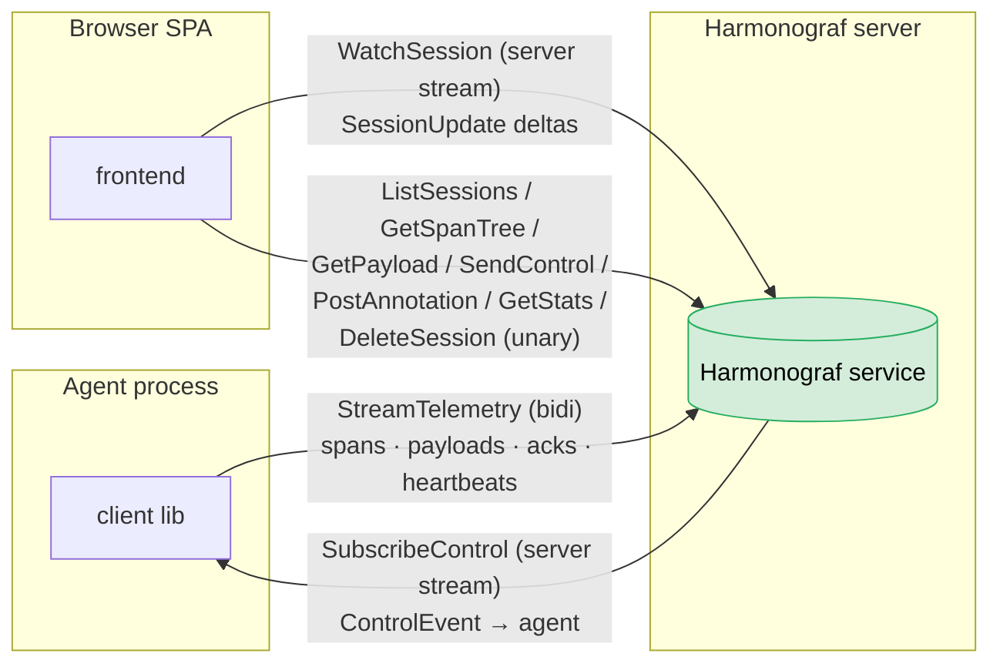
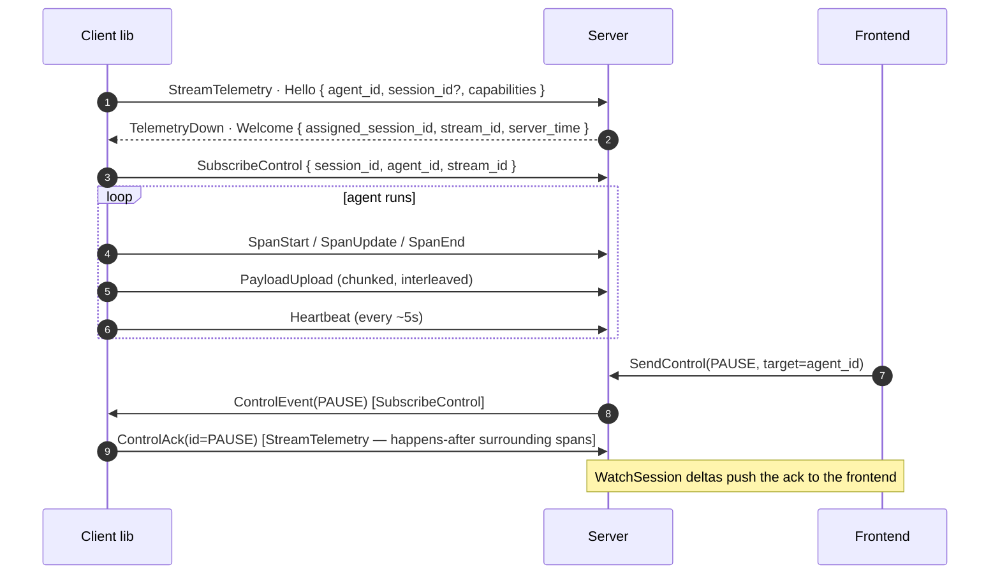

# 01 — Data Model & RPC Protocol

Status: **ACCEPTED** (open questions resolved 2026-04-10; goldfive migration reflected below).

Scope: the wire. Shared primitives used by all three components, plus
the gRPC service that connects agents to the server.

This is the most load-bearing document in the set: the span abstraction
and the RPC contract constrain what every other component can do.

> **Migration note (2026-04).** Orchestration types
> (`Task` / `TaskPlan` / `TaskEdge` / `UpdatedTaskStatus` /
> `TaskStatus`) and control types
> (`ControlKind` / `ControlEvent` / `ControlAck` / `ControlTarget` /
> per-kind payloads) moved out of `harmonograf/v1/types.proto`
> and into `goldfive/v1/{types,control,events}.proto` during Phase A
> of the goldfive migration. Harmonograf imports them wherever they
> cross the wire. The `TelemetryUp` `task_plan = 9` and
> `task_status_update = 10` variants are **reserved** — plan / task
> state now rides inside `TelemetryUp.goldfive_event = 11`.
>
> See [`../protocol/data-model.md`](../protocol/data-model.md) for the
> current wire-level detail and
> [`../goldfive-integration.md`](../goldfive-integration.md) for the
> integration seam.
>
> Newer design decisions that postdate this doc:
>
> - [ADR 0021 — Session id pinning](../adr/0021-session-id-pinning.md)
>   — one adk-web run = one harmonograf session.
> - [ADR 0022 — Lazy Hello](../adr/0022-lazy-hello.md) — defer the
>   `Hello` RPC until first emit to eliminate ghost session rows.
> - [ADR 0023 — Intervention dedup by `annotation_id`](../adr/0023-intervention-dedup-by-annotation-id.md).
> - [ADR 0024 — Per-ADK-agent Gantt rows with auto-registration](../adr/0024-per-adk-agent-gantt-rows.md)
>   — `hgraf.agent.*` hint attributes on the first span drive
>   server-side auto-register.
> - [ADR 0025 — Intervention timeline viz](../adr/0025-intervention-timeline-viz.md).

---

## 1. Design principles

1. **One span primitive, not N framework-specific types.** ADK events, tool calls, LLM calls, user messages, transfers — all are `Span`s with different `kind` and `attributes`. The client library adapts framework concepts into spans; the server and frontend never need to know the framework.
2. **Hot path vs. cold path.** Span metadata (ids, timing, kind, status, short name) is small, frequent, and must stream fast. Payloads (full prompts, tool args, completions, results) are large, needed on drill-down only, and travel on a separate code path. The timeline stays responsive even when payloads are huge.
3. **Cross-agent links are first-class.** A span can reference another span via typed links. This is how the frontend renders coordination arrows and how the server answers "what triggered this?"
4. **Telemetry and control are separate RPCs, not one fused channel.** Telemetry is high-volume, bursty, and tolerant of small delays; control is low-volume and latency-sensitive. Two RPCs on the same service give each its own flow control, its own backpressure surface, and its own reconnect path. To preserve happens-before for acks and avoid a third RPC, **control acks travel back upstream on the telemetry stream** (`ControlAck` is a variant in the telemetry oneof). See §4 for the full rationale.
5. **Never block the agent.** Emit must be non-blocking. Buffering, reconnection, and backpressure are the client library's problem, never the agent code's.

---

## 2. Core entities

**Entity overview** — the primitives of the wire model and how they
relate. Spans are the high-volume hot path; payloads ride out-of-band by
digest; annotations and control events orbit spans/agents.



### 2.1 Session

A session is the unit a user opens in the console. Multiple agents collaborating on one task share a session id.

```
Session {
  id:               string          (human-readable, see below)
  title:            string          (user-visible; defaults to id or first agent's goal)
  created_at:       timestamp
  ended_at:         timestamp | null
  status:           enum { LIVE, COMPLETED, ABORTED }
  agent_ids:        [string]        (denormalized for fast listing)
  metadata:         map<string, string>
}
```

**Id scheme**: session ids are human-readable strings chosen by the client or auto-generated. Format when auto-generated: `sess_YYYY-MM-DD_NNNN` where `NNNN` is a per-day counter assigned by the server on first-connect. Clients may supply their own id (e.g., `sess_2026-04-10_mission-alpha`); the server rejects ids that contain characters outside `[a-zA-Z0-9_-]` or exceed 128 chars. This keeps urls, logs, and the session picker legible.

Agent ids and span ids are separate: agent ids are also user-chosen human-readable strings (e.g., `research-agent`), while span ids remain UUIDv7 since they are internal, high-volume, and never shown to users directly.

**Session creation is automatic.** The first agent to `Connect` with a given session id creates the session. Subsequent agents with the same id join it. If no session id is provided, the client library generates one via the default scheme. There is no separate `CreateSession` RPC — session state is a side-effect of the first connection. (A pre-declaring "coordinator" agent can still set `title` and `metadata` in its `Hello`; subsequent joiners can update metadata but not title.)

### 2.2 Agent

```
Agent {
  id:               string          (stable across reconnects; chosen by client)
  session_id:       string
  name:             string          (display name, e.g., "research-agent")
  framework:        enum { ADK, CUSTOM, ... }
  framework_version: string
  capabilities:     [Capability]    (see §2.6)
  metadata:         map<string, string>
  connected_at:     timestamp
  last_heartbeat:   timestamp
  status:           enum { CONNECTED, DISCONNECTED, CRASHED }
}
```

Identity is chosen by the client. The client library persists agent id on disk so a restarted agent can reclaim its row in the Gantt chart rather than appearing as a new row.

### 2.3 Span — the core primitive

```
Span {
  id:               string (UUIDv7)
  session_id:       string
  agent_id:         string
  parent_span_id:   string | null   (nesting within one agent)
  kind:             SpanKind        // enum, see below
  kind_string:      string          // populated only when kind == CUSTOM
  status:           SpanStatus
  name:             string          (short label shown on the block, e.g., "search_web")
  start_time:       timestamp
  end_time:         timestamp | null
  attributes:       map<string, AttributeValue>    (framework-specific + user-added)
  payload_ref:      PayloadRef | null              (content-addressed, see §2.4)
  links:            [SpanLink]
  error:            ErrorInfo | null
}

SpanKind = enum {
  INVOCATION       // top-level agent turn (ADK Invocation)
  LLM_CALL         // model invocation
  TOOL_CALL        // function/tool execution
  USER_MESSAGE     // message from human in the loop
  AGENT_MESSAGE    // message from another agent
  TRANSFER         // control handoff to another agent (ADK transfer_to_agent)
  WAIT_FOR_HUMAN   // long-running tool awaiting human input
  PLANNED          // projected future work (ghost block on timeline)
  CUSTOM           // framework-specific, rendered generically — paired with kind_string
}

// kind_string: when kind == CUSTOM, this string holds the framework-specific
// label (e.g., "langgraph_node", "crewai_task"). The frontend renders CUSTOM
// blocks with the generic outline color and shows kind_string as the label
// instead of an icon. Empty unless kind == CUSTOM.

SpanStatus = enum {
  PENDING          // created but not yet running
  RUNNING
  COMPLETED
  FAILED
  CANCELLED
  AWAITING_HUMAN   // visually urgent; drives the "needs attention" queue
}

SpanLink {
  target_span_id:  string
  target_agent_id: string           (may differ from this span's agent_id — cross-agent)
  relation:        LinkRelation
}

LinkRelation = enum {
  INVOKED          // this span started target (outgoing)
  WAITING_ON       // this span is blocked on target
  TRIGGERED_BY     // inverse of INVOKED, set by receiver
  FOLLOWS          // sequential ordering across agents
  REPLACES         // this span replaces another (e.g., after rewind)
}
```

**Notes on the model:**

- **`PLANNED` kind** lets agents declare upcoming work ("I will call tool X in ~30s"), which the frontend renders as ghost/dashed blocks — supporting the "future invocations" view you asked for.
- **`REPLACES` relation** supports rewind semantics: when a user rewinds to a point and the agent re-runs from there, new spans link back to the spans they replaced. History is never destroyed.
- **`attributes`** is the extension point. Framework-specific data (ADK event codes, model name, token counts) lives here, typed as a protobuf `Value`-like union.

### 2.4 Payload

Large blobs (LLM prompts/completions, tool args and results, binary artifacts) are content-addressed and stored separately from span metadata.

```
PayloadRef {
  digest:  string        (sha256)
  size:    int64
  mime:    string        (e.g., "application/json", "text/plain", "image/png")
  summary: string        (short preview, e.g., first 200 chars — shown in tooltips)
}

Payload {
  digest:  string
  bytes:   bytes
}
```

**Rationale**: the Gantt chart and tooltips only need `summary`. Full payloads load lazily when the user opens the drawer on a span. Deduplication is a free win (system prompts reused across calls).

**Resolved**: payloads are chunked at 256 KiB. See §4.3.

### 2.5 Annotation

User-attached notes, optionally with steering effect.

```
Annotation {
  id:           string
  session_id:   string
  target:       AnnotationTarget   // span_id, or (agent_id, time_range)
  author:       string             // "user" in local mode
  created_at:   timestamp
  kind:         enum { COMMENT, STEERING, HUMAN_RESPONSE }
  body:         string
  delivered_at: timestamp | null   // for STEERING/HUMAN_RESPONSE: when agent ack'd
}
```

- `COMMENT`: visible in UI only, never sent to agents.
- `STEERING`: sent to the target agent as a steering message via the downward stream. Agent must opt-in to steering (capability flag) or it is stored as a COMMENT.
- `HUMAN_RESPONSE`: the reply to a `WAIT_FOR_HUMAN` span. Delivered synchronously; the awaiting span transitions from `AWAITING_HUMAN` → `RUNNING`.

### 2.6 Capabilities

Agents advertise what control operations they support. The frontend greys out buttons the agent cannot handle.

```
Capability = enum {
  PAUSE_RESUME      // can pause mid-turn
  CANCEL            // can kill cleanly
  REWIND            // can restart from a prior span
  STEERING          // accepts live steering messages
  HUMAN_IN_LOOP     // emits WAIT_FOR_HUMAN spans
  INTERCEPT_TRANSFER // transfers to other agents can be blocked/rerouted by the user
}
```

**Rationale**: not all frameworks support rewind. ADK, for example, does not natively support mid-invocation pause. The capability flag keeps the UI honest.

### 2.7 ControlEvent

Flows **server → agent** on the bidirectional stream.

```
ControlEvent {
  id:         string              (for ack correlation)
  issued_at:  timestamp
  target:     ControlTarget       // agent_id, or (agent_id, span_id)
  kind:       ControlKind
  payload:    bytes               (kind-specific, typed per case)
}

ControlKind = enum {
  PAUSE
  RESUME
  CANCEL
  REWIND_TO          // payload: target span_id
  INJECT_MESSAGE     // payload: text / structured message
  APPROVE            // payload: optional edited args for the pending tool call
  REJECT             // payload: reason string
  INTERCEPT_TRANSFER // payload: new target agent_id or "block"
  STEER              // same as annotation kind=STEERING, delivered live
}
```

Every control event expects a `ControlAck` from the client (success, failure, or unsupported). The frontend surfaces the ack as a toast.

---

## 3. ADK mapping (starting point)

The client library ships with an ADK adapter that translates ADK concepts into spans. This is the reference mapping:

| ADK concept | harmonograf Span | Notes |
|---|---|---|
| `Invocation` | `INVOCATION` span, no parent | One per agent turn. Children are all events in the turn. |
| `Event` with `content` (LLM output) | `LLM_CALL` span | `payload_ref` holds prompt + completion. `attributes` holds model, token counts. |
| `Event` with `function_call` | `TOOL_CALL` span | `name` = tool name. `payload_ref` = args. Child of the LLM_CALL that emitted it. |
| `Event` with `function_response` | Closes the matching `TOOL_CALL` span with result in `payload_ref`. | |
| `Event` with `actions.transfer_to_agent` | `TRANSFER` span with `INVOKED` link to the receiving agent's next `INVOCATION`. | Cross-agent link. |
| Long-running tool | `TOOL_CALL` span with status `AWAITING_HUMAN` until response. | Triggers the approval UI. |
| `Event.actions.state_delta` | Attribute on the enclosing span, not its own span. | Avoids block spam. |

**Non-ADK frameworks** adapt the same way: the adapter decides which events become spans and which become attributes.

---

## 4. gRPC service

**RPC surface at a glance** — agents speak two streaming RPCs (telemetry
bidi + control server-stream); the frontend uses a mix of unary and
server-streaming RPCs; everything lives on one `Harmonograf` service.




```protobuf
syntax = "proto3";
package harmonograf.v1;

service Harmonograf {
  // Agent → server, bidirectional. Spans go up, control acks ride the same
  // upstream. Server downstream is reserved for flow-control hints, not
  // control delivery (see SubscribeControl below).
  rpc StreamTelemetry(stream TelemetryUp) returns (stream TelemetryDown);

  // Server → agent control delivery. The agent opens this once after
  // StreamTelemetry; the server pushes ControlEvents whenever the user
  // interacts. Acks travel back on StreamTelemetry, not on this stream.
  rpc SubscribeControl(SubscribeControlRequest) returns (stream ControlEvent);

  // Frontend → server. Unary/server-stream API for the UI.
  rpc ListSessions(ListSessionsRequest) returns (ListSessionsResponse);
  rpc WatchSession(WatchSessionRequest) returns (stream SessionUpdate);
  rpc GetPayload(GetPayloadRequest) returns (GetPayloadResponse);
  rpc GetSpanTree(GetSpanTreeRequest) returns (GetSpanTreeResponse);
  rpc PostAnnotation(PostAnnotationRequest) returns (PostAnnotationResponse);
  rpc SendControl(SendControlRequest) returns (SendControlResponse);
  rpc DeleteSession(DeleteSessionRequest) returns (DeleteSessionResponse);
  rpc GetStats(GetStatsRequest) returns (GetStatsResponse);
}
```

### 4.1 Telemetry: `StreamTelemetry`

```protobuf
message TelemetryUp {
  oneof msg {
    Hello          hello = 1;         // first message only
    SpanStart      span_start = 2;
    SpanUpdate     span_update = 3;   // attribute/status changes mid-span
    SpanEnd        span_end = 4;
    PayloadUpload  payload = 5;       // chunked, see §4.3
    Heartbeat      heartbeat = 6;     // every 5s, bears buffer stats
    ControlAck     control_ack = 7;   // ack for events received via SubscribeControl
    Goodbye        goodbye = 8;       // graceful disconnect
  }
}

message TelemetryDown {
  oneof msg {
    Welcome        welcome = 1;       // response to Hello
    PayloadRequest payload_request = 2;  // server asks for a payload by digest
    FlowControl    flow_control = 3;     // server-side hint: slow/resume
    ServerGoodbye  server_goodbye = 4;
  }
}
```

**Lifecycle:**

1. Client opens `StreamTelemetry`, sends `Hello { agent_id, session_id?, name, framework, capabilities, resume_token? }`.
2. Server responds with `Welcome { accepted, assigned_session_id, assigned_stream_id, server_time, flags }`. If `session_id` was not provided, server generates one (`sess_YYYY-MM-DD_NNNN`) and returns it. If the session already exists, the agent joins it. If the agent already has live streams under the same `agent_id`, the new one is accepted alongside (multi-stream is allowed) and given a distinct `stream_id`.
3. Client opens `SubscribeControl { session_id, agent_id, stream_id }` once `Welcome` lands. Server begins pushing `ControlEvent`s scoped to that agent.
4. Client streams `SpanStart`/`SpanUpdate`/`SpanEnd` as the agent runs. Order within one stream is preserved; cross-stream order is by timestamp.
5. Client sends `ControlAck` upstream on `StreamTelemetry` for every `ControlEvent` it receives via `SubscribeControl`. Acks ride telemetry so happens-before is observable: when the server sees an ack, it knows every span emitted before the ack was at least enqueued.
6. On heartbeat gaps > 15s, server marks the agent `DISCONNECTED`. Client reconnects with the same `agent_id` and a `resume_token` from the last server-acknowledged span.
7. Either side may send `Goodbye` / `ServerGoodbye` for clean shutdown.

**Connect → stream → control sequence** — Hello on `StreamTelemetry`
returns a `stream_id` that the agent then uses to open `SubscribeControl`.
Control events flow down the second stream; their acks ride back upstream
on the first.



**Resume semantics**: on reconnect, the client replays any buffered but un-ack'd messages on a fresh `StreamTelemetry`. The server idempotently de-duplicates by `span.id` (UUIDv7 makes this cheap). `SubscribeControl` is re-opened too — control delivery is at-least-once with ack-driven dedup on the client.

**Multi-stream rule (resolved D)**: multiple concurrent `StreamTelemetry`s under the same `agent_id` are allowed. The server merges their spans into one logical agent row in the Gantt; spans never collide because span ids are UUIDv7. `ControlEvent`s are fanned out to **every** live `SubscribeControl` for the agent — the agent code is responsible for deciding which instance handles a control event (typically the one whose span is being targeted, identified by the `target.span_id` in the event).

### 4.2 Control: `SubscribeControl`

```protobuf
message SubscribeControlRequest {
  string session_id = 1;
  string agent_id = 2;
  string stream_id = 3;   // from Welcome
}

// ControlEvent message defined in §2.7
```

The server holds one `SubscribeControl` per (agent_id, stream_id) pair. `SendControl` from the frontend looks up the set of live subscriptions for the target agent and pushes the event to each.

### 4.2.1 Why two RPCs instead of one fused bidi stream

Considered and rejected: a single `Connect(stream ClientMessage) returns (stream ServerMessage)` where control events ride the server-side of the same bidi stream as telemetry. Also rejected: three RPCs (telemetry, control-down, ack-up).

Reasons for the two-RPC split with acks folded into telemetry:

- **Separate flow control.** Telemetry can buffer megabytes of payloads without ever blocking control delivery. With one stream, gRPC's per-stream window means a stalled payload upload would also stall a `PAUSE` event. Two streams means control gets its own window and stays low-latency under telemetry pressure.
- **Independent reconnect.** Control reconnects are cheap (single subscribe message); telemetry reconnects involve resume tokens and replay. Coupling them means every transient telemetry hiccup tears down control too.
- **No third RPC.** Acks could go on a separate `StreamControlAcks` client-stream, but that adds another reconnect path, another half-open detection problem, and another piece of state to garbage-collect. Folding acks into the existing telemetry upstream costs one variant in the oneof and gets us happens-before "for free": when the server sees `ControlAck(id=X)`, every span the client emitted before that ack is already on the wire ahead of it.
- **Multi-stream tolerance.** Multiple telemetry streams per agent are allowed (resolved D); a fused bidi would force the server to pick one for control delivery. Two RPCs let `SubscribeControl` exist independently and fan out cleanly.

The cost is one extra RPC in the service definition. Worth it.

### 4.3 Payload upload

### 4.3 Payload upload

Payloads are uploaded out-of-band from span metadata to keep the hot path small.

```protobuf
message PayloadUpload {
  string digest = 1;      // sha256, precomputed by client
  int64  total_size = 2;
  string mime = 3;
  bytes  chunk = 4;       // up to 256 KiB per chunk
  bool   last = 5;
}
```

**Flow**:
1. Client computes digest + summary locally. Sends `SpanStart`/`SpanEnd` with `payload_ref { digest, size, mime, summary }` immediately — the timeline updates without waiting for bytes.
2. Client uploads the bytes in chunks in the background, interleaved with other `TelemetryUp` messages on the same stream.
3. If the client is overflowing its buffer (§4.5), it may skip uploading payloads and mark `payload_ref.summary` with an "evicted" flag. The server will later ask via `PayloadRequest` if the user opens the drawer and the payload is missing.

**Resolves open question B**: use chunking. 256 KiB chunks give us single-digit-ms gRPC frames; 10MB payloads become 40 chunks and remain interleavable.

### 4.4 Heartbeat & health

```protobuf
message Heartbeat {
  int64  buffered_events = 1;      // current in-memory event count
  int64  dropped_events = 2;       // cumulative since connect
  int64  buffered_payload_bytes = 3;
  double cpu_self_pct = 4;         // optional, client-reported
}
```

Shown in the agent row header on the frontend — the user can see when a client is struggling.

### 4.5 Backpressure & buffering (client side)

Requirement (from your answers): **never slow the agent down, buffer up to ~1 minute in memory.**

Concrete policy:
- **Event ring buffer**: bounded, default 2000 entries (~1 min at 30 events/sec). Tunable.
- **Overflow policy**: drop oldest *non-span-boundary* events first (updates before starts/ends), then drop `SpanUpdate`s, then drop entire `TOOL_CALL` spans' payloads (keep the span, lose the body), finally drop whole spans. Every drop increments counters in the next `Heartbeat`.
- **Payload buffer**: separate, default 16 MiB. Overflow: skip upload entirely, mark `payload_ref` as evicted. Span metadata is never dropped because of payload overflow.
- **Emit API is non-blocking**: `client.emit_span_start(...)` returns immediately. Serialization and enqueue happen on a background worker thread. If the queue to the worker is full, the call drops the event on the floor and increments a counter — agent code never blocks.
- **Reconnect**: exponential backoff (100ms → 30s, jittered). Buffer keeps filling (and overflowing per policy) while disconnected.

### 4.6 Frontend-facing APIs

- **`WatchSession`**: server-streamed `SessionUpdate`s. The frontend opens one per visible session. Messages are deltas: new spans, span updates, span ends, new annotations, agent state changes, control acks.
- **`GetSpanTree`**: one-shot request for all spans in a time window + agent filter. Used on initial session open and on large viewport jumps.
- **`GetPayload`**: lazy load for drill-down drawer.
- **`SendControl`**: frontend's way of issuing a `ControlEvent`. Server routes to every live `SubscribeControl` for the target agent; the corresponding `ControlAck` arrives on the agent's `StreamTelemetry` upstream.
- **`GetStats`**: returns server-wide retention stats — total session count, span count, on-disk payload bytes, oldest live session timestamp. Surfaced on the settings/diagnostics page so operators can see growth even though there is no automatic eviction.
- **`PostAnnotation`**: creates annotation; if `STEERING`, server pushes a `ControlEvent.STEER` to the agent and awaits ack before returning.

### 4.7 Auth (v0 and roadmap)

**v0 — local trust**: the server binds to `127.0.0.1` only. Any process on the loopback interface can connect. No credentials.

**v1 — hosted**: gRPC metadata bearer token. Token binds to a `principal` + allowed session ids. `Hello` is rejected if the token's scope doesn't match. Frontend uses a separate session cookie bridged to gRPC-Web metadata.

**v2 — multi-tenant**: per-agent API keys issued via a `/keys` admin API, rotatable, scoped per session. Optional mTLS for agent-to-server.

The protocol is designed so v0 → v1 is additive: v1 adds metadata fields; v0 clients still work against v0 servers.

---

## 5. Resolved decisions (review round 2026-04-10)

- **A — auto-create**: `StreamTelemetry` auto-creates unknown sessions on first `Hello`. No `CreateSession` RPC. (§2.1)
- **B — payload chunking**: 256 KiB chunks. Resolved in §4.3.
- **C — id scheme**: human-readable. Sessions: `sess_YYYY-MM-DD_NNNN` default, user-supplied ids accepted (regex `[a-zA-Z0-9_-]{1,128}`). Agents: user-chosen human-readable. Spans: UUIDv7 (internal, never user-facing). (§2.1, §2.2)
- **D — multi-stream**: multiple concurrent telemetry streams per `agent_id` are allowed. Server merges spans into one logical row; control events fan out to all live `SubscribeControl`s for the agent. (§4.1)
- **E — custom kinds**: `CUSTOM` enum value plus a `kind_string` field. When `kind_enum == CUSTOM`, the string holds the framework-specific label and the frontend renders the block with the generic outline color. (§2.3)
- **F — retention**: unlimited. Server never evicts on its own. `GetStats` exposes growth so operators can decide when to `DeleteSession`. (§4.6)

---

## 6. Out of scope for this doc

- Server internals, storage schema, session lifecycle daemon → see `03-server.md`.
- Python client library API surface, ADK integration code structure → see `02-client-library.md`.
- Frontend rendering, interaction design, color palette → see `04-frontend-and-interaction.md`.

---

## Related ADRs

- [ADR 0004 — Telemetry and control are separate RPCs](../adr/0004-telemetry-control-split.md)
- [ADR 0005 — Control acks ride upstream on the telemetry stream](../adr/0005-acks-ride-telemetry.md)
- [ADR 0006 — gRPC as the wire transport](../adr/0006-grpc-over-other-transports.md)
- [ADR 0009 — UUIDv7 for span identifiers](../adr/0009-uuidv7-span-ids.md)
- [ADR 0010 — A span is not a task](../adr/0010-span-is-not-task.md)
- [ADR 0016 — Content-addressed payloads with eviction](../adr/0016-content-addressed-payloads.md)
