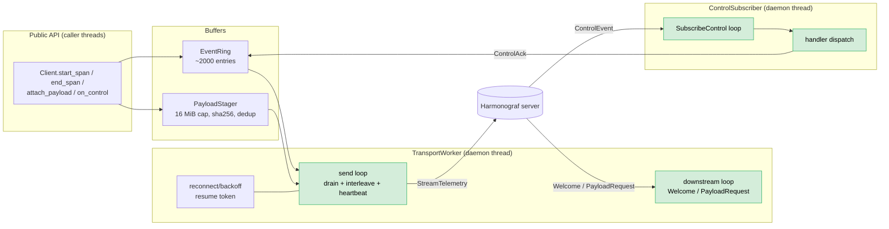
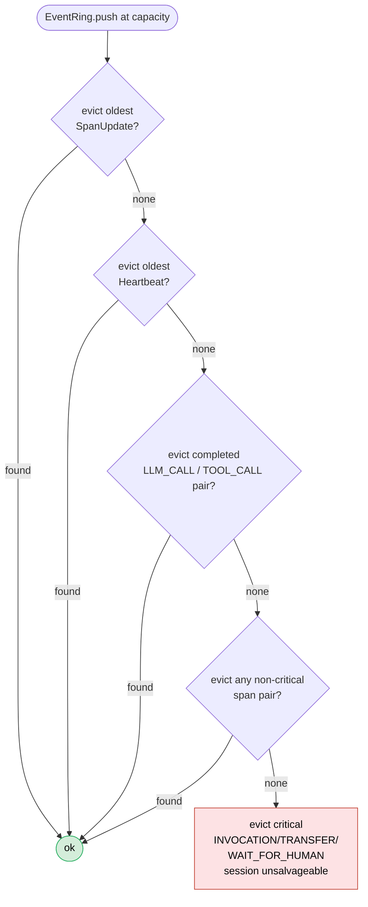
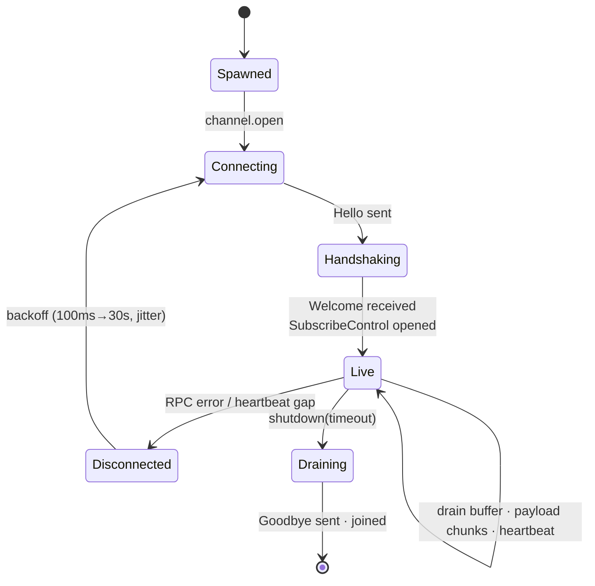

# 02 — Client Library

Status: **DRAFT**
Scope: the Python package that runs inside an agent process and emits telemetry to the harmonograf server. Includes the ADK adapter as the reference framework integration.

This doc presupposes the wire protocol in `01-data-model-and-rpc.md`. Anything wire-shaped (message names, field names, RPC contracts) is authoritative there, not here.

---

## 1. Design goals

1. **Zero blocking on the agent.** Every public emit method returns in microseconds. Serialization, queueing, and network I/O happen on a background worker. If the worker is overloaded, events are dropped — never queued in the caller.
2. **One-line ADK integration.** `harmonograf_client.attach_adk(runner)` is the whole onboarding story for the most common case. Custom frameworks get a thin manual API and the same primitives the ADK adapter uses.
3. **Crash-safe identity.** A restarted agent reclaims its row in the Gantt chart. Restarts don't fragment the timeline.
4. **Visible failure.** When the client drops events or evicts payloads, the user sees it in the Gantt agent header — not in a log file the user will never read.
5. **No required configuration.** `Client()` with zero args produces a working setup against `127.0.0.1:50431` (the default local server port) with sensible defaults for everything.

---

**Internals overview** — public emit lands in the ring buffer; a single
transport worker drains it, runs reconnect/backoff, and shares a stream
with the control subscriber so acks ride telemetry.



## 2. Package layout

```
client/
  pyproject.toml
  harmonograf_client/
    __init__.py             # public re-exports: Client, attach_adk, SpanHandle, ...
    client.py               # Client class — public API surface
    config.py               # ClientConfig dataclass, env var loading
    identity.py             # agent_id persistence (~/.harmonograf/agents/)
    span.py                 # SpanHandle (caller-side opaque handle)
    buffer.py               # RingBuffer + drop policy + counters
    transport.py            # TransportWorker thread, gRPC plumbing, reconnect
    payloads.py             # PayloadStager: digest, summary, chunked upload
    control.py              # ControlSubscriber: SubscribeControl loop, ack dispatch
    capabilities.py         # Capability enum mirror + handler registration
    adapters/
      __init__.py
      adk.py                # attach_adk + ADKAdapter implementation
    pb/                     # generated protobuf + grpc stubs (committed)
      harmonograf/
        v1/
          types_pb2.py
          types_pb2.pyi
          telemetry_pb2.py
          telemetry_pb2.pyi
          control_pb2.py
          frontend_pb2.py
          service_pb2.py
          service_pb2_grpc.py
  tests/
    test_buffer.py
    test_identity.py
    test_payloads.py
    test_transport_with_fake_server.py
    test_adk_adapter.py
```

`pb/` is generated by `make proto` (task #2) and committed for reproducibility.

---

## 3. Public API

### 3.1 Construction

```python
from harmonograf_client import Client, Capability

client = Client(
    name="research-agent",        # required, display name
    session_id=None,              # None → auto-generate or join
    agent_id=None,                # None → load-or-create from disk
    server_addr="127.0.0.1:50431",
    capabilities={Capability.PAUSE_RESUME, Capability.STEERING},
    framework="custom",
    framework_version="0.1.0",
    config=None,                  # optional ClientConfig override
)
```

- `name` is the only required argument. Everything else has defaults.
- If `agent_id` is None, the client looks up `~/.harmonograf/agents/{name}.json`. If present, it reuses the stored id; if not, it generates one (`{name}-{uuid7-suffix}`) and persists it. This is what makes restarts reclaim their Gantt row.
- If `session_id` is None, the client checks the `HARMONOGRAF_SESSION` env var (set by orchestration to make multi-agent runs share a session). If still None, it sends `Hello` with no session_id and the server assigns one.
- `Client.__init__` does not block on the network. It spawns the transport worker and returns. The first emit may happen before `Welcome` arrives — events are buffered until the worker has a connection.

### 3.2 Emission

The emit API is non-blocking and returns opaque handles:

```python
inv = client.start_span(kind="INVOCATION", name="user_turn")
llm = client.start_span(kind="LLM_CALL", name="gpt-4o", parent=inv,
                        attributes={"model": "gpt-4o", "temperature": 0.2})

llm.attach_payload(prompt_bytes, mime="application/json", summary=preview(prompt_bytes))
# ... model returns ...
llm.attach_payload(completion_bytes, mime="application/json",
                   summary=preview(completion_bytes), role="output")
client.end_span(llm, status="COMPLETED")

tool = client.start_span(kind="TOOL_CALL", name="search_web", parent=llm,
                         attributes={"args": {"q": "harmonograf"}})
client.end_span(tool, status="COMPLETED")

client.end_span(inv, status="COMPLETED")
```

`SpanHandle` is opaque from the caller's perspective. Internally it carries:
- `span_id` (UUIDv7, generated client-side)
- `agent_id`, `session_id`, `parent_span_id`
- a reference to the owning `Client` so `handle.update(...)` and `handle.attach_payload(...)` are convenience methods that delegate to the client

Method index:
- `start_span(kind, name, *, parent=None, attributes=None, links=None, kind_string=None, start_time=None) -> SpanHandle`
- `update_span(handle, *, attributes=None, status=None) -> None`
- `end_span(handle, *, status="COMPLETED", end_time=None, error=None) -> None`
- `attach_payload(handle, data: bytes, *, mime: str, summary: str, role: str = "default") -> None`
- `link(source: SpanHandle, target_span_id: str, target_agent_id: str, relation: LinkRelation) -> None` — adds a `SpanLink` to an in-flight or completed span
- `annotate(handle, text: str) -> None` — convenience for client-side `COMMENT` annotations (rare; usually annotations come from the UI)

`kind` accepts either a `SpanKind` enum value or a string. Strings map to enum values; an unrecognized string sets `kind_enum=CUSTOM` and `kind_string=<that string>`. This is the path used by the ADK adapter for non-standard event types.

### 3.3 Lifecycle

```python
client.shutdown(timeout=5.0)   # flushes buffer, sends Goodbye, joins worker
```

`Client` is also a context manager:

```python
with Client(name="research-agent") as client:
    ...   # emit
# shutdown() called automatically; flushes buffer with default 5s timeout
```

`atexit` registers a final-effort flush so even unhandled exceptions get a chance to drain.

### 3.4 Control handlers

Capabilities are advertised in `Hello`. For each capability, the agent must register a handler before any control event arrives, otherwise the client responds with `unsupported`:

```python
@client.on_control("PAUSE")
def handle_pause(event):
    pause_my_loop()
    return ControlAck.success()

@client.on_control("STEER")
def handle_steer(event):
    inject_message(event.payload.decode())
    return ControlAck.success()
```

Handlers run on the control dispatcher thread, **not** the agent's main thread. They must return quickly. Long work should hand off to the agent thread via the agent's own queue. Handlers may return `ControlAck.success()`, `ControlAck.failure(reason)`, or `ControlAck.unsupported()`. The transport worker writes the ack onto the upstream `StreamTelemetry` so the server sees the happens-before ordering described in doc 01 §4.1.

If a handler raises, the client responds with `failure` and the exception is logged.

### 3.5 ADK one-liner

```python
from harmonograf_client import Client, attach_adk
from google.adk.runners import InMemoryRunner

runner = InMemoryRunner(...)
client = Client(name="research-agent")
attach_adk(client, runner)

# now run the runner normally — events are translated to spans automatically
```

`attach_adk(client, runner)` installs hooks on the runner's session service / event bus and registers an `ADKAdapter` instance. The adapter implements the mapping from doc 01 §3 and is the only place ADK-specific code lives. Custom frameworks write their own adapter against the same primitives.

---

## 4. Identity & persistence

Agent identity files live at `~/.harmonograf/agents/{name}.json`:

```json
{
  "agent_id": "research-agent-019192a4-7e23-72b1-9c41-58a8b07d3e2f",
  "first_seen": "2026-04-08T17:22:14Z",
  "last_seen":  "2026-04-10T09:14:02Z"
}
```

Rules:
- The filename is the human-readable `name`. One name = one stable id on this machine.
- If two `Client` instances with the same name run on the same machine simultaneously, both load the same `agent_id`. They each get a distinct `stream_id` from the server, and both render into the same row. This is the multi-stream case from doc 01 §4.1.
- The file is rewritten on every successful `Welcome` to update `last_seen`. Writes are atomic (write to tempfile, rename).
- `~/.harmonograf/agents/` is created on first use with mode 0700.
- Override with `HARMONOGRAF_IDENTITY_DIR` env var for tests and isolated environments.

Resume tokens are **not** persisted across restarts — they live in memory on the transport worker and are only used for in-process reconnects. Cross-restart de-duplication is handled by the server using the persisted span ids (UUIDv7, never recycled).

---

## 5. Ring buffer

The buffer sits between the public emit methods and the transport worker. Its job is to absorb bursts and gracefully shed load when the agent emits faster than the network can drain.

**Drop-policy ladder** — the buffer protects load-bearing spans last; every
drop bumps a counter that rides the next `Heartbeat` so the operator sees
the loss in the agent row header.



### 5.1 Structure

Two buffers:

- **Event buffer** (`buffer.EventRing`): bounded deque of `TelemetryUp` oneof variants (excluding `PayloadUpload`), default capacity 2000. ~1 minute at 30 events/sec.
- **Payload buffer** (`buffer.PayloadStaging`): pending `PayloadStager` objects awaiting chunking + upload, default capacity 16 MiB total bytes.

Both are guarded by a single lock, since the producer (caller threads) and consumer (transport worker) are different threads. Lock hold times are O(1) — append, pop, or peek.

### 5.2 Drop policy (event buffer overflow)

When `EventRing.push()` would exceed capacity, evict in this order until space is freed:

1. **Oldest `SpanUpdate`s.** They are mid-span observations; the ends still convey final state.
2. **Oldest `Heartbeat`s.** A new one will be sent in <5s anyway.
3. **Oldest `SpanStart`/`SpanEnd` pairs from completed spans of kind `LLM_CALL` or `TOOL_CALL`.** Whole spans drop together so the timeline never has half-spans.
4. **Oldest `SpanStart`/`SpanEnd` pairs from completed spans of any kind except `INVOCATION`, `WAIT_FOR_HUMAN`, and `TRANSFER`.** These three are load-bearing for understanding the session and are preserved as long as possible.
5. **Finally**, drop oldest `INVOCATION`/`WAIT_FOR_HUMAN`/`TRANSFER` span pairs. At this point the session is unsalvageable — the next heartbeat will report it.

Each drop increments a counter:

```python
class BufferStats:
    dropped_updates: int
    dropped_heartbeats: int
    dropped_spans_lossy: int      # LLM/TOOL/etc
    dropped_spans_critical: int   # INVOCATION/TRANSFER/WAIT_FOR_HUMAN
    payloads_evicted: int
    payload_bytes_evicted: int
    current_event_count: int
    current_payload_bytes: int
```

The counters ride the next outgoing `Heartbeat`. The frontend exposes them in the agent row header.

### 5.3 Drop policy (payload buffer overflow)

`PayloadStager.attach()` returns immediately. If the new payload would exceed the 16 MiB cap:

1. Mark the payload `evicted=True` in its `PayloadRef.summary` (server-side reconstruction sees this flag).
2. Increment `payloads_evicted` and `payload_bytes_evicted`.
3. Do **not** drop the span — only the bytes. The span still emits with its `PayloadRef` and the user sees the summary text in the drawer; opening the payload tab shows "Payload was not preserved (client under backpressure)".

Payload buffer eviction never affects the event buffer.

### 5.4 Non-blocking emit

`Client.start_span` and friends:

1. Build the proto message (CPU work — microseconds).
2. Acquire the buffer lock, push, release. If the push triggers evictions, they happen under the lock.
3. Notify the transport worker via a condition variable.

There is no `put_with_timeout`, no `Queue.put(block=True)`. If the buffer is so full that even after running the drop policy there is no room (which should be impossible — the policy guarantees space), the call drops the new event and increments `dropped_updates`. Agent code never blocks.

---

## 6. Transport worker

A single daemon thread (`transport.TransportWorker`) owns:

- The gRPC channel to the server
- The `StreamTelemetry` bidi stream
- The `SubscribeControl` server-stream
- Reconnect/backoff state
- The resume token (last span_id the server confirmed)

**Worker lifecycle** — one daemon thread owns the channel; reconnect is a
state of the same thread. The control subscriber is a sibling thread that
shares the buffer for ack delivery.



### 6.1 Connect & handshake

1. Open `grpc.insecure_channel(server_addr)` (channel is async-ready immediately; no blocking).
2. Open `StreamTelemetry`. Send `Hello` first, then start draining the buffer.
3. Wait for `Welcome` on the downstream half. Capture `assigned_session_id` and `assigned_stream_id`.
4. Open `SubscribeControl(session_id, agent_id, stream_id)` on a sibling thread (`ControlSubscriber`).
5. Mark the worker `connected`. Persist `last_seen` to the identity file.

### 6.2 Send loop

```
loop:
  wait for buffer non-empty OR heartbeat tick (5s)
  drain up to N messages from the event buffer
  drain payload chunks (interleave: at most one chunk per N events)
  if heartbeat tick: append a Heartbeat with current BufferStats
  send all messages on StreamTelemetry
```

The interleave ratio means a 10 MB payload (40 chunks) doesn't starve a burst of span updates: at N=10, the span updates and the chunks share bandwidth roughly evenly, and a `PAUSE` ack going upstream still gets out within a few hundred milliseconds.

### 6.3 Receive loop (on `StreamTelemetry` downstream)

Handles `Welcome`, `PayloadRequest`, `FlowControl`, `ServerGoodbye`. `PayloadRequest` looks up the digest in the local payload cache (the bytes we already staged) and re-uploads it; if the bytes were evicted, replies with a `PayloadUpload` carrying `last=true` and `chunk=b""` plus an attribute indicating eviction (server interprets this as "permanently unavailable").

### 6.4 Control receive loop (on `SubscribeControl`)

Runs on a second daemon thread. For each `ControlEvent`:

1. Look up the registered handler by `kind`.
2. Call it. Capture the return value (or exception → failure).
3. Build a `ControlAck` and push it onto the **event buffer** (so it goes upstream on `StreamTelemetry`, satisfying the happens-before contract from doc 01 §4.1).
4. Notify the transport worker.

If no handler is registered, send `ControlAck.unsupported()`.

### 6.5 Reconnect

Triggers: gRPC stream closed by peer, RPC error, heartbeat round-trip failure.

```
backoff = 100ms
loop:
  sleep(backoff + jitter)
  attempt connect
  if success:
    re-send any un-acked messages from the resume buffer
    re-open SubscribeControl
    backoff = 100ms
    break
  else:
    backoff = min(backoff * 2, 30_000ms)
```

The buffer continues to accept (and overflow per policy) while the worker is disconnected.

The server dedups by `span.id`. Resume token is just the last span id the server acked; the client replays from there.

---

## 7. Payload staging

`payloads.PayloadStager` handles digest, summary, and chunking.

```python
class PayloadStager:
    def stage(self, data: bytes, mime: str, summary: str | None) -> PayloadRef:
        digest = hashlib.sha256(data).hexdigest()
        if summary is None:
            summary = self._derive_summary(data, mime)
        ref = PayloadRef(digest=digest, size=len(data), mime=mime, summary=summary)
        if self._would_overflow(len(data)):
            self.evict(ref)
            return ref
        self._cache[digest] = data
        self._chunk_queue.append((digest, mime, len(data)))
        return ref
```

- `_derive_summary` is mime-aware: JSON gets the first 200 chars of `json.dumps(load(data))`, text gets the first 200 chars, binary gets `f"<{mime}, {size} bytes>"`.
- Cache is keyed by digest. Two spans attaching identical bytes (e.g., same system prompt) share one cache entry and one upload — server-side dedup is also keyed by digest.
- Chunking is performed lazily by the transport worker as it pulls from `_chunk_queue`. Chunk size is 256 KiB (from doc 01 §4.3).

---

## 8. ADK adapter

`harmonograf_client.adapters.adk` is the reference adapter. It is the only place ADK-specific imports live.

### 8.1 Hook points

Three hook points cover the ADK event surface:

1. **Runner / SessionService event emission.** ADK emits `Event` objects through its session service. The adapter subscribes to this stream (via `SessionService.append_event` interception or runner-level callbacks, depending on which version of ADK is targeted) and translates each event into one or more spans.
2. **Invocation start/end.** The runner exposes invocation lifecycle. Adapter creates an `INVOCATION` span on start and ends it on completion / cancellation / error.
3. **Long-running tool registration.** ADK has explicit hooks for long-running tools; the adapter uses them to mark `TOOL_CALL` spans as `AWAITING_HUMAN` and propagate the eventual response.

### 8.2 Event-to-span mapping

Implemented per the table in doc 01 §3:

```python
def translate(event: adk.Event) -> list[Action]:
    if event.content and event.content.parts:
        # LLM_CALL: prompt → completion
        actions = [SpanStart(kind="LLM_CALL", ...,
                             attributes={"model": event.model, "tokens_in": ...},
                             payload=("prompt", event.input))]
        for part in event.content.parts:
            if part.function_call:
                actions.append(SpanStart(kind="TOOL_CALL", parent=current_llm,
                                         name=part.function_call.name,
                                         payload=("args", part.function_call.args)))
            elif part.function_response:
                actions.append(SpanEnd(target=tool_for(part.function_response),
                                       payload=("result", part.function_response.response)))
            elif part.text:
                actions.append(SpanEnd(target=current_llm,
                                       payload=("completion", part.text)))
    if event.actions and event.actions.transfer_to_agent:
        actions.append(SpanStart(kind="TRANSFER",
                                 attributes={"target": event.actions.transfer_to_agent},
                                 link_to=("INVOKED", target_agent_id, None)))
    if event.actions and event.actions.state_delta:
        actions.append(SpanUpdate(target=current_invocation,
                                  attributes={"state_delta": event.actions.state_delta}))
    return actions
```

`Action` is a small adapter-local IR; the adapter applies it to the `Client` to emit spans. Keeping translation pure (event → list of actions) makes the adapter trivially unit-testable without spinning up gRPC or even a real `Client`.

### 8.3 Capability mapping

The ADK adapter advertises:

- `HUMAN_IN_LOOP` — ADK's long-running tool support
- `STEERING` — implemented by injecting a synthesized user-message event into the next agent turn

It does **not** advertise `PAUSE_RESUME`, `CANCEL`, or `REWIND` because ADK does not natively support mid-invocation pause or rewind. Operators who want those have to implement them in their own runner wrapper.

`INTERCEPT_TRANSFER` is implementable on top of ADK by wrapping the runner's transfer dispatch, but is not part of v0 of the adapter.

### 8.4 Agent identity in multi-agent ADK runs

ADK multi-agent setups have multiple `Agent` instances under one `Runner`. The adapter is given a name for the **runner** (the harmonograf "agent") at attach time; sub-agents within the runner are recorded as `attributes["sub_agent"]` on their spans rather than separate harmonograf agents. Cross-runner coordination (multiple Python processes) is the case where multiple harmonograf agents appear, joined by a shared `session_id`.

This keeps the Gantt y-axis count manageable: one row per process, not one row per ADK agent definition.

---

## 9. Configuration

`ClientConfig` is a frozen dataclass with all tunables. Loaded from constructor args, then env vars, then defaults.

| Field | Default | Env var |
|---|---|---|
| `server_addr` | `"127.0.0.1:50431"` | `HARMONOGRAF_SERVER_ADDR` |
| `event_buffer_capacity` | 2000 | `HARMONOGRAF_EVENT_BUFFER` |
| `payload_buffer_bytes` | 16 << 20 (16 MiB) | `HARMONOGRAF_PAYLOAD_BUFFER` |
| `chunk_size_bytes` | 256 << 10 (256 KiB) | `HARMONOGRAF_CHUNK_SIZE` |
| `heartbeat_interval_s` | 5.0 | `HARMONOGRAF_HEARTBEAT` |
| `reconnect_initial_ms` | 100 | — |
| `reconnect_max_ms` | 30000 | — |
| `identity_dir` | `~/.harmonograf/agents` | `HARMONOGRAF_IDENTITY_DIR` |
| `disabled` | `False` | `HARMONOGRAF_DISABLED` |

When `disabled=True`, every emit method becomes a no-op and no transport worker is spawned. This is the kill switch for production agents that want to ship harmonograf in the codebase but turn it off in some environments.

---

## 10. Testing strategy

### 10.1 Unit tests

- `test_buffer.py`: drop policy correctness — every priority tier evicts in the right order; counters increment exactly once per drop; buffer stays within capacity under adversarial input.
- `test_identity.py`: load-or-create works; concurrent creation is race-safe (file lock); custom `HARMONOGRAF_IDENTITY_DIR` is respected; corrupted identity files are regenerated with a warning.
- `test_payloads.py`: digest stability; summary derivation per mime type; eviction marks the ref correctly; cache dedups identical bytes.
- `test_adk_adapter.py`: feed canned ADK `Event` fixtures into `translate()`, assert the resulting `Action` list. No gRPC, no `Client`. Cover every row of the doc 01 §3 mapping table.

### 10.2 Integration tests

A `FakeServer` lives in `tests/conftest.py`: an in-process gRPC server that implements `StreamTelemetry`/`SubscribeControl` against an in-memory store. Tests:

- `test_transport_with_fake_server.py`:
  - Happy path: connect, emit 100 spans, verify all received in order.
  - Reconnect: kill the server, restart it, verify replay catches up via resume token.
  - Multi-stream: open two clients with the same `agent_id`, verify both rows merge server-side.
  - Backpressure: configure 10-event buffer, emit 1000 events, verify dropped counter and that `INVOCATION` spans survive.
  - Control round-trip: server sends `PAUSE`, client handler runs, ack arrives upstream within 100ms.
  - Payload chunking: 1 MiB payload uploaded in 4 chunks, server reassembles, digest matches.

### 10.3 ADK end-to-end

Lives in the e2e test suite (task #15), not here, because it requires a real ADK runner and a real harmonograf server.

---

## 11. Out of scope

- Server-side processing → `03-server.md`
- Frontend → `04-frontend-and-interaction.md`
- The wire protocol itself → `01-data-model-and-rpc.md`
- Auth (v0 is local-trust only; client passes no credentials) → revisit when v1 lands
