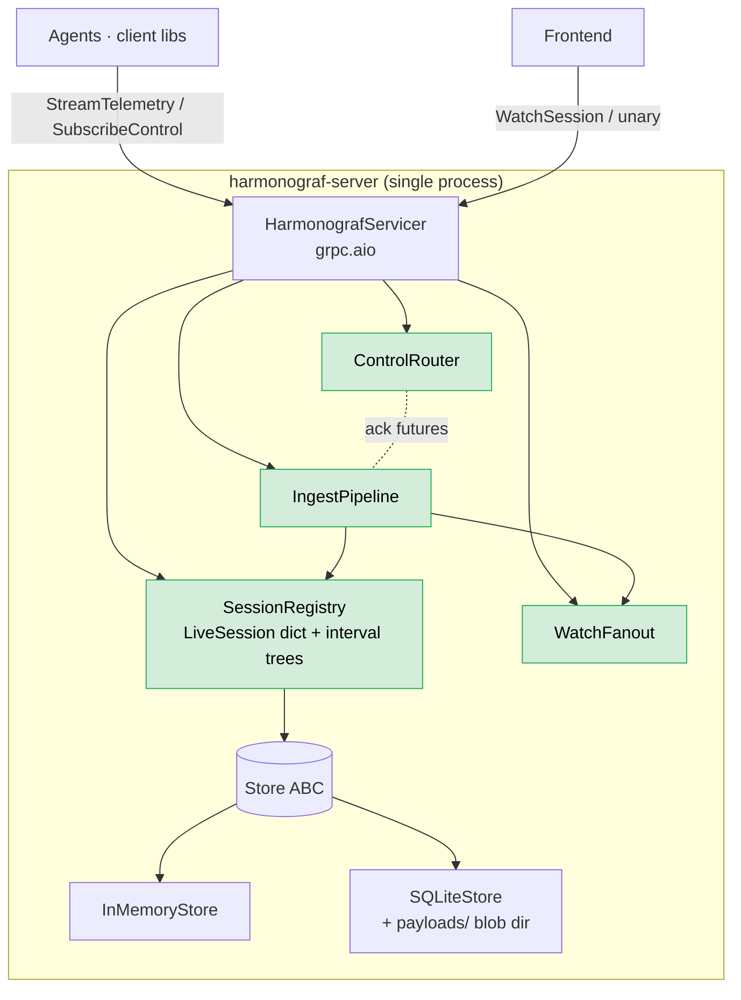

# 03 — Server

Status: **DRAFT**
Scope: the Python process that terminates agent telemetry, persists session state, and serves the frontend. This is the fan-in point: many agents in, one console out, control flowing both ways.

This doc presupposes the wire protocol in `01-data-model-and-rpc.md` and the frontend interactions in `04-frontend-and-interaction.md`. Storage and routing decisions here exist to serve those.

> **Companion doc.** Operator-lens walkthrough of the same code is in
> [11-server-architecture.md](11-server-architecture.md), which
> covers the current state including session routing, agent
> auto-registration, the drift ring, and the intervention
> aggregator. This doc focuses on the *design rationale* for why the
> server is shaped the way it is; doc 11 focuses on *what you find*
> when you open the server package.
>
> **Post-migration deltas (2026-04).** The server now dispatches
> `TelemetryUp.goldfive_event` envelopes (field 11) carrying
> `goldfive.v1.Event` variants for plan / task / drift / run
> lifecycle. `TaskPlan` (field 9) and `UpdatedTaskStatus` (field 10)
> are **reserved** — plan / task state rides inside goldfive events.
> New RPCs since this doc: `ListInterventions` (harmonograf #87).
> New in-memory structures: `_drifts_by_session` ring (500 cap per
> session) for late-subscribe replay.

---

## 1. Design goals

1. **One process, no external services.** A single `harmonograf` binary that includes the gRPC server, storage, and (statically served) frontend assets. No Redis, no Postgres, no message broker. Local-first.
2. **Hot path stays in memory.** Live sessions answer `WatchSession` from RAM. The persistence layer is write-behind, never read-on-the-hot-path.
3. **Pluggable storage.** Behind a `Store` interface so the in-memory backend (tests, ephemeral runs) and the SQLite backend (production) are interchangeable. A future Postgres backend should require nothing in the rest of the server to change.
4. **Control routing is keyed on liveness.** When the frontend issues `SendControl`, the server delivers to **every** live `SubscribeControl` for the agent (multi-stream is allowed). If no stream is live, the call returns `UNAVAILABLE` immediately — no queueing, no replay.
5. **Unbounded retention, observable growth.** The server never evicts. Operators see total counts and disk usage via `GetStats` and decide when to `DeleteSession`.

---

**Component layout** — one process composes ingest, sessions, control,
fanout, and storage. The hot path stays in memory via `SessionRegistry`;
the `Store` is write-behind.



## 2. Package layout

```
server/
  pyproject.toml
  harmonograf_server/
    __init__.py
    __main__.py             # python -m harmonograf_server → main()
    main.py                 # argparse, bootstrap, signal handlers
    config.py               # ServerConfig dataclass
    service.py              # HarmonografServicer (the gRPC service impl)
    sessions.py             # SessionRegistry (in-memory live state)
    ingest.py               # telemetry ingest pipeline
    control.py              # ControlRouter (per-agent pub/sub)
    watch.py                # WatchSession fanout (delta queues)
    storage/
      __init__.py
      base.py               # Store ABC + value objects
      memory.py             # InMemoryStore (interval trees per agent)
      sqlite.py             # SQLiteStore + payload blob store
    payloads/
      __init__.py
      cache.py              # in-memory LRU for hot blob reads
    pb/                     # generated protobuf, committed
      harmonograf/v1/
        types_pb2.py
        ...
        service_pb2_grpc.py
  tests/
    test_storage_memory.py
    test_storage_sqlite.py
    test_ingest.py
    test_control_router.py
    test_watch_fanout.py
    test_service_e2e.py
```

`pb/` is generated by `make proto` (task #2) and committed.

---

## 3. Process lifecycle

`python -m harmonograf_server` boots the server.

```
main()
  parse args (port, data_dir, log_level, store_backend)
  load config
  build store (InMemoryStore | SQLiteStore(data_dir))
  build SessionRegistry(store)
  build ControlRouter()
  build WatchFanout()
  build IngestPipeline(store, registry, fanout)
  build HarmonografServicer(store, registry, router, fanout, ingest)
  start grpc.aio.server() bound to 127.0.0.1:port
  install SIGTERM/SIGINT handlers → graceful_shutdown()
  await server.wait_for_termination()
```

Bind is hard-coded to `127.0.0.1` in v0 — no remote access without future auth. Changing this requires explicitly setting `--bind 0.0.0.0` and accepting the warning printed at startup.

### 3.1 Graceful shutdown

On SIGTERM/SIGINT:

1. Stop accepting new RPCs (`server.stop(grace=...)`).
2. Send `ServerGoodbye` to every live `StreamTelemetry`. Clients will reconnect when the server comes back up; their buffers absorb the gap.
3. Drain in-flight ingest. Anything mid-write to the store gets fsync'd.
4. Close all `SubscribeControl` streams.
5. Close the `Store`. SQLite checkpoints WAL.
6. Exit 0.

Grace period default: 5s. Past that, ungraceful close.

---

## 4. Storage interface

```python
class Store(abc.ABC):
    # Sessions
    def create_or_join_session(self, session_id: str | None,
                               first_agent: AgentInfo) -> Session: ...
    def get_session(self, session_id: str) -> Session | None: ...
    def list_sessions(self, *, status: SessionStatus | None = None,
                      limit: int, offset: int) -> list[Session]: ...
    def update_session(self, session_id: str, *, title: str | None = None,
                       metadata: dict | None = None,
                       status: SessionStatus | None = None,
                       ended_at: datetime | None = None) -> None: ...
    def delete_session(self, session_id: str) -> None: ...

    # Agents
    def upsert_agent(self, agent: AgentInfo) -> None: ...
    def list_agents(self, session_id: str) -> list[AgentInfo]: ...
    def update_agent_status(self, agent_id: str, status: AgentStatus,
                            last_heartbeat: datetime | None = None) -> None: ...

    # Spans
    def write_span_start(self, span: Span) -> None: ...
    def write_span_update(self, span_id: str, attributes: dict | None,
                          status: SpanStatus | None) -> None: ...
    def write_span_end(self, span_id: str, end_time: datetime,
                       status: SpanStatus, error: ErrorInfo | None) -> None: ...
    def get_span(self, span_id: str) -> Span | None: ...
    def query_spans(self, session_id: str, *, agent_ids: list[str] | None = None,
                    time_range: tuple[datetime, datetime] | None = None,
                    limit: int | None = None) -> list[Span]: ...
    def get_span_tree(self, session_id: str, root_span_id: str) -> list[Span]: ...

    # Annotations
    def write_annotation(self, annotation: Annotation) -> None: ...
    def list_annotations(self, session_id: str,
                         *, span_id: str | None = None) -> list[Annotation]: ...
    def mark_annotation_delivered(self, annotation_id: str,
                                  delivered_at: datetime) -> None: ...

    # Payloads
    def put_payload(self, digest: str, mime: str, data: bytes) -> None: ...
    def get_payload(self, digest: str) -> tuple[str, bytes] | None: ...
    def has_payload(self, digest: str) -> bool: ...

    # Stats
    def stats(self) -> StoreStats: ...

    # Lifecycle
    def close(self) -> None: ...
```

All methods are synchronous. Async wrapping happens in the service layer using a thread pool — SQLite writes are I/O-bound but not so frequent that asyncio-friendly drivers are worth the complexity. Tests assert that no method holds a write lock for more than 10ms under steady-state load.

`Span`, `AgentInfo`, etc., are plain dataclasses defined in `storage/base.py`, **not** the protobuf types directly. The service layer converts at the boundary. This keeps the storage layer free of protobuf imports and lets us evolve the wire format without breaking persistence.

**Storage layering** — the live mirror serves the hot path; the `Store`
ABC is the only persistence seam. Payload bytes sit on disk under
two-char shards rather than in SQLite blobs.

```mermaid
flowchart TB
    Hot[Hot path<br/>WatchSession · GetSpanTree<br/>(live sessions)] --> LM[LiveSession mirror<br/>per-agent interval trees]
    LM -. write-behind<br/>asyncio.to_thread .-> Store[Store ABC]
    Cold[Cold path<br/>ListSessions · re-open<br/>(after grace)] --> Store
    Store --> Mem[InMemoryStore<br/>dicts + intervaltree]
    Store --> SQ[SQLiteStore<br/>WAL · indexed by<br/>(session, agent, time)]
    SQ --> FS[(payloads/{xx}/{digest}<br/>filesystem blobs<br/>ref-counted)]

    classDef good fill:#d4edda,stroke:#27ae60,color:#000
    class LM,Store good
```

### 4.1 InMemoryStore

Backed by:

- `dict[session_id, _SessionRow]`
- Per session: `dict[agent_id, AgentInfo]`, `dict[span_id, Span]`, and **per-agent interval trees** keyed by `(start_time, end_time)` for `query_spans` time-range queries.
- `dict[span_id, list[span_id]]` for parent → children lookups.
- `dict[digest, (mime, bytes)]` for payloads. Payloads are ref-counted by the spans pointing at them; `delete_session` decrements refs and drops orphaned blobs.

Interval tree: `intervaltree` package (pure Python, well-tested), with the trees rebuilt incrementally as spans arrive. Span ends update the existing entry rather than re-inserting.

`InMemoryStore` is the default for `--store memory` and is also what tests use by default. It is **lossy on shutdown**: nothing is persisted to disk.

### 4.2 SQLiteStore

Backed by SQLite, file at `{data_dir}/harmonograf.db`. WAL mode for concurrent readers. Schema:

```sql
CREATE TABLE sessions (
  id          TEXT PRIMARY KEY,
  title       TEXT NOT NULL,
  created_at  INTEGER NOT NULL,   -- unix micros
  ended_at    INTEGER,
  status      TEXT NOT NULL,      -- LIVE | COMPLETED | ABORTED
  metadata    TEXT NOT NULL       -- json
);

CREATE TABLE agents (
  id              TEXT NOT NULL,
  session_id      TEXT NOT NULL,
  name            TEXT NOT NULL,
  framework       TEXT NOT NULL,
  framework_ver   TEXT NOT NULL,
  capabilities    TEXT NOT NULL,  -- json array
  metadata        TEXT NOT NULL,
  connected_at    INTEGER NOT NULL,
  last_heartbeat  INTEGER NOT NULL,
  status          TEXT NOT NULL,
  PRIMARY KEY (id, session_id),
  FOREIGN KEY (session_id) REFERENCES sessions(id) ON DELETE CASCADE
);

CREATE TABLE spans (
  id              TEXT PRIMARY KEY,
  session_id      TEXT NOT NULL,
  agent_id        TEXT NOT NULL,
  parent_span_id  TEXT,
  kind            TEXT NOT NULL,
  kind_string     TEXT,
  status          TEXT NOT NULL,
  name            TEXT NOT NULL,
  start_time      INTEGER NOT NULL,
  end_time        INTEGER,
  attributes      TEXT NOT NULL,  -- json
  payload_refs    TEXT NOT NULL,  -- json (multiple roles per span)
  links           TEXT NOT NULL,  -- json
  error           TEXT,           -- json
  FOREIGN KEY (session_id) REFERENCES sessions(id) ON DELETE CASCADE
);

CREATE INDEX idx_spans_session_time ON spans(session_id, start_time);
CREATE INDEX idx_spans_session_agent_time ON spans(session_id, agent_id, start_time);
CREATE INDEX idx_spans_parent ON spans(parent_span_id);

CREATE TABLE annotations (
  id            TEXT PRIMARY KEY,
  session_id    TEXT NOT NULL,
  target_kind   TEXT NOT NULL,    -- span | row
  target_span   TEXT,
  target_agent  TEXT,
  target_time   INTEGER,
  author        TEXT NOT NULL,
  created_at    INTEGER NOT NULL,
  kind          TEXT NOT NULL,
  body          TEXT NOT NULL,
  delivered_at  INTEGER,
  FOREIGN KEY (session_id) REFERENCES sessions(id) ON DELETE CASCADE
);

CREATE TABLE payload_refs (
  digest      TEXT PRIMARY KEY,
  mime        TEXT NOT NULL,
  size        INTEGER NOT NULL,
  ref_count   INTEGER NOT NULL
);
```

Payload **bytes** are stored on the filesystem at `{data_dir}/payloads/{digest[0:2]}/{digest}`, not in SQLite. SQLite's blob storage is fine for KB-scale things but a 10MB completion would bloat the WAL. Filesystem with two-char sharding handles millions of payloads cleanly. Ref-counting is in `payload_refs`; on `delete_session`, the server decrements refs for every span's payload digests, and any row reaching zero is deleted from disk.

Time storage: unix microseconds as `INTEGER`. Avoids floating-point fuzz around span boundaries.

Range queries use the `idx_spans_session_agent_time` index. The interval-tree optimization from `InMemoryStore` is **not** used here — SQLite's index handles the access pattern with 10k-span sessions in single-digit milliseconds, and `WatchSession` answers from the live in-memory mirror anyway.

### 4.3 Live mirror

`SessionRegistry` keeps a `dict[session_id, LiveSession]` for sessions that currently have at least one connected agent. `LiveSession` holds:

- The session metadata
- A ref to every connected agent and its `stream_id`s
- An in-memory copy of all spans created since the session went live (or since server boot, for sessions that were already complete on disk)
- Per-agent interval trees identical to the `InMemoryStore` ones, used by `WatchSession` and `GetSpanTree` for ranges that overlap the live window

Writes to a `LiveSession` happen on the ingest pipeline (§5). Reads happen on `WatchSession` and `GetSpanTree`. Lock granularity: one `RWLock` per `LiveSession`.

When the last agent disconnects and a 30s grace period expires with no reconnect, the session transitions to `COMPLETED`, the live mirror is dropped, and subsequent reads come from the underlying `Store`.

---

## 5. Ingest pipeline

The path from `StreamTelemetry` to "rendered on the frontend":

```
StreamTelemetry RPC handler (per-stream coroutine)
  ↓ async iterator over TelemetryUp
IngestPipeline.handle(stream)
  - on Hello: ensure session exists, register agent, allocate stream_id, send Welcome
  - on SpanStart/Update/End: dedup by span.id, write to Store, update LiveSession,
                             emit SessionUpdate delta to WatchFanout
  - on PayloadUpload chunk: assemble in PayloadAssembler[digest], on last=true
                            verify digest, Store.put_payload, emit delta
  - on Heartbeat: update agent last_heartbeat, mirror BufferStats to LiveSession
  - on ControlAck: route to ControlRouter so a SendControl caller can resolve
  - on Goodbye: mark agent DISCONNECTED, schedule grace timer
```

**Ingest fan-out** — every `TelemetryUp` variant is dispatched into its
own handler; spans land in both the live mirror and the `Store`, then
broadcast to every interested watcher.

```mermaid
flowchart LR
    In([TelemetryUp]) --> Disp{oneof variant}
    Disp -- Hello --> H1[ensure session<br/>register agent<br/>mint stream_id]
    Disp -- SpanStart/Update/End --> H2[dedup by id]
    H2 --> LM[LiveSession mirror<br/>(in-memory)]
    H2 --> ST[asyncio.to_thread<br/>Store.write_span_*]
    H2 --> WF[WatchFanout.broadcast<br/>SessionUpdate delta]
    Disp -- PayloadUpload --> H3[PayloadAssembler[digest]<br/>verify on last=true]
    H3 --> ST
    Disp -- Heartbeat --> H4[update last_heartbeat<br/>mirror BufferStats]
    Disp -- ControlAck --> H5[ControlRouter.deliver_ack]
    Disp -- Goodbye --> H6[mark DISCONNECTED<br/>30s grace timer]

    classDef good fill:#d4edda,stroke:#27ae60,color:#000
    class LM,WF good
```

### 5.1 Dedup

Span ids are UUIDv7 and unique across reconnects. `IngestPipeline` keeps a small bloom filter per session of recently-seen ids; a hit triggers a slow-path lookup against the live mirror to confirm. Spans seen twice are silently ignored (the second copy may carry an updated status — the pipeline merges if so, taking the more advanced status of {RUNNING > COMPLETED}).

### 5.2 Multi-stream merge

Two `StreamTelemetry`s under the same `agent_id` are independent on the wire but write to the same `LiveSession.agents[agent_id]` slot. Each stream gets its own `stream_id`; spans carry an implicit stream attribution but render on one row. `Heartbeat` stats are aggregated across streams in the agent header.

### 5.3 Backpressure (server side)

If `WatchFanout` queues for a frontend client back up (slow consumer), the server **does not** slow ingest. Instead, the slow `WatchSession` stream gets a coalesced "you fell behind, here is a snapshot, resume" message: the per-client delta queue is drained, replaced with a single `SnapshotPointer` referencing a fresh `GetSpanTree` call the client should make. This bounds memory regardless of frontend pathology.

---

## 6. Control router

`ControlRouter` maps `agent_id → list[ControlSubscription]`. Each `ControlSubscription` is the server-side handle for one open `SubscribeControl` call.

```python
class ControlRouter:
    def subscribe(self, session_id: str, agent_id: str, stream_id: str) -> ControlSubscription: ...
    def unsubscribe(self, sub: ControlSubscription) -> None: ...
    def send(self, target_agent_id: str, event: ControlEvent) -> SendResult: ...
    def expect_ack(self, control_id: str, timeout: float) -> Awaitable[ControlAck]: ...
    def deliver_ack(self, ack: ControlAck) -> None: ...
```

### 6.1 SendControl flow

When the frontend calls `SendControl`:

1. Service layer generates a `control_id` (UUIDv7).
2. Builds the `ControlEvent` with `target.agent_id` and (optionally) `target.span_id`.
3. Calls `router.send(target_agent_id, event)`. Router enumerates all live subscriptions for that agent and pushes the event onto each subscription's outgoing queue (which the `SubscribeControl` coroutine drains and writes to the gRPC stream).
4. Calls `router.expect_ack(control_id, timeout=5s)` — returns an awaitable.
5. Awaits the future. When the ingest pipeline sees a matching `ControlAck` on any telemetry stream, it calls `router.deliver_ack(ack)`, which resolves the future.
6. Service layer returns `SendControlResponse{ acks: [...]}` to the frontend. If multiple streams ack'd (multi-stream agent), the response includes all acks; the frontend usually only cares about the first success.
7. If timeout fires, returns `DEADLINE_EXCEEDED` with the partial ack list.

### 6.2 No queueing across reconnects

If `router.send` finds zero live subscriptions for the target, it returns `UNAVAILABLE` immediately. Control events are **not** queued for offline agents — that would be a footgun (a stale `PAUSE` arriving an hour later). The frontend surfaces `UNAVAILABLE` as a snackbar: "Agent X is offline, control not delivered."

The exception is `STEER` annotations: those are persisted as `Annotation` rows and re-delivered when the agent reconnects (§7.1 below). This is an annotation-layer concern, not a control-layer one.

---

## 7. Frontend RPCs

### 7.1 ListSessions

Reads from `Store.list_sessions(status=..., limit=50, offset=...)`. Live sessions are merged in from `SessionRegistry` for the `LIVE` status filter. Sort: live first (desc by last activity), then completed (desc by `ended_at`). Pagination is offset-based; the picker never asks for more than 50 at a time.

### 7.2 WatchSession

Server-streamed `SessionUpdate`s. Implementation:

1. Resolve `session_id`. If live, snapshot the `LiveSession` state into the first `SessionUpdate` (sent as a `Snapshot` variant containing all current spans, agents, annotations).
2. If not live, snapshot from the `Store`.
3. Subscribe the client to the `WatchFanout` for this session. Subsequent updates (span starts/ends/updates, agent state changes, new annotations, control acks the user issued) arrive as `Delta` variants.
4. On client disconnect, unsubscribe.

The snapshot+delta pattern means the client always has a consistent starting point and the deltas are small.

### 7.3 GetPayload

Looks up the digest in `Store.get_payload`. If not present, falls back to the in-flight `PayloadAssembler` (the bytes may be mid-upload). If still not present and the owning agent is live, emits a `PayloadRequest` on the agent's `StreamTelemetry` downstream and awaits the re-upload (with timeout). If the agent reports the payload as evicted, returns `NOT_FOUND` with a flag the frontend renders as the "client under backpressure" message.

### 7.4 GetSpanTree

For a given session and root span (or whole session), returns all descendant spans. Implemented against `Store.get_span_tree`; for live sessions, served from the live mirror's parent → children index.

### 7.5 PostAnnotation

Inserts via `Store.write_annotation`. If `kind == STEERING`:

1. Build a `ControlEvent.STEER` with the annotation body as payload.
2. Call `ControlRouter.send` + `expect_ack`.
3. On success, `Store.mark_annotation_delivered(annotation.id, now)` and return.
4. On `UNAVAILABLE`, the annotation is stored as undelivered. When the agent reconnects (`Hello` arrives and the ingest pipeline registers the agent), the server checks for any undelivered `STEERING` annotations targeting that agent and re-issues `SendControl` for each.

`COMMENT` annotations skip the control round-trip entirely. `HUMAN_RESPONSE` annotations are treated like `STEERING` but with a different `ControlKind` (`APPROVE` / `REJECT` / `INJECT_MESSAGE` depending on the response shape).

### 7.6 SendControl

As described in §6.1.

### 7.7 DeleteSession

`Store.delete_session(session_id)` cascades through `agents`, `spans`, `annotations`. Payload ref counts are decremented; orphaned blobs are removed from disk. The frontend confirms before calling.

### 7.8 GetStats

```protobuf
message GetStatsResponse {
  int64  session_count = 1;
  int64  live_session_count = 2;
  int64  agent_count = 3;
  int64  span_count = 4;
  int64  annotation_count = 5;
  int64  payload_count = 6;
  int64  payload_bytes_on_disk = 7;
  int64  oldest_session_unix_us = 8;
  string store_backend = 9;
  string version = 10;
}
```

`Store.stats()` is the data source. SQLiteStore answers this via cached `COUNT(*)` queries refreshed every 30s; the in-memory store answers from its dicts directly.

The frontend exposes this on the settings/diagnostics page as a "growth" panel: since retention is unlimited, operators need somewhere to see what's accumulating. There is no automatic alert — just the numbers.

---

## 8. Bootstrap & CLI

```
$ harmonograf-server --help

usage: harmonograf-server [-h] [--port PORT] [--data-dir DATA_DIR]
                          [--store {memory,sqlite}] [--bind BIND]
                          [--log-level LEVEL]

Harmonograf coordination console server.

options:
  --port PORT          gRPC port (default: 7531)
  --data-dir DIR       Data directory for sqlite + payloads
                       (default: ~/.harmonograf/data)
  --store BACKEND      Storage backend: memory | sqlite (default: sqlite)
  --bind ADDRESS       Bind address (default: 127.0.0.1; non-loopback prints
                       a warning since v0 has no auth)
  --log-level LEVEL    DEBUG | INFO | WARNING | ERROR (default: INFO)
```

Defaults are chosen so `harmonograf-server` with no arguments runs a working server against a local SQLite store under `~/.harmonograf/data/` on port 7531. The client library defaults match.

### 8.1 Static frontend serving

The server also serves the frontend's built assets under HTTP on the same port via a thin HTTP-on-gRPC tunnel (specifically: a `grpc.aio.server()` won't serve HTTP, so we run a parallel `aiohttp` app on `port + 1` for static files and reverse-proxy gRPC-Web through it). v0 keeps these separate; v1 will consolidate via Envoy or grpc-gateway. The frontend dev workflow uses Vite's dev server and gRPC-Web → server directly.

### 8.2 Logging

Standard library `logging` configured with a structured JSON formatter on stderr. Each log line carries `session_id`, `agent_id`, `span_id`, `stream_id` when in scope. Ingest errors and dropped messages are logged at WARNING; control failures at ERROR; everything routine at INFO.

---

## 9. Concurrency model

`grpc.aio` for the service surface — one coroutine per RPC call. `StreamTelemetry` and `SubscribeControl` coroutines own their respective streams for their full duration.

The `Store` is synchronous and is called from a dedicated thread pool (`asyncio.to_thread`). Pool size: 8 by default. `SessionRegistry`, `ControlRouter`, and `WatchFanout` are pure-asyncio and use `asyncio.Lock`/`asyncio.Queue` internally. No threads other than the storage pool and the gRPC internal threads.

Dataflow:

```
StreamTelemetry coroutine → IngestPipeline.handle (async)
  → SessionRegistry.update (async, under per-session lock)
  → asyncio.to_thread(Store.write_span_*) — fire-and-forget acked by Store
  → WatchFanout.broadcast (async)
    → per-frontend asyncio.Queue → WatchSession coroutine sends
```

Storage write is **not** awaited before the WatchFanout broadcast — the live mirror is the source of truth for the hot path, and the persisted copy catches up asynchronously. If the storage write fails, the live mirror still has the data; on shutdown the in-flight writes get drained in §3.1 step 3.

---

## 10. Testing strategy

### 10.1 Storage tests

`test_storage_memory.py` and `test_storage_sqlite.py` share a parameterized test class so the same suite runs against both backends. Coverage:

- Round-trip every entity type
- `query_spans` with all combinations of filters
- Range queries return spans whose intervals overlap the requested window (boundary cases: span starts before window and ends inside, vice versa, fully contained, fully overlapping)
- Cascading delete clears agents/spans/annotations and decrements payload refs
- `stats()` reflects actual contents

### 10.2 Ingest tests

`test_ingest.py` drives an in-process pipeline with synthetic `TelemetryUp` messages and asserts:

- Hello creates a session and assigns a stream_id
- Duplicate span ids are merged not duplicated
- Multi-stream: two streams with the same agent_id both write into one agent slot
- Heartbeat stats are mirrored to the live agent
- Goodbye + 30s grace ends the session

### 10.3 Control router tests

`test_control_router.py`:

- Subscribe → send → ack round trip
- Send with no subscribers returns `UNAVAILABLE`
- Send with multiple subscribers fans out to all
- Ack timeout returns `DEADLINE_EXCEEDED` with partial acks
- Unsubscribe during a pending send doesn't leak the future

### 10.4 Watch fanout tests

`test_watch_fanout.py`:

- Snapshot is consistent with the live mirror at subscribe time
- Deltas arrive in causal order
- Slow consumer triggers snapshot-pointer fallback after queue threshold
- Disconnecting a watcher cleans up the queue

### 10.5 End-to-end service tests

`test_service_e2e.py` boots a real `HarmonografServicer` against an `InMemoryStore`, opens client streams via `grpc.aio.insecure_channel`, and runs scenarios:

- Single agent emits 100 spans, frontend `WatchSession` sees them in order
- Two agents in one session, transfer link rendered correctly
- Frontend `SendControl(PAUSE)` reaches the agent and ack arrives within 100ms
- `DeleteSession` removes everything and `GetStats` reflects the change

The full ADK end-to-end is task #15 and tests the client library against this server.

---

## 11. Out of scope

- Client library internals → `02-client-library.md`
- Wire protocol → `01-data-model-and-rpc.md`
- Frontend → `04-frontend-and-interaction.md`
- Auth → v1 (see doc 01 §4.7)
- Multi-tenant deployments, clustering, replication → not v0

---

## Related ADRs

- [ADR 0002 — Three-component architecture](../adr/0002-three-component-architecture.md)
- [ADR 0007 — SQLite as the v0 timeline store](../adr/0007-sqlite-over-postgres.md)
- [ADR 0015 — Ship the invariant validator to production](../adr/0015-invariants-as-safety-net.md)
- [ADR 0020 — No authentication or multi-tenancy in v0](../adr/0020-no-auth-in-v0.md)
