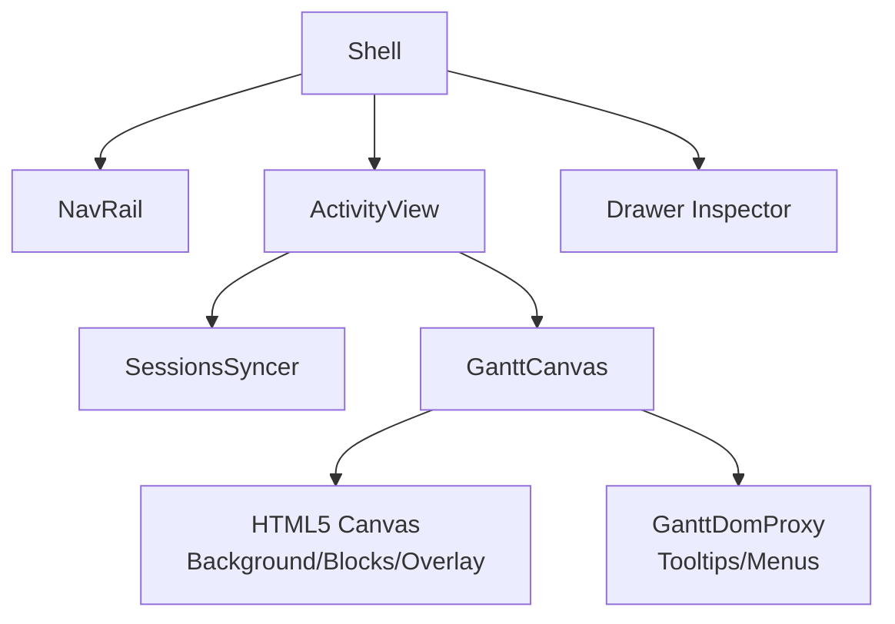
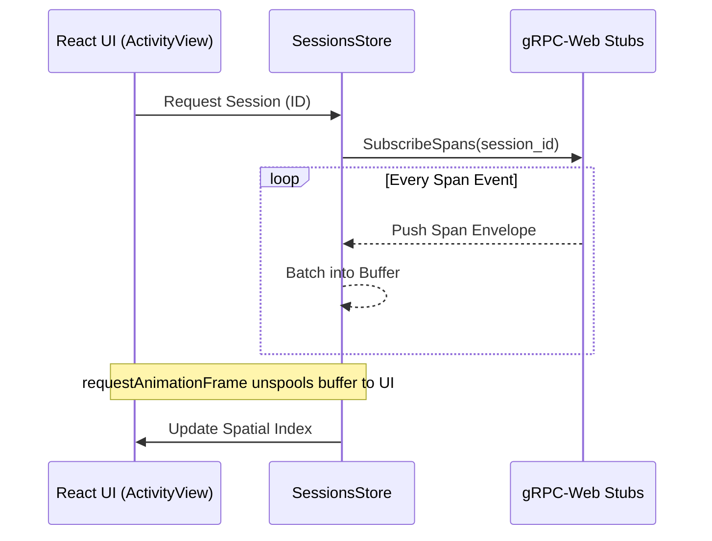

# 10. Frontend Architecture

## Executive Summary

The Harmonograf frontend is a dynamic, high-performance web interface designed for observability, human-in-the-loop (HITL) steering, and granular interactions within multi-agent systems. Built with React and Vite, the frontend connects to the Harmonograf server via gRPC-Web and visualizes complex asynchronous workflows using a specialized Gantt-chart rendering engine built heavily around HTML5 Canvas for unbounded scalability.

With modern multi-agent systems increasingly performing concurrent sub-tasks involving tools, retries, branching logic, and cross-agent communication, traditional chat-based observability tools fall short. The frontend architecture resolves these problems by turning to spatial indexing, a componentized Shell view, bidirectional RPCs for intervention, and highly optimized local state stores.

## 1. System Context and Build Tools

The frontend is a classic Single Page Application (SPA) built using modern web paradigms:
- **TypeScript & React (via Vite):** Ensures strong typing of incoming telemetry data and fast module replacement during development.
- **Protocol Buffers (protobuf):** Type definitions for structures like `Span`, `Agent`, `Session`, and `Transport`. This guarantees that the UI uses exact structures emitted by the gRPC-Web server backend.
- **gRPC-Web & Sonora:** Provides bidirectional structured communication. The UI consumes streaming data through hooks mapped onto these stubs.

## 2. Component Architecture & Shell View

At the highest level, the frontend orchestrates visual components via the Shell view. 
The core rendering target revolves around the Canvas, configured in [`GanttCanvas.tsx`](file:///home/sunil/git/harmonograf/frontend/src/gantt/GanttCanvas.tsx#L31-35).



### The Shell Structure
- **NavRail/AppBar:** Primary left-side and top navigation for toggling views.
- **Drawer:** A right-hand contextual flyout. When users interact with a specific agent span or require a HITL approval, the detail inspector mounts within the Drawer, keeping the Gantt chart context unbroken globally.

## 3. Data Fetching and State Management

Data flow between the backend and the UI relies on Streaming RPCs. The synchronization relies natively on Zustand stores.

### Streaming Pipeline



Rather than rendering the DOM completely upon every JSON packet, updates are batched, saving critical OS frame boundaries. Note how `GanttCanvas` avoids tying React `useState` hooks to high-frequency metric variables—instead relying entirely securely upon independent `mouseMove` boundary matrices internally.

## 4. The High-Performance Gantt Engine

Rendering thousands of concurrent and sequential agent spans with DOM nodes is technically impossible without crashing modern browsers through reflow bottlenecks. The Harmonograf architecture bypasses the DOM entirely.

### 4.1. The Canvas Renderer (`gantt/GanttCanvas.tsx`)
The Gantt layout hooks onto HTML5 elements natively. As seen in the source for [`GanttCanvas.tsx`](file:///home/sunil/git/harmonograf/frontend/src/gantt/GanttCanvas.tsx#L148-150):
```tsx
  <canvas ref={bgRef} style={layer(0)} />
  <canvas ref={blocksRef} style={layer(1)} />
  <canvas ref={overlayRef} style={layer(2)} />
```
The design places static grids onto `layer(0)`, dynamically sized moving span blocks onto `layer(1)`, and volatile boundaries onto `layer(2)`. This multi-canvas hierarchy limits rendering redraw costs exclusively.

### 4.2. Spatial Indexing
To interpret standard mouse actions natively, we correlate `onClick` queries dynamically bypassing CSS objects:
```tsx
  const onContextMenu = (e: React.MouseEvent<HTMLDivElement>) => {
    const spanId = renderer.spanAt(e.clientX - r.left, e.clientY - r.top);
    // ...
  };
```
As bounds are computed for X and Y natively within the layout engine, they are registered to an R-Tree index.

## 5. Viewport Scaling & DOM Overlay Proxy

While Canvas excels at fast rendering, it is abysmal for inputs. The `GanttCanvas` leverages an overlay pipeline to circumvent this.

### DOM Overlay Layer
This involves tracking explicit span coordinates structurally globally. For example, if a span triggers `Approval Needed`, a specific overlay element hooks accurately:
```tsx
  {menu && <SpanContextMenu state={menu} onClose={() => setMenu(null)} />}
  {renderOverlay &&
    canvasSize.w > 0 &&
    renderOverlay({ ... })} // Projection mapped
```
See [`GanttCanvas.tsx:L204-213`](file:///home/sunil/git/harmonograf/frontend/src/gantt/GanttCanvas.tsx#L204-213).

## 6. The Control Router (HITL Submissions)

To complete the Human-in-the-loop circle, the frontend possesses a structured channel for dispatching actions back into the system grid. 
Instead of plain REST mutators, interaction intents execute bi-directional calls natively towards the root orchestrator pipelines.

## 7. Conclusions

The Harmonograf frontend minimizes React render cycles, adopting an ECS-like game-engine loop for data rendering via HTML5 Canvas. By securely interleaving DOM elements exclusively for native text/form inputs, the topology maintains flawless 60 FPS frame rates processing potentially millions of unstructured telemetry events visually correctly.
