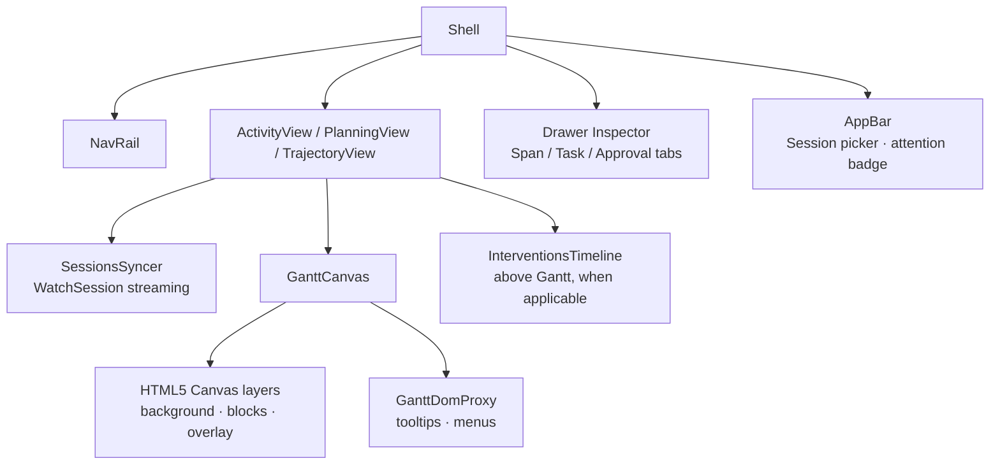
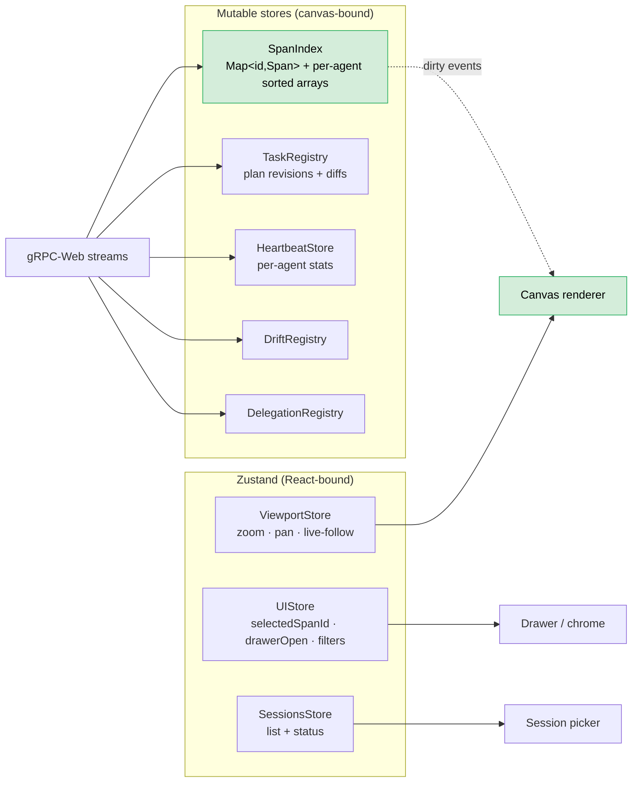
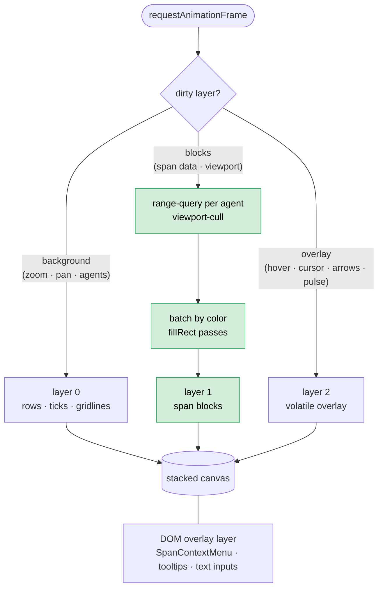
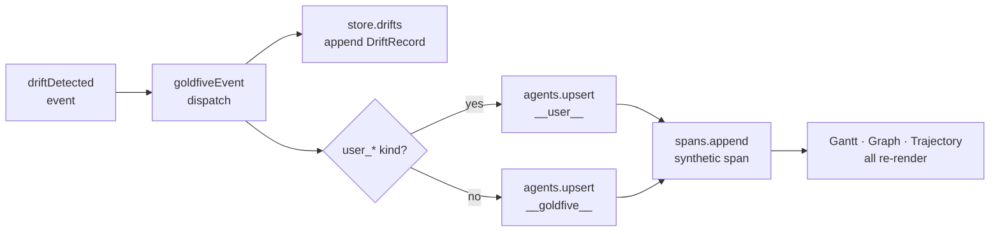

# 10. Frontend Architecture

Status: **CURRENT** (2026-04).

The harmonograf frontend is a React 18 + TypeScript single-page app
that renders multi-agent runs on a custom-canvas Gantt. The chrome
(nav rail, drawer, picker, inspector) is React; the Gantt itself
bypasses React entirely and runs its own `requestAnimationFrame` loop
against mutable stores.

This doc is the operator-lens companion to
[04-frontend-and-interaction.md](04-frontend-and-interaction.md).
Doc 04 covers *what* the operator sees and does; this doc covers
*how* the code is organized and why.

## 1. Stack and build

- **React 18 + TypeScript**, built with Vite.
- **gRPC-Web via Sonora**. Generated stubs live under
  `frontend/src/gen/` (committed). All wire types come straight
  from `proto/harmonograf/v1/` + `proto/goldfive/v1/`.
- **No UI framework** — the chrome uses MD3-style components
  composed in-tree, not `@material/web` imports. Earlier drafts
  planned MD3-via-npm; the current code uses hand-rolled
  components matching MD3 tokens.
- **State**: two tiers.
  - **Zustand stores** for chrome state (selection, filters, view
    intent, session list).
  - **Plain mutable stores** (`SessionStore`, `SpanIndex`,
    `TaskRegistry`, `ContextSeriesRegistry`, `DriftRegistry`,
    `DelegationRegistry`) for hot data. The canvas renderer
    subscribes directly to these, never through React.

## 2. Shell layout



- **NavRail / AppBar** — primary navigation and session-picker
  entry point.
- **Drawer** — right-hand flyout. Opens on span / task selection.
  Keeps Gantt context visible behind it.
- **Views** — `ActivityView` (live Gantt), `PlanningView`
  (plan-centric with intervention timeline), `TrajectoryView`
  (DAG + ribbon for plan-review).

## 3. Data flow

Data flows one direction: server → mutable store → canvas. React
renders chrome off the same stores via
`useSyncExternalStore`-style subscriptions that observe *presence*
(agent list, session metadata, counts), not hot data.



### Streaming pipeline

```mermaid
sequenceDiagram
    participant UI as React (ActivityView)
    participant Store as SessionStore
    participant gRPC as gRPC-Web
    UI->>Store: open session_id
    Store->>gRPC: WatchSession(session_id)
    gRPC-->>Store: SessionUpdate.snapshot (agents, spans, plans, ctx samples)
    gRPC-->>Store: SessionUpdate.burst_complete
    loop live deltas
        gRPC-->>Store: SessionUpdate.new_span / updated_span / ended_span /
                       new_annotation / agent_* / goldfive_event / ...
        Store-->>Store: apply to mutable stores · emit() on listeners
    end
    Note over Store: renderer's subscribers set dirty bits;<br/>next rAF coalesces into a redraw
```

Mutations on the mutable stores are synchronous from the `WatchSession`
handler. The canvas renderer coalesces multiple mutations in one
microtask into a single redraw on the next animation frame.

## 4. The Canvas Gantt

`frontend/src/gantt/GanttCanvas.tsx` mounts three stacked canvases
and forwards pointer events. `frontend/src/gantt/renderer.ts` owns
the draw loop.

```tsx
  <canvas ref={bgRef} style={layer(0)} />        // rows, grid, axis
  <canvas ref={blocksRef} style={layer(1)} />    // span rectangles
  <canvas ref={overlayRef} style={layer(2)} />   // hover, cursor, arrows
```

Design rationale and internals (triple-buffered layers, span
bucketing for batch fill, hit-testing, binary-search context
overlay): see
[internals/renderer-pipeline.md](../internals/renderer-pipeline.md).



## 5. DOM overlay layer

Canvas is great for rendering, terrible for input. The DOM overlay
layer rides on top of the canvases and carries:

- `SpanContextMenu` — right-click actions (inspect, annotate, steer).
- Tooltips anchored to span rects via `renderer.rectForSpan()`.
- Text inputs for annotation compose.

The overlay is reconciled by React normally. Projection math from
span ids to screen coordinates is exposed by the renderer via
`rectForSpan(spanId)` and `getRowLayout(agentId)` so overlay
components don't duplicate layout logic.

## 6. HITL and control submission

Operator actions dispatch through the standard `SendControl` /
`PostAnnotation` unary RPCs. The frontend never holds its own
control socket — it goes through the server's `ControlRouter`.
See [design/13 — Human interaction model](13-human-interaction-model.md)
for the round-trip.

## 7. Actor attribution and span synthesis

The frontend treats the two parties that act on a run from outside
agent code — the human operator and the goldfive orchestrator — as
first-class actor rows, on par with the worker agents. This is
implemented entirely in the event-dispatch layer; neither the wire
protocol nor the server has to know about it.

**Reserved agent IDs.** [`theme/agentColors.ts`](../../frontend/src/theme/agentColors.ts)
defines two reserved ids: `__user__` and `__goldfive__`. Both sit
outside the hashed `schemeTableau10` palette with fixed colors so a
real agent's hash can never shadow them. `SYNTHETIC_ACTOR_IDS`,
`isSyntheticActor()`, and `actorDisplayLabel()` export the
membership check and display mapping.

**Lazy materialization on drift.**
[`rpc/goldfiveEvent.ts`](../../frontend/src/rpc/goldfiveEvent.ts)
routes `goldfive.v1.Event` payloads onto the session stores. The
`driftDetected` case does two things in addition to appending to
`store.drifts`:

1. Decides the attribution actor — `user_steer` / `user_cancel` /
   `user_pause` → `__user__`; everything else → `__goldfive__`.
2. Calls `ensureSyntheticActor(store, actorId)`, which
   `store.agents.upsert`s the row if absent (`connectedAtMs = 1` so
   real agents sort below it,
   `metadata["harmonograf.synthetic_actor"] = "1"` for downstream
   styling hooks).
3. Calls `synthesizeDriftSpan(...)`, which
   `store.spans.append`s a fabricated span on the actor row. Span
   kind is `USER_MESSAGE` for the operator and `CUSTOM` for
   goldfive; attributes carry `drift.kind`, `drift.severity`,
   `drift.detail`, `drift.target_task_id`, `drift.target_agent_id`,
   and `harmonograf.synthetic_span = true` to distinguish from
   client-reported spans.



The net effect is that actor rows require no special-casing in the
views. The Gantt renderer paints a bar on the actor row because the
spans store has one; the Trajectory ribbon paints a drift marker
because the drifts store has one. Both stores are subscribed to
normally, which keeps the actor feature orthogonal to the rendering
architecture described in §4.

**Trajectory view.**
[`components/shell/views/TrajectoryView.tsx`](../../frontend/src/components/shell/views/TrajectoryView.tsx)
is the primary plan-review surface and consumes the same drift
records. Its `buildViewModel()` merges all plans for the session by
`createdAtMs` (not by plan id — goldfive planners often mint fresh
ids on each refine) and bins drifts into the rev that was live when
each drift was observed. The ribbon then renders pivots
(severity-colored `↻`) at rev boundaries and drift markers (stars
for user-authored, circles for goldfive-authored) on each segment.

## 8. Delegation edges

goldfive `2986775+` emits a `DelegationObserved` event every time a
coordinator agent calls `AgentTool(sub_agent)` — i.e. the registry
dispatcher sees a registered-agent-to-registered-agent tool
invocation and fans out an explicit cross-agent edge. The telemetry
plugin's generic `TOOL_CALL` span on the coordinator row is
insufficient to reconstruct this relationship (it does not name the
sub-agent as a recognizable row), so harmonograf consumes the event
directly.

The [`goldfiveEvent.ts`](../../frontend/src/rpc/goldfiveEvent.ts)
dispatcher appends each payload to a new `SessionStore.delegations`
registry
([`DelegationRegistry` in `gantt/index.ts`](../../frontend/src/gantt/index.ts))
whose shape intentionally mirrors `DriftRegistry` — `append()` /
`list()` / `clear()` / `subscribe()`. The Gantt renderer's
`drawDelegations()` pass walks the registry per blocks-redraw and
paints a dashed 30%-opacity bezier (goldfive-cyan) from the
`fromAgent` row-center to the `toAgent` row-center at the observed
time. The Trajectory DAG surfaces a faint
"↪↪ delegated to: X" annotation under the task card. The companion
`agentInvocationStarted` / `agentInvocationCompleted` events remain
no-ops because `HarmonografTelemetryPlugin` already materializes
them as per-agent `INVOCATION` spans.

## 9. Intervention timeline

`components/Interventions/InterventionsTimeline.tsx` renders the
unified chronological strip above the Gantt in planning and
trajectory views. Data comes from two sources:

1. On open, `ListInterventions(session_id)` unary RPC returns the
   full merged history from the server's `interventions.py`
   aggregator.
2. Live updates come through the existing `WatchSession` deltas
   (annotations, `goldfive_event.drift_detected`,
   `goldfive_event.plan_revised`) — `lib/interventions.ts` mirrors
   the server aggregator so a late-joining client dedups
   incrementally without a second RPC.

The component encodes source × kind × severity on three
independent visual channels; X anchor is stabilized so hovering
doesn't jitter neighbors. See
[ADR 0025](../adr/0025-intervention-timeline-viz.md).

## 10. Performance budget

Non-negotiable:

| Metric | Target |
|---|---|
| Frame time (pan / zoom) | < 16 ms p95 |
| Live event → visible | < 100 ms |
| Session open → first paint | < 500 ms for a 1k-span session |
| Drawer open → payload rendered | < 300 ms for a 1 MB payload |
| Memory per session | < 200 MB at 10k spans |

Stress scenarios in the perf suite cover steady-state (5 agents × 10
events/sec × 2h), bursts (500 events/sec for 10s), multi-MB
payloads, and cross-agent chatter. Regressions fail CI.

## Related ADRs

- [ADR 0008 — Canvas rendering for the Gantt chart](../adr/0008-canvas-gantt-over-svg.md)
- [ADR 0013 — Drift is a first-class event](../adr/0013-drift-as-first-class.md)
- [ADR 0025 — Intervention timeline viz on three channels](../adr/0025-intervention-timeline-viz.md)
