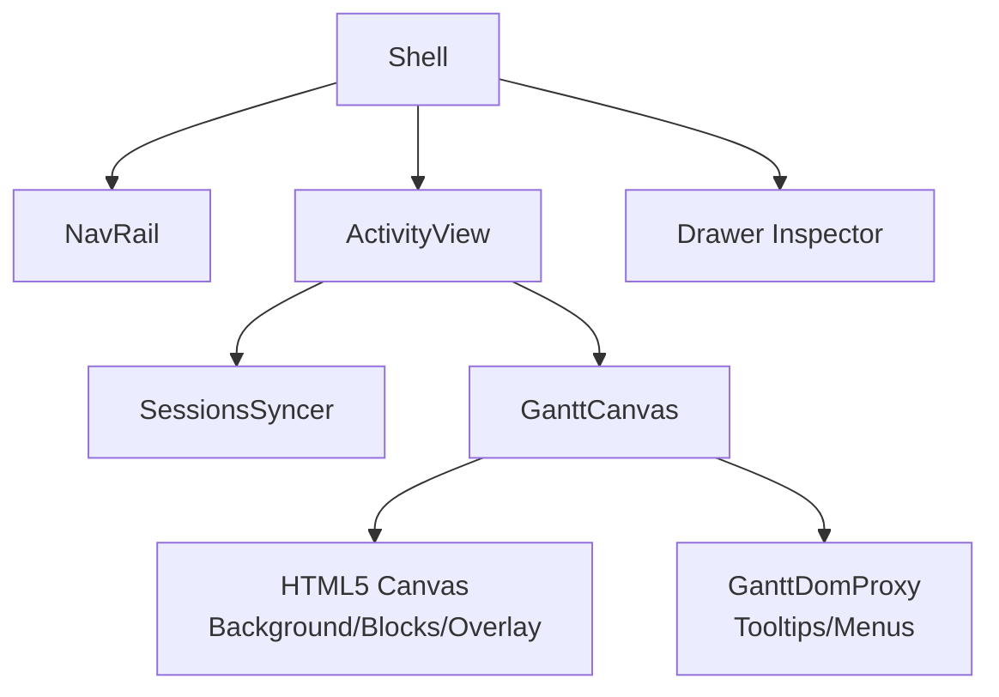
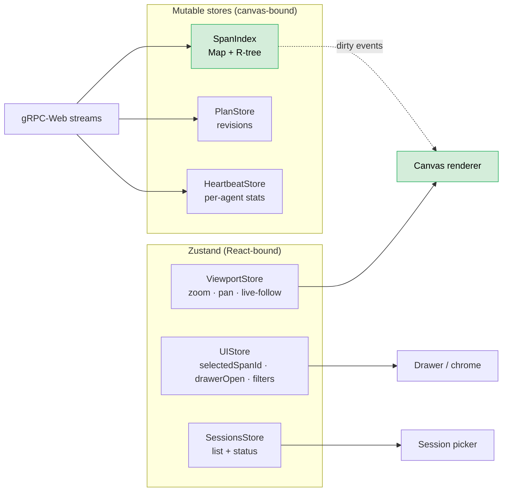
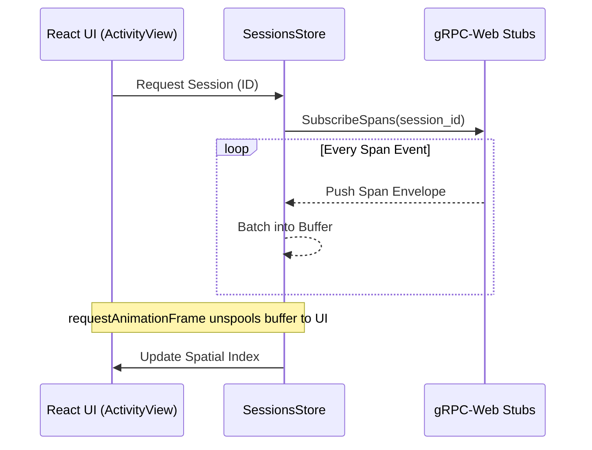
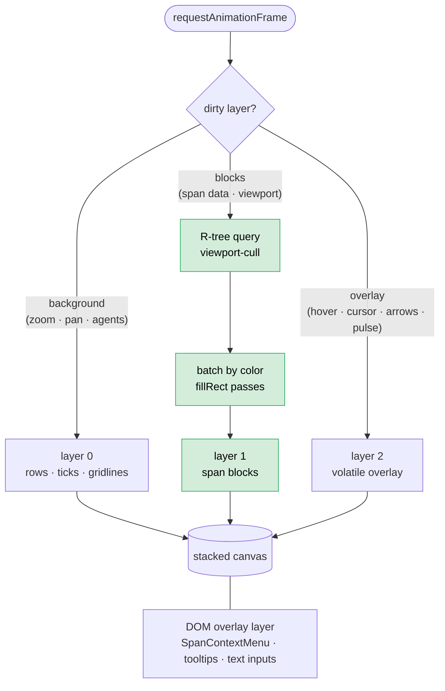
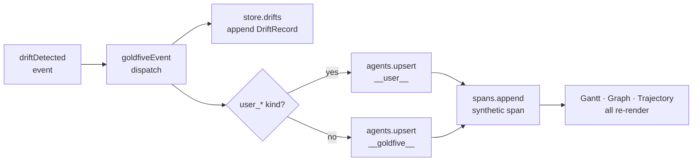

# 10. Frontend Architecture

## Executive Summary

The Harmonograf frontend is a dynamic, high-performance web interface designed for observability, human-in-the-loop (HITL) steering, and granular interactions within multi-agent systems. Built with React and Vite, the frontend connects to the Harmonograf server via gRPC-Web and visualizes complex asynchronous workflows using a specialized Gantt-chart rendering engine built heavily around HTML5 Canvas for unbounded scalability.

With modern multi-agent systems increasingly performing concurrent sub-tasks involving tools, retries, branching logic, and cross-agent communication, traditional chat-based observability tools fall short. The frontend architecture resolves these problems by turning to spatial indexing, a componentized Shell view, bidirectional RPCs for intervention, and highly optimized local state stores.

## 1. System Context and Build Tools

The frontend is a classic Single Page Application (SPA) built using modern web paradigms:
- **TypeScript & React (via Vite):** Ensures strong typing of incoming telemetry data and fast module replacement during development.
- **Protocol Buffers (protobuf):** Type definitions for structures like `Span`, `Agent`, `Session`, and `Transport`. This guarantees that the UI uses exact structures emitted by the gRPC-Web server backend.
- **gRPC-Web & Sonora:** Provides bidirectional structured communication. The UI consumes streaming data through hooks mapped onto these stubs.

## 2. Component Architecture & Shell View

At the highest level, the frontend orchestrates visual components via the Shell view. 
The core rendering target revolves around the Canvas, configured in [`GanttCanvas.tsx`](file:///home/sunil/git/harmonograf/frontend/src/gantt/GanttCanvas.tsx#L31-35).



### The Shell Structure
- **NavRail/AppBar:** Primary left-side and top navigation for toggling views.
- **Drawer:** A right-hand contextual flyout. When users interact with a specific agent span or require a HITL approval, the detail inspector mounts within the Drawer, keeping the Gantt chart context unbroken globally.

## 3. Data Fetching and State Management

Data flow between the backend and the UI relies on Streaming RPCs. The synchronization relies natively on Zustand stores.

**State store layout** — Zustand is used for chrome (selection, filters,
viewport intent); the hot span data lives in plain mutable stores the
canvas subscribes to directly, never through React.



### Streaming Pipeline



Rather than rendering the DOM completely upon every JSON packet, updates are batched, saving critical OS frame boundaries. Note how `GanttCanvas` avoids tying React `useState` hooks to high-frequency metric variables—instead relying entirely securely upon independent `mouseMove` boundary matrices internally.

## 4. The High-Performance Gantt Engine

Rendering thousands of concurrent and sequential agent spans with DOM nodes is technically impossible without crashing modern browsers through reflow bottlenecks. The Harmonograf architecture bypasses the DOM entirely.

### 4.1. The Canvas Renderer (`gantt/GanttCanvas.tsx`)
The Gantt layout hooks onto HTML5 elements natively. As seen in the source for [`GanttCanvas.tsx`](file:///home/sunil/git/harmonograf/frontend/src/gantt/GanttCanvas.tsx#L148-150):
```tsx
  <canvas ref={bgRef} style={layer(0)} />
  <canvas ref={blocksRef} style={layer(1)} />
  <canvas ref={overlayRef} style={layer(2)} />
```
The design places static grids onto `layer(0)`, dynamically sized moving span blocks onto `layer(1)`, and volatile boundaries onto `layer(2)`. This multi-canvas hierarchy limits rendering redraw costs exclusively.

### 4.2. Spatial Indexing
To interpret standard mouse actions natively, we correlate `onClick` queries dynamically bypassing CSS objects:
```tsx
  const onContextMenu = (e: React.MouseEvent<HTMLDivElement>) => {
    const spanId = renderer.spanAt(e.clientX - r.left, e.clientY - r.top);
    // ...
  };
```
As bounds are computed for X and Y natively within the layout engine, they are registered to an R-Tree index.

**Canvas layer pipeline** — three stacked canvases with independent
dirty triggers; the DOM overlay layer rides on top for hit-test handlers
and accessible inputs.



## 5. Viewport Scaling & DOM Overlay Proxy

While Canvas excels at fast rendering, it is abysmal for inputs. The `GanttCanvas` leverages an overlay pipeline to circumvent this.

### DOM Overlay Layer
This involves tracking explicit span coordinates structurally globally. For example, if a span triggers `Approval Needed`, a specific overlay element hooks accurately:
```tsx
  {menu && <SpanContextMenu state={menu} onClose={() => setMenu(null)} />}
  {renderOverlay &&
    canvasSize.w > 0 &&
    renderOverlay({ ... })} // Projection mapped
```
See [`GanttCanvas.tsx:L204-213`](file:///home/sunil/git/harmonograf/frontend/src/gantt/GanttCanvas.tsx#L204-213).

## 6. The Control Router (HITL Submissions)

To complete the Human-in-the-loop circle, the frontend possesses a structured channel for dispatching actions back into the system grid. 
Instead of plain REST mutators, interaction intents execute bi-directional calls natively towards the root orchestrator pipelines.

## 7. Actor Attribution and Span Synthesis

The frontend treats the two parties that act on a run from outside agent code — the human operator and the goldfive orchestrator — as first-class actor rows, on par with the worker agents. This is implemented entirely in the event-dispatch layer; neither the wire protocol nor the server has to know about it.

**Reserved agent IDs.** [`theme/agentColors.ts`](file:///home/sunil/git/harmonograf/frontend/src/theme/agentColors.ts) defines two reserved ids: `__user__` and `__goldfive__`. Both sit outside the hashed `schemeTableau10` palette with fixed colors so a real agent's hash can never shadow them. `SYNTHETIC_ACTOR_IDS`, `isSyntheticActor()`, and `actorDisplayLabel()` export the membership check and display mapping.

**Lazy materialization on drift.** [`rpc/goldfiveEvent.ts`](file:///home/sunil/git/harmonograf/frontend/src/rpc/goldfiveEvent.ts) routes `goldfive.v1.Event` payloads onto the session stores. The `driftDetected` case does two things in addition to appending to `store.drifts`:

1. Decides the attribution actor — `user_steer` / `user_cancel` / `user_pause` → `__user__`; everything else → `__goldfive__`.
2. Calls `ensureSyntheticActor(store, actorId)`, which `store.agents.upsert`s the row if absent (`connectedAtMs = 1` so real agents sort below it, `metadata["harmonograf.synthetic_actor"] = "1"` for downstream styling hooks).
3. Calls `synthesizeDriftSpan(...)`, which `store.spans.append`s a fabricated span on the actor row. Span kind is `USER_MESSAGE` for the operator and `CUSTOM` for goldfive; attributes carry `drift.kind`, `drift.severity`, `drift.detail`, `drift.target_task_id`, `drift.target_agent_id`, and `harmonograf.synthetic_span = true` to distinguish from client-reported spans.



The net effect is that actor rows require no special-casing in the views. The Gantt renderer paints a bar on the actor row because the spans store has one; the Trajectory ribbon paints a drift marker because the drifts store has one. Both stores are subscribed to normally, which keeps the actor feature orthogonal to the rendering architecture described in §4.

**Trajectory view.** [`components/shell/views/TrajectoryView.tsx`](file:///home/sunil/git/harmonograf/frontend/src/components/shell/views/TrajectoryView.tsx) is the primary plan-review surface and consumes the same drift records. Its `buildViewModel()` merges all plans for the session by `createdAtMs` (not by plan id — goldfive planners often mint fresh ids on each refine) and bins drifts into the rev that was live when each drift was observed. The ribbon then renders pivots (severity-colored `↻`) at rev boundaries and drift markers (stars for user-authored, circles for goldfive-authored) on each segment.

## 8. Delegation Edges

goldfive `2986775+` emits a `DelegationObserved` event every time a
coordinator agent calls `AgentTool(sub_agent)` — i.e. the registry
dispatcher sees a registered-agent-to-registered-agent tool invocation
and fans out an explicit cross-agent edge. The telemetry plugin's
generic `TOOL_CALL` span on the coordinator row is insufficient to
reconstruct this relationship (it does not name the sub-agent as a
recognizable row), so harmonograf consumes the event directly.

The [`goldfiveEvent.ts`](file:///home/sunil/git/harmonograf/frontend/src/rpc/goldfiveEvent.ts) dispatcher appends each payload to a new `SessionStore.delegations` registry ([`DelegationRegistry` in `gantt/index.ts`](file:///home/sunil/git/harmonograf/frontend/src/gantt/index.ts)) whose shape intentionally mirrors `DriftRegistry` — `append()` / `list()` / `clear()` / `subscribe()`. The Gantt renderer's `drawDelegations()` pass walks the registry per blocks-redraw and paints a dashed 30%-opacity bezier (goldfive-cyan) from the `fromAgent` row-center to the `toAgent` row-center at the observed time. The Trajectory DAG surfaces a faint "↪↪ delegated to: X" annotation under the task card. The companion `agentInvocationStarted` / `agentInvocationCompleted` events remain no-ops because `HarmonografTelemetryPlugin` already materializes them as per-agent `INVOCATION` spans.

## 9. Conclusions

The Harmonograf frontend minimizes React render cycles, adopting an ECS-like game-engine loop for data rendering via HTML5 Canvas. By securely interleaving DOM elements exclusively for native text/form inputs, the topology maintains flawless 60 FPS frame rates processing potentially millions of unstructured telemetry events visually correctly.

---

## Related ADRs

- [ADR 0008 — Canvas rendering for the Gantt chart](../adr/0008-canvas-gantt-over-svg.md)
