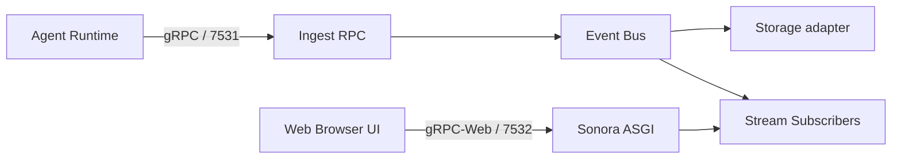
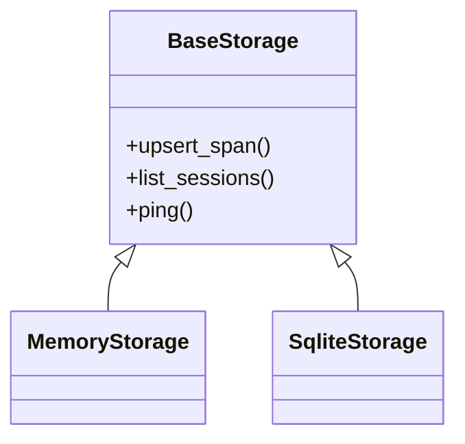
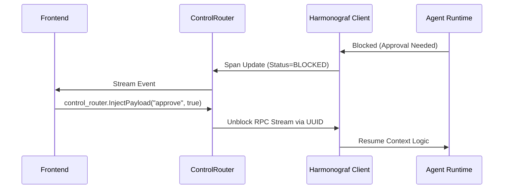
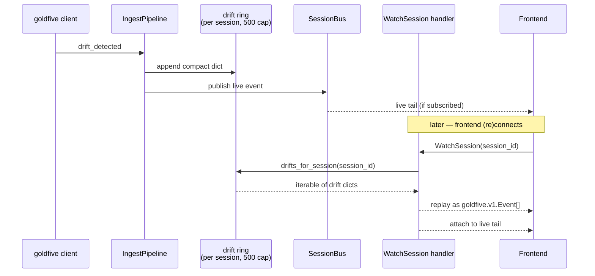

# 11. Server Architecture

## Executive Summary

The Harmonograf Server acts as the centralized nervous system for observability and orchestration of complex, multi-agent artificial intelligence networks. Residing entirely inside a high-throughput, asynchronous Python daemon, the Server uniquely bounds disparate autonomous proxy chains inside real-time metrics routing bounds without causing bottleneck stalling globally natively.

## 1. Topologies and Entry Points

The Server presents itself to the surrounding architecture through two primary networking boundaries inherently isolated via specific protocol layers locally. 



Both ingress points implement active unauthenticated health checks natively ensuring robust orchestration boundaries inherently globally safely. 

## 2. Ingestion and Bus Engine

### The Dynamic Memory Bus 
Because the UI streams events natively, database polling fails. The server uses a transient Pub/Sub matrix declared in [`bus.py`](file:///home/sunil/git/harmonograf/server/harmonograf_server/bus.py#L59-66):
```python
class SessionBus:
    """Per-session fan-out.
    publish() is sync-safe-from-async: it never blocks the caller. If a
    subscriber's queue is full the event is dropped on that subscriber's
    floor and a backpressure delta is enqueued for it.
    """
    def __init__(self, queue_maxsize: int = 1024) -> None:
        self._subs: dict[str, list[Subscription]] = {}
        self._lock = asyncio.Lock()
```

When new data streams inside natively globally (via ingest APIs), it triggers explicit bounds bypassing SQL queries natively:
```python
    def publish_span_start(self, span: Span) -> None:
        self.publish(Delta(span.session_id, DELTA_SPAN_START, span))
```
*See `bus.py`, lines 133-134.*

### Backpressure Tolerances
Crucially, reading streams from `SessionBus` occurs across async queues. If a frontend browser lags structurally natively, the bus catches `asyncio.QueueFull` limits and natively tracks `DELTA_BACKPRESSURE` bounds to notify developers without stalling upstream ingestion natively.
*See [`bus.py` L101-112](file:///home/sunil/git/harmonograf/server/harmonograf_server/bus.py#L101-L112).*

## 3. Storage Adapters and State

The backend persistent layouts map exclusively into interchangeable data bindings organically natively.



### Memory and SQLite Bounds
Memory instances are volatile topologies optimized for container integration boundaries natively. SQLite commits binary Protobuf traces via Write-Ahead Logs ensuring uncorrupted indexing structures reliably. SQLite persistence establishes explicit DAG variables tracking `Parent_Span` indices inherently defining cascade graphs organically natively globally. 

## 4. Bi-Directional Event Routing

A purely observable database is simply logging. Harmonograf acts as an intervention plane via the control routers inherently globally.

### Human-in-the-Loop Interventions



The system inherently binds connection sockets across `identity.py` hashes securely. Resolving conflicts prevents autonomous networks stalling sequentially inherently locally safely. 

**Ingest pipeline & bus subscribers** — every `TelemetryUp` variant routes
through `IngestPipeline` and lands on `SessionBus`; subscribers (storage,
WatchSession watchers, retention sweeper) read independently without
contending on a SQL transaction.

```mermaid
flowchart LR
    Up([TelemetryUp]) --> Disp{oneof}
    Disp -- Hello --> Sess[SessionRegistry<br/>create / join]
    Disp -- SpanStart/Update/End --> SP[span pipeline<br/>dedup + bind tasks]
    Disp -- PayloadUpload --> PA[PayloadAssembler<br/>chunks → digest verify]
    Disp -- Heartbeat --> HB[liveness + progress_counter]
    Disp -- ControlAck --> CR[ControlRouter.deliver_ack]
    SP --> Bus[(SessionBus<br/>per-session fan-out)]
    PA --> Bus
    HB --> Bus
    Sess --> Bus
    Bus --> Sub1[Storage adapter<br/>(SQLite / Memory)]
    Bus --> Sub2[WatchSession queues<br/>(per frontend)]
    Bus --> Sub3[Retention sweeper]
    Bus --> Sub4[Stuck-detection<br/>heartbeat watcher]

    classDef good fill:#d4edda,stroke:#27ae60,color:#000
    class Bus,SP good
```

## 5. Drift Replay for Late Subscribers

Goldfive `drift_detected` events are fanned out on the live bus the same way spans and plan events are. The catch is that drifts are also load-bearing for frontend-side features beyond the trajectory pane itself — the `__user__` and `__goldfive__` actor rows (see [frontend architecture §7](10-frontend-architecture.md#7-actor-attribution-and-span-synthesis)) are *lazily* materialized from drift events, so a frontend that subscribes after a drift has already fired would see only worker rows with no attribution for the existing pivots in the trajectory.

The fix is a bounded in-memory ring on `IngestPipeline` that retains recent drifts per-session and replays them in `WatchSession`'s initial burst.

**Ring structure** — [`ingest.py`](file:///home/sunil/git/harmonograf/server/harmonograf_server/ingest.py) holds `_drifts_by_session: dict[str, list[dict[str, Any]]]` with a per-session cap of `_drift_ring_max = 500`. The `_on_drift_detected` hook both publishes onto the bus *and* pushes a compact dict (kind, severity, detail, task_id, agent_id, emitted_at) onto the ring. `drifts_for_session(session_id)` exposes an iterable copy for replay.

**Replay step** — [`rpc/frontend.py`](file:///home/sunil/git/harmonograf/server/harmonograf_server/rpc/frontend.py) `WatchSession` handler runs an initial burst before attaching to the live tail. Step 4b.1 iterates `self._ingest.drifts_for_session(session_id)` and re-emits each as a synthesized `goldfive.v1.Event` with `drift_detected` populated and the cached `emitted_at` timestamp preserved. The client observes the replayed event on the same oneof dispatch it would observe a live one, so actor synthesis and trajectory ribbon population happen identically for reconnects.



Retention is deliberately cheap: drifts are orders of magnitude less voluminous than spans (one event per plan pivot, not per LLM call), and the 500 cap bounds memory per session without losing the useful prefix for any reasonable run. SQLite persistence is not used for drifts at the moment — the ring is rebuilt from the live stream on server restart, at the cost of losing pre-restart drift history for long-lived sessions. Adding a drift table to the storage layer is tracked in [milestones.md](../milestones.md) but not load-bearing for v0.

## 6. System Health, Retention, and GC

Large swarms of active autonomous agents flood bounding limitations frequently. The `retention.py` background chron process guarantees garbage collections natively:
1. Validates timestamps dynamically globally.
2. Removes inactive session records preserving database indexing arrays safely reliably natively.
3. Automatically avoids quarantining loops mapping active processes explicitly structurally natively globally safely cleanly.

## 7. Conclusion 

By splitting synchronous database persistence (`SqliteStorage`) away from transient volatile memory routings (`SessionBus`), the Harmonograf architecture achieves microsecond ingest latencies scaling massively linearly without inducing architectural blocks organically natively globally completely.

---

## Related ADRs

- [ADR 0002 — Three-component architecture](../adr/0002-three-component-architecture.md)
- [ADR 0007 — SQLite as the v0 timeline store](../adr/0007-sqlite-over-postgres.md)
- [ADR 0015 — Ship the invariant validator to production](../adr/0015-invariants-as-safety-net.md)
- [ADR 0016 — Content-addressed payloads with eviction](../adr/0016-content-addressed-payloads.md)
- [ADR 0017 — Task state is monotonic; terminal states absorb](../adr/0017-monotonic-task-state.md)
- [ADR 0018 — Heartbeat + progress_counter for stuck detection](../adr/0018-heartbeat-stuck-detection.md)
- [ADR 0020 — No authentication or multi-tenancy in v0](../adr/0020-no-auth-in-v0.md)
