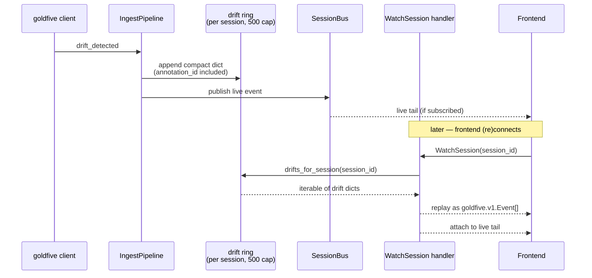

# 11. Server Architecture

Status: **CURRENT** (2026-04, reflects the #63 / #66 / #71 / #80 / #85 refreshes).

This is the operator-lens companion to [03-server.md](03-server.md).
Where doc 03 justifies *why* the server is shaped the way it is, this
doc walks through *what* you actually find in
`server/harmonograf_server/` and how the pieces compose.

## 1. Ingress surfaces

The server presents two network surfaces from one process:

```mermaid
flowchart LR
    A[Agent runtime<br/>(harmonograf_client · goldfive)] -- "gRPC / 7531<br/>StreamTelemetry + SubscribeControl" --> B[Ingest RPC]
    C[Web browser UI<br/>(Gantt console)] -- "gRPC-Web / 7532<br/>Sonora ASGI" --> D[Frontend RPC]
    B --> E[(SessionBus)]
    D --> E
    E --> F[Storage adapter]
    E --> G[Frontend stream fan-out]
```

- **Agent ingress** (`rpc/telemetry.py`, `rpc/control.py`) — bidi
  `StreamTelemetry` and server-streaming `SubscribeControl`, both
  native gRPC on the same port. In v0 this binds to `127.0.0.1:7531`
  by default; bearer-token auth (`--auth-token`) is optional and gated
  on the loopback / non-loopback decision from
  [ADR 0020](../adr/0020-no-auth-in-v0.md).
- **Frontend ingress** (`rpc/frontend.py`) — unary and server-streaming
  RPCs served over gRPC-Web via Sonora's ASGI shim
  (`_sonora_shim.py`). Listed by `grpcurl` on the same port; the
  browser hits the Sonora path.

Both surfaces speak the same `proto/harmonograf/v1/` wire protocol
(plus goldfive's imported `events.proto` / `control.proto`) and land
on the same `SessionBus`.

## 2. Ingest pipeline

Per-telemetry-stream dispatch on the `TelemetryUp` oneof lives in
[`ingest.py`](../../server/harmonograf_server/ingest.py). The pattern
every branch follows is *dedup → persist → publish*:

```mermaid
flowchart LR
    Up([TelemetryUp]) --> Disp{oneof}
    Disp -- Hello --> H1[handle_hello<br/>create/join session<br/>register agent<br/>mint stream_id]
    Disp -- SpanStart/Update/End --> H2[per-span session/agent override<br/>harvest hgraf.agent.* hints<br/>_ensure_route auto-register<br/>seen_span_ids dedup]
    H2 --> ST[Store.append_span / update_span / end_span]
    H2 --> Bus[(SessionBus publish)]
    Disp -- PayloadUpload --> H3[_PayloadAssembler<br/>sha256 verify on last=true]
    H3 --> ST
    Disp -- Heartbeat --> H4[liveness · progress_counter<br/>stuck detection<br/>context-window sample]
    Disp -- ControlAck --> H5[ControlRouter.record_ack]
    Disp -- goldfive_event --> H6[route by event.session_id<br/>per-kind dispatch]
    H6 --> ST
    H6 --> Bus
    H6 --> DR[drift ring<br/>(per-session, 500 cap)]
    Disp -- Goodbye --> H7[close_stream]

    classDef good fill:#d4edda,stroke:#27ae60,color:#000
    class Bus,H2,H6 good
```

### Session routing (harmonograf #66 / goldfive #155)

Spans and goldfive events route to different sessions on the same
telemetry stream:

- **Spans** route by `pb_span.session_id` falling back to
  `ctx.session_id` (the stream's Hello session). This is how the
  per-ADK-agent spans land on the correct session id when the plugin
  stamps the outer adk-web session on every span (see
  [ADR 0021](../adr/0021-session-id-pinning.md)).
- **Goldfive events** route by `Event.session_id` (proto field 5,
  added in goldfive #155 / #157). When the event carries a
  `session_id` different from the stream's Hello session,
  `_handle_goldfive_event` wraps the context in a `_SessionView`
  read-only overlay that pins `session_id` without mutating the
  underlying `StreamContext`, and calls `_ensure_route` to
  auto-create the session/agent row if unseen.

Empty `Event.session_id` falls back to the Hello session — the
pre-#155 behavior — for backward compatibility with older goldfive
clients.

### Agent auto-registration (harmonograf #74 / #80)

`_ensure_route` is the first-sight handler for any `(session_id,
agent_id)` pair. The first span emitted by an agent carries
`hgraf.agent.*` attributes (name, parent_id, kind, branch) that the
handler harvests into `Agent.metadata` as `adk.agent.name`,
`harmonograf.parent_agent_id`, `harmonograf.agent_kind`, and
`adk.agent.branch`. Subsequent spans short-circuit via `seen_routes`
so the hot-path pays the harvest cost once per agent, never per span.
See [ADR 0024](../adr/0024-per-adk-agent-gantt-rows.md).

The plugin side of the contract is
`HarmonografTelemetryPlugin._register_agent_for_ctx` in
[`telemetry_plugin.py`](../../client/harmonograf_client/telemetry_plugin.py).

### Storage-before-publish invariant

`Store.append_span` runs before `bus.publish_span_start` within the
same handler. The `WatchSession` replay path reads from storage then
attaches to the bus; if publish preceded persist, a reconnect could
see a live delta for a span not yet in the store and end up with a
duplicate on the frontend. This invariant is load-bearing — every
handler keeps the order.

## 3. SessionBus

[`bus.py`](../../server/harmonograf_server/bus.py) is the per-session
pub/sub surface with bounded per-subscriber queues and drop-oldest
backpressure. One bus per process; internally
`dict[session_id, list[Subscription]]`.

```python
class SessionBus:
    """Per-session fan-out.
    publish() is sync-safe-from-async: it never blocks the caller. If a
    subscriber's queue is full the event is dropped on that subscriber's
    floor and a backpressure delta is enqueued for it.
    """
    def __init__(self, queue_maxsize: int = 1024) -> None:
        self._subs: dict[str, list[Subscription]] = {}
        self._lock = asyncio.Lock()
```

Publish semantics: snapshot subscribers under the lock, then iterate
without it. A slow subscriber can never block the fan-out to fast
subscribers; instead its queue fills, `put_nowait` raises
`QueueFull`, the bus records `DELTA_BACKPRESSURE` on that subscriber's
queue, and the subscriber can resync via `WatchSession` if it detects
the counter rising.

### Convenience publishers

One `publish_*` per delta kind:

```
publish_span_start       publish_task_plan
publish_span_update      publish_task_status
publish_span_end         publish_agent_upsert
publish_annotation       publish_agent_status
publish_heartbeat        publish_task_report
publish_context_window_sample
publish_run_started / _run_completed / _run_aborted
publish_plan_submitted / _plan_revised
publish_drift_detected
publish_delegation_observed / _agent_invocation_*
```

The fan-out for goldfive events is substantially the same pattern as
the legacy span deltas; the wire shape is passthrough via the
`goldfive_event = 19` variant on `SessionUpdate`.

## 4. ControlRouter

[`control_router.py`](../../server/harmonograf_server/control_router.py)
is the reverse direction:

- `subscribe(session_id, agent_id, stream_id)` registers a live
  `SubscribeControl` stream with a bounded (256) event queue.
- `deliver(agent_id, kind, payload, timeout, require_all_acks)` builds
  a `goldfive.v1.ControlEvent`, fans it out to every live subscription
  for the agent, awaits acks, and resolves via `_maybe_resolve`.
- `record_ack(ack, stream_id)` is called from the telemetry ingest
  path when `TelemetryUp.control_ack` arrives. The ack rides
  telemetry, not the control stream itself, so happens-before is
  preserved (see [ADR 0005](../adr/0005-acks-ride-telemetry.md)).
- `register_alias(sub_agent_id, stream_agent_id)` maps an ADK
  sub-agent name to the transport stream's registered agent_id so
  control events addressed to a per-ADK-agent display name route to
  the stream that actually owns it.

No queuing across reconnects: if `deliver` finds no live
subscriptions, it returns `UNAVAILABLE` immediately and the frontend
surfaces a snackbar. The exception is STEERING annotations, which
persist as undelivered and replay on reconnect — but that's an
annotation-layer concern, implemented in `rpc/frontend.py`, not in
the router.

## 5. Intervention aggregator

[`interventions.py`](../../server/harmonograf_server/interventions.py)
is the chronological merge of three source streams:

- `annotations` table — user STEER / HUMAN_RESPONSE / COMMENT.
- Ingest pipeline drift ring (`_drifts_by_session`) — live
  `drift_detected` events, per-session bounded at 500.
- `task_plans.revision_kind` — plan revisions carrying a drift kind
  or goldfive-autonomous kind (`cascade_cancel`, `refine_retry`,
  `human_intervention_required`).

The aggregator projects each source into a common
`InterventionRecord` shape, runs outcome attribution (drift → plan
revision within a 5-minute window for user-control kinds, 5s for
autonomous drifts), and deduplicates by `annotation_id` so a single
user STEER doesn't surface as three cards (see
[ADR 0023](../adr/0023-intervention-dedup-by-annotation-id.md)).

The `ListInterventions(session_id)` unary RPC (added in #87) exposes
the merged list. Live updates arrive via the existing `WatchSession`
deltas; the frontend deriver in `lib/interventions.ts` mirrors the
aggregator so a late-joining client recomputes incrementally without
a second subscribe.

## 6. Drift replay for late subscribers

Drift events are load-bearing for frontend-side features beyond the
trajectory pane — the `__user__` and `__goldfive__` actor rows are
lazily materialized from drifts. A frontend that subscribes *after* a
drift has fired would see only worker agent rows with no attribution
for the existing pivots.

The fix is a bounded in-memory ring on `IngestPipeline`:

- `_drifts_by_session: dict[str, list[dict[str, Any]]]`, cap 500 per
  session.
- `_on_drift_detected` publishes onto the bus *and* pushes a compact
  dict (kind, severity, detail, task_id, agent_id, emitted_at,
  annotation_id) onto the ring.
- `drifts_for_session(session_id)` returns an iterable copy for
  replay.

`rpc/frontend.py :: WatchSession` re-emits each ring entry as a
synthesized `goldfive.v1.Event` with `drift_detected` populated and
the cached `emitted_at` preserved, before attaching to the live bus.
Client-side dispatch is identical for live vs replayed events.



Retention is deliberately cheap: drifts are orders of magnitude less
voluminous than spans (one per plan pivot, not one per LLM call), and
the 500 cap bounds memory per session. SQLite persistence for drifts
is on the roadmap but not load-bearing for v0 — the ring rebuilds
from the live stream on server restart.

## 7. Storage adapter

Two backends, one interface (`storage/base.py`):

- `storage/memory.py` — in-memory dicts + intervaltrees, lossy on
  shutdown. Default for tests; selectable via `--store memory`.
- `storage/sqlite.py` — `aiosqlite` + WAL, production default.
  Payload bytes above a threshold live on disk under
  `{data_dir}/payloads/{xx}/{digest}`; small payloads inline in the
  `payloads` table.

Schema walkthrough lives in
[internals/storage-sqlite.md](../internals/storage-sqlite.md). The
header-level facts:

- Every storage method is a coroutine that runs SQL on a thread
  executor.
- FK cascades are enforced only on `tasks.plan_id`; all other
  cleanup in `delete_session` is explicit DELETE in FK order.
- Migrations are additive `ALTER TABLE ADD COLUMN` checked via
  `PRAGMA table_info`. No version table.

## 8. Health and retention

- `/healthz`, `/readyz` — unauthenticated probes from
  [`health.py`](../../server/harmonograf_server/health.py).
- `retention.py` — background sweeper that honors session-age limits
  configured via CLI. v0 defaults to no auto-retention; operators
  call `DeleteSession` explicitly.
- `stress.py` — synthetic-load generator for benchmarks.

## 9. What's NOT here anymore

- **Orchestration.** Plan / task / drift / invariant / refine logic
  moved to [goldfive](https://github.com/pedapudi/goldfive) in Phases
  A–D. Harmonograf ingests `goldfive.v1.Event` envelopes via
  `TelemetryUp.goldfive_event` and persists plan / task state, but
  never decides any of it. See
  [`../goldfive-integration.md`](../goldfive-integration.md).
- **`ControlKind` / `ControlAck` / `ControlEvent` proto.** Control
  wire types live in `goldfive/v1/control.proto` and harmonograf
  imports them. Harmonograf's own `control.proto` is only the
  `SubscribeControlRequest` envelope.
- **`Task` / `TaskPlan` / `TaskEdge` / `UpdatedTaskStatus` proto.**
  These moved to `goldfive/v1/types.proto`. Harmonograf's storage
  schema still has a `task_plans` / `tasks` table because the server
  *persists* plans derived from `PlanSubmitted` / `PlanRevised`
  events, but the wire types are goldfive's.

## Related ADRs

- [ADR 0002 — Three-component architecture](../adr/0002-three-component-architecture.md)
- [ADR 0007 — SQLite as the v0 timeline store](../adr/0007-sqlite-over-postgres.md)
- [ADR 0015 — Ship the invariant validator to production](../adr/0015-invariants-as-safety-net.md)
- [ADR 0016 — Content-addressed payloads with eviction](../adr/0016-content-addressed-payloads.md)
- [ADR 0017 — Task state is monotonic; terminal states absorb](../adr/0017-monotonic-task-state.md)
- [ADR 0018 — Heartbeat + progress_counter for stuck detection](../adr/0018-heartbeat-stuck-detection.md)
- [ADR 0020 — No authentication or multi-tenancy in v0](../adr/0020-no-auth-in-v0.md)
- [ADR 0021 — Pin `goldfive.Session.id` to the outer adk-web session id](../adr/0021-session-id-pinning.md)
- [ADR 0022 — Lazy Hello](../adr/0022-lazy-hello.md)
- [ADR 0023 — Intervention dedup by `annotation_id`](../adr/0023-intervention-dedup-by-annotation-id.md)
- [ADR 0024 — Per-ADK-agent Gantt rows with auto-registration](../adr/0024-per-adk-agent-gantt-rows.md)
