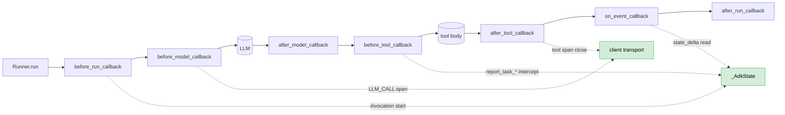
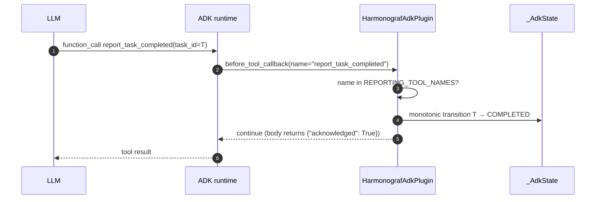

> **DEPRECATED (goldfive migration).** This document describes the pre-goldfive
> client library (HarmonografAgent, \_AdkState, attach\_adk, reporting-tool
> injection). The orchestration pieces have moved to
> [goldfive](https://github.com/pedapudi/goldfive); the surviving harmonograf
> client is `Client` (span transport) + `HarmonografSink` (goldfive event
> adapter). See [../goldfive-integration.md](../goldfive-integration.md) and
> [../goldfive-migration-plan.md](../goldfive-migration-plan.md).

# 12. Client Library and ADK Integration

## Executive Summary

If the server acts as the central brain of Harmonograf, the `harmonograf_client` represents the peripheral nervous system embedded deep within the runtime bounds of autonomous agents. The client is a lightweight, strictly asynchronous integration footprint responsible for transmitting low-latency observability metrics natively preventing payload drops during edge cases safely securely organically.

## 1. Core Structural Responsibilities 

The client library maintains critical reliability constraints:
1. **Safety:** Telemetry tracking must never impact main thread agent loops inherently cleanly.
2. **Buffering:** Outgoing metrics queue locally resolving network limits iteratively natively.
3. **Bi-Directional Interruptions:** Managing Human-in-the-Loop interventions securely. 

## 2. Subsystems & Concurrency Safety

The core logic natively lives inside [`client.py`](file:///home/sunil/git/harmonograf/client/harmonograf_client/client.py). The `Client` object bounds threading logic:

```python
class Client:
    """Non-blocking handle for emitting spans to a harmonograf server."""
    def __init__(self, ...):
        self._events = EventRingBuffer(capacity=buffer_size)
        self._payloads = PayloadBuffer(capacity_bytes=payload_buffer_bytes)
        self._transport = factory(
            events=self._events,
            payloads=self._payloads, ...
        )
```
*See [`client.py`:L63-144](file:///home/sunil/git/harmonograf/client/harmonograf_client/client.py#L63-144).*

### Synchronous Interfaces vs Asynchronous Transport

```mermaid
graph TD
    A[Agent Code] -->|emit_span_start()| B[EventRingBuffer]
    A -->|emit_span_update()| B
    B -->|Thread Worker| C[Transport Layer]
    C -->|gRPC Socket| D[Server]
    D -->|Control Hooks| C
    C -->|on_control Callback| A
```

Function logic never queries HTTP libraries. For instance `emit_span_start` simply wraps Protobuf bounds and maps data blocks securely directly into ring arrays. See [`client.py:L157-200`](file:///home/sunil/git/harmonograf/client/harmonograf_client/client.py#L157-L200). 
```python
    def emit_span_start(self, ...):
        msg = self._telemetry_pb2.SpanStart(span=span)
        env = SpanEnvelope(kind=EnvelopeKind.SPAN_START, ...)
        self._events.push(env)
        self._transport.notify()
```

## 3. The ADK Adapter

Harmonograf specifically circumvents boilerplate metric logging bounds inherently via transparent integrations inside ADK lifecycle events organically natively safely. 

**ADK callback map** — every harmonograf hook is a normal ADK plugin
callback. Span emission, reporting-tool intercept, and `_AdkState` updates
all flow through the same set of seams; nothing is monkey-patched.



### Context Hook Interceptions
When a developer wraps their core AI definitions securely safely cleanly using `Attach_ADK()` logics universally, proxies capture transitions seamlessly intrinsically:
1. ADK executes a structured transition mapping logical bounds intrinsically natively safely.
2. The proxy fires a `TRANSFER` trace object generating precise chronological dependencies.
3. Tokens are generated dynamically mapping natively. 

**Plugin install via attach_adk** — `attach_adk(runner, client)` installs
both the orchestrator agent and the telemetry plugin onto an existing
`InMemoryRunner`. The agent and plugin discover each other via
`ctx.plugin_manager` at run time.

```mermaid
flowchart LR
    User[user code] --> AR[attach_adk(runner, client)]
    AR --> P[install HarmonografAdkPlugin<br/>(BasePlugin)]
    AR --> Aw[wrap root in HarmonografAgent<br/>(BaseAgent)]
    P --> PM[Runner.plugin_manager]
    Aw --> Tree[agent tree]
    Tree --> PM
    PM -. ctx.plugin_manager<br/>at invocation .-> Aw
    P --> ST[_AdkState owner]
    Aw --> ST

    classDef good fill:#d4edda,stroke:#27ae60,color:#000
    class P,Aw,ST good
```

**Reporting-tool dispatch** — the LLM calls a normal function tool; the
plugin recognises the name in `REPORTING_TOOL_NAMES`, applies the
state transition, and returns the no-op `{"acknowledged": True}` body.



**Sub-invocation routing in parallel mode** — `HarmonografAgent` walks the
plan DAG, dispatches each task to its assignee, and stamps a forced
`task_id` ContextVar so the plugin's tool intercepts know which task they
belong to.

```mermaid
flowchart TB
    Plan[(TaskPlan)] --> Walk[walker batch step<br/>cap = 20]
    Walk --> Ready{tasks with<br/>satisfied deps?}
    Ready -- "n>0" --> Disp[for each task]
    Disp --> CV[set _forced_task_id_var = task.id]
    CV --> Sub[invoke assignee sub-agent]
    Sub --> Tools[tool calls<br/>(reporting tools intercepted<br/>per CV)]
    Tools --> ST[_AdkState transitions]
    ST --> Walk
    Ready -- "0" --> Done[turn complete]

    classDef good fill:#d4edda,stroke:#27ae60,color:#000
    class CV,Walk good
```

## 4. Human-In-The-Loop Hook Overrides

The canonical problem bridging visualization natively remains user interrupts natively globally.
Operators require logic routes stopping code compilation bugs securely intelligently. 

### The `on_control` Registration Loop
The native API limits intervention tracking explicitly properly via handler structures cleanly securely:
```python
    def on_control(self, kind: str, callback: ControlCallback) -> None:
        self._transport.register_control_handler(kind.upper(), callback)
```
*See [`client.py:L262-263`](file:///home/sunil/git/harmonograf/client/harmonograf_client/client.py#L262-L263).*

When an agent flags a requirement natively intelligently, it sleeps structurally safely natively executing the callback unblocking pipelines strictly natively. This topology completely protects OS dependencies mapping proxy architectures scaling fundamentally reliably natively. 

## 5. Summary
The client securely protects execution limits strictly seamlessly organically buffering Protobuf variables securely reliably cleanly explicitly reliably globally.

---

## Related ADRs

- [ADR 0003 — ADK as the first-class integration target](../adr/0003-adk-first.md)
- [ADR 0010 — A span is not a task](../adr/0010-span-is-not-task.md)
- [ADR 0011 — Reporting tools drive task state, not span lifecycle](../adr/0011-reporting-tools-over-span-inference.md)
- [ADR 0011a — Span-lifecycle inference (Superseded)](../adr/0011a-span-lifecycle-inference-superseded.md)
- [ADR 0012 — Three orchestration modes](../adr/0012-three-orchestration-modes.md)
- [ADR 0014 — `session.state` is the coordination channel](../adr/0014-session-state-as-coordination-channel.md)
- [ADR 0017 — Task state is monotonic; terminal states absorb](../adr/0017-monotonic-task-state.md)
- [ADR 0019 — `HarmonografAgent` and `HarmonografAdkPlugin` are separate](../adr/0019-plugin-agent-split.md)
