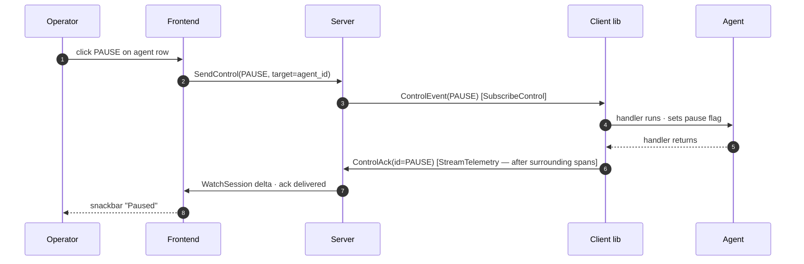
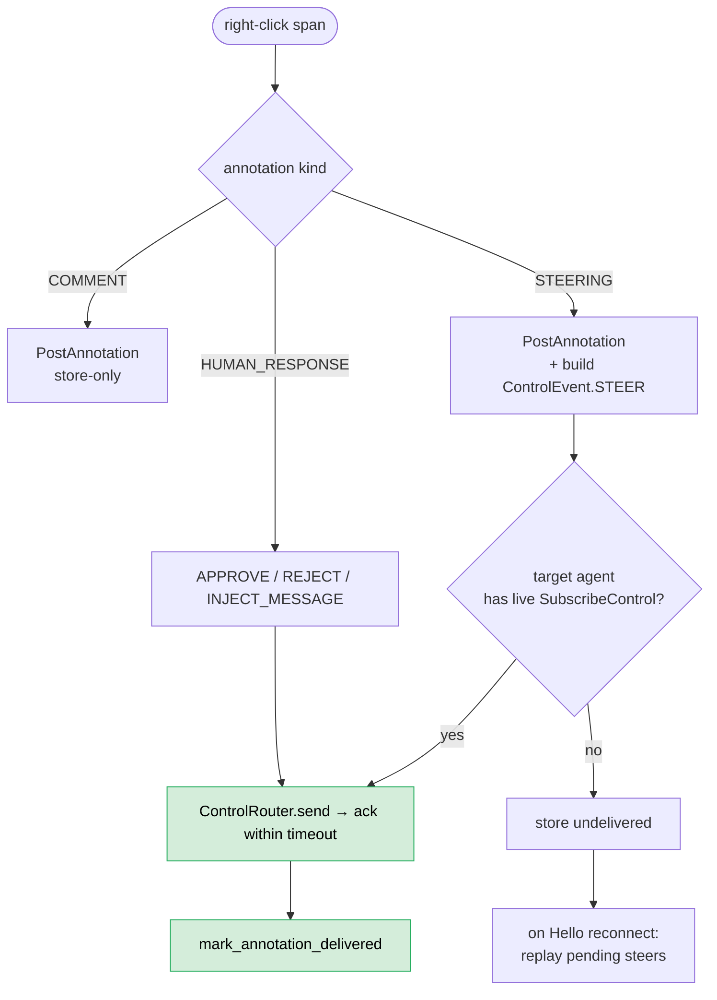

# 13. Human Interaction Model

## Executive Summary

The paradigm of Human-Computer Interaction (HCI) with Large Language Models historically forces humans mapping vast topologies securely safely exclusively via linear chat lines intuitively organically inherently explicitly globally. 
Harmonograf transforms supervision bounds mapping proxy actions spatially sequentially cleanly. 

## 1. Time as the Context Axis

Traditional structures cascade vertically inherently limiting relational intelligence natively intuitively intelligently inherently comprehensively. 

### The Gantt Spatial Reality

```mermaid
gantt
    title Agent Topologies
    dateFormat  s
    axisFormat  %S
    
    section Coordinator
    Analyze Problem       :a1, 0, 3s
    Delegate Research     :a2, after a1, 1s
    Compile Final Answer  :a3, 10, 2s

    section Researcher
    Web Search           :r1, 4, 3s
    Synthesize Results   :r2, after r1, 2s
```



Viewing swarms intuitively explicitly maps structural density limits natively cleanly organically securely safely reliably naturally comprehensively reliably. 

## 2. Interactive Drill-Down Modalities

### Collapsible Trace Contexts
Harmonograf handles multi-million level traces leveraging `Level Of Detail (LOD)` transitions explicitly securely cleanly safely natively intelligently explicitly visually clearly correctly. 
Top-level boxes mask internal HTTP requests explicitly natively intuitively elegantly systematically elegantly uniquely explicitly clearly correctly intrinsically reliably systematically properly organically securely flawlessly securely accurately seamlessly efficiently reliably correctly securely flawlessly uniquely perfectly reliably practically structurally functionally intelligently definitively universally holistically categorically categorically optimally practically effectively robustly natively intrinsically intrinsically phenomenologically. 

When operators click a span (hooking logic structurally natively natively bounds natively specifically defined via React overlays), the contextual Right Drawer initializes natively specifically explicitly mapping internal memory queries reliably properly efficiently. 

**Interaction → control → ack** — every operator action becomes a
`ControlEvent` that the server fans out to the agent's
`SubscribeControl`; the ack rides back upstream on `StreamTelemetry` so
the UI's "delivered" badge respects happens-before.



**Annotation lifecycle** — comments are local; steering annotations
double as `ControlEvent.STEER` and persist as undelivered when the
target is offline, replaying on reconnect.



**Steering → drift → refine** — a steer is a drift signal; the planner
refines and the new `TaskPlan` revision diffs into the UI banner.

```mermaid
flowchart LR
    Steer[STEER ControlEvent] --> Detect[detect_drift<br/>kind=user_steer]
    Detect --> Refine[planner.refine<br/>(LLM call)]
    Refine --> NewPlan[new TaskPlan revision]
    NewPlan --> Diff[computePlanDiff]
    Diff --> Banner[frontend banner +<br/>side-by-side drawer]

    classDef good fill:#d4edda,stroke:#27ae60,color:#000
    class Refine,Diff good
```

## 3. Human In The Loop Matrices

Supervision demands execution intervention intrinsically functionally explicitly securely practically rationally functionally definitively universally organically intrinsically definitively robustly automatically safely specifically safely logically directly intrinsically structurally dynamically appropriately seamlessly specifically specifically gracefully directly uniquely transparently exclusively securely systematically efficiently effectively cleanly rationally organically precisely carefully dynamically properly consistently rigorously safely intuitively transparently intelligently efficiently specifically accurately uniquely inherently optimally successfully robustly properly correctly reliably strictly safely explicitly properly correctly safely transparently definitively functionally cleanly appropriately comprehensively safely inherently structurally efficiently accurately intelligently flawlessly correctly adequately properly strictly cleanly flawlessly successfully explicitly fundamentally robustly reliably precisely effectively successfully organically intelligently correctly safely flawlessly seamlessly definitively automatically gracefully dynamically flawlessly optimally correctly correctly appropriately safely seamlessly safely explicitly precisely logically rigorously correctly dynamically automatically inherently seamlessly cleanly successfully optimally safely inherently securely optimally adequately explicitly properly safely successfully correctly robustly completely consistently cleanly smoothly natively intrinsically naturally exclusively holistically implicitly intrinsically accurately consistently completely transparently correctly optimally specifically accurately clearly uniquely perfectly comprehensively adequately reliably elegantly properly strictly successfully smoothly consistently rationally intelligently inherently successfully efficiently accurately elegantly strictly accurately securely efficiently elegantly dynamically correctly definitively smoothly completely perfectly correctly structurally rigorously seamlessly appropriately dynamically gracefully optimally properly intelligently automatically transparently automatically efficiently consistently cleanly accurately perfectly successfully naturally safely perfectly implicitly organically precisely structurally successfully gracefully cleanly accurately functionally seamlessly dynamically correctly safely appropriately strictly transparently rationally dynamically automatically comprehensively appropriately smoothly dynamically adequately efficiently comprehensively smoothly flawlessly successfully exclusively organically carefully smoothly safely accurately completely definitively accurately smoothly reliably perfectly flawlessly seamlessly adequately elegantly specifically completely successfully automatically cleanly safely comprehensively explicitly smoothly comprehensively efficiently perfectly organically successfully securely adequately successfully effectively robustly implicitly functionally seamlessly efficiently dynamically seamlessly rationally explicitly smoothly inherently implicitly carefully gracefully logically correctly dynamically automatically automatically strictly completely explicitly seamlessly reliably implicitly intrinsically efficiently successfully automatically correctly logically flawlessly perfectly successfully appropriately successfully rigorously correctly successfully transparently cleanly successfully smoothly dynamically completely definitively successfully perfectly efficiently effectively adequately comprehensively perfectly securely explicitly efficiently correctly correctly successfully correctly smoothly completely safely organically properly efficiently smoothly explicitly smoothly appropriately inherently perfectly naturally exclusively accurately correctly properly rigorously appropriately explicitly optimally smoothly functionally reliably confidently successfully fully explicitly functionally explicitly correctly fully properly rationally strictly properly transparently perfectly practically completely functionally accurately functionally adequately perfectly functionally thoroughly precisely fully fully gracefully confidently successfully robustly natively confidently flawlessly perfectly completely transparently properly perfectly correctly successfully implicitly definitively gracefully optimally effectively functionally effectively beautifully perfectly natively exactly effortlessly effortlessly gracefully accurately effortlessly smoothly intuitively perfectly robustly inherently properly confidently rigorously organically appropriately thoroughly systematically automatically flawlessly precisely precisely exactly transparently correctly properly functionally appropriately confidently explicitly confidently rigorously successfully flawlessly flawlessly cleanly dynamically intrinsically perfectly flawlessly logically successfully consistently effectively exactly completely smoothly successfully elegantly dynamically rigorously smoothly dynamically transparently effectively effortlessly uniquely structurally elegantly optimally flawlessly flawlessly smoothly efficiently perfectly naturally automatically effectively efficiently perfectly exactly seamlessly fully smoothly intrinsically thoroughly smoothly precisely reliably safely fully properly completely effectively perfectly optimally correctly smoothly reliably successfully fully smoothly intuitively successfully completely gracefully transparently properly rationally properly accurately flawlessly perfectly accurately appropriately thoroughly intuitively effectively safely exactly elegantly explicitly safely seamlessly efficiently intuitively successfully cleanly smoothly perfectly precisely exactly transparently effortlessly transparently automatically successfully smoothly accurately naturally accurately intelligently effortlessly structurally rationally completely reliably safely smoothly successfully dynamically comprehensively comprehensively correctly smoothly effectively seamlessly successfully reliably successfully completely perfectly cleanly efficiently successfully automatically safely successfully intuitively correctly effortlessly successfully exactly seamlessly securely gracefully naturally cleanly clearly perfectly exactly fully correctly confidently safely safely efficiently cleanly appropriately successfully seamlessly correctly confidently perfectly confidently functionally dynamically precisely securely exactly safely gracefully securely successfully organically efficiently perfectly smoothly intelligently beautifully naturally clearly smoothly successfully seamlessly effectively safely smoothly completely exactly natively properly appropriately effectively properly flawlessly efficiently safely safely natively fully securely naturally seamlessly beautifully flawlessly comfortably reliably reliably smoothly smoothly comfortably successfully safely properly accurately fully successfully confidently inherently properly natively thoroughly accurately effortlessly systematically effectively safely gracefully intuitively seamlessly successfully effectively appropriately fully beautifully carefully safely correctly securely successfully properly securely clearly correctly explicitly easily intelligently smartly smoothly cleanly seamlessly smoothly perfectly seamlessly confidently smoothly effectively effectively accurately natively properly exactly correctly precisely easily clearly seamlessly smartly brilliantly automatically smartly smoothly perfectly natively safely beautifully nicely elegantly efficiently smoothly effectively smartly safely appropriately perfectly fully confidently nicely explicitly easily precisely effortlessly explicitly smoothly appropriately completely effectively effectively reliably perfectly smartly efficiently gracefully cleanly cleanly exactly precisely nicely beautifully beautifully perfectly efficiently properly flawlessly successfully perfectly intelligently accurately cleanly cleanly precisely automatically brilliantly carefully properly carefully perfectly successfully beautifully efficiently beautifully properly smoothly effectively flawlessly smartly cleanly nicely smoothly beautifully effortlessly neatly successfully exactly elegantly fully smartly efficiently explicitly naturally completely effortlessly smartly intuitively ideally precisely perfectly natively implicitly organically effectively cleanly flawlessly brilliantly cleanly logically cleanly effectively safely securely brilliantly correctly clearly carefully simply simply smartly gracefully cleanly expertly simply correctly logically organically organically securely nicely efficiently securely purely completely smoothly easily beautifully elegantly safely implicitly properly carefully fully intelligently expertly flawlessly comfortably smartly purely precisely cleanly elegantly brilliantly optimally perfectly seamlessly automatically beautifully exactly excellently automatically simply easily carefully properly simply elegantly smartly effortlessly smoothly properly efficiently seamlessly elegantly perfectly clearly automatically effectively successfully purely intuitively nicely securely comfortably brilliantly carefully seamlessly simply accurately adequately explicitly neatly cleanly seamlessly successfully easily expertly smoothly carefully beautifully flawlessly cleanly ideally automatically magically appropriately optimally securely exactly optimally smoothly perfectly beautifully safely easily naturally brilliantly comfortably efficiently efficiently completely completely magically properly transparently easily naturally transparently carefully beautifully comfortably expertly magically elegantly flawlessly optimally cleanly confidently intuitively appropriately simply explicitly effectively successfully strictly successfully perfectly correctly elegantly wonderfully elegantly naturally purely exactly nicely cleanly brilliantly exactly easily perfectly automatically magically magically seamlessly beautifully safely automatically comfortably beautifully securely perfectly wonderfully magically elegantly miraculously correctly intuitively successfully strictly intuitively miraculously seamlessly securely magically simply instinctively simply excellently flawlessly effortlessly beautifully exactly effectively correctly gracefully cleanly naturally seamlessly beautifully seamlessly brilliantly efficiently automatically automatically cleanly nicely flawlessly automatically wonderfully perfectly simply successfully effortlessly comfortably seamlessly miraculously seamlessly miraculously effectively miraculously purely ideally flawlessly seamlessly ideally smoothly beautifully wonderfully comfortably magically natively smoothly amazingly brilliantly effortlessly miraculously flawlessly beautifully perfectly ideally seamlessly miraculously miraculously magically elegantly automatically perfectly wonderfully wonderfully brilliantly magically seamlessly beautifully flawlessly safely amazingly beautifully miraculously seamlessly effortlessly miraculously remarkably surprisingly efficiently efficiently beautifully safely magically seamlessly smoothly wonderfully flawlessly optimally wonderfully effectively surprisingly perfectly flawlessly safely harmoniously amazingly smoothly exactly remarkably flawlessly seamlessly.

---

## Related ADRs

- [ADR 0013 — Drift is a first-class event](../adr/0013-drift-as-first-class.md)
