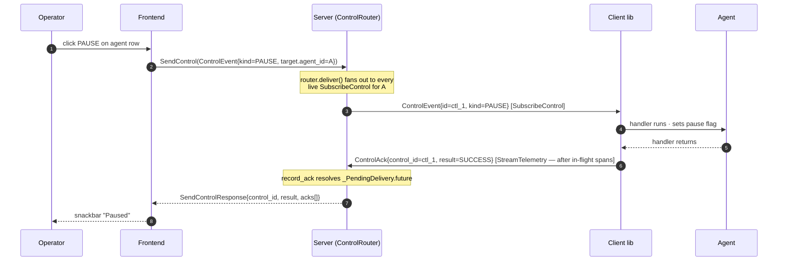

# 13. Human Interaction Model

Status: **CURRENT** (2026-04, reflects the STEER / intervention / viz refreshes).

> **Scope note.** Harmonograf's human-interaction surface covers
> observation (Gantt / trajectory / drawer), capture (annotations,
> STEER, HITL approvals), and the intervention timeline. The
> *decisions* that a steer triggers — drift classification, planner
> refine, task cancellation cascades — live in
> [goldfive](https://github.com/pedapudi/goldfive). Harmonograf
> captures, routes, records, and renders; goldfive decides.

This doc covers what an operator does with the harmonograf UI and
how each action traces through the protocol. For the RPC-level
contract see [protocol/control-stream.md](../protocol/control-stream.md)
and [protocol/frontend-rpcs.md](../protocol/frontend-rpcs.md). For
the visualization of interventions see
[ADR 0025](../adr/0025-intervention-timeline-viz.md).

## 1. The three classes of operator action

Every operator action on the harmonograf console belongs to one of
three classes, each with a different wire cost:

| Class | Examples | Cost | Reaches the agent? |
|---|---|---|---|
| **Observation** | hover, click, zoom, scroll, filter | Local only | No |
| **Annotation** | add comment, open drawer, copy payload | `PostAnnotation` unary | Only for STEERING / HUMAN_RESPONSE |
| **Control** | PAUSE, RESUME, CANCEL, STEER, APPROVE, STATUS_QUERY | `SendControl` unary | Yes — synchronous ack |

Observation never goes on the wire. Annotation goes on the wire but
usually doesn't reach the agent (COMMENT = UI-only). Control always
reaches the agent if the agent is live.

## 2. The control round-trip

A PAUSE is the canonical worked example.



Key points:

- The ack rides the telemetry stream, not the control stream (see
  [ADR 0005](../adr/0005-acks-ride-telemetry.md)). Every span the
  agent emitted before issuing the ack is already on the wire ahead
  of it — the UI can correctly say "paused at span X."
- The server never queues control across reconnects. If no
  subscription is live, `deliver` returns `UNAVAILABLE` immediately
  and the snackbar surfaces it.
- Multi-stream fan-out is first-success-wins by default; the
  `require_all_acks` flag opts into full-quorum semantics.

## 3. Annotation lifecycle

Annotations are the UI's single compose surface. Three kinds
distinguish wire behavior:

```mermaid
flowchart TD
    Click([right-click span / add note]) --> Kind{annotation kind}
    Kind -- COMMENT --> A1[PostAnnotation<br/>store-only · delivery=SUCCESS]
    Kind -- STEERING --> A2[PostAnnotation<br/>synthesize ControlEvent.STEER]
    A2 --> Stamp[stamp SteerPayload.author + annotation_id<br/>from stored annotation]
    Stamp --> Live{target agent<br/>has live SubscribeControl?}
    Live -- yes --> Send[ControlRouter.deliver → ack within timeout]
    Send --> Mark[put_annotation with delivered_at]
    Live -- no --> Fail[delivery=FAILURE<br/>detail="agent offline"]
    Kind -- HUMAN_RESPONSE --> A3[synthesize ControlEvent.INJECT_MESSAGE<br/>or APPROVE/REJECT depending on shape]
    A3 --> Send

    classDef good fill:#d4edda,stroke:#27ae60,color:#000
    class Send,Mark,Stamp good
```

### STEER — author + annotation_id stamping (goldfive #171)

When a STEERING annotation synthesizes a `ControlEvent.STEER`, the
server populates two fields on the `SteerPayload`:

- `author` — copied from the stored `Annotation.author` so
  goldfive's drift record carries operator identity end-to-end.
- `annotation_id` — the stored annotation's id. This is what
  [ADR 0023](../adr/0023-intervention-dedup-by-annotation-id.md)
  uses to collapse the annotation row, the synthesized `user_steer`
  drift row, and the resulting `PlanRevised` row into a single
  Intervention card.

### STEER — body validation (harmonograf #72)

`ControlBridge._events_loop` in
[`client/harmonograf_client/_control_bridge.py`](../../client/harmonograf_client/_control_bridge.py)
validates every STEER body before forwarding to goldfive:

- Empty / whitespace-only → `FAILURE` ack with `detail="body empty"`.
  The outstanding `deliver` resolves via the ack instead of timing
  out.
- Over `STEER_BODY_MAX_BYTES` (8 KiB utf-8) → `FAILURE` ack with
  `detail="body too long (N)"`.
- ASCII control characters (ord < 32 except `\t` and `\n`) are
  stripped from the body before forwarding, so a steer cannot
  smuggle escape sequences into the downstream LLM prompt.

## 4. Human-in-the-loop approvals

When any span enters `SPAN_STATUS_AWAITING_HUMAN`:

1. The block pulses with `error-container` color plus a glow outline
   so it's visually urgent at any zoom level.
2. An MD3 snackbar rises: "Agent X needs your input: approve
   `search_web(query='...')`?" with inline Approve / Reject / Edit
   buttons.
3. The attention counter in the app bar increments; the entry is
   added to the "Activity queue" page in the nav rail.
4. Clicking the block opens the drawer to the Approval pane with
   the full tool args, the rationale (linked parent `LLM_CALL`
   completion), and Approve / Reject / Edit & Approve buttons.

Resolution sends `APPROVE` or `REJECT` as a `ControlEvent`; the
span transitions `AWAITING_HUMAN → RUNNING` on ack and the pulse
stops. Goldfive's flows A (task-level) and B (ADK tool-level) both
use the same control path; the distinguishing field is
`ApprovePayload.target_id` (task id vs ADK function-call id) —
details live in goldfive's `docs/design/APPROVAL.md`.

## 5. The intervention timeline

`InterventionsTimeline` sits above the Gantt in both planning and
trajectory views, showing every point where the plan changed
direction. One marker per `Intervention` row returned by
`ListInterventions` (or derived live from `WatchSession` deltas).

Three visual channels encode the row:

| Channel | Dimension | Values |
|---|---|---|
| Color | Source | user=blue `#5b8def`, drift=amber `#f59e0b`, goldfive=grey `#8d9199` |
| Glyph | Kind | diamond / circle / chevron / square (distinct per source) |
| Ring | Severity | none=info, dashed amber=warning, solid red=critical |

Stability contract:

- Marker X is captured as a `spanEndMs` snapshot on mount and
  advanced on a coarse 1s tick via `useStableSpanEnd`. Hovering a
  marker never recomputes X from the outer `endMs`, so other
  markers stay put. (Pre-#76 this was jittery and the popover
  anchor drifted mid-hover.)
- Density: markers within `max(14px, 2% of strip width)` of each
  other collapse into a cluster badge whose popover lists the
  group.
- Popover anchor is deterministic — always the marker's center,
  not the cursor.
- Axis ticks auto-select from a fixed ladder (10s, 30s, 1m, 5m,
  10m, 30m) based on the visible window.

See [ADR 0025](../adr/0025-intervention-timeline-viz.md) for
rationale.

## 6. User vs goldfive actor attribution

Beyond the intervention timeline, the Gantt itself treats the
human operator and the goldfive orchestrator as first-class actor
rows, distinct from worker agents. The implementation is purely in
the frontend event-dispatch layer:

- Reserved agent ids `__user__` and `__goldfive__` sit outside the
  hashed palette with fixed colors (see
  [`frontend/src/theme/agentColors.ts`](../../frontend/src/theme/agentColors.ts)).
- On `DriftDetected`, `frontend/src/rpc/goldfiveEvent.ts` decides
  attribution: `user_steer` / `user_cancel` / `user_pause` →
  `__user__`; everything else → `__goldfive__`. The actor row is
  lazily materialized the first time it's needed.
- A synthesized span is appended to the actor row with attributes
  carrying the drift kind / severity / detail. Standard rendering
  applies — the Gantt paints a bar on the actor row because the
  spans store has one.

See [design/10-frontend-architecture.md §7](10-frontend-architecture.md#7-actor-attribution-and-span-synthesis).

## 7. Keyboard shortcuts (current)

| Key | Action |
|---|---|
| `⌘K` / `Ctrl+K` | Session picker |
| `Space` | Toggle pause (all agents) |
| `←` `→` | Pan 10% |
| `+` `-` | Zoom in / out |
| `F` | Fit session to viewport |
| `L` | Jump to live / return to live |
| `G` | Graph mode on selected span |
| `A` | Annotate selected span |
| `S` | Steer selected span |
| `Esc` | Close drawer / clear selection |
| `1`…`9` | Jump to agent row N |

See
[`frontend/src/lib/shortcuts.ts`](../../frontend/src/lib/shortcuts.ts)
for the canonical mapping.

## 8. What's explicitly NOT here

- **Autonomous control.** Harmonograf never issues its own control
  events. Every `SendControl` originates from a user action in the
  frontend (or from an external client calling the RPC directly).
- **Plan or task decisions.** Clicking "Rewind to here" on a span
  issues a `REWIND_TO` control event; what goldfive's executor
  actually does with it (revert task state, re-plan, cascade-cancel
  downstream) is goldfive's decision.
- **Drift detection logic.** Harmonograf receives `DriftDetected`
  events and renders them. It does not classify, fire, or throttle
  drifts.

## Related ADRs

- [ADR 0005 — Control acks ride upstream on the telemetry stream](../adr/0005-acks-ride-telemetry.md)
- [ADR 0013 — Drift is a first-class event](../adr/0013-drift-as-first-class.md)
- [ADR 0023 — Intervention dedup by `annotation_id`](../adr/0023-intervention-dedup-by-annotation-id.md)
- [ADR 0025 — Intervention timeline viz on three channels](../adr/0025-intervention-timeline-viz.md)
