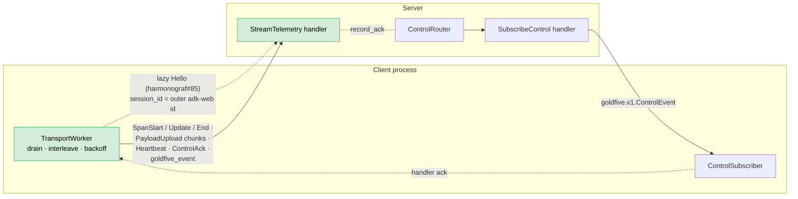

# 14. Information Flow — ADK callback to rendered pixel

Status: **CURRENT** (2026-04).

End-to-end tour of one piece of telemetry — an LLM call — as it
traverses the five tiers that carry it from the agent process to a
rendered pixel in the Gantt. Every tier has its own docs; this one
stitches them together so a reader can keep the whole pipeline in
their head.

## Tier 1 — ADK callback → plugin → client ring buffer

```mermaid
flowchart LR
    Callback[ADK lifecycle callback<br/>(before_model, after_tool, ...)]
    Plugin[HarmonografTelemetryPlugin<br/>stamp agent_id + session_id]
    Client[Client.emit_span_start/end/attach_payload]
    Ring[(Event ring buffer<br/>~2000 entries)]
    Stage[PayloadStager<br/>sha256 + summary]
    Worker[TransportWorker thread]
    Callback --> Plugin
    Plugin --> Client
    Client --> Ring
    Client --> Stage
    Ring -. notify .-> Worker
    Stage -. notify .-> Worker

    classDef good fill:#d4edda,stroke:#27ae60,color:#000
    class Ring,Stage good
```

What happens on the agent thread:

1. ADK invokes a lifecycle callback on
   `HarmonografTelemetryPlugin` (e.g. `before_model_callback`).
2. The plugin derives the **per-agent id**
   `{client_agent_id}:{adk_agent_name}` from its invocation-id
   stack (see [ADR 0024](../adr/0024-per-adk-agent-gantt-rows.md))
   and stamps it as the span's `agent_id`.
3. The plugin derives the **session id** — the outer adk-web
   `ctx.session.id` cached on the ROOT `before_run_callback` (see
   [ADR 0021](../adr/0021-session-id-pinning.md)) — and stamps it
   as the span's `session_id`.
4. On first-sight for this `(session_id, per_agent_id)` pair, the
   plugin adds the `hgraf.agent.*` hint attributes so the server
   can auto-register the agent row.
5. `Client.emit_span_start(...)` builds the protobuf envelope,
   pushes onto the ring buffer, and returns. No network I/O on the
   agent thread.

## Tier 2 — client → server over `StreamTelemetry`



Highlights:

- **Lazy Hello** (harmonograf #83 / #85). The first
  `TelemetryUp` on the stream is the Hello, but it's not sent at
  stream open — the transport defers until the first real envelope
  is ready. Hello's `session_id` is the session id of that first
  envelope, so the home session starts with the right id from the
  very first write. See [ADR 0022](../adr/0022-lazy-hello.md).
- **Per-envelope session routing** (harmonograf #66). Individual
  spans and goldfive events may carry a `session_id` different
  from the Hello's, and the server routes each one to the
  declared session. This is how one client process can emit on
  behalf of multiple adk-web invocations that land on different
  sessions.
- **Control acks ride upstream on telemetry** (ADR 0005). A
  separate `SubscribeControl` RPC delivers events; their acks fold
  into `TelemetryUp.control_ack` on the telemetry stream so
  happens-before is free.

## Tier 3 — ingest → bus → store

```mermaid
flowchart TB
    In([TelemetryUp from any client]) --> Ing[IngestPipeline<br/>dedup span.id]
    Ing --> Route[_ensure_route<br/>auto-register session/agent<br/>harvest hgraf.agent.* hints]
    Route --> LM[LiveSession state<br/>(in-memory mirror)]
    Ing --> Asm[PayloadAssembler<br/>(per digest)]
    Ing --> HB[heartbeat · progress_counter<br/>stuck detection]
    Ing --> GE[goldfive_event dispatch<br/>route by event.session_id<br/>drift ring append]
    LM -. write-behind .-> Store[(Store ABC)]
    Asm -. on last=true + sha256 match .-> Store
    GE --> Store
    Store --> Mem[InMemoryStore]
    Store --> SQ[SQLiteStore + payloads/{xx}/{digest}]
    LM --> Bus[(SessionBus<br/>per-session fan-out)]
    HB --> Bus
    Asm --> Bus
    GE --> Bus
    Bus --> Sub1[WatchSession queues]
    Bus --> Sub2[stuck-detector watcher]

    classDef good fill:#d4edda,stroke:#27ae60,color:#000
    class Bus,LM,Ing,Route good
```

Highlights:

- **Storage-before-publish** is an invariant. `Store.append_span`
  runs before `bus.publish_span_start` so a reconnecting
  `WatchSession` that reads from storage then attaches to the bus
  never sees a delta for a span not yet persisted.
- **Auto-register agents** from span hints on first-sight. The
  first span a new agent emits pays the hint cost; subsequent
  spans short-circuit via `seen_routes`. See
  [ADR 0024](../adr/0024-per-adk-agent-gantt-rows.md).
- **Goldfive event routing** dispatches on
  `TelemetryUp.goldfive_event.session_id` (field 5), falling back
  to the stream's Hello session when empty. One transport stream
  can carry events for multiple sessions.
- **Drift ring** (500 per session) captures every
  `DriftDetected` for late-subscribe replay. See
  [design/11 §6](11-server-architecture.md#6-drift-replay-for-late-subscribers).

## Tier 4 — server → frontend over gRPC-Web

```mermaid
sequenceDiagram
    autonumber
    participant FE as Frontend
    participant Srv as Server (WatchSession)
    participant Ring as drift ring
    participant Store
    participant Bus as SessionBus
    FE->>Srv: WatchSession(session_id)
    Srv->>Bus: subscribe(session_id) [live tail buffers]
    Srv->>Store: list_agents / list_spans / list_task_plans / list_ctx_samples
    Store-->>Srv: rows
    Srv->>Ring: drifts_for_session(session_id)
    Ring-->>Srv: iterable of drift dicts
    Srv-->>FE: SessionUpdate{ session }
    Srv-->>FE: SessionUpdate{ agent } ×N
    Srv-->>FE: SessionUpdate{ initial_span } ×M
    Srv-->>FE: SessionUpdate{ initial_annotation } ×K
    Srv-->>FE: SessionUpdate{ goldfive_event(drift_detected) } ×D  (replay)
    Srv-->>FE: SessionUpdate{ burst_complete }
    loop live phase
        Bus-->>Srv: Delta from queue
        Srv-->>FE: SessionUpdate{ new_span / updated_span / ...<br/>goldfive_event passthrough }
    end
    Note over Srv,FE: queue full → coalesce to snapshot pointer;<br/>frontend re-fetches via GetSpanTree
    FE->>Srv: GetPayload(digest) [drawer open]
    Srv-->>FE: PayloadChunk ×N
```

Highlights:

- **Initial burst + live tail** with an explicit `burst_complete`
  marker. Clients flip from "loading..." to "live" on the marker,
  not on the first delta.
- **Drift replay** happens during the burst so a late-joining
  frontend sees the existing `__user__` / `__goldfive__` actor
  rows materialized correctly.
- **goldfive_event passthrough** (field 19). Plan / task / drift /
  run lifecycle all ride the one oneof variant; the frontend
  dispatches on the inner payload kind.

## Tier 5 — frontend state → canvas render

```mermaid
flowchart LR
    Wire[WatchSession deltas<br/>+ ListInterventions] --> Idx[(SessionStore<br/>AgentRegistry · SpanIndex ·<br/>TaskRegistry · ContextSeriesRegistry ·<br/>DriftRegistry · DelegationRegistry)]
    Idx -. dirty rects .-> RAF[requestAnimationFrame]
    RAF --> Bg[layer 0 · background]
    RAF --> Bl[layer 1 · blocks<br/>(viewport-cull, color batch)]
    RAF --> Ov[layer 2 · overlay<br/>(hover · cursor · arrows · pulse)]
    Bg --> Cv[(stacked canvas)]
    Bl --> Cv
    Ov --> Cv
    Cv --- Dom[DOM overlay<br/>SpanContextMenu · tooltips]
    Idx --> Iv[lib/interventions.ts<br/>live deriver]
    Iv --> IT[InterventionsTimeline<br/>stable X · 3-channel encoding]
    Idx --> Dr[Drawer (React)<br/>Inspector tabs]
    Dr -. lazy .-> Pay[GetPayload]

    classDef good fill:#d4edda,stroke:#27ae60,color:#000
    class Idx,RAF,Cv,Iv good
```

Highlights:

- **Mutable store, not Zustand** for the hot path. The renderer
  reads field-directly from `SessionStore.spans.range(...)` on
  every frame. React never re-renders the Gantt on data changes.
- **Three canvas layers** (background / blocks / overlay) each
  with independent dirty triggers. Layer separation lets
  pan-without-data-change skip the overlay cost.
- **Intervention deriver mirrors the server aggregator** so live
  updates dedup by `annotation_id` the same way server-side does.
  A steer that arrives as annotation → drift → plan revision all
  collapses into one timeline row incrementally. See
  [ADR 0023](../adr/0023-intervention-dedup-by-annotation-id.md).

## Where to look in source

- Tier 1: [`client/harmonograf_client/telemetry_plugin.py`](../../client/harmonograf_client/telemetry_plugin.py)
- Tier 2: [`client/harmonograf_client/transport.py`](../../client/harmonograf_client/transport.py)
- Tier 3: [`server/harmonograf_server/ingest.py`](../../server/harmonograf_server/ingest.py), [`server/harmonograf_server/bus.py`](../../server/harmonograf_server/bus.py), [`server/harmonograf_server/storage/sqlite.py`](../../server/harmonograf_server/storage/sqlite.py)
- Tier 4: [`server/harmonograf_server/rpc/frontend.py`](../../server/harmonograf_server/rpc/frontend.py), [`server/harmonograf_server/interventions.py`](../../server/harmonograf_server/interventions.py)
- Tier 5: [`frontend/src/gantt/renderer.ts`](../../frontend/src/gantt/renderer.ts), [`frontend/src/gantt/index.ts`](../../frontend/src/gantt/index.ts), [`frontend/src/lib/interventions.ts`](../../frontend/src/lib/interventions.ts), [`frontend/src/components/Interventions/InterventionsTimeline.tsx`](../../frontend/src/components/Interventions/InterventionsTimeline.tsx)

## Related ADRs

- [ADR 0004 — Telemetry and control are separate RPCs](../adr/0004-telemetry-control-split.md)
- [ADR 0005 — Control acks ride upstream on the telemetry stream](../adr/0005-acks-ride-telemetry.md)
- [ADR 0016 — Content-addressed payloads with eviction](../adr/0016-content-addressed-payloads.md)
- [ADR 0018 — Heartbeat + progress_counter for stuck detection](../adr/0018-heartbeat-stuck-detection.md)
- [ADR 0021 — Pin `goldfive.Session.id` to the outer adk-web session id](../adr/0021-session-id-pinning.md)
- [ADR 0022 — Lazy Hello](../adr/0022-lazy-hello.md)
- [ADR 0024 — Per-ADK-agent Gantt rows with auto-registration](../adr/0024-per-adk-agent-gantt-rows.md)
