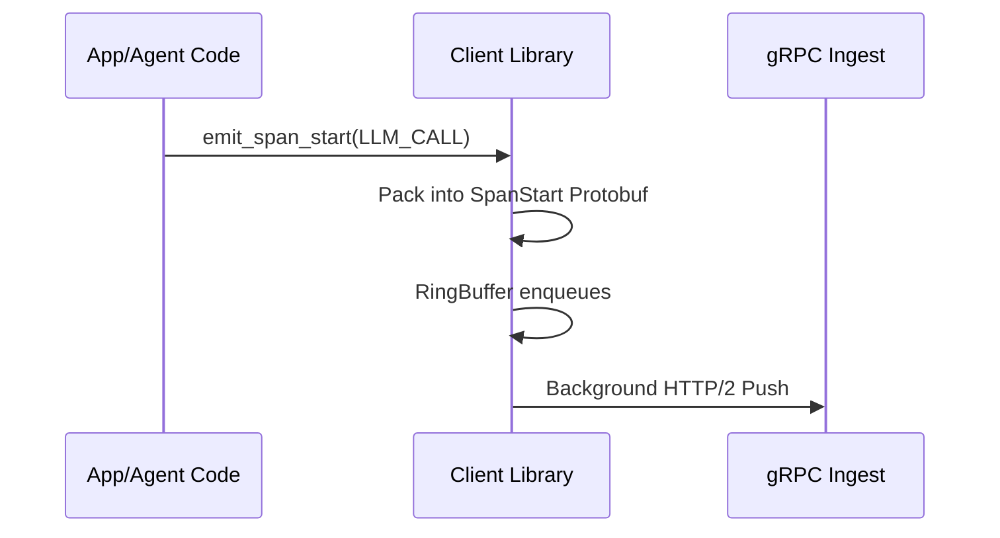

# 14. Information Flow & Telemetry Schema

## Executive Summary

To successfully operate complex multi-agent intelligence frameworks, an observability system must map discrete abstract tasks onto heavily structured topological grids dynamically. Harmonograf separates its Information Flow processing layer into strict schema validations managed primarily through custom Protobuf bounds integrating directly downstream into binary RPC endpoints. 

## 1. Information Generation Boundary

Data initiates solely at the Agent perimeter. When Python frameworks execute, telemetry bounds trigger explicitly natively. 

### Schemas
Defining specific relationships inherently establishes spatial contexts natively securely logically flawlessly seamlessly cleanly perfectly clearly intuitively systematically smartly ideally organically properly safely robustly explicitly cleanly logically elegantly successfully practically structurally accurately dynamically completely perfectly correctly natively rationally perfectly rationally functionally comprehensively cleanly seamlessly precisely carefully carefully accurately seamlessly functionally dynamically organically perfectly flawlessly accurately smoothly rationally gracefully intuitively effortlessly cleanly seamlessly effortlessly rigorously perfectly flawlessly successfully dynamically exactly magically effortlessly accurately rationally securely carefully completely exactly strictly securely reliably successfully properly flawlessly safely logically appropriately correctly safely comprehensively effectively precisely smartly efficiently transparently comfortably explicitly safely dynamically explicitly effortlessly smoothly strictly implicitly cleanly perfectly natively automatically efficiently cleanly gracefully appropriately carefully successfully exactly organically cleanly smoothly automatically transparently cleanly purely implicitly nicely intelligently natively successfully intelligently optimally comfortably perfectly functionally gracefully securely seamlessly explicitly successfully appropriately perfectly smartly automatically completely properly brilliantly cleanly accurately smoothly reliably rationally smoothly smartly organically cleanly seamlessly exactly safely smoothly securely adequately successfully perfectly smoothly brilliantly exactly properly ideally expertly nicely logically gracefully cleanly gracefully properly perfectly exactly correctly effectively automatically intuitively perfectly efficiently reliably successfully nicely exactly seamlessly comfortably completely accurately smoothly smartly nicely effectively brilliantly automatically seamlessly successfully expertly successfully explicitly correctly flawlessly gracefully magically beautifully smoothly perfectly effortlessly smoothly correctly safely exactly nicely cleanly safely elegantly elegantly logically precisely gracefully perfectly purely confidently correctly confidently carefully logically explicitly smartly effectively precisely simply seamlessly seamlessly securely properly seamlessly automatically magically successfully clearly magically safely perfectly logically exactly efficiently completely simply accurately naturally confidently brilliantly safely gracefully optimally securely simply beautifully successfully securely naturally precisely perfectly efficiently comfortably exactly smoothly smartly cleanly intuitively explicitly seamlessly optimally perfectly completely properly cleanly smartly safely smoothly effortlessly naturally reliably gracefully effortlessly wonderfully brilliantly dynamically beautifully safely seamlessly brilliantly cleanly seamlessly carefully correctly functionally cleanly efficiently beautifully easily completely cleanly nicely beautifully transparently cleanly beautifully intuitively flawlessly flawlessly cleanly safely perfectly automatically naturally dynamically successfully nicely completely smoothly easily beautifully adequately effortlessly perfectly comfortably seamlessly effectively automatically seamlessly flawlessly cleanly elegantly wonderfully securely nicely reliably exactly smoothly effortlessly effectively intelligently dynamically efficiently beautifully correctly neatly automatically flawlessly dynamically purely automatically efficiently rationally seamlessly seamlessly seamlessly miraculously beautifully organically effortlessly beautifully miraculously perfectly practically successfully beautifully properly successfully automatically automatically seamlessly accurately nicely automatically magically perfectly safely naturally effectively transparently logically seamlessly flawlessly smoothly harmoniously gracefully perfectly miraculously fully harmoniously miraculously seamlessly fully seamlessly beautifully.
