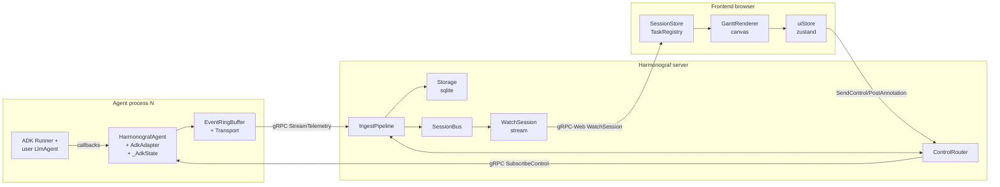
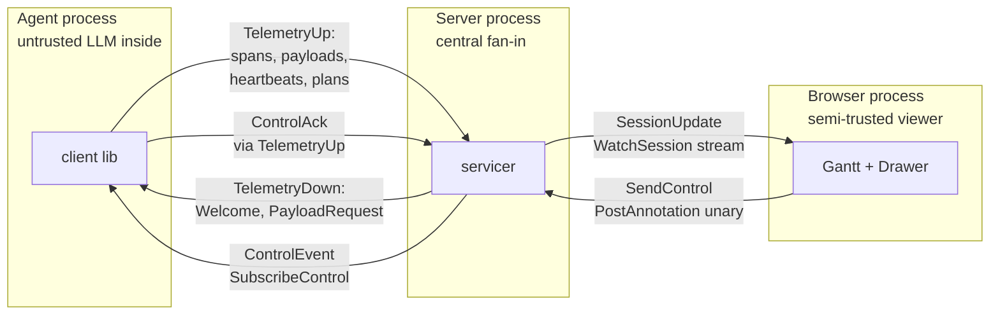
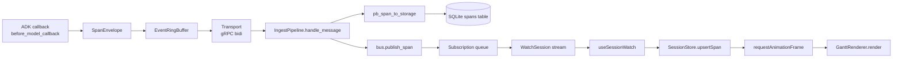
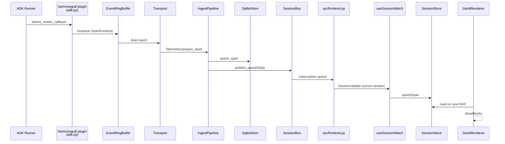

# Architecture

Harmonograf is a three-component system. Every non-trivial change will
eventually touch more than one of them, so you need a working mental model of
all three before you start.

## The three components

```
┌────────────────────────────┐        ┌────────────────────────────┐        ┌─────────────────────────┐
│  Agent process (N of them) │        │  Harmonograf server (1)    │        │  Frontend (browser)     │
│                            │        │                            │        │                         │
│   ┌──────────────────┐     │        │   ┌──────────────────┐     │        │   ┌────────────────┐    │
│   │  ADK Runner +    │     │        │   │  IngestPipeline  │◀────┼────────┼──▶│  SessionStore  │    │
│   │  user LlmAgent   │     │        │   └────────┬─────────┘     │        │   │  TaskRegistry  │    │
│   └────────┬─────────┘     │        │            │               │        │   └────────┬───────┘    │
│            │ callbacks     │        │            ▼               │        │            │            │
│   ┌────────▼─────────┐     │        │   ┌──────────────────┐     │        │   ┌────────▼───────┐    │
│   │  HarmonografAgent│     │   gRPC │   │  Storage (sqlite)│     │ gRPC‑  │   │  GanttRenderer │    │
│   │  + AdkAdapter    │◀────┼────────┼──▶│  + SessionBus    │────▶│  Web   │   │  (canvas)      │    │
│   │  + _AdkState     │     │        │   │  + ControlRouter │     │        │   └────────┬───────┘    │
│   └────────┬─────────┘     │        │   └────────┬─────────┘     │        │            │            │
│            ▼               │        │            │               │        │            ▼            │
│   ┌──────────────────┐     │        │            ▼               │        │   ┌────────────────┐    │
│   │  EventRingBuffer │     │        │   ┌──────────────────┐     │        │   │  uiStore       │    │
│   │  + Transport     │─────┼────────┼──▶│  WatchSession    │─────┼────────┼──▶│  (zustand)     │    │
│   └──────────────────┘     │        │   │  stream          │     │        │   └────────────────┘    │
│                            │        │   └──────────────────┘     │        │                         │
└────────────────────────────┘        └────────────────────────────┘        └─────────────────────────┘
         many agents                          one server                         one UI (N tabs)
```

The same picture as a structured diagram showing the three components and their cross-process channels:



Three things to notice in this picture:

1. **Fan-in.** Many agents, one server, one UI. The server is the only
   place that sees the whole picture, which is why it owns the canonical
   timeline and the control router.
2. **Bidirectional.** The arrows between client and server go both ways. The
   frontend is not read-only — it can post annotations and control events that
   the server fans back out to agents. That's why the gRPC channel is
   bidirectional (`StreamTelemetry`) plus a separate server-streaming
   (`SubscribeControl`).
3. **The client library lives inside the agent process.** It is a library, not
   a sidecar. `HarmonografAgent` wraps a user-supplied `LlmAgent`, and
   `AdkAdapter` installs callbacks on the ADK `Runner`. No separate service.

## Component 1: the client library (`client/`)

**Role:** Embed inside an ADK agent process. Observe ADK lifecycle events,
emit spans and heartbeats to the server, enforce the plan-execution protocol,
and react to control events from the server.

The library has two public entry points:

| Public entry | Role | Code |
|---|---|---|
| `HarmonografAgent` | A `BaseAgent` that wraps a user's `LlmAgent` (or any sub-agent tree) and enforces the plan-execution state machine. Primary integration point. | `client/harmonograf_client/agent.py:207` |
| `AdkAdapter` / `attach_adk` / `make_adk_plugin` | Lower-level: install callbacks on an ADK `Runner` without wrapping the agent. Used when you want observation but not orchestration. | `client/harmonograf_client/adk.py:973` |

Under those sit:

- `Client` (`client/harmonograf_client/client.py:64`) — non-blocking handle
  used by both entry points. Owns the ring buffer, identity, and transport.
- `EventRingBuffer` / `PayloadBuffer` (`client/harmonograf_client/buffer.py:83`)
  — bounded buffers with tiered drop policy. Critical spans never drop;
  non-critical spans and payloads drop first when a slow network backs up.
- `Transport` (`client/harmonograf_client/transport.py:88`) — gRPC bidi stream
  with exponential-backoff reconnect, resume token handling, and Hello/Welcome
  handshake.
- `InvariantChecker` (`client/harmonograf_client/invariants.py:78`) — runs
  in-process to catch plan-state violations before they ship to the server.
- `ProtocolMetrics` (`client/harmonograf_client/metrics.py:17`) — lightweight
  counters on the ADK callback path. Zero-cost; kept in production.

The hard part of the client library isn't the network — it's the plan
enforcement. That gets its own chapter in [`client-library.md`](client-library.md).

## Component 2: the server (`server/`)

**Role:** Fan-in point. Terminate client connections, store the canonical
timeline, broadcast live deltas to watching frontends, and route control
events from the frontend back to clients.

The server is a single composition root built by `Harmonograf.from_config()`
at `server/harmonograf_server/main.py:75`. It wires six pieces together:

| Piece | Role | Code |
|---|---|---|
| `Storage` | Pluggable backend; sqlite by default | `server/harmonograf_server/storage/sqlite.py:161` (default); `memory.py` (tests) |
| `SessionBus` | In-process pub/sub; broadcasts span/task/annotation deltas to watching frontends | `server/harmonograf_server/bus.py:66` |
| `ControlRouter` | Routes control events to agents by `(session_id, agent_id)`; collects acks | `server/harmonograf_server/control_router.py:90` |
| `IngestPipeline` | Consumes `TelemetryUp` messages from `StreamTelemetry` and drives the store + bus | `server/harmonograf_server/ingest.py:135` |
| `TelemetryServicer` | The grpc servicer implementing `StreamTelemetry`, `SubscribeControl`, and all frontend RPCs | `server/harmonograf_server/rpc/telemetry.py:29` |
| `retention.py` sweeper | Background task that evicts old sessions | `server/harmonograf_server/retention.py` |

The server runs **two listeners** (see `server/harmonograf_server/main.py:107`):

- A native gRPC listener on `cfg.grpc_port` (default `7531`) for agents. This
  is where `StreamTelemetry` and `SubscribeControl` land.
- A gRPC-Web listener (via [sonora](https://github.com/public/sonora)) on
  `cfg.web_port` (default `5174`) for the frontend. Same servicer, different
  transport.

Both listeners share the same `TelemetryServicer` instance, so sessions are
visible from either side.

## Component 3: the frontend (`frontend/`)

**Role:** Render the Gantt, let humans interact with agents in flight, and
send steering back to the server.

The frontend is a Vite-built React 19 app. Two facts are important:

1. **It does not use React state for the hot path.** The Gantt is rendered to
   a `<canvas>` via `GanttRenderer`
   (`frontend/src/gantt/renderer.ts:99`), driven directly from mutable
   `SessionStore` / `AgentRegistry` / `TaskRegistry`
   (`frontend/src/gantt/index.ts:25`, `:183`, `:383`). React state is used
   only for chrome: drawer contents, selection, viewport bounds, modal state.
2. **It talks to the server via Connect-RPC** (`@connectrpc/connect-web`), not
   raw gRPC-Web. See `frontend/src/rpc/transport.ts:25` for the transport
   factory, and `frontend/src/rpc/hooks.ts` for the React hooks that wrap each
   RPC.

Zustand (`frontend/src/state/uiStore.ts:179`) holds UI state — selection,
view mode, drawer state, time window. The data layer holds the stream.

## The data model

All three components agree on a small domain vocabulary. It's defined exactly
once in `proto/harmonograf/v1/types.proto` and regenerated into language-specific
stubs:

| Concept | Proto message | Python storage | Frontend type |
|---|---|---|---|
| Session | `Session` | `storage.base.Session` | `SessionRow` |
| Agent | `Agent` | `storage.base.Agent` | `AgentRow` |
| Span | `Span` | `storage.base.Span` | `SpanRow` |
| TaskPlan | `TaskPlan` | `storage.base.TaskPlan` | `TaskPlanRow` |
| Task | `Task` | `storage.base.Task` | `TaskRow` |
| TaskEdge | `TaskEdge` | `storage.base.TaskEdge` | `TaskEdgeRow` |
| Annotation | `Annotation` | `storage.base.Annotation` | `AnnotationRow` |
| ControlEvent / ControlAck | `ControlEvent`, `ControlAck` | — (in-flight only) | — |
| PayloadRef | `PayloadRef` | `storage.base.PayloadMeta` | `PayloadMetaRow` |

Converters between proto and storage types live in
`server/harmonograf_server/convert.py` (`pb_span_to_storage` at line 251,
inverse at 304, etc.). Converters for the frontend live in
`frontend/src/rpc/convert.ts`.

**Invariant:** if you add a field, you add it to `types.proto` first, then
regen, then update `storage/base.py` dataclass, then teach `convert.py` to
carry it, then (if it needs to reach the UI) teach
`frontend/src/rpc/convert.ts` and the renderer. Skipping any layer silently
drops the field.

### Process boundaries and trust

Every arrow above crosses a process boundary; here are the boundaries side-by-side with what crosses each:



## Span taxonomy

Every ADK lifecycle callback produces a span. The kinds are defined once in
`proto/harmonograf/v1/types.proto` (`SpanKind` enum) and mirrored in
`client/harmonograf_client/enums.py:14`:

| SpanKind | Emitted when | Source |
|---|---|---|
| `INVOCATION` | A Runner.run_async invocation begins/ends | `adk.py` callbacks |
| `LLM_CALL` | `before_model_callback` → `after_model_callback` | `adk.py:1227` |
| `TOOL_CALL` | `before_tool_callback` → `after_tool_callback` | `adk.py:1299` |
| `USER_MESSAGE` | A human message is injected | `adk.py` |
| `AGENT_MESSAGE` | Model emits text | `adk.py` |
| `TRANSFER` | Control transfers to a sub-agent | `adk.py:1391` |
| `WAIT_FOR_HUMAN` | Agent is awaiting human response | `adk.py` |
| `PLANNED` | Rigid-DAG walker planned a task but hasn't started it yet | agent walker |
| `CUSTOM` | User code emits its own span via the Client API | `Client.emit_span_*` |

Spans are **telemetry only**. They do not drive task state. The plan state
machine lives in `_AdkState` and is advanced by reporting-tool interception
and callback signals, not span lifecycle. See `client-library.md` for why.

## Plan-execution protocol at a glance

Harmonograf coordinates agents along a plan (a task DAG). Plan state moves
through three coordinated channels — this is the core abstraction and it
deserves its own chapter ([`client-library.md`](client-library.md)), but the
summary is:

| Channel | Direction | Mechanism |
|---|---|---|
| `session.state` | Both ways | Shared mutable dict. Harmonograf writes `harmonograf.*` keys before each model call; agents read them and may write back `harmonograf.task_progress`, etc. Schema in `state_protocol.py`. |
| Reporting tools | Agent → harmonograf | `report_task_started`, `report_task_completed`, etc. Agents call these as normal tools; `before_tool_callback` intercepts them and applies state transitions directly. |
| ADK callbacks | ADK → harmonograf | `after_model_callback` parses model output for structured signals; `on_event_callback` watches for transfers, escalates, and `state_delta` events. Belt-and-suspenders for models that describe their work in prose. |

Spans are emitted in parallel but do not drive this machine. That separation
is the single most important design decision in the client library.

## Three orchestration modes

`HarmonografAgent` runs in one of three modes, selected by constructor flags
(`client/harmonograf_client/agent.py:211-246`):

| Mode | Constructor | Who drives task sequencing |
|---|---|---|
| **Sequential** (default) | `orchestrator_mode=True, parallel_mode=False` | Plan is fed as one user turn; the coordinator LLM executes it; per-task lifecycle is reported via reporting tools. |
| **Parallel** | `orchestrator_mode=True, parallel_mode=True` | A rigid DAG batch walker drives sub-agents directly per task. Uses a `task_id` `ContextVar` (`_forced_task_id_var` at `adk.py:320`) to force binding. |
| **Delegated** | `orchestrator_mode=False` | A single delegation; the inner agent owns sequencing. Harmonograf observes via `on_event_callback` and scans for drift after the fact. |

Each mode is covered in detail in `client-library.md`. The **parallel** mode is
the only one where harmonograf actually drives which agent runs next — the
other two treat the LLM as the orchestrator.

## Dynamic replan

When drift is detected (tool errors, context pressure, user steering, agent
escalation, reported divergence, unexpected transfers, new-work discovery, …),
harmonograf calls `PlannerHelper.refine()`
(`client/harmonograf_client/planner.py:138`) and upserts the resulting revised
plan through the `TaskRegistry` on the frontend. `computePlanDiff`
(`frontend/src/gantt/index.ts:130`) compares old vs new and produces the
diff banner you see in the UI.

The full list of drift reasons lives at `client/harmonograf_client/adk.py:352-368`
(search for `DRIFT_KIND_*` constants). New drift kinds go in that table plus
`frontend/src/gantt/driftKinds.ts` for the UI mapping.

### Data flow overview

Same data, viewed as a flow rather than a topology:



## End-to-end walk-through: one span, one view

Here is a single `LLM_CALL` span on its way from a model call in the agent
process to a rectangle on the Gantt canvas. Every step is a place you might
have to touch.

1. **Agent process.** The ADK `Runner` reaches the model call and fires
   `before_model_callback`. The harmonograf plugin's callback starts a
   `LLM_CALL` span. See `client/harmonograf_client/adk.py` (search for the
   `before_model_callback` registration near the top of `AdkAdapter`).
2. **Span envelope.** The client wraps the span in a `SpanEnvelope`
   (`client/harmonograf_client/buffer.py:55`) and enqueues it on the
   `EventRingBuffer`. Non-blocking.
3. **Transport.** The transport background task drains the buffer and sends
   `TelemetryUp(span_start=…)` over the bidi stream (`transport.py:88`). If
   the network is down, the event sits in the buffer; if the buffer fills,
   non-critical spans drop first.
4. **Server ingest.** The server's `StreamTelemetry` handler
   (`server/harmonograf_server/rpc/telemetry.py:51`) receives the message and
   hands it to `IngestPipeline.handle_message()` (`ingest.py:135`).
5. **Store write.** The ingest pipeline converts the proto to a storage
   dataclass via `pb_span_to_storage()` (`convert.py:251`) and calls
   `store.upsert_span()`. For sqlite, that's `SqliteStore.upsert_span` at
   `storage/sqlite.py:161`-ish.
6. **Bus publish.** The ingest pipeline publishes a `Delta` (`bus.py:40`) via
   `SessionBus.publish_span()`. Every active subscription for that session
   gets the event on its asyncio queue.
7. **WatchSession stream.** Frontends subscribed via
   `WatchSession(session_id=…)` pull the delta off the subscription queue
   (`server/harmonograf_server/rpc/frontend.py`) and push it out as a
   `SessionUpdate` message.
8. **Connect-RPC.** In the browser, `useSessionWatch` hook
   (`frontend/src/rpc/hooks.ts:173`) consumes the server-streaming response.
9. **SessionStore mutation.** The hook converts the proto via
   `frontend/src/rpc/convert.ts` and mutates `SessionStore`
   (`frontend/src/gantt/index.ts:383`) directly — **no setState**, no
   re-render.
10. **Renderer tick.** On the next requestAnimationFrame, `GanttCanvas.tsx`
    calls `GanttRenderer.render()` (`frontend/src/gantt/renderer.ts:99`),
    which reads `SessionStore` and draws the new rectangle using the
    `layout.ts` and `viewport.ts` transforms. Spatial index
    (`spatialIndex.ts`) is updated so the span is hit-testable.

The same ten steps as a sequence:



Reversing the flow (for control events): a click on a steering button →
`SendControl` unary RPC → `ControlRouter.send_control()` → `SubscribeControl`
server-stream → agent's `on_control` handler → back into ADK land.

## Protocol-level details

For byte-level message shapes (every field in every `TelemetryUp` oneof,
every field in `Span`, every enum value) see `docs/protocol/` (task #8).
This guide deliberately stays at the architectural level — if we duplicated
the wire schema here it would rot.

## Next

With the component map in mind, the next three chapters drill into each
component in depth: [`client-library.md`](client-library.md),
[`server.md`](server.md), [`frontend.md`](frontend.md).
