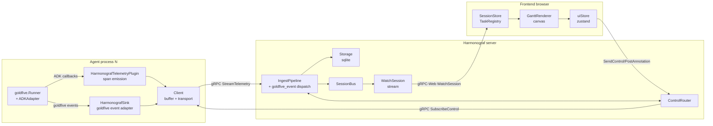
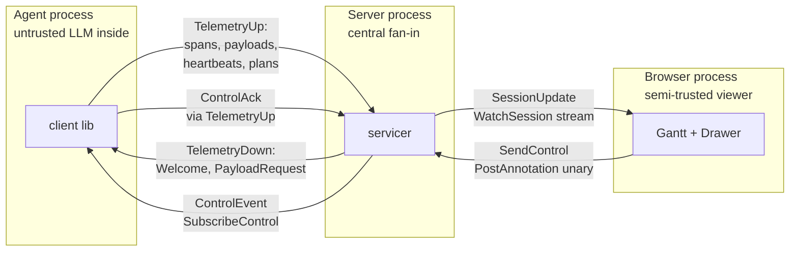
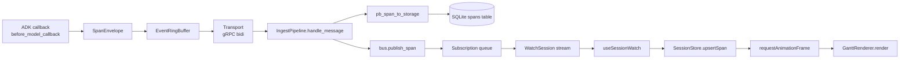
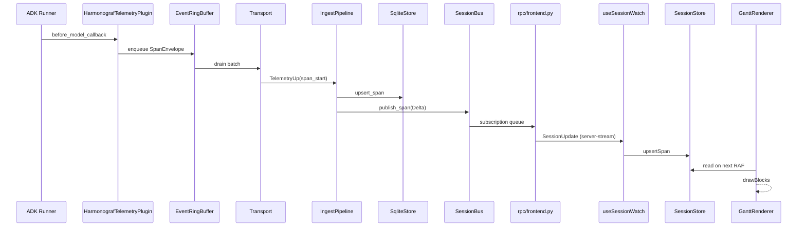

# Architecture

Harmonograf is a three-component system. Every non-trivial change will
eventually touch more than one of them, so you need a working mental model of
all three before you start.

## The three components

Three things to notice in this picture:

1. **Fan-in.** Many agents, one server, one UI. The server is the only
   place that sees the whole picture, which is why it owns the canonical
   timeline and the control router.
2. **Bidirectional.** The arrows between client and server go both ways. The
   frontend is not read-only — it can post annotations and control events that
   the server fans back out to agents. That's why the gRPC channel is
   bidirectional (`StreamTelemetry`) plus a separate server-streaming
   (`SubscribeControl`).
3. **Harmonograf is the observability tap.** Orchestration — planning, task
   dispatch, drift detection, reinvocation — lives in
   [goldfive](https://github.com/pedapudi/goldfive), inside the same agent
   process. `HarmonografSink` is the `goldfive.EventSink` that ships plan /
   task / drift events to the server; `HarmonografTelemetryPlugin` emits
   ADK-level spans for lifecycle callbacks.

## Component 1: the client library (`client/`)

**Role:** Embed inside an agent process. Ship spans and goldfive orchestration
events to the server, react to control events. After the goldfive migration
(PRs [#6](https://github.com/pedapudi/harmonograf/pull/6),
[#7](https://github.com/pedapudi/harmonograf/pull/7),
[#9](https://github.com/pedapudi/harmonograf/pull/9),
[#11](https://github.com/pedapudi/harmonograf/pull/11)), the library is
observability-only — orchestration lives in
[goldfive](https://github.com/pedapudi/goldfive).

Three public surfaces:

| Public surface | Role | Code |
|---|---|---|
| `Client` | Non-blocking handle owning the ring buffer, identity, transport, payload staging, and control-handler registry. | `client/harmonograf_client/client.py` |
| `HarmonografSink` | A `goldfive.EventSink` that translates goldfive `Event` envelopes into harmonograf `TelemetryUp(goldfive_event=…)` frames. | `client/harmonograf_client/sink.py` |
| `HarmonografTelemetryPlugin` | Optional ADK `BasePlugin` that emits harmonograf spans for ADK lifecycle callbacks. Pure observability. | `client/harmonograf_client/telemetry_plugin.py` |

Under those sit:

- `EventRingBuffer` / `PayloadBuffer` (`client/harmonograf_client/buffer.py`)
  — bounded buffers with tiered drop policy. Critical spans and goldfive
  events never drop; non-critical spans and payloads drop first when the
  network backs up.
- `Transport` (`client/harmonograf_client/transport.py`) — gRPC bidi stream
  with exponential-backoff reconnect, resume token handling, Hello/Welcome
  handshake, and serialisation of each envelope variant (`SPAN_*`,
  `PAYLOAD_UPLOAD`, `HEARTBEAT`, `GOLDFIVE_EVENT`, `CONTROL_ACK`) onto the
  right `TelemetryUp` oneof field.
- `Heartbeat` (`client/harmonograf_client/heartbeat.py`) — periodic
  liveness beacon.
- `Identity` (`client/harmonograf_client/identity.py`) — persisted
  agent_id so restarts reclaim their Gantt row.

Plan state, task state, drift — not in this library. See
[client-library.md](client-library.md) for the full internals tour.

## Component 2: the server (`server/`)

**Role:** Fan-in point. Terminate client connections, store the canonical
timeline, broadcast live deltas to watching frontends, and route control
events from the frontend back to clients.

The server is a single composition root built by `Harmonograf.from_config()`
at `server/harmonograf_server/main.py:75`. It wires six pieces together:

| Piece | Role | Code |
|---|---|---|
| `Storage` | Pluggable backend; sqlite by default | `server/harmonograf_server/storage/sqlite.py:161` (default); `memory.py` (tests) |
| `SessionBus` | In-process pub/sub; broadcasts span/task/annotation deltas to watching frontends | `server/harmonograf_server/bus.py:66` |
| `ControlRouter` | Routes control events to agents by `(session_id, agent_id)`; collects acks | `server/harmonograf_server/control_router.py:90` |
| `IngestPipeline` | Consumes `TelemetryUp` messages from `StreamTelemetry` and drives the store + bus | `server/harmonograf_server/ingest.py:135` |
| `TelemetryServicer` | The grpc servicer implementing `StreamTelemetry`, `SubscribeControl`, and all frontend RPCs | `server/harmonograf_server/rpc/telemetry.py:29` |
| `retention.py` sweeper | Background task that evicts old sessions | `server/harmonograf_server/retention.py` |

The server runs **two listeners** (see `server/harmonograf_server/main.py:107`):

- A native gRPC listener on `cfg.grpc_port` (default `7531`) for agents. This
  is where `StreamTelemetry` and `SubscribeControl` land.
- A gRPC-Web listener (via [sonora](https://github.com/public/sonora)) on
  `cfg.web_port` (default `5174`) for the frontend. Same servicer, different
  transport.

Both listeners share the same `TelemetryServicer` instance, so sessions are
visible from either side.

## Component 3: the frontend (`frontend/`)

**Role:** Render the Gantt, let humans interact with agents in flight, and
send steering back to the server.

The frontend is a Vite-built React 19 app. Two facts are important:

1. **It does not use React state for the hot path.** The Gantt is rendered to
   a `<canvas>` via `GanttRenderer`
   (`frontend/src/gantt/renderer.ts:99`), driven directly from mutable
   `SessionStore` / `AgentRegistry` / `TaskRegistry`
   (`frontend/src/gantt/index.ts:25`, `:183`, `:383`). React state is used
   only for chrome: drawer contents, selection, viewport bounds, modal state.
2. **It talks to the server via Connect-RPC** (`@connectrpc/connect-web`), not
   raw gRPC-Web. See `frontend/src/rpc/transport.ts:25` for the transport
   factory, and `frontend/src/rpc/hooks.ts` for the React hooks that wrap each
   RPC.

Zustand (`frontend/src/state/uiStore.ts:179`) holds UI state — selection,
view mode, drawer state, time window. The data layer holds the stream.

## The data model

All three components agree on a small domain vocabulary. Harmonograf-owned
types live in `proto/harmonograf/v1/types.proto`; `Plan`, `Task`, `TaskEdge`,
`TaskStatus`, `DriftKind` come from `proto/goldfive/v1/types.proto` and are
imported (not re-declared) into harmonograf's proto tree.

| Concept | Owner | Proto message | Python storage | Frontend type |
|---|---|---|---|---|
| Session | harmonograf | `harmonograf.v1.Session` | `storage.base.Session` | `SessionRow` |
| Agent | harmonograf | `harmonograf.v1.Agent` | `storage.base.Agent` | `AgentRow` |
| Span | harmonograf | `harmonograf.v1.Span` | `storage.base.Span` | `SpanRow` |
| Plan | goldfive | `goldfive.v1.Plan` | `storage.base.Plan` | via `SessionUpdate.goldfive_event` |
| Task | goldfive | `goldfive.v1.Task` | `storage.base.Task` | via `SessionUpdate.goldfive_event` |
| TaskEdge | goldfive | `goldfive.v1.TaskEdge` | `storage.base.TaskEdge` | via `SessionUpdate.goldfive_event` |
| Annotation | harmonograf | `harmonograf.v1.Annotation` | `storage.base.Annotation` | `AnnotationRow` |
| ControlEvent / ControlAck | harmonograf | `harmonograf.v1.ControlEvent`, `ControlAck` | — (in-flight only) | — |
| PayloadRef | harmonograf | `harmonograf.v1.PayloadRef` | `storage.base.PayloadMeta` | `PayloadMetaRow` |

Plan / task / drift state reaches the frontend through the
`SessionUpdate.goldfive_event` variant on `WatchSession` (see
[../internals/server-ingest-bus.md](../internals/server-ingest-bus.md)). The
server's ingest builds a plan/task index from the event stream; the
frontend subscribes to the raw events and reduces them into its own
`TaskRegistry`.

Converters between proto and storage types live in
`server/harmonograf_server/convert.py`. Converters for the frontend live in
`frontend/src/rpc/convert.ts`.

**Invariant:** if you add a harmonograf-owned field, you add it to
`proto/harmonograf/v1/types.proto` first, then regen, then update
`storage/base.py` dataclass, then teach `convert.py` to carry it, then (if
it needs to reach the UI) teach `frontend/src/rpc/convert.ts` and the
renderer. Skipping any layer silently drops the field. For goldfive-owned
fields (`Plan`, `Task`, `DriftKind`) the edit lands in goldfive first;
harmonograf picks it up by bumping the goldfive dependency and running
`make proto`.

### Process boundaries and trust

Every arrow above crosses a process boundary; here are the boundaries side-by-side with what crosses each:

## Span taxonomy

Every ADK lifecycle callback produces a span. The kinds are defined once in
`proto/harmonograf/v1/types.proto` (`SpanKind` enum) and mirrored in
`client/harmonograf_client/enums.py:14`:

| SpanKind | Emitted when | Source |
|---|---|---|
| `INVOCATION` | A Runner.run_async invocation begins/ends | `telemetry_plugin.py` |
| `LLM_CALL` | `before_model_callback` → `after_model_callback` | `telemetry_plugin.py` |
| `TOOL_CALL` | `before_tool_callback` → `after_tool_callback` | `telemetry_plugin.py` |
| `USER_MESSAGE` | A human message is injected | `telemetry_plugin.py` |
| `AGENT_MESSAGE` | Model emits text | `telemetry_plugin.py` |
| `TRANSFER` | Control transfers to a sub-agent | `telemetry_plugin.py` |
| `WAIT_FOR_HUMAN` | Agent is awaiting human response | `telemetry_plugin.py` |
| `CUSTOM` | User code emits its own span via the Client API | `Client.emit_span_*` |

Spans are **telemetry only**. They do not drive task state. Task state is
driven by goldfive events (`TaskStarted`, `TaskCompleted`, `TaskFailed`,
`DriftDetected`, …) emitted by `goldfive.DefaultSteerer` when a reporting
tool fires or when an ADK event implies a transition. Harmonograf sees
those transitions only through `HarmonografSink`.

## Orchestration: read it in goldfive

Plan DAG construction, task dispatch (sequential / parallel-DAG / delegated),
drift detection, the refine loop, reporting tools, and session-state
coordination are all in [goldfive](https://github.com/pedapudi/goldfive).
Harmonograf sees the outcome as goldfive events on the sink; it does not
decide what runs next. If you are adding a new drift kind or a new
reporting-tool behaviour, start in goldfive and bump the dependency here
after it lands.

### How a replan reaches the UI

When goldfive emits `PlanRevised`, the sink pushes a `GOLDFIVE_EVENT`
envelope; the transport serialises it onto `TelemetryUp.goldfive_event`;
the server's ingest dispatches on `Event.payload` and publishes a bus
delta; the frontend's `WatchSession` subscription receives the event
inside `SessionUpdate.goldfive_event`; the frontend reduces the new plan
into its `TaskRegistry` and `computePlanDiff` compares old vs new for the
diff banner.

### Data flow overview

Same data, viewed as a flow rather than a topology:

## End-to-end walk-through: one span, one view

Here is a single `LLM_CALL` span on its way from a model call in the agent
process to a rectangle on the Gantt canvas. Every step is a place you might
have to touch.

1. **Agent process.** The ADK `Runner` reaches the model call and fires
   `before_model_callback`. `HarmonografTelemetryPlugin` starts a `LLM_CALL`
   span. See `client/harmonograf_client/telemetry_plugin.py` for the
   callback registrations.
2. **Span envelope.** The client wraps the span in a `SpanEnvelope`
   (`client/harmonograf_client/buffer.py:55`) and enqueues it on the
   `EventRingBuffer`. Non-blocking.
3. **Transport.** The transport background task drains the buffer and sends
   `TelemetryUp(span_start=…)` over the bidi stream (`transport.py:88`). If
   the network is down, the event sits in the buffer; if the buffer fills,
   non-critical spans drop first.
4. **Server ingest.** The server's `StreamTelemetry` handler
   (`server/harmonograf_server/rpc/telemetry.py:51`) receives the message and
   hands it to `IngestPipeline.handle_message()` (`ingest.py:135`).
5. **Store write.** The ingest pipeline converts the proto to a storage
   dataclass via `pb_span_to_storage()` (`convert.py:251`) and calls
   `store.upsert_span()`. For sqlite, that's `SqliteStore.upsert_span` at
   `storage/sqlite.py:161`-ish.
6. **Bus publish.** The ingest pipeline publishes a `Delta` (`bus.py:40`) via
   `SessionBus.publish_span()`. Every active subscription for that session
   gets the event on its asyncio queue.
7. **WatchSession stream.** Frontends subscribed via
   `WatchSession(session_id=…)` pull the delta off the subscription queue
   (`server/harmonograf_server/rpc/frontend.py`) and push it out as a
   `SessionUpdate` message.
8. **Connect-RPC.** In the browser, `useSessionWatch` hook
   (`frontend/src/rpc/hooks.ts:173`) consumes the server-streaming response.
9. **SessionStore mutation.** The hook converts the proto via
   `frontend/src/rpc/convert.ts` and mutates `SessionStore`
   (`frontend/src/gantt/index.ts:383`) directly — **no setState**, no
   re-render.
10. **Renderer tick.** On the next requestAnimationFrame, `GanttCanvas.tsx`
    calls `GanttRenderer.render()` (`frontend/src/gantt/renderer.ts:99`),
    which reads `SessionStore` and draws the new rectangle using the
    `layout.ts` and `viewport.ts` transforms. Spatial index
    (`spatialIndex.ts`) is updated so the span is hit-testable.

The same ten steps as a sequence:

Reversing the flow (for control events): a click on a steering button →
`SendControl` unary RPC → `ControlRouter.send_control()` → `SubscribeControl`
server-stream → agent's `on_control` handler → back into ADK land.

## Protocol-level details

For byte-level message shapes (every field in every `TelemetryUp` oneof,
every field in `Span`, every enum value) see [`../protocol/`](../protocol/).
This guide deliberately stays at the architectural level — if we duplicated
the wire schema here it would rot.

## Next

With the component map in mind, the next three chapters drill into each
component in depth: [`client-library.md`](client-library.md),
[`server.md`](server.md), [`frontend.md`](frontend.md).
