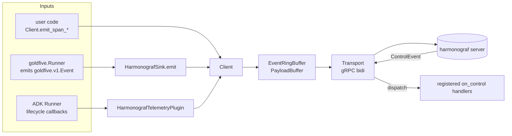

# Client library internals

The harmonograf client (`client/harmonograf_client/`) is the observability
tap that lives inside an agent process. After the goldfive migration it is
small — no orchestration state, no plan walker, no reporting-tool dispatch.

Orchestration — plans, tasks, drift, reporting tools, the reinvocation loop,
the steerer — is in [goldfive](https://github.com/pedapudi/goldfive). See
[../goldfive-integration.md](../goldfive-integration.md) for how the two
compose.

## Anatomy

```
client/harmonograf_client/
├── __init__.py           public surface
├── buffer.py             EventRingBuffer, PayloadBuffer, SpanEnvelope, EnvelopeKind
├── client.py             Client — the non-blocking handle
├── enums.py              SpanKind, SpanStatus, Capability (mirror proto enums)
├── heartbeat.py          periodic transport heartbeat
├── identity.py           persisted AgentIdentity (agent_id on disk)
├── sink.py               HarmonografSink — goldfive.EventSink adapter
├── telemetry_plugin.py   HarmonografTelemetryPlugin — optional ADK BasePlugin
└── transport.py          gRPC bidi transport, reconnect, resume, control stream
```

The public surface is deliberately narrow (from
`client/harmonograf_client/__init__.py`):

- `Client`
- `HarmonografSink`
- `HarmonografTelemetryPlugin`
- `ControlAckSpec`
- `Capability`, `SpanKind`, `SpanStatus`

Anything not on that list is internal — feel free to rename it.

## Data flow

Three ways data enters the library, one way it leaves.



Every public method on the sink / plugin / Client lands one envelope in the
ring buffer and returns in microseconds. The transport is a single
background asyncio task that drains the buffer into a `TelemetryUp` stream
and handles reconnect on disconnects. Agent code never waits on the network,
disk, or a full buffer.

## The three public surfaces

### `Client`

Constructs the transport, owns identity, exposes `emit_span_start`,
`emit_span_end`, `emit_span_update`, `attach_payload`, and the
`on_control(kind, handler)` registration. `Client()` with no args binds
`127.0.0.1:7531` — matching the server's default — and uses an identity
file under `~/.harmonograf/`.

```python
from harmonograf_client import Client

client = Client(name="researcher")                               # 127.0.0.1:7531 default
client = Client(name="researcher", server_addr="localhost:7531") # explicit
```

Shutdown is explicit: `client.shutdown(flush_timeout=5.0)` flushes pending
envelopes and tears down the transport.

### `HarmonografSink`

A `goldfive.EventSink`. Constructing one and attaching it to
`goldfive.Runner(sinks=[...])` is the integration surface:

```python
from harmonograf_client import Client, HarmonografSink
from goldfive import Runner, SequentialExecutor, LLMPlanner
from goldfive.adapters.adk import ADKAdapter

client = Client(name="researcher")
runner = Runner(
    agent=ADKAdapter(root_agent),
    planner=LLMPlanner(call_llm=..., model="openai/gpt-4o-mini"),
    executor=SequentialExecutor(),
    sinks=[HarmonografSink(client)],
)
await runner.run("user request")
```

`HarmonografSink.emit(event)` packs the `goldfive.v1.Event` into a
`GOLDFIVE_EVENT` envelope on the ring buffer; the transport serialises it
as `TelemetryUp(goldfive_event=…)` and the server's ingest dispatches on
`event.payload` (a `oneof` over `RunStarted`, `GoalDerived`,
`PlanSubmitted`, `PlanRevised`, `TaskStarted`, `TaskCompleted`,
`TaskFailed`, `DriftDetected`, `RunCompleted`, `RunAborted`, …).

### `HarmonografTelemetryPlugin`

An ADK `BasePlugin` that turns ADK lifecycle callbacks into harmonograf
spans. Compose it alongside goldfive's `ADKAdapter`:

```python
from google.adk.apps.app import App
from harmonograf_client import HarmonografTelemetryPlugin

app = App(
    name="researcher",
    root_agent=root_agent,
    plugins=[HarmonografTelemetryPlugin(client)],
)
```

The plugin maps:

| ADK callback | Span |
|---|---|
| `before_run_callback` / `after_run_callback` | `INVOCATION` |
| `before_model_callback` / `after_model_callback` | `LLM_CALL` |
| `before_tool_callback` / `after_tool_callback` / `on_tool_error_callback` | `TOOL_CALL` |
| `on_event_callback` (transfer / escalate) | `TRANSFER`, `WAIT_FOR_HUMAN` |

It never reads or writes plan state. Orchestration decisions are
goldfive's; the plugin is pure observability.

## Envelope kinds

`EnvelopeKind` in `buffer.py`:

- `SPAN_START`, `SPAN_UPDATE`, `SPAN_END` — span lifecycle
- `PAYLOAD_UPLOAD` — large-body chunks for `attach_payload`
- `HEARTBEAT` — periodic liveness beacon
- `CONTROL_ACK` — acks for server-sent control events (ride back up the
  telemetry stream to preserve happens-before)
- `GOLDFIVE_EVENT` — goldfive `Event` envelopes emitted by
  `HarmonografSink`

Eviction policy: `GOLDFIVE_EVENT`, `SPAN_START`, `SPAN_END`, and
`CONTROL_ACK` are in the "never evict" tier. `SPAN_UPDATE` and
`HEARTBEAT` drop first under backpressure; `PAYLOAD_UPLOAD` has its own
byte-capped buffer.

## Buffer, transport, reconnect

`Transport` (`transport.py`) runs `StreamTelemetry` and `SubscribeControl`
as two concurrent gRPC calls on the same channel:

- `StreamTelemetry` is bidirectional. The client uploads `TelemetryUp`
  messages; the server downloads `TelemetryDown` (Welcome, PayloadRequest,
  Goodbye).
- `SubscribeControl` is server-streaming. The client receives
  `ControlEvent` messages; registered handlers execute on a dedicated
  dispatch thread and their `ControlAckSpec` return values are packed
  into `CONTROL_ACK` envelopes on the telemetry ring.

Reconnect is exponential-backoff with a circuit breaker after consecutive
failures. On reconnect, the client sends a `Hello` carrying the resume
token from the last `Welcome`; the server replays any post-token deltas
before accepting new input.

## Control handlers

`Client.on_control(kind, handler)` registers a per-kind callback.
Handlers are synchronous and return a `ControlAckSpec` indicating
acceptance:

```python
from harmonograf_client import Client, ControlAckSpec

client = Client(name="researcher")

def on_pause(event):
    pause_flag.set()
    return ControlAckSpec(accepted=True)

client.on_control("PAUSE", on_pause)
```

Kinds are the string name of a `ControlKind` proto enum variant
(`PAUSE`, `RESUME`, `CANCEL`, `STEER`, `APPROVE`, `REJECT`,
`INJECT_MESSAGE`, …). Unrecognised kinds are delivered with a
default-rejecting ack.

## What is deliberately not here

If you are looking for any of the following, it is in goldfive, not here:

- `Plan`, `Task`, `TaskEdge`, `TaskStatus`, `DriftKind` types
- `PlannerHelper` / `LLMPlanner` / `PassthroughPlanner`
- Reporting tool definitions (`report_task_started`, etc.)
- `DefaultSteerer` and the task state machine
- `SessionContext` and session-state coordination
- The plan walker / parallel DAG executor
- `HarmonografAgent` / `HarmonografRunner` / `attach_adk` / `make_adk_plugin`

Any reference to those names in older docs is a staleness bug — please file
an issue or send a PR.
