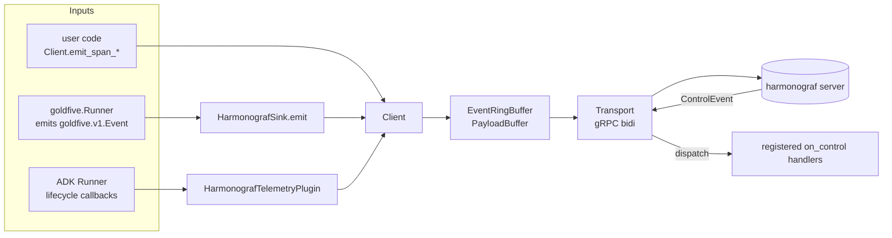

# Client library internals

The harmonograf client (`client/harmonograf_client/`) is the observability
tap that lives inside an agent process. After the goldfive migration it is
small — no orchestration state, no plan walker, no reporting-tool dispatch.

Orchestration — plans, tasks, drift, reporting tools, the reinvocation loop,
the steerer — is in [goldfive](https://github.com/pedapudi/goldfive). See
[../goldfive-integration.md](../goldfive-integration.md) for how the two
compose.

## Recent shape changes (what this doc assumes)

- **Lazy Hello (#85).** The transport defers the `Hello` RPC until the
  first envelope arrives on the ring buffer. Construction no longer
  opens a stream; ghost sessions from importing the library are gone.
- **Per-agent Gantt rows (#80).** `HarmonografTelemetryPlugin` stamps a
  per-ADK-agent id on every span via `before_agent_callback` /
  `after_agent_callback`. A single `goldfive.wrap` run with a
  coordinator + specialists + AgentTool wrappers renders one row per
  ADK agent — not one collapsed row for the whole tree.
- **Plugin dedup (#68).** If two `HarmonografTelemetryPlugin` instances
  end up on the same ADK `PluginManager` (easy under `goldfive.wrap` +
  `adk web` + `App(plugins=[...])`), the later instance detects the
  earlier one on its first callback and silently disables itself.
- **STEER body validation (#72).** The `_control_bridge` between
  harmonograf's control delivery and goldfive rejects empty bodies and
  bodies > 8 KiB (`STEER_BODY_MAX_BYTES = 8192`) and strips ASCII
  control characters before forwarding (`_sanitise_steer_body`).
  `author` and `annotation_id` are stamped onto every STEER
  ControlEvent the server synthesises in `PostAnnotation`
  (`rpc/frontend.py:508-515`), so the goldfive-side steerer can
  attribute + dedupe.

## Anatomy

```
client/harmonograf_client/
├── __init__.py           public surface
├── buffer.py             EventRingBuffer, PayloadBuffer, SpanEnvelope, EnvelopeKind
├── client.py             Client — the non-blocking handle
├── enums.py              SpanKind, SpanStatus, Capability (mirror proto enums)
├── heartbeat.py          periodic transport heartbeat
├── identity.py           persisted AgentIdentity (agent_id on disk)
├── sink.py               HarmonografSink — goldfive.EventSink adapter
├── telemetry_plugin.py   HarmonografTelemetryPlugin — optional ADK BasePlugin
└── transport.py          gRPC bidi transport, reconnect, resume, control stream
```

The public surface is deliberately narrow (from
`client/harmonograf_client/__init__.py`):

- `Client`
- `HarmonografSink`
- `HarmonografTelemetryPlugin`
- `ControlAckSpec`
- `Capability`, `SpanKind`, `SpanStatus`

Anything not on that list is internal — feel free to rename it.

## Data flow

Three ways data enters the library, one way it leaves.



Every public method on the sink / plugin / Client lands one envelope in the
ring buffer and returns in microseconds. The transport is a single
background asyncio task that drains the buffer into a `TelemetryUp` stream
and handles reconnect on disconnects. Agent code never waits on the network,
disk, or a full buffer.

## The three public surfaces

### `Client`

Constructs the transport, owns identity, exposes `emit_span_start`,
`emit_span_end`, `emit_span_update`, `attach_payload`, and the
`on_control(kind, handler)` registration. `Client()` with no args binds
`127.0.0.1:7531` — matching the server's default — and uses an identity
file under `~/.harmonograf/`.

```python
from harmonograf_client import Client

client = Client(name="researcher")                               # 127.0.0.1:7531 default
client = Client(name="researcher", server_addr="localhost:7531") # explicit
```

Shutdown is explicit: `client.shutdown(flush_timeout=5.0)` flushes pending
envelopes and tears down the transport.

### `HarmonografSink`

A `goldfive.EventSink`. Constructing one and attaching it to
`goldfive.Runner(sinks=[...])` is the integration surface:

```python
from harmonograf_client import Client, HarmonografSink
from goldfive import Runner, SequentialExecutor, LLMPlanner
from goldfive.adapters.adk import ADKAdapter

client = Client(name="researcher")
runner = Runner(
    agent=ADKAdapter(root_agent),
    planner=LLMPlanner(call_llm=..., model="openai/gpt-4o-mini"),
    executor=SequentialExecutor(),
    sinks=[HarmonografSink(client)],
)
await runner.run("user request")
```

`HarmonografSink.emit(event)` packs the `goldfive.v1.Event` into a
`GOLDFIVE_EVENT` envelope on the ring buffer; the transport serialises it
as `TelemetryUp(goldfive_event=…)` and the server's ingest dispatches on
`event.payload` (a `oneof` over `RunStarted`, `GoalDerived`,
`PlanSubmitted`, `PlanRevised`, `TaskStarted`, `TaskCompleted`,
`TaskFailed`, `DriftDetected`, `RunCompleted`, `RunAborted`, …).

### `HarmonografTelemetryPlugin`

An ADK `BasePlugin` that turns ADK lifecycle callbacks into harmonograf
spans. Compose it alongside goldfive's `ADKAdapter`:

```python
from google.adk.apps.app import App
from harmonograf_client import HarmonografTelemetryPlugin

app = App(
    name="researcher",
    root_agent=root_agent,
    plugins=[HarmonografTelemetryPlugin(client)],
)
```

The plugin maps ADK lifecycle callbacks to span kinds:

| ADK callback | Span kind |
|---|---|
| `before_run_callback` / `after_run_callback` | `INVOCATION` |
| `before_agent_callback` / `after_agent_callback` | *no span — pushes per-agent id onto the invocation's agent stack* |
| `before_model_callback` / `after_model_callback` | `LLM_CALL` |
| `before_tool_callback` / `after_tool_callback` / `on_tool_error_callback` | `TOOL_CALL` |
| `on_cancellation(invocation_id)` (goldfive#167) | *closes stale RUNNING spans with `status=CANCELLED`* |

It never reads or writes plan state. Orchestration decisions are
goldfive's; the plugin is pure observability.

#### Per-agent attribution (#80)

A single `goldfive.wrap` run typically drives a tree of ADK agents —
coordinator, specialists, AgentTool wrappers, workflow containers
(`SequentialAgent` / `ParallelAgent` / `LoopAgent`). Without attribution
every span would collapse onto the client's root `agent_id` and the
Gantt would render one row for the whole tree.

The plugin derives a stable per-ADK-agent id from the client root and
the ADK agent's `name`:

```text
agent_id = f"{client.agent_id}:{adk_agent.name}"
```

On `before_agent_callback` the plugin pushes this id onto an
invocation-keyed stack (`_agent_stash[invocation_id]`). Subsequent
spans (LLM, tool, child invocations) read the top-of-stack and stamp
the id into `Span.agent_id`. `after_agent_callback` pops.

On the FIRST span the plugin sees for a given `(session_id,
per_agent_id)` pair it also stamps four `hgraf.agent.*` attributes:

- `hgraf.agent.name` — the raw ADK agent name.
- `hgraf.agent.kind` — a coarse hint (`llm`, `workflow`, `tool_wrapped`,
  `unknown`) derived by walking the MRO of the agent class.
- `hgraf.agent.parent_id` — the derived id of the parent ADK agent, or
  the last-but-one segment of `ctx.branch` as a fallback.
- `hgraf.agent.branch` — the ADK dot-delimited ancestry (forensic).

The server harvests these into `Agent.metadata` on first-sight via the
auto-register path in `ingest.py` (see `server.md`). The client never
stamps these attributes on subsequent spans from the same agent — the
cost is paid exactly once per `(session_id, agent_id)` pair.

#### Lazy Hello (#84, #85)

Constructing a `Client` no longer opens a stream. The transport waits
for the first envelope on the ring buffer and opens `StreamTelemetry` +
`SubscribeControl` on demand. This matters for ADK flows: importing
`harmonograf_client` to configure an `App(plugins=[...])` no longer
mints an empty session visible in the picker. Ghost sessions caused by
module-level instantiation are gone as of 2026-04.

Two corollaries:

1. The `session_id` the server assigns is not known until the first
   emit. `Client.session_id` returns `""` until then.
2. Every callback in `HarmonografTelemetryPlugin` wakes the transport
   via `_client.emit_span_*` → `transport.notify()`, so the very first
   callback on a run is what flushes the handshake.

#### Plugin dedup (#68)

Under `goldfive.wrap` + `adk web` + `App(plugins=[HarmonografTelemetryPlugin(c)])`
it is easy to end up with two plugin instances on the same
`PluginManager`: one from `App.plugins`, another propagated via
`observe()` or an adapter's `add_plugin` call. Without dedup every
span is emitted twice.

On the first callback the plugin walks
`invocation_context.plugin_manager.plugins` and checks whether another
plugin with `name="harmonograf-telemetry"` appears *earlier* in the
list than `self`. If so, it flips `_disabled_as_duplicate = True` and
short-circuits every subsequent callback. An INFO log is emitted
exactly once per deduped instance so operators can see what happened.

#### Cancellation sweep

When a `goldfive.ADKAdapter.invoke()` asyncio task catches
`CancelledError` (USER_STEER / USER_CANCEL / upstream cancel),
`after_run_callback` and any in-flight `after_model_callback` /
`after_tool_callback` do NOT fire — ADK places those hooks after the
`async with Aclosing(...)` block, not inside a `finally`. Without
cleanup, spans the plugin already `emit_span_start`-ed would stay
`status=RUNNING` forever.

The adapter calls `plugin.on_cancellation(invocation_id)` on every
plugin that exposes the hook; `HarmonografTelemetryPlugin` delegates
to `_close_stale_spans_for_invocation`, which flushes leftover run /
LLM / tool spans scoped to the cancelled invocation with
`status=CANCELLED`. Tool spans for concurrent sibling invocations are
preserved — the plugin tracks `id(tool_context) → invocation_id` in a
parallel dict so cleanup filters precisely.

## Envelope kinds

`EnvelopeKind` in `buffer.py`:

- `SPAN_START`, `SPAN_UPDATE`, `SPAN_END` — span lifecycle
- `PAYLOAD_UPLOAD` — large-body chunks for `attach_payload`
- `HEARTBEAT` — periodic liveness beacon
- `CONTROL_ACK` — acks for server-sent control events (ride back up the
  telemetry stream to preserve happens-before)
- `GOLDFIVE_EVENT` — goldfive `Event` envelopes emitted by
  `HarmonografSink`

Eviction policy: `GOLDFIVE_EVENT`, `SPAN_START`, `SPAN_END`, and
`CONTROL_ACK` are in the "never evict" tier. `SPAN_UPDATE` and
`HEARTBEAT` drop first under backpressure; `PAYLOAD_UPLOAD` has its own
byte-capped buffer.

## Buffer, transport, reconnect

`Transport` (`transport.py`) runs `StreamTelemetry` and `SubscribeControl`
as two concurrent gRPC calls on the same channel:

- `StreamTelemetry` is bidirectional. The client uploads `TelemetryUp`
  messages; the server downloads `TelemetryDown` (Welcome, PayloadRequest,
  Goodbye).
- `SubscribeControl` is server-streaming. The client receives
  `ControlEvent` messages; registered handlers execute on a dedicated
  dispatch thread and their `ControlAckSpec` return values are packed
  into `CONTROL_ACK` envelopes on the telemetry ring.

Reconnect is exponential-backoff with a circuit breaker after consecutive
failures. On reconnect, the client sends a `Hello` carrying the resume
token from the last `Welcome`; the server replays any post-token deltas
before accepting new input.

## Root-session rollup for AgentTool sub-Runners

ADK's `AgentTool` spawns a sub-`Runner` whose root agent's
`before_run_callback` fires against the same plugin (ADK propagates
the plugin manager into sub-Runners). Each sub-Runner mints its own
`InMemorySessionService` session id, so if we stamped the per-ctx id
on every span, a single `adk web` run would fan out across N
harmonograf sessions — the plan view (pinned to the outer adk-web
session per goldfive#161) would sit alone and the span view would be
scattered.

The plugin caches the ROOT `ctx.session.id` on the first
`before_run_callback` (`_root_session_id`) and stamps it on every
subsequent span. Sub-Runners use the cached root; the `adk.session_id`
attribute still carries the per-ctx id for forensic debugging. The
root is cleared by the matching `after_run_callback` (matching on
`_root_invocation_id` so sub-Runner teardowns don't release it early).

On root-invocation start, the plugin also opens an additional
server-side control subscription scoped to the cached session id via
`Client.open_additional_control_subscription(session_id)`. This makes
the server's router prefer this sub when a STEER arrives with
`session_id=<outer adk-web session>` — fixing the goldfive#162 /
harmonograf#54 flakiness where STEER ack-timed-out because the
router's fall-back fan-out to every live sub is unreliable under
some topologies. One extra sub per run, not per sub-Runner.

## Control handlers

`Client.on_control(kind, handler)` registers a per-kind callback.
Handlers are synchronous and return a `ControlAckSpec` indicating
acceptance:

```python
from harmonograf_client import Client, ControlAckSpec

client = Client(name="researcher")

def on_pause(event):
    pause_flag.set()
    return ControlAckSpec(accepted=True)

client.on_control("PAUSE", on_pause)
```

Kinds are the string name of a `ControlKind` proto enum variant
(`PAUSE`, `RESUME`, `CANCEL`, `STEER`, `APPROVE`, `REJECT`,
`INJECT_MESSAGE`, …). Unrecognised kinds are delivered with a
default-rejecting ack.

## What is deliberately not here

If you are looking for any of the following, it is in goldfive, not here:

- `Plan`, `Task`, `TaskEdge`, `TaskStatus`, `DriftKind` types
- `PlannerHelper` / `LLMPlanner` / `PassthroughPlanner`
- Reporting tool definitions (`report_task_started`, etc.)
- `DefaultSteerer` and the task state machine
- `SessionContext` and session-state coordination
- The plan walker / parallel DAG executor
- `HarmonografAgent` / `HarmonografRunner` / `attach_adk` / `make_adk_plugin`

Any reference to those names in older docs is a staleness bug — please file
an issue or send a PR.
