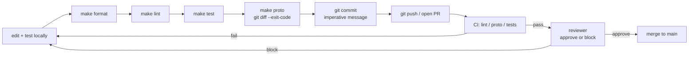

# Contributing

How to propose and land a change in harmonograf.

## Proposing a change

Most changes follow this loop:

1. **Understand the scope.** Read the relevant chapter of this guide.
   Changes that cross component boundaries (client + server, server +
   frontend, proto + everything) need more care than isolated fixes.
2. **Prototype on a branch.** `git checkout -b my-change`. Prefer short
   branches; long-lived ones rot.
3. **Keep the change narrow.** A bug fix is a bug fix. Don't bundle a
   refactor into it. A proto field addition doesn't need a rename of
   the surrounding message. Three similar lines is better than an
   abstraction you'll delete next week.
4. **Write tests first if the bug is behavioral.** See
   [`testing.md`](testing.md) for the right tier.
5. **Run `make test` and `make lint` locally.** Don't rely on CI to catch
   the obvious.
6. **Open a PR.** Short title, descriptive body, link the relevant issue
   or task.

The full path from local edit to merged PR:

## Commit style

- **Imperative mood, short first line.** `feat: add cpu_percent_peak to
  Heartbeat` — not "Added cpu_percent_peak" and not "cpu_percent_peak
  added to Heartbeat."
- **~50 char first line; wrap body at 72.** Standard git conventions.
- **Prefix with `feat:`, `fix:`, `refactor:`, `docs:`, `test:`, `chore:`** —
  consistent with recent commit history (see `git log --oneline`).
- **Explain *why*, not *what*.** The diff shows what. The commit message
  explains why you chose this approach over an obvious alternative.
- **One logical change per commit.** If you can split it, split it.
- **Reference issues** in the body, not the title: `Closes #42` or
  `Refs #123`.

## PR expectations

### Title and description

- Title matches the primary commit.
- Description covers: what changed, why, what tests you added, what you
  *didn't* change that a reviewer might expect to be changed.
- If the PR touches more than one component, list them in the description
  and explain how they fit together.

### Size

Aim for PRs under ~500 lines of diff. Bigger than that and reviewers have
to choose between a thorough pass and a fast one — you'll get one, not
both. Exceptions: proto changes that propagate through generated files,
and large generated-file updates (which are mechanical).

### Scope

One problem per PR. If during review you discover an unrelated bug,
open a separate PR. "While I'm here" changes bloat diffs and slow
review.

### Checklist before opening

- [ ] `make proto` clean (`git diff --exit-code` after running it).
- [ ] `make test` passes.
- [ ] `make lint` passes.
- [ ] Added tests at the right tier (see `testing.md`).
- [ ] Updated any affected dev guide chapters.
- [ ] `AGENTS.md` updated if project-vision-level facts changed.
- [ ] No secrets, credentials, or API keys in the diff.
- [ ] No debug `print()` or `console.log` left in.

## CI expectations

CI runs on every PR. The contract (in priority order):

| Stage | Tool | What it catches |
|---|---|---|
| 1 | `make lint` | Ruff + ESLint issues. |
| 2 | `make proto && git diff --exit-code` | Forgot to regen protos. |
| 3 | `make server-test` | Server unit tests. |
| 4 | `make client-test` | Client unit + integration tests. |
| 5 | `make frontend-test` | Frontend build + lint. |
| 6 | `pnpm --dir frontend test` | vitest suite. |

E2E tests (`make e2e`) are **not** in the required set. They require a
real LLM endpoint and are run manually or on a nightly schedule. If your
change affects the e2e path, run them locally before merging and note it
in the PR.

### When CI fails

- **Lint failure:** `make format` and `make lint`. Push the fix.
- **Test failure:** reproduce locally with the same command CI used. If
  it passes locally but fails in CI, suspect: network dependencies,
  uncommitted generated files, env var differences.
- **Proto drift:** `make proto`, commit the generated files.

## Where to put new code

| You're adding… | Put it in |
|---|---|
| A new field on a domain type | `proto/harmonograf/v1/types.proto`, regen, then `convert.py`, `storage/base.py`, `storage/sqlite.py` |
| A new RPC | `proto/harmonograf/v1/service.proto` or `frontend.proto`, regen, then a handler in `server/harmonograf_server/rpc/` |
| A new reporting tool | Lands in [goldfive](https://github.com/pedapudi/goldfive) (`goldfive.reporting` + `goldfive.DefaultSteerer`). Harmonograf picks it up because `HarmonografSink` forwards every `goldfive.v1.Event` variant. |
| A new drift kind | Lands in goldfive (`goldfive.DriftKind` + classifier). In harmonograf: add a UI badge in `frontend/src/gantt/driftKinds.ts`. |
| A new invariant rule | Lands in goldfive — harmonograf no longer owns plan-state invariants. |
| A new storage backend | `server/harmonograf_server/storage/<kind>.py` implementing `Storage` ABC, register in `factory.py`, tested via `test_storage_extensive.py` |
| A new UI view | `frontend/src/components/shell/views/` + wire into `Shell.tsx` + state in `uiStore.ts` |
| A new frontend RPC hook | `frontend/src/rpc/hooks.ts` |
| A new keyboard shortcut | `frontend/src/lib/shortcuts.ts` + binding in `Shell.tsx` |

## Where to put new tests

| Change kind | Test location |
|---|---|
| Client library logic | `client/tests/test_<module>.py` |
| Server logic | `server/tests/test_<module>.py` |
| Storage backend | `server/tests/test_storage_extensive.py` (runs against both backends) |
| Frontend hot path | `frontend/src/__tests__/<module>.test.ts` |
| Frontend component | `frontend/src/__tests__/<Component>.test.tsx` |
| Full pipeline scenario | `tests/e2e/test_scenarios.py` (add a new scenario function) |
| Real-LLM behavior | `tests/e2e/test_planner_e2e.py` or similar; gate on `KIKUCHI_LLM_URL` |
| Playwright interop | `tests/integration/tests/<name>.spec.ts` |

See [`testing.md`](testing.md) for how to decide which tier.

## When to update `AGENTS.md`

`AGENTS.md` is the project-vision doc that gets loaded by Claude Code as
canonical context. Update it when:

- The three-component architecture changes shape.
- A core abstraction moves (e.g., the plan state machine relocates).
- A key file's role changes significantly.
- You introduce a new orchestration mode or drift kind that downstream
  prompts need to know about.

Do *not* update it for:

- Routine bug fixes.
- Renames of internal helpers.
- Test additions.
- Frontend styling tweaks.

A good rule of thumb: if a new contributor reading `AGENTS.md` alone
would be misled by the change, update it. Otherwise leave it alone.

## When to update this guide (`docs/dev-guide/`)

Update the relevant chapter(s) in the same PR as the behavior change.
Don't defer documentation — it rots fast and "docs PR coming next week"
usually means "never."

- **`setup.md`** — toolchain versions, new env vars, new make targets.
- **`architecture.md`** — component-level flows, new cross-component
  interactions.
- **`client-library.md`** — new orchestration mode, new drift kind, new
  reporting tool, new invariant, new metric, new state-protocol key.
- **`server.md`** — new ingest path, new bus delta kind, new RPC, new
  storage field, new control event type.
- **`frontend.md`** — new view, new hook, new component tree change,
  new UI store field.
- **`working-with-protos.md`** — new proto layout or new codegen rule.
- **`testing.md`** — new test tier, new harness, new fixture pattern.
- **`debugging.md`** — new common failure mode you hit in production or
  a new debug tool you want others to know about.
- **`contributing.md`** — changes to this process.

## Code style

### Python

- `ruff format` is authoritative. Run `make format` before committing.
- Line length: whatever ruff says (currently defaults).
- Type hints: required on public functions, optional on internal helpers.
  Prefer `dict[str, X]` over `Dict[str, X]` (PEP 585).
- Imports: sorted by `ruff`. Standard library, third-party, first-party,
  local — in that order.
- Docstrings: terse. One line for simple functions, triple-quoted block
  for classes and complex functions. Don't restate the code.
- Comments: default to writing none. Only when the *why* is non-obvious.

### TypeScript

- `eslint` is authoritative.
- Prefer `const` over `let`. Never use `var`.
- Prefer explicit types on exported functions; let inference handle
  internals.
- Don't use `any`. Use `unknown` if you must; narrow it with a type guard.
- React: hooks and function components only. No class components.
- State mutation: allowed in mutable stores (the Gantt hot path), not
  allowed in React state or Zustand (use the setter).

### Proto

- Field numbers: see [`working-with-protos.md`](working-with-protos.md).
- Naming: `snake_case` for field names, `PascalCase` for message and enum
  names, `SCREAMING_SNAKE_CASE` for enum values.
- Comments: required on every message and every non-obvious field.
- Never reuse a retired field number.

## Reviewing PRs

If you're reviewing (as a teammate or as a maintainer):

1. **Read the commit messages first.** If they don't make sense, ask
   for a rewrite before diving into the diff.
2. **Run the change locally** if it's non-trivial. `make demo` is fast.
3. **Check the test tier.** A PR that changes callback dispatch but
   only adds unit tests is probably missing integration coverage.
4. **Check the pitfalls.** Each chapter of this guide calls out specific
   pitfalls; verify the PR doesn't step in one.
5. **Be decisive.** A vague "LGTM with comments" is worse than "block on
   the three issues I listed." Block or approve — don't hedge.

## Releases

There is no formal release process today. `main` is the release branch;
tagged versions exist but are not shipped as packages. When that changes,
this section will be updated.

## Questions

If you can't find the answer in this guide, the code is the next best
source. After that, ask. The team would rather answer a question twice
than have you bang your head for an afternoon.
