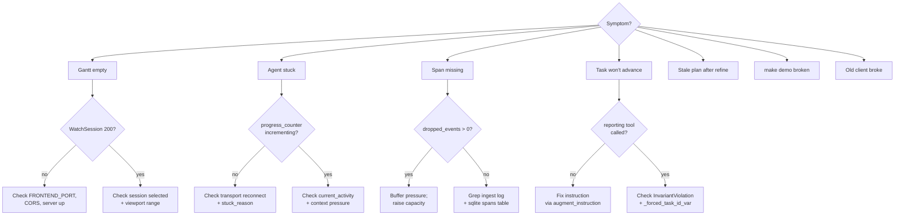

# Debugging

A field guide for when something is broken. Organized by symptom, because
that is how debugging actually starts.

## Turning on debug logging

### Server

The server uses `logging_setup.py` at `server/harmonograf_server/logging_setup.py`
to configure a Rich-backed structured logger. Default level is `INFO`.

Turn on debug logs:

```bash
LOG_LEVEL=DEBUG make server-run
```

Or, when running under `python -m harmonograf_server`:

```bash
LOG_LEVEL=DEBUG uv run python -m harmonograf_server --store sqlite --data-dir data
```

Log destinations:

- Console (stdout/stderr) — always on.
- `data/harmonograf-server.log` or similar, if file logging is enabled in
  the config. Grep `logging_setup.py` for the current behavior; this
  file's location is one of the first things to change if it's not where
  you expect.

Particularly useful loggers when debugging:

| Logger | What it tells you |
|---|---|
| `harmonograf_server.ingest` | Every `TelemetryUp` message handled. |
| `harmonograf_server.bus` | Every delta published and every subscription state change. |
| `harmonograf_server.control_router` | Every control event routed and every ack received. |
| `harmonograf_server.rpc.frontend` | Every frontend RPC call. |
| `harmonograf_server.storage.sqlite` | All SQL statements if `LOG_LEVEL=DEBUG`. |

### Client library

Set `LOG_LEVEL=DEBUG` in the agent process environment. The client library
respects Python's standard `logging` config. Interesting loggers:

| Logger | What it tells you |
|---|---|
| `harmonograf_client.telemetry_plugin` | Every ADK callback and the span it produced. |
| `harmonograf_client.sink` | Every goldfive event converted to `GOLDFIVE_EVENT` envelope. |
| `harmonograf_client.transport` | gRPC connection state, reconnect attempts, Hello/Welcome handshake. |
| `harmonograf_client.buffer` | Ring buffer pressure and drops. |

To see the orchestration state machine in motion — task transitions,
reporting-tool interceptions, drift fires, invariant checks — turn on
goldfive's loggers instead. Those live in
[goldfive](https://github.com/pedapudi/goldfive), not harmonograf.

### Frontend

Open browser DevTools:

- **Network** tab → filter for `/harmonograf.v1.Harmonograf/` — all RPC
  traffic. Streaming RPCs show as `EventStream`; unary RPCs show as
  `POST` with a gRPC-Web content type.
- **Console** → frontend logs. Set `localStorage.debug = 'harmonograf:*'`
  if we've wired up `debug`-style namespaced logging (grep for `debug(`
  in `frontend/src/`).
- **Application** → `localStorage` for any persisted UI state from
  `uiStore`.

The `TransportBar` component (`frontend/src/components/TransportBar/`) in
dev builds shows the live transport state. If it says "disconnected",
the backend is unreachable — check the server is up and the CORS allow
list in `_cors.py`.

## Plan-state invariants: debug them in goldfive

The invariant validator that used to live in harmonograf's client
(`invariants.py`) moved to goldfive during the migration. If the UI is
showing a task transition that looks impossible (`COMPLETED →
IN_PROGRESS`, say), the bug is in goldfive's steerer / reporting-tool
handling. Follow the trail there — goldfive has its own debug harness
and invariant suite.

## Common failure modes

A symptom-first triage flow. Each branch points at the section below that covers it.



### 1. "The Gantt is empty"

**Check, in order:**

1. DevTools Network → is `WatchSession` returning 200 and streaming? If
   not, the frontend can't reach the server. Check `FRONTEND_PORT` (default
   5174) and the server log for connection errors.
2. Is any session listed in the session picker? If not, no agent has
   connected to the server. Check the agent's transport log for
   `Hello`/`Welcome`.
3. Is the session selected in the URL / uiStore? `SessionStore` is empty
   until a session is selected.
4. Is the viewport time window outside the data range? Try "fit to data"
   (or zoom out). If `SessionStore.minTimeMs`/`maxTimeMs` are `Infinity`,
   no spans have landed yet.

### 2. "An agent is stuck"

Symptoms: its row is red, `progress_counter` stopped incrementing, spans
are not ending.

**Check:**

1. `Heartbeat.progress_counter` — is it increasing? The heartbeat sweeper
   (`rpc/telemetry.py:111`) marks an agent `DISCONNECTED` if it hasn't
   heartbeated recently. If heartbeats stop but the agent is still running,
   the transport is deadlocked; check `harmonograf_client.transport` logs
   for reconnect loops.
2. The `stuck_reason` annotation (if any) — written by the server when
   the sweeper can infer a reason (no progress, no spans, no heartbeat).
3. Is the orchestrator waiting on a task that will never complete? Look
   at `current_activity` in the heartbeat — it should name the current
   task. For the underlying task state, consult goldfive logs.
4. Context window pressure — check `Heartbeat.context_window_tokens` vs
   `context_window_limit_tokens`. Near the limit means the model is about
   to refuse, which usually shows up as `DRIFT_KIND_CONTEXT_PRESSURE`.

### 3. "A span is missing from the UI"

**Check:**

1. Did the client buffer drop it? Look at `Heartbeat.dropped_events` and
   `BufferStats.dropped_events`. If nonzero, the buffer is under pressure.
   Non-critical spans drop first.
2. Did the server log an ingest error for it? Grep
   `harmonograf_server.ingest` for the span's ID.
3. Is the span in the store? `sqlite3 data/harmonograf.db "SELECT * FROM
   spans WHERE id=?"` — if yes, the bug is between store and UI (bus or
   renderer).
4. Is the span's time range outside the current viewport? The renderer
   only draws spans that intersect the viewport.

### 4. "A task won't advance"

Symptoms: the task is stuck in `PENDING` or `IN_PROGRESS` despite the
agent clearly finishing it.

**Check:**

1. Did the agent call a reporting tool? Grep the goldfive log for the
   tool name. If not, the agent's instruction template is missing the
   reporting-tool appendix — goldfive's `ADKAdapter` is supposed to
   inject it; check that the subtree you're looking at is reachable
   from the `ADKAdapter` root.
2. Did goldfive's steerer process the tool call? Look for the
   matching `TaskStarted` / `TaskCompleted` / `TaskFailed` event in
   goldfive logs.
3. Is the corresponding `goldfive_event` landing on the harmonograf
   server? Grep `harmonograf_server.ingest` for `goldfive_event` —
   every dispatched variant should appear.
4. Is the frontend reducing it? Check browser devtools for the
   `SessionUpdate.goldfive_event` in the `WatchSession` stream and
   confirm `TaskRegistry` is applying it.

### 5. "The UI shows stale data after a refine"

Symptoms: a plan was refined but the UI still shows the old plan.

**Check:**

1. Did goldfive emit `PlanRevised`? Grep the goldfive log for the event
   (goldfive's `Runner` / `DefaultSteerer` logs this).
2. Did the harmonograf server ingest it? Grep `harmonograf_server.ingest`
   for `goldfive_event` + `PlanRevised`; it should update the plan index
   and publish a `goldfive_event` bus delta.
3. Did the frontend receive the `SessionUpdate.goldfive_event`? Check
   DevTools → Network → `WatchSession` stream.
4. Did `TaskRegistry` reduce it and run `computePlanDiff`? Add a
   `console.log` in `computePlanDiff` and hover the refine.
5. Did the renderer pick up the mutation? `TaskRegistry` notifies
   subscribers; verify the drawer is subscribed.

### 6. "`make demo` starts but nothing works"

**Check:**

1. All three processes started? Look for "frontend dev server" and
   "presentation_agent" and "harmonograf-server" in the output.
2. Port conflicts? Default ports are 7531 (native gRPC), 5174 (gRPC-Web),
   5173 (Vite), 8080 (ADK web). Run `lsof -i :7531` etc.
3. CORS? Open DevTools; if you see CORS errors for requests to the server,
   check `_cors.py` allow list.
4. Does the agent see `HARMONOGRAF_SERVER`? Default is `127.0.0.1:7531`;
   if it's not set in `tests/reference_agents/presentation_agent/` env, spans won't flow.

### 7. "A proto change broke old clients"

See [`working-with-protos.md`](working-with-protos.md) for the
forward-compat rules. The most common causes:

- Reused a retired field number.
- Renamed or removed a field in place.
- Changed a field from singular to `repeated`.

Revert the proto change, add the field fresh with a new number, and
re-release.

### 8. "Tests pass locally but fail in CI"

**Usual suspects:**

- You forgot to regenerate protos: `make proto && git status`.
- You left a test depending on `KIKUCHI_LLM_URL` (CI doesn't have it).
- You left a test depending on real network (firewall blocks it).
- A `conftest.py` cleanup didn't run because of an exception; state
  leaked across tests.

## Inspecting the sqlite store

```bash
sqlite3 data/harmonograf.db
```

Useful one-liners:

```sql
.tables
.schema spans
SELECT COUNT(*) FROM spans;
SELECT id, kind, status, name, start_time, end_time FROM spans ORDER BY start_time DESC LIMIT 20;
SELECT * FROM agents WHERE status='CONNECTED';
SELECT plan_id, revision_index, revision_kind, summary FROM task_plans ORDER BY revision_index DESC LIMIT 10;
SELECT digest, size, mime, evicted FROM payloads ORDER BY created_at DESC LIMIT 10;
```

If the sqlite file is corrupted (power loss, aborted write), delete it and
restart the server. Data retention is not authoritative — agents will
re-stream on reconnect via resume tokens.

## Reading a heartbeat

Heartbeats are your primary debug instrument for agent health. Shape
(`proto/harmonograf/v1/telemetry.proto` `Heartbeat` message):

| Field | Meaning |
|---|---|
| `buffered_events` | How many events are queued for transport. Growing = network slow. |
| `dropped_events` | How many events were dropped. Nonzero = buffer overflow. |
| `dropped_spans_critical` | Critical spans dropped. Should always be zero. Nonzero = bug. |
| `buffered_payload_bytes` | Payload buffer occupancy. |
| `payloads_evicted` | Payloads dropped before upload. Backfill via `PayloadRequest`. |
| `cpu_self_pct` | Agent process CPU. |
| `client_time` | Wall clock on the client. Compared to `server_time` for skew. |
| `progress_counter` | Monotonic; used for stuckness detection. Must increment on any state change. |
| `current_activity` | One-sentence description. If it says nothing useful, the agent is probably stuck. |
| `context_window_tokens` / `context_window_limit_tokens` | Model context window usage. |

## Asking the server for stats

`make stats` runs `harmonograf_server.cli_stats` which invokes the
`GetStats` RPC and prints server counters — span count, session count,
active subscriptions, and so on. Quick sanity check when you can't tell
if the server is alive.


## Common "but that's impossible" causes

A running list of things that have bitten people and look unbelievable:

- **Two sessions with the same ID.** Happens when an agent restarts with a
  stale resume token. Fix: clear the identity file or change session ID
  logic.
- **Spans appear to arrive out of order.** The bus preserves publish order
  per subscriber, but clock skew between the client and server can make
  the UI sort wrong. Use `SpanStart.start_time` from the client, not
  server receive time.
- **A task is marked complete before its span ends.** Plan state and span
  lifecycle are decoupled by design. Goldfive's reporting-tool intercept
  fires first; the harmonograf span ends when the ADK callback
  eventually runs. See [client-library.md](client-library.md).
- **`session.state` mutation silently lost.** Session-state coordination
  is goldfive's `SessionContext` — chase this inside goldfive.
- **A drift fires repeatedly.** Drift detection and throttling are in
  goldfive; check goldfive's drift logger and refine-throttle settings.

## When you really can't figure it out

1. Reduce to a minimal reproduction. A 10-line test is easier to debug
   than a 10-minute demo.
2. Bisect with `git bisect` — the recent commits list in git log is a
   decent starting point.
3. Ask for a second pair of eyes. The client library in particular has
   gotchas that are hard to see if you wrote them yourself.
4. If goldfive's invariant suite is silent but something is obviously
   wrong, the invariant itself may be missing — file an issue upstream.

## Next

[`contributing.md`](contributing.md) — once the bug is fixed, how to get
it into `main`.
