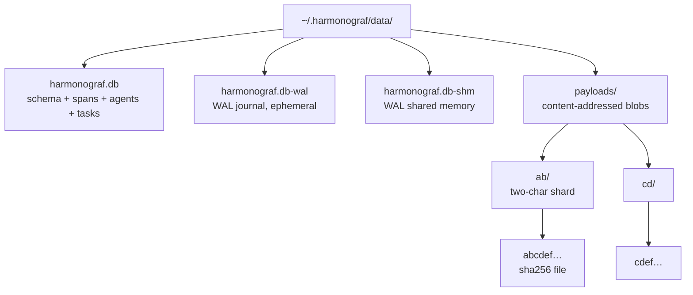

# Deployment

This chapter is for contributors and operators running harmonograf
somewhere real — a shared dev box, a staging VM, a lab workstation
that needs to survive a reboot. It is **not** a cloud deployment
guide, because harmonograf has no cloud-hosted tier and its v0 auth
story is deliberately minimal (see [`security-model.md`](security-model.md)).

Read [`setup.md`](setup.md) first if you have never run harmonograf
locally. This document picks up from "it works on my laptop" and
takes you to "it survives a reboot and a browser on another machine
can see it".

## Process model

One server, many agents, many browsers. That's the only topology
(see [`architecture.md`](architecture.md) §"Design principles #5").

```
   ┌─ agent process 1 (grpc client) ─┐
   │                                 │
   │  ┌─ agent process 2 (grpc) ─┐   │
   │  │                          │   │
   │  │   ┌─ harmonograf-server ─┴───┴──────────┐
   │  │   │                                      │
   │  │   │     :7531 (native gRPC, for agents)  │
   │  │   │     :7532 (gRPC-Web + health, for    │
   │  │   │             browsers)                │
   │  │   └──────────────────────────────────────┘
   │  │                          │
   │  └──────────────────────────┘
   │                                 │
   └─────────────────────────────────┘
```

**There is exactly one server per deployment.** It owns the canonical
timeline and the control router. There is no clustering, no HA, no
active-active failover. The process is stateless enough that you can
restart it without losing telemetry (the sqlite file is the state)
but there is no second process that picks up while you're down.

The server is built by `Harmonograf.from_config()` at
`server/harmonograf_server/main.py:74`. It runs two listeners
concurrently (`main.py:107-183`):

| Listener | Default port | Transport | Audience |
|---|---|---|---|
| native gRPC | `cfg.grpc_port` = `7531` | grpc.aio | Agent clients (Python) |
| gRPC-Web + health | `cfg.web_port` = `7532` | hypercorn + sonora | Browsers, health probes |

Both listeners share the same `TelemetryServicer` instance, so
sessions are visible from either side. The port numbers are
configured in `ServerConfig` (`server/harmonograf_server/config.py:14-26`)
and are the single source of truth — do not hard-code them elsewhere.

## Installation

On a persistent host the workflow is identical to
[`setup.md`](setup.md):

```bash
git clone <repo>
cd harmonograf
make install
```

The result is three Python venvs (server, client, tests) managed by
`uv` plus a node_modules under `frontend/`. None of these are
system-wide installs. If you want the `harmonograf-server` binary
on `$PATH`, alias it or invoke `uv run python -m harmonograf_server`
from the repo checkout.

## Data directory and backup strategy

The server stores everything under `cfg.data_dir` (default
`~/.harmonograf/data`, `config.py:18`). The layout is:

```
~/.harmonograf/data/
├── harmonograf.db           # sqlite file (schema, spans, agents, tasks, ...)
├── harmonograf.db-wal       # WAL journal (ephemeral, recreated on start)
├── harmonograf.db-shm       # shared-memory index for WAL
└── payloads/                # content-addressed payload bytes
    ├── ab/
    │   └── abcdef...       # sha256 digest → file
    └── cd/
        └── cdef...
```

The two-char shard directory (`sqlite.py:_payload_path`) keeps any
single directory under a few thousand files at realistic payload
counts.

The same layout as a tree:



### Backup

Use the `GetStats` RPC first to find out how big the live state
is before you plan a backup:

```bash
make stats
```

That prints `session_count`, `agent_count`, `span_count`,
`payload_count`, `payload_bytes`, and `disk_usage_bytes` as reported
by `SqliteStore.stats()` at `sqlite.py:1126`. `disk_usage_bytes` walks
both the DB file and the payloads tree so it is the authoritative
"what does harmonograf occupy on disk" number.

**For a consistent snapshot while the server is running**, use the
SQLite online backup API. The simplest form:

```bash
# While the server is still running:
sqlite3 ~/.harmonograf/data/harmonograf.db ".backup '/backup/harmonograf.db.bak'"
```

Then `rsync -a ~/.harmonograf/data/payloads/ /backup/payloads/` to
cover the content-addressed blobs. Payloads are immutable — once a
digest exists on disk it does not get rewritten — so the rsync pass
can race with a live write without corrupting anything.

**For an offline backup**, stop the server first:

```bash
systemctl stop harmonograf         # or your process manager of choice
tar -czf harmonograf-data.tgz -C ~/.harmonograf data
systemctl start harmonograf
```

The graceful stop path at `main.py:185-218` waits up to
`cfg.grace_seconds` (default `5.0`) for existing RPCs to finish
and then closes the store.

**Do not `cp` or `tar` the DB file while the server is running and
writing** — WAL mode makes it look safe, but a half-committed
checkpoint during copy produces a backup that is not consistent with
itself. Always use the `.backup` command or stop the server.

### Restore

```bash
systemctl stop harmonograf
rm -rf ~/.harmonograf/data
mkdir -p ~/.harmonograf/data
cp /backup/harmonograf.db.bak ~/.harmonograf/data/harmonograf.db
rsync -a /backup/payloads/ ~/.harmonograf/data/payloads/
systemctl start harmonograf
```

The server will pick up the schema on `SqliteStore.start()` and
backfill any new columns via the `ALTER TABLE ... IF NOT EXISTS`
pattern at `sqlite.py:193-223`. See [`migration.md`](migration.md)
for what that means when the DB is from a different schema version.

## Port configuration and network

The defaults are:

| Service | Default bind | Set in | Purpose |
|---|---|---|---|
| `harmonograf-server` gRPC | `127.0.0.1:7531` | `ServerConfig.grpc_port` | Native gRPC for agent clients |
| `harmonograf-server` gRPC-Web | `127.0.0.1:7532` | `ServerConfig.web_port` | gRPC-Web for the frontend + `/healthz`, `/readyz` |
| Frontend Vite dev server | `127.0.0.1:5173` | `frontend/vite.config.ts` | Browser app during development |
| `adk web` demo agent | `127.0.0.1:8080` | Makefile `ADK_WEB_PORT` | Optional — only when running `make demo` |

**All defaults bind to loopback.** This is deliberate and is the
primary security control in v0 (see
[`security-model.md`](security-model.md)). If you pass
`--host 0.0.0.0` to expose the server to a LAN, you are operating
without authentication by default and must put a reverse proxy in
front. There is no in-process TLS.

To change ports, pass flags to the server:

```bash
uv run python -m harmonograf_server \
    --host 0.0.0.0 \
    --port 7531 \
    --web-port 7532 \
    --data-dir /var/lib/harmonograf/data \
    --auth-token "$(cat /etc/harmonograf/token)"
```

The Makefile `server-run` target uses the defaults
(`Makefile:87-88`).

## TLS and auth — what's built in

**Nothing built in for TLS.** The native gRPC listener is opened
with `add_insecure_port()` at `main.py:118`. The gRPC-Web listener is
served by hypercorn over plain HTTP (`main.py:175-182`). There is no
code path in v0 that terminates TLS.

**Optional bearer-token auth** is the only built-in auth mechanism
(`server/harmonograf_server/auth.py`). Enable it with
`--auth-token <secret>` (`ServerConfig.auth_token`, `config.py:25`):

- On the native gRPC side, a `BearerTokenInterceptor`
  (`auth.py:44`) is inserted in front of every RPC. Calls without
  `authorization: bearer <token>` are rejected with
  `UNAUTHENTICATED`.
- On the gRPC-Web side, `asgi_bearer_guard` (`auth.py:80`) wraps the
  sonora app and rejects any request without the header with a 401.
- `/healthz` and `/readyz` are **intentionally exempt** from the
  guard — see the comment at `auth.py:82-85` and the mount order at
  `main.py:162-167`. Orchestrators can probe without credentials.

The auth module is brutally honest about its limitations
(`auth.py:7-10`):

> This is explicitly *not* a real auth system — there is no rotation,
> no TLS, no multi-tenant scoping. It exists to prevent accidental
> cross-machine leakage in shared dev environments.

Treat the bearer token as a tripwire, not a security boundary. If
your threat model includes anyone with network access, front
harmonograf with a reverse proxy that terminates TLS and does real
auth. See [`security-model.md`](security-model.md) for the full
v0 gap list.

### Fronting with a reverse proxy

A minimal nginx configuration that terminates TLS and forwards
gRPC-Web to the server:

```nginx
server {
    listen 443 ssl http2;
    server_name harmonograf.example.internal;

    ssl_certificate     /etc/letsencrypt/live/.../fullchain.pem;
    ssl_certificate_key /etc/letsencrypt/live/.../privkey.pem;

    # Browser → gRPC-Web (hypercorn on :7532)
    location / {
        proxy_pass         http://127.0.0.1:7532;
        proxy_http_version 1.1;
        proxy_set_header   Host $host;
        proxy_set_header   X-Forwarded-For $proxy_add_x_forwarded_for;
        proxy_read_timeout 3600s;
        proxy_buffering    off;
    }

    location = /healthz { proxy_pass http://127.0.0.1:7532/healthz; }
    location = /readyz  { proxy_pass http://127.0.0.1:7532/readyz; }
}
```

For **native gRPC** (port `7531`), TLS termination is trickier — most
proxies either need grpc/2 support (nginx does) or you need an
envoy sidecar. The client library's `TransportConfig.server_addr`
(`transport.py:66`) takes a plain `host:port`; the channel is opened
with `grpc.aio.insecure_channel` (`transport.py:391`). If you change
that, you will also need to teach the client to accept TLS certs —
which is an unimplemented feature as of v0. The practical workaround:
run the proxy on a different port (e.g. `8531`) that terminates TLS
and forwards to `127.0.0.1:7531`, and configure client processes with
`HARMONOGRAF_SERVER=proxy.example.internal:8531`. The client still
speaks plaintext to the proxy; the network hop is TLS-protected end
to end only if the client and the proxy are on the same host.

The gRPC-Web path is easier because it's HTTP/2-over-TLS to the
proxy and plaintext to hypercorn.

## Logging and rotation

`logging_setup.py` configures a structured logger backed by
[rich](https://rich.readthedocs.io/) (see `server.md` §"Anatomy" for
file sizes). The output goes to stderr by default — hypercorn's
`errorlog = "-"` at `main.py:173` wires hypercorn to the same
stream.

**Log levels** are set via `cfg.log_level` (`config.py:19`). The
`text` vs `json` format is `cfg.log_format` (`config.py:20`); JSON is
useful when you are feeding logs into a log collector.

**Rotation is the operator's job.** The server does not open log
files directly — it writes to stderr. Under systemd, journald handles
rotation and retention. Under a process supervisor that does not
redirect stderr, pipe to `logrotate` or run the server under `tee`
with a rotated output file.

A minimal journald reader:

```bash
journalctl -u harmonograf.service -f --output=short-iso
```

Good metrics to grep for in the log:

- `stream opened` / `stream closed` — agent lifecycle (`ingest.py:232-238, 296-302`)
- `session created` — new session boot (`ingest.py:207`)
- `transport circuit breaker OPEN` — client saw repeated connect
  failures (`transport.py:334`)
- `retention swept N session(s)` — retention reclaimed state
  (`retention.py:51`)

## Health checks and stats

Two HTTP endpoints are always available on the web port, exempt from
the bearer-token guard:

| Endpoint | Returns | Code |
|---|---|---|
| `GET /healthz` | `ok\n` | 200 always, as long as the process is serving |
| `GET /readyz` | `ready\n` / `not ready\n` | 200 iff `store.ping()` succeeds; 503 otherwise |

Implementation: `server/harmonograf_server/health.py`. `/readyz`
calls `SqliteStore.ping()` (`sqlite.py:838`), which runs a
`SELECT 1` inside the async lock. That's a real signal that the
store is reachable and not wedged.

**Probe examples** (adjust hostnames / ports as needed):

```bash
curl -fsS http://127.0.0.1:7532/healthz
curl -fsS http://127.0.0.1:7532/readyz
```

**Kubernetes** (if you are running under k8s despite the "no cloud
tier" caveat):

```yaml
livenessProbe:
  httpGet:
    path: /healthz
    port: 7532
  periodSeconds: 10
readinessProbe:
  httpGet:
    path: /readyz
    port: 7532
  periodSeconds: 5
  failureThreshold: 3
```

**Stats RPC**. `make stats` (Makefile:218) runs a small CLI that
calls `GetStats` over native gRPC and prints the result. It is the
canonical "how big is the deployment" probe and what you should
scrape into whatever monitoring system you have.

```bash
$ make stats
session_count: 142
agent_count: 318
span_count: 91420
payload_count: 2109
payload_bytes: 48274819
disk_usage_bytes: 72981234
```

The call path is `server/harmonograf_server/cli_stats.py →
Harmonograf server → SqliteStore.stats()` at `sqlite.py:1126`.

**Server-side metrics loop** (`main.py:144-152`) periodically logs
a snapshot at `cfg.metrics_interval_seconds` (default `30.0`,
`config.py:24`). That is the cheap log-based alternative to scraping
`GetStats` from outside. Set the interval to `0` to disable.

## Multi-tenant considerations and session IDs

Harmonograf does **not** support multi-tenant isolation in v0. There
is one global namespace for sessions, agents, and control routing.
Two agent processes that both submit `session_id=debug-1` will
overwrite each other's telemetry; two browsers watching `debug-1`
will see both agents' events interleaved.

Session IDs are validated against `_SESSION_ID_RE = r"^[a-zA-Z0-9_-]{1,128}$"`
at `ingest.py:67, 191-194`. That validation exists so session IDs
are safe to interpolate into filesystem paths (for payload shards)
and SQL parameters — see the check in `handle_hello()` at
`ingest.py:191`. Do not add characters to that regex without
auditing every downstream consumer.

**If you need tenancy today**, run one server per tenant on a
separate port with a separate `--data-dir`. That is the supported
isolation mechanism. There is no cross-tenant scoping inside a single
server process.

**Auto-generated session IDs** follow the pattern
`sess_YYYY-MM-DD_NNNN` (`ingest.py:322-325`) and are scoped to the
server's local wall clock. They are predictable, which is fine for
v0 but means a malicious actor could guess a coworker's session ID
on a shared server — another reason the shared-server mode needs a
real auth layer in front.

## Graceful shutdown and draining

`Harmonograf.stop()` at `main.py:185-218` runs the following
sequence:

1. Cancel the heartbeat sweeper task (`main.py:187-192`).
2. Cancel the retention task (`main.py:193-198`).
3. Cancel the periodic metrics task (`main.py:199-204`).
4. `await grpc_server.stop(grace=cfg.grace_seconds)` — lets
   in-flight RPCs finish for up to `grace_seconds` (default `5.0`).
5. Fire `web_shutdown.set()` so hypercorn winds down gracefully
   (`main.py:207-213`).
6. `await store.close()` — closes the sqlite connection (`main.py:214-217`).

The signal handlers at `main.py:220-229` wire `SIGINT` and `SIGTERM`
into `_stop_event.set()`, so a `kill <pid>` or `Ctrl-C` triggers the
graceful path.

**Client-side draining**. `Transport.shutdown(timeout=5.0)` at
`transport.py:208` sets `_stop` and sends a `Goodbye(reason="shutdown")`
if the connection is still up (`transport.py:461-467`). That tells
the server to close the stream cleanly and mark the agent
`DISCONNECTED` (`ingest.py:288-302`).

**If you SIGKILL the server**, the client's reconnect loop will
keep trying with exponential backoff (`transport.py:265-312`). The
circuit breaker opens after `BREAKER_FAILURE_THRESHOLD = 10`
consecutive failures (`transport.py:55, 326-344`) and cools down for
`BREAKER_COOLDOWN_MS = 60000` ms before trying again. That is
deliberate: a crashed server should not be hammered back into
existence by a fleet of retrying agents.

## Docker and systemd patterns

**systemd unit (`/etc/systemd/system/harmonograf.service`)**:

```ini
[Unit]
Description=Harmonograf server
After=network.target

[Service]
Type=simple
User=harmonograf
Group=harmonograf
WorkingDirectory=/opt/harmonograf
Environment=HOME=/var/lib/harmonograf
ExecStart=/opt/harmonograf/server/.venv/bin/python -m harmonograf_server \
    --store sqlite \
    --data-dir /var/lib/harmonograf/data \
    --host 127.0.0.1 \
    --port 7531 \
    --web-port 7532 \
    --auth-token-file /etc/harmonograf/token \
    --retention-hours 168
Restart=on-failure
RestartSec=5
KillSignal=SIGTERM
TimeoutStopSec=10

[Install]
WantedBy=multi-user.target
```

Notes:

- `TimeoutStopSec=10` must be at least `cfg.grace_seconds + 5` so
  systemd does not SIGKILL before the graceful drain finishes.
- Bind to `127.0.0.1` and front with nginx if you want external
  access.
- `--retention-hours 168` is one week; adjust to taste.

**Docker**. There is no official image in v0. A minimal Dockerfile
skeleton:

```dockerfile
FROM python:3.12-slim
RUN pip install uv
WORKDIR /opt/harmonograf
COPY . .
RUN uv sync --directory server
EXPOSE 7531 7532
VOLUME ["/var/lib/harmonograf/data"]
CMD ["uv", "run", "--directory", "server", \
     "python", "-m", "harmonograf_server", \
     "--data-dir", "/var/lib/harmonograf/data", \
     "--host", "0.0.0.0"]
```

With `--host 0.0.0.0` you are binding publicly. **Do not expose a
container like this without a reverse proxy doing TLS and auth.**
See [`security-model.md`](security-model.md).

## Upgrades

The sqlite store runs `ALTER TABLE ... ADD COLUMN ... IF NOT EXISTS`
at startup (`sqlite.py:193-223`) to backfill new columns on pre-existing
databases. That covers additive schema changes. For destructive or
non-additive changes see [`migration.md`](migration.md).

A rolling upgrade is not supported — there is one server. The
standard sequence is:

1. Back up the data dir (`.backup` + rsync).
2. `git pull` to the new revision.
3. `make install` to refresh deps.
4. `make proto` if protos changed.
5. `systemctl restart harmonograf`.
6. Tail the log for the `stream opened` / `session created` lines
   as agents reconnect.

Clients reconnect automatically with the exponential-backoff + circuit
breaker path at `transport.py:265-364`. A reconnect re-sends the
`resume_token` = last acked span id so the server can dedup replays
(`transport.py:587-597`).

## What's next

If you are operating harmonograf in anger, the next three chapters
are the ones you want within reach:

- [`performance-tuning.md`](performance-tuning.md) — knobs for when
  it is slow.
- [`security-model.md`](security-model.md) — what the v0 threat
  model really is.
- [`migration.md`](migration.md) — upgrading without losing old
  sessions.
- [`debugging.md`](debugging.md) — when the symptoms look like an
  operational problem but turn out to be a bug.
