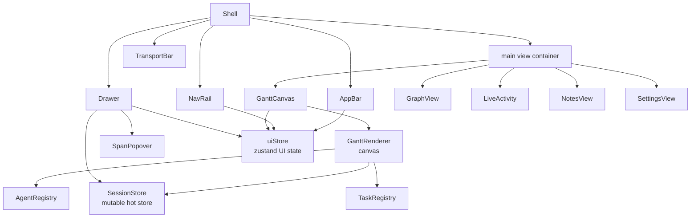
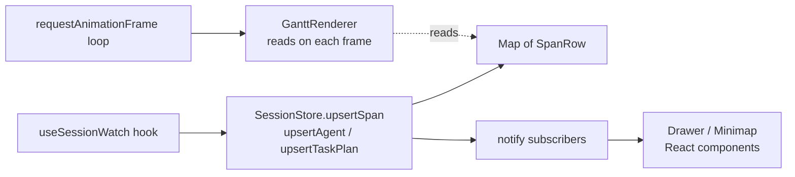
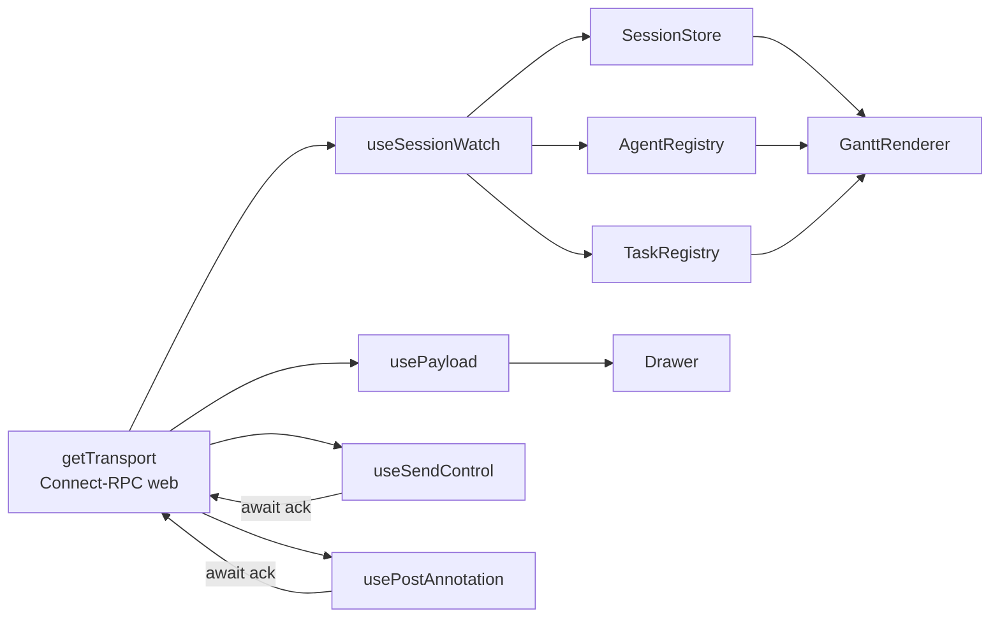

# Frontend internals

The frontend (`frontend/`) is a React 19 + TypeScript + Vite app. It's smaller
than the client library but it has some unusual architectural choices that
trip up contributors who expect a conventional React data flow. Read this
chapter before touching anything under `frontend/src/gantt/` or
`frontend/src/rpc/`.

## Anatomy

```
frontend/src/
├── main.tsx / App.tsx        # Vite entry; mounts <Shell />
├── index.css                 # Global styling; Material Design 3 tokens
├── theme/                    # Design tokens (colors, typography)
├── gantt/                    # Render pipeline. Hot path. NOT React state.
│   ├── index.ts              #   SessionStore, AgentRegistry, TaskRegistry, computePlanDiff
│   ├── renderer.ts           #   GanttRenderer — canvas draw loop
│   ├── GanttCanvas.tsx       #   React wrapper around the canvas element
│   ├── layout.ts             #   Task-to-pixel layout (y per agent, x from viewport)
│   ├── viewport.ts           #   Zoom/pan state; time ↔ canvas math
│   ├── spatialIndex.ts       #   Hit-testing index + dirty-rect tracking
│   ├── stages.ts             #   Topological stage layout for dependency visualization
│   ├── colors.ts             #   Span kind → color mapping
│   ├── driftKinds.ts         #   Drift kind → UI color/icon mapping
│   ├── types.ts              #   Shared type definitions
│   ├── mockData.ts           #   Deterministic fixtures for Storybook-style pages
│   ├── stress.ts / StressPage.tsx # Perf testbed
├── rpc/                      # Connect-RPC client layer
│   ├── transport.ts          #   getTransport() singleton
│   ├── hooks.ts              #   React hooks wrapping each RPC
│   ├── convert.ts            #   proto ↔ frontend types
├── state/
│   └── uiStore.ts            # Zustand store for UI state (selection, drawer, viewport)
├── lib/
│   └── shortcuts.ts          # Keyboard shortcuts
├── components/
│   ├── shell/                # Shell, AppBar, NavRail, Drawer
│   ├── Gantt/                # Minimap, in-chart overlays
│   ├── Interaction/          # SpanPopover, steering controls
│   ├── TransportBar/         # Transport state indicator
│   ├── LiveActivity/         # "What is the agent doing right now"
│   ├── OrchestrationTimeline/# Task-stage timeline (secondary view)
│   ├── SessionPicker/
│   └── TaskStages/
├── pb/                       # Generated protobuf-es stubs (checked in)
└── __tests__/                # vitest tests
```

The React tree with annotations of which plane each component reads from:



## The unusual bit: two data planes

React apps usually have one data plane: `setState` → re-render. The
harmonograf frontend has two, and that is intentional.

### Plane 1: the hot path (mutable, no React state)

The Gantt is rendered to a `<canvas>` element, not to a React tree. Span
data, agent rosters, and task plans live in **mutable** stores that the
renderer reads directly:

| Store | Type | File |
|---|---|---|
| `AgentRegistry` | Mutable keyed collection of `AgentRow`s | `frontend/src/gantt/index.ts:25` |
| `TaskRegistry` | Mutable keyed collection of `TaskPlanRow`s + revision history | `frontend/src/gantt/index.ts:183` |
| `SessionStore` | Mutable per-session container holding spans, agents, tasks, annotations | `frontend/src/gantt/index.ts:383` |

These are classes with `subscribe()` methods. React components that need to
react to changes (agent list in the drawer, task graph in the graph view)
subscribe and force a re-render via a small adapter hook. The canvas
renderer does **not** subscribe — it reads on every animation frame via
`requestAnimationFrame`, so updates are picked up naturally.

Why this design? A session with a thousand spans, streaming at 30+ deltas per
second, kills React's reconciler. Canvas rendering plus mutable stores lets
the hot path handle thousands of spans without jank. The tradeoff is that
you can't use React DevTools to inspect span state — you have to read the
store directly.

**Invariant:** never call `setState` from inside the render loop. Never push
span data through React state. Any PR that moves span data into a hook or
Zustand is incorrect.

### Plane 2: UI state (Zustand)

Everything *else* is in `frontend/src/state/uiStore.ts`. The store is a
Zustand slice with shape (see `uiStore.ts:102` for the `UiState` interface):

| Field | Purpose |
|---|---|
| `selectedSessionId` | Which session the user is viewing |
| `selectedAgentId` | Optional agent filter |
| `selectedSpanId` | Which span the drawer is inspecting |
| `viewMode` | `gantt` / `graph` / `activity` / `notes` / `settings` |
| `drawerOpen` | Drawer visibility |
| `viewport` | Time window bounds (ms) |
| `timezone` / `displaySettings` | User preferences |
| `transportState` | Connected / disconnected / reconnecting |

Zustand is good for this: selection changes are infrequent and benefit from
memoized subscribers. Zustand for UI state, mutable stores for hot data.

The exported hook is `useUiStore` at `uiStore.ts:179`.

## `SessionStore` — the hot store

`SessionStore` (`frontend/src/gantt/index.ts:383`) owns one session's worth
of data. It holds:

- A `Map<SpanId, SpanRow>` of all spans.
- An `AgentRegistry` of all agents in the session.
- A `TaskRegistry` of task plans + revision history.
- An `AnnotationList`.
- Minimum/maximum timestamps, for auto-fit viewport.

There is one `SessionStore` per session currently being watched. In practice
that's one at a time — switching sessions discards the old store.

SessionStore subscription model: mutators notify React subscribers, while the canvas reads on every animation frame without subscribing.



### Mutation entry points

Everything that changes the store funnels through mutator methods:

| Method | Called by |
|---|---|
| `upsertSpan(span)` | `useSessionWatch` hook on each span delta |
| `upsertAgent(agent)` | Ditto for agent deltas |
| `upsertTaskPlan(plan)` | Ditto for plan deltas (calls `TaskRegistry.upsert` under the hood) |
| `upsertAnnotation(ann)` | Ditto for annotation deltas |
| `replaceSnapshot(snapshot)` | On initial `GetSpanTree` response (bulk load) |

Every mutator notifies subscribers, so React components that subscribe
re-render. The canvas picks up changes on the next frame regardless.

### Hit testing

`spatialIndex.ts` maintains an interval-tree-backed index keyed by span
bounds. `GanttCanvas.tsx` uses it to answer "what's under the mouse" on
mousemove. The index is updated incrementally as the store mutates; the
renderer marks "dirty rects" when spans move or resize.

## `TaskRegistry` and `computePlanDiff`

`TaskRegistry` (`frontend/src/gantt/index.ts:183`) holds task plans and
their revision history. Each time an agent emits a new `TaskPlan` (i.e.
after a refine), `TaskRegistry.upsert(plan)` runs `computePlanDiff` against
the previous revision and stores the result as a `PlanRevision`
(`frontend/src/gantt/index.ts:124`).

`computePlanDiff` at `frontend/src/gantt/index.ts:130` returns a `PlanDiff`
(interface at line 115):

| Field | Meaning |
|---|---|
| `added` | `Task[]` — tasks in the new plan but not the old |
| `removed` | `{id, title}[]` — tasks in the old plan but not the new |
| `modified` | `{id, title, changes}[]` — tasks present in both, with per-field delta |
| `edgesChanged` | `boolean` — whether the task graph topology changed |

The UI consumes this diff to render the "plan was refined" banner and
highlight changed tasks in the graph view.

**Pitfall:** `computePlanDiff` is O(n) per refine. If you add a field to
`Task`, update the `modified` comparison — missing fields don't show up in
the diff UI, which is confusing.

## The render pipeline

`GanttRenderer` at `frontend/src/gantt/renderer.ts:99` is the main draw
loop. Each frame:

1. Read the current `viewport` from the `uiStore`.
2. Use `layout.ts` to compute per-agent row positions from
   `AgentRegistry`.
3. For each span in `SessionStore`, project its time range through
   `viewport` and check if it intersects the current canvas bounds.
4. Draw the span rectangle with color from `colors.ts` (by span kind) and
   status-dependent styling.
5. Draw overlays: task bindings (via `TaskRegistry`), drift markers (via
   `driftKinds.ts`), selection, hover.
6. Update `spatialIndex` for any moved spans.

`GanttCanvas.tsx` is the React wrapper: it owns the canvas ref, installs
resize observers, and forwards mouse events to hit-test and emit selection
changes into the uiStore.

`stages.ts` is a secondary layout for the graph view — it runs a
topological layering on the task DAG and positions tasks into horizontal
stages.

## RPC layer

### Transport

`frontend/src/rpc/transport.ts`:

- `apiBaseUrl()` at line 15: picks the backend URL from `VITE_API_BASE` env
  or falls back to the same origin.
- `getTransport()` at line 25: lazily constructs a singleton Connect-RPC
  transport via `@connectrpc/connect-web`.
- `setTransport()` at line 38: lets tests inject a custom transport.

The transport is gRPC-Web under the hood. It connects to
`FRONTEND_PORT=5174` on the server, not the Vite dev server port.

### Hooks

`frontend/src/rpc/hooks.ts` wraps each RPC in a React hook:

| Hook | Line | Purpose | RPC |
|---|---|---|---|
| `useSessions` | 87 | Poll `ListSessions` with a configurable interval | `ListSessions` (unary) |
| `useAgentLive` | 162 | Subscribe to an agent's heartbeat + activity deltas | Via `useSessionWatch` |
| `useSessionWatch` | 173 | Stream session deltas, push into `SessionStore` | `WatchSession` (server-stream) |
| `usePayload` | 452 | Lazy fetch a payload by digest | `GetPayload` (unary) |
| `useSendControl` | 531 | Send a control event; await ack | `SendControl` (unary) |
| `usePostAnnotation` | 570 | Post an annotation; await ack | `PostAnnotation` (unary) |

Helper functions in the same file:

- `taskStatusFromInt()` at line 40 — wire-int to string status.
- `tsToMsAbs()` at line 44 — protobuf Timestamp to absolute ms for the
  renderer.

Proto/frontend type conversion lives in `frontend/src/rpc/convert.ts`.

RPC hook → store → renderer fan-out for the watch flow:



### Snapshot + deltas pattern

When a session is first opened, the flow is:

1. `useSessionWatch` opens a `WatchSession` stream.
2. Server sends an initial snapshot (current session state) as the first
   `SessionUpdate`.
3. `useSessionWatch` calls `sessionStore.replaceSnapshot(snapshot)`.
4. Subsequent `SessionUpdate` messages are deltas; the hook calls
   `upsertSpan`, `upsertAgent`, etc.

If the user jumps the viewport to a time window that's outside the stored
data, the frontend can fall back to a unary `GetSpanTree` to fetch that
range. The current code uses `WatchSession`'s initial snapshot as the only
bulk load path — richer lazy paging is a known TODO.

## Component tree

### `Shell`

`frontend/src/components/shell/Shell.tsx` is the top-level layout:

```
<Shell>
  <AppBar />            ← title, session selector, view mode toggle
  <NavRail />           ← view mode icons (gantt / graph / activity / notes / settings)
  <main>
    {viewMode === 'gantt'  && <GanttCanvas />}
    {viewMode === 'graph'  && <GraphView />}
    {viewMode === 'activity' && <LiveActivity />}
    {viewMode === 'notes'  && <NotesView />}
    {viewMode === 'settings' && <SettingsView />}
  </main>
  <Drawer />            ← inspector for the selected span / task
  <TransportBar />      ← dev-only transport state indicator
</Shell>
```

### `AppBar`

`components/shell/AppBar.tsx`. Session picker, breadcrumbs, view mode
toggle, time window controls. Reads and writes `uiStore` for session and
view mode.

### `Drawer`

`components/shell/Drawer.tsx`. Inspector pane. Shows the selected span
(payload preview via `usePayload`), selected task (with reporting tool
history), or agent details. Tabs are composed — each tab is a separate
component under `components/Interaction/` or `components/TaskStages/`.

### `SpanPopover`

`components/Interaction/SpanPopover.tsx`. Hover/click popover on the
canvas. Renders span kind, status, timing, attributes. If the span has a
payload, shows a lazy loader hooked to `usePayload`.

### `TransportBar`

`components/TransportBar/TransportBar.tsx`. Small dev tool: shows whether
the Connect-RPC transport is connected, lets you manually reconnect. Hidden
in production builds.

### `Gantt/Minimap`

`components/Gantt/Minimap.tsx`. Overview strip under the main canvas; drag
to navigate the viewport. Reads directly from `SessionStore` so it stays
in sync with the main canvas without a separate subscription.

## Keyboard shortcuts

`frontend/src/lib/shortcuts.ts` defines the shortcut table. Shortcuts are
bound by `useKeyboardShortcuts()` in `Shell.tsx`. If you add a shortcut:
edit this table, update the docs in `docs/dev-guide/` (user-facing guide),
and add a test.

## Styling

Material Design 3 tokens via `@material/web` and custom CSS variables in
`index.css`. Most chrome uses Material components; the canvas is plain
painting. Don't introduce a new UI library without discussing it —
`@material/web` is the current standard.

## Gotchas

1. **Vite dev vs prod ports.** `pnpm dev` uses port 5173; the built app
   served behind the server uses whatever origin serves it. The gRPC-Web
   backend is *always* on `FRONTEND_PORT` on the harmonograf server
   (default 5174). Don't confuse the Vite port with the backend port.
2. **Proto-es vs grpc-js.** The generated stubs under `frontend/src/pb/`
   use `@bufbuild/protobuf` (protobuf-es), not `google-protobuf`. The RPC
   layer uses Connect-RPC. Do not add `google-protobuf` or `grpc-web` —
   you'll end up with two incompatible proto runtimes.
3. **SessionStore is not thread-safe.** JavaScript is single-threaded and
   so is this, but async delta handlers can race against user interactions.
   Always mutate from the main thread (inside the hook callback, inside a
   React event handler). Never call a mutator from inside a setTimeout
   that might outlive the component.
4. **Canvas coordinates are DPR-aware.** `GanttCanvas` sets `canvas.width =
   clientWidth * devicePixelRatio` and scales the drawing context. Layout
   helpers work in CSS pixels — don't multiply by DPR in layout code, only
   in `GanttCanvas` itself.
5. **`useEffect` cleanup matters.** `useSessionWatch` opens a long-running
   stream. The cleanup function **must** call `abortController.abort()` or
   you'll leak gRPC streams on unmount.

## Testing the frontend

See [`testing.md`](testing.md). Key test files under
`frontend/src/__tests__/`:

- Render tests use `@testing-library/react` + vitest.
- Hot-path tests for `SessionStore`, `computePlanDiff`, spatial index, and
  viewport math are pure-TS unit tests.
- E2E interop tests live in `tests/integration/` (Playwright + a real
  harmonograf server).

## Next

[`working-with-protos.md`](working-with-protos.md) covers the codegen
workflow that keeps the frontend's `pb/` directory in sync with the
client and server.
