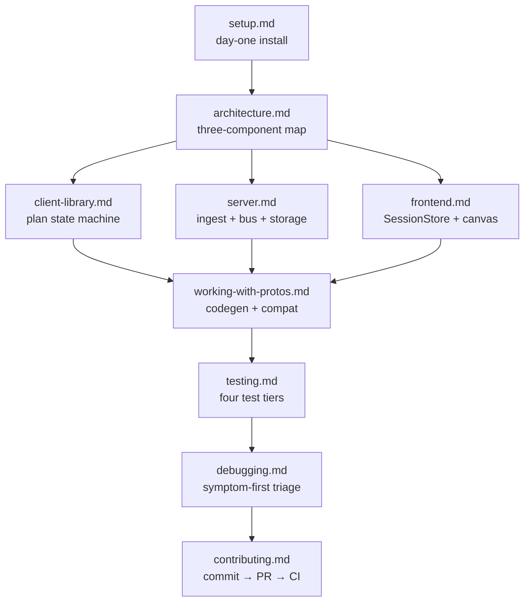

# Harmonograf developer guide

Target audience: engineers modifying harmonograf itself — the client library, the
server, the frontend, the protos, or any cross-cutting concern between them. If
you are trying to *use* harmonograf to observe your own agents, see
[`docs/operator-quickstart.md`](../operator-quickstart.md) instead.

## How to use this guide

The guide is organized into fifteen files. Read the first nine in the order below on
your first pass; the remaining six (`storage-backends`, `migration`, `deployment`,
`security-model`, `performance-tuning`, `debugging`) are topical reference you grab
when the situation demands.

| # | File | When to read |
|---|---|---|
| 1 | [`setup.md`](setup.md) | First day. Clone, install, run `make demo`, smoke-test. |
| 2 | [`architecture.md`](architecture.md) | Before touching anything that crosses a component boundary. |
| 3 | [`client-library.md`](client-library.md) | Anything under `client/`. Lazy Hello, per-agent callbacks, plugin dedup. |
| 4 | [`server.md`](server.md) | Anything under `server/`. Ingest pipeline, bus, storage, intervention aggregator, RPC surface. |
| 5 | [`frontend.md`](frontend.md) | Anything under `frontend/`. Stores, views, `InterventionsTimeline`, per-agent Gantt rows. |
| 6 | [`working-with-protos.md`](working-with-protos.md) | Any `.proto` change. Codegen + forward-compat rules. |
| 7 | [`storage-backends.md`](storage-backends.md) | SQLite schema, PostgreSQL adapter, session-relative times, agent metadata. |
| 8 | [`testing.md`](testing.md) | Before writing a test or debugging a flake. Covers pytest + vitest + e2e. |
| 9 | [`debugging.md`](debugging.md) | When something is broken. Logging, invariants, common failure modes. |
| 10 | [`performance-tuning.md`](performance-tuning.md) | Per-LLM-call metrics, heartbeat cadence, aggregator cost. |
| 11 | [`security-model.md`](security-model.md) | v0 posture (no auth, STEER body validation, local-only). |
| 12 | [`migration.md`](migration.md) | Upgrade paths across the overlay / lazy-Hello / per-agent-row eras. |
| 13 | [`deployment.md`](deployment.md) | Local + single-host deployment shape. |
| 14 | [`contributing.md`](contributing.md) | Before opening a PR. Commit style, CI expectations, AGENTS.md rules. |

The guide does not duplicate the wire-protocol reference or the ADR set — those
live under [`docs/protocol/`](../protocol/) and [`docs/design/`](../design/).
Cross-link wherever appropriate but do not rewrite.

The map below shows how the chapters depend on each other on a first read:

A dedicated wire-protocol reference lives in a sibling tree under
[`docs/protocol/`](../protocol/). This guide covers *internals, workflow, and
architecture* — for byte-level message shapes and the gRPC surface, cross-link
into `docs/protocol/` at the relevant anchor.

## Reading conventions

- `path/to/file.py:LINE` references jump straight to the definition in most
  editors (VS Code, JetBrains, Vim with `gF`, etc.). Line numbers are accurate
  as of the commit this guide was written against; grep if a reference drifts.
- *Ground truth is the code.* This guide is a map, not a spec. When the guide
  disagrees with the source, trust the source and file a PR to fix the guide.
- Pitfalls and invariants are called out inline with a **Pitfall:** or
  **Invariant:** prefix. These are the things that bit someone already —
  please preserve them when refactoring.
- Tables are used anywhere a flat list of ≥4 items needs structure. Don't
  replace them with prose when updating.

## What you get out of the guide

A new contributor should be able to:

1. Clone the repo, install all three components, and boot `make demo`
   end-to-end on day one (see `setup.md`).
2. Understand the three-component architecture well enough to predict where a
   change has to land (see `architecture.md`).
3. Trace a single span from an ADK `before_model_callback` through the client
   ring buffer, across the gRPC channel, into sqlite, out through a WatchSession
   stream, into the `SessionStore`, and onto the Gantt canvas (see the
   end-to-end walk-through at the end of `architecture.md`).
4. Add a proto field without breaking old clients (see
   `working-with-protos.md`).
5. Write a test at the right layer for the change they are making, and know
   which test harness runs where (see `testing.md`).
6. Debug a stuck agent, a dropped span, or a plan that won't advance (see
   `debugging.md`).

If any of these is not true after reading, that's a bug in the guide — please
open an issue or a PR.
