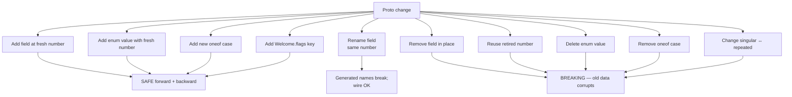

# Migration and forward compatibility

This document is for anyone changing a proto, a sqlite schema, or a
wire-format assumption in harmonograf. The rules are tight because
v0 has no clustering and no rolling upgrade — "the server restarts"
is the ceremony — but clients run in many processes with independent
upgrade schedules, and old sqlite files show up in support tickets
with versions the current code has never seen.

Read [`working-with-protos.md`](working-with-protos.md) first for the
codegen workflow. This document is the **semantic** companion: it is
the rules you must follow *after* `make proto` has spit out the new
stubs and you are about to commit.

## The three things that evolve

| What | Schema | Evolution surface |
|---|---|---|
| Wire protocol | `proto/harmonograf/v1/*.proto` | Field numbers, enum tags, oneof membership |
| Storage schema | `SqliteStore.SCHEMA` at `sqlite.py:45-168` | `CREATE TABLE` DDL + `ALTER TABLE` backfill |
| Session-state keys | goldfive `SessionContext` (`goldfive.adapters.adk`) | Typed context agents read/write on ADK `session.state` |

They evolve at different speeds and under different rules. Protos are
the hardest to change because the generated code lands in three
components and every client has its own upgrade schedule. Sqlite
schema is easier because there is only one reader (the server). State
keys are the easiest because they are in-process only.

A compatibility matrix for the kinds of proto changes you might make — green is safe, red is breaking:



## Proto evolution: the forward-compat rules

The proto wire format is designed to survive field additions without
coordination. That only works if you follow the rules **every time**.
The rules are not optional; the first time someone breaks them,
either the server stops accepting old clients or old clients start
silently dropping fields.

### Rule 1: Never reuse a field number

Every field in every proto message has a stable integer tag. The
protobuf wire format encodes fields by tag, not by name. Deleting a
field and reusing its number in a later release **is a breaking
change** — old clients will deserialize the new wire bytes as the
removed field, leading to silent corruption.

The discipline:

- When you delete a field, mark the number as `reserved` in the
  `.proto` so nobody can accidentally reclaim it. Example:
  ```proto
  message Foo {
    reserved 3, 5, 7 to 9;
    reserved "old_name", "unused_field";
  }
  ```
- If you rename a field, you are keeping the same number. Renames
  affect only the **generated** accessor names, not the wire shape.
  The wire is unaffected; readers parsing an old-name serialization
  see the new-name field.
- **Never** hand-renumber a field that has shipped. Even in a
  "nobody uses this" field, you cannot prove nobody has an old
  session on disk that references it.

### Rule 2: Field additions are always safe (when done correctly)

Adding a new field at a fresh tag number is safe. The rules:

- **Pick an unused tag.** Grep the proto file; tags 1-15 are cheap
  (single-byte varint tag) and reserved for hot fields; tags 16+
  cost two bytes. Do not care about byte counts unless you are in
  a 10k-fields-per-second hot path, which harmonograf is not.
- **New fields get a default-friendly type.** Scalar defaults (`0`,
  `""`, empty bytes, `false`) are what an old reader will see if
  the field is absent. `Timestamp` defaults to unset — check
  `HasField()` before reading.
- **Never make a new field `required`.** Proto3 does not have
  `required`, so this is automatic, but the logical version of the
  rule is: **do not treat an absence of the field as an error** in
  code that might read old wire data.

The canonical "add a field" walk-through is in
[`working-with-protos.md`](working-with-protos.md) §"Adding a field".
Read that for the full codegen-to-renderer chain. This document only
covers the **semantic** compatibility, not the codegen mechanics.

### Rule 3: Enum additions need an `UNSPECIFIED` zero

Every enum in `types.proto` defines a zero-valued `*_UNSPECIFIED`
member (e.g. `SPAN_STATUS_UNSPECIFIED`, `AGENT_STATUS_UNSPECIFIED`,
`CONTROL_KIND_UNSPECIFIED`). That is the default value for
unset-or-unknown enums. Adding a new member is safe; old clients
that do not know the new member will deserialize it as the raw
integer and, depending on language, either reject it or fall through.

The Python generated code treats unknown enum values as the raw int;
the TypeScript codegen depends on `@bufbuild/protoc-gen-es` behavior
(same pattern). The server's ingest code guards against unknown
values by treating `SPAN_STATUS_UNSPECIFIED` as "no update" — see
`ingest.py:450-451`:

```python
if msg.status != types_pb2.SPAN_STATUS_UNSPECIFIED:
    status = span_status_from_pb(msg.status)
```

When you add a new enum value, audit every such comparison. If the
code dispatches on every known enum value, a new value will fall
through the dispatch and silently do nothing. The fix is either a
default branch or an explicit "unknown" handler.

### Rule 4: Oneof changes are breaking

`TelemetryUp` (`telemetry.proto` — see
[`docs/protocol/telemetry-stream.md`](../protocol/telemetry-stream.md))
is a oneof. Each variant has a tag inside the oneof. **Removing or
renumbering a oneof variant is a breaking change**; adding one is
safe in the same way adding a field is safe, because unknown oneof
cases deserialize to "none of the above" in well-behaved readers.

The server dispatches on oneof name at `ingest.py:246-268`:

```python
kind = msg.WhichOneof("msg")
if kind == "span_start": ...
elif kind == "span_update": ...
...
else:
    logger.debug("ignoring unknown TelemetryUp kind: %s", kind)
```

The `else` branch is the forward-compat guarantee. A newer client
emitting a new oneof variant will not crash an older server; the
older server just logs and moves on. **Do not remove the else
branch** even though it looks unreachable today.

### Rule 5: `Welcome.flags` is how the server advertises capabilities

`Welcome.flags` at `telemetry.proto:169-171` is a
`map<string, string>` reserved for future capability negotiation:

```proto
// Server feature flags / capability advertisements. Reserved for future
// negotiation; v0 is always empty.
map<string, string> flags = 5;
```

When you ship a server feature that old clients need to know about
(say, "server now supports compressed payload chunks"), advertise it
in `Welcome.flags` under a well-known key. New clients can read the
flag on `Welcome` receipt and adapt; old clients ignore it. Because
maps are preserved round-trip in all generated codegens, adding a
new key is always safe.

**Conversely**, a newer client that wants to know the server's
capabilities can read `Welcome.flags` at connect time. The client's
Welcome-receipt code is at `transport.py:424-427` today; it extracts
`assigned_session_id` and `assigned_stream_id` but does not look at
`flags`. When the first real flag ships, that is where it lands.

Do not use `Welcome.flags` for non-capability state (e.g., session
counts, server version string). It is specifically for negotiated
feature flags that change behavior.

### Rule 6: Reserve field numbers on removal

If you truly must remove a field, the workflow is:

1. **Release N:** add `[deprecated = true]` to the field. Keep
   writing it in the client and reading it in the server. Deprecate
   in the dev-guide and announce in a release note.
2. **Release N+1:** stop writing it in new clients. The server still
   accepts it from old clients. Add a `TODO: remove after all
   clients >= N+1` comment.
3. **Release N+2** (or later — at least two releases after step 1):
   remove the field from the proto and add `reserved <number>, "<name>";`
   in its place. Old clients on N or earlier will now encounter
   wire bytes they cannot serialize, so you must also document this
   as a **minimum client version** bump in the release notes.

The rhythm is: **deprecate → wait → remove**, spread across two or
more releases. Any shorter cycle will break someone who has not
rebuilt their client.

## SQLite schema evolution

The sqlite store has a lightweight migration pattern built into
`SqliteStore.start()` at `sqlite.py:180-224`. It is not a formal
migration framework — there is no `schema_version` table or ordered
migration scripts. Instead, the `SCHEMA` constant at
`sqlite.py:45-168` is idempotent (all `CREATE TABLE IF NOT EXISTS`
and `CREATE INDEX IF NOT EXISTS`) and additive-column changes are
handled by a hand-rolled `PRAGMA table_info` check followed by
`ALTER TABLE ... ADD COLUMN`.

The canonical pattern is visible at `sqlite.py:193-223`:

```python
# Backfill payload_* columns on pre-existing DBs created before PayloadRef metadata was tracked.
async with self._db.execute("PRAGMA table_info(spans)") as cur:
    cols = {row[1] for row in await cur.fetchall()}
for name, ddl in (
    ("payload_mime", "ALTER TABLE spans ADD COLUMN payload_mime TEXT NOT NULL DEFAULT ''"),
    ("payload_size", "ALTER TABLE spans ADD COLUMN payload_size INTEGER NOT NULL DEFAULT 0"),
    ("payload_summary", "ALTER TABLE spans ADD COLUMN payload_summary TEXT NOT NULL DEFAULT ''"),
    ("payload_role", "ALTER TABLE spans ADD COLUMN payload_role TEXT NOT NULL DEFAULT ''"),
    ("payload_evicted", "ALTER TABLE spans ADD COLUMN payload_evicted INTEGER NOT NULL DEFAULT 0"),
):
    if name not in cols:
        await self._db.execute(ddl)
```

And for `task_plans` at `sqlite.py:205-223`:

```python
async with self._db.execute("PRAGMA table_info(task_plans)") as cur:
    tp_cols = {row[1] for row in await cur.fetchall()}
if "revision_reason" not in tp_cols:
    await self._db.execute(
        "ALTER TABLE task_plans ADD COLUMN revision_reason TEXT NOT NULL DEFAULT ''"
    )
# ...and so on for revision_kind, revision_severity, revision_index.
```

### The rules for additive schema changes

When you add a column:

1. **Update `SCHEMA` first.** Add the column to the `CREATE TABLE`
   statement so a fresh DB ships with the final shape.
2. **Add a backfill block in `start()`.** Use the `PRAGMA table_info`
   pattern above. The backfill must be idempotent — `start()` runs
   on every boot, not just on upgrade.
3. **The column needs a `NOT NULL DEFAULT ...` clause.** SQLite
   cannot `ALTER TABLE ADD COLUMN` with `NOT NULL` without a default,
   and you do not want to special-case nulls in the read path.
4. **Update the `storage/base.py` dataclass** so the Python row type
   has the field.
5. **Update `convert.py`** so the proto ↔ storage converter carries
   the field.
6. **Update `ingest.py`** if the field should be populated from a
   specific TelemetryUp message.
7. **Update the frontend** (`frontend/src/rpc/convert.ts` + renderer
   + any chrome component that uses it).

Miss any of those layers and the field silently drops — see the
invariant at [`architecture.md`](architecture.md) §"The data model":

> If you add a field, you add it to `types.proto` first, then regen,
> then update `storage/base.py` dataclass, then teach `convert.py` to
> carry it, then (if it needs to reach the UI) teach
> `frontend/src/rpc/convert.ts` and the renderer. Skipping any
> layer silently drops the field.

### Non-additive schema changes

The idempotent-`SCHEMA` pattern only handles additions. The harder
cases:

| Change | How to do it |
|---|---|
| Rename a column | Add the new column (additive), backfill from the old one in a migration step, stop writing the old column, keep reading both, then remove the old column in a future release after old DBs are drained. Never do it as a single `ALTER`. |
| Change a column type | Same as rename: add a new column of the new type, backfill, drain, remove. |
| Add a `NOT NULL` constraint to an existing nullable column | Write a backfill that fills nulls with a default, then recreate the table with the new constraint (SQLite does not support `ALTER COLUMN`). Plan a maintenance window. |
| Drop a column | SQLite 3.35+ supports `ALTER TABLE DROP COLUMN`. For older sqlite on an operator's machine, fall back to the table-rewrite dance: `CREATE TABLE new_x AS SELECT ... FROM x`, `DROP TABLE x`, `ALTER TABLE new_x RENAME TO x`, reindex. |
| Add a `CHECK` constraint | Same as "drop a column" — table rewrite. |
| Reorder columns | Don't. Column order is meaningless; the pain of rewriting is never worth it. |

For any change beyond additive columns, write a targeted migration
block at the top of `start()`, gated on a `PRAGMA table_info` check
or on `PRAGMA user_version`. Consider introducing `PRAGMA user_version`
as a real schema version counter if the migration list grows past a
handful of blocks — today it does not, which is why the code uses
the `table_info` pattern.

### What happens when an old DB meets a new server

The pattern is: `SCHEMA` runs, all `CREATE ... IF NOT EXISTS` are
no-ops on existing tables, then the backfill block adds any missing
columns. After that, the store behaves identically to a freshly
created one — the historical rows simply have the default value in
the new columns. The server does not know or care how old the DB is.

A **new DB meeting an old server** is the reverse: the old server's
`SCHEMA` creates a subset of tables, the new-server columns are
absent, and a subsequent downgrade-then-upgrade cycle works. What
does **not** work is running the old server against a DB that a
new server already wrote: if the new server added a `NOT NULL`
column, the old server's `INSERT` statements will fail because they
omit the column. Do not downgrade the server across a column
addition without restoring an older backup of the DB.

## Client / server version skew

Harmonograf expects `server_version >= client_version - N` for some
small N (today: `N = 1`, because we do not yet have a formal skew
policy and ship both components from the same commit). What the
server actually guarantees:

- **`TelemetryUp` oneof dispatch is forward-compatible** (see Rule
  4 above). A newer client emitting a variant the server does not
  recognize is logged and ignored, not a connection-terminator.
- **Additive proto fields are forward-compatible** (Rule 2). A
  newer client emitting a new field on a known message: the server
  parses what it knows and drops the rest.
- **Enum values are forward-compatible** (Rule 3) **as long as the
  server treats unknown enums as `*_UNSPECIFIED`** — audit on
  every new enum value.
- **`Welcome.flags` is the forward channel for server → client
  capability advertising** (Rule 5).

What the server does **not** guarantee today:

- A minimum supported client version. There is no `MinClientVersion`
  field anywhere. A five-version-old client will connect and
  attempt to send whatever it knows; if the server has removed a
  message it used to expect, the old client will fail at the point
  where it sends it. Avoid removing anything the deprecated cycle
  (Rule 6) has not already cleared.
- Graceful refusal of too-old clients. A newer server that cannot
  handle an old wire message will log at WARN and drop the stream;
  it does not send a structured `ServerGoodbye(reason="unsupported version")`.
  Add that if it becomes a real operational problem.

The minimum-version story will get more formal when the first real
incompatibility lands. Today, the bar is "ship client and server
together".

## Session replay and wire-format compatibility

A session replay is reading old sqlite data through a new server
and frontend. Today the storage layer uses the same proto→storage
converters (`server/harmonograf_server/convert.py`) for live ingest
and historical reads — there is not a separate "replay" path. That
means **the schema evolution rules above are the replay
compatibility rules**:

- Additive column additions work for replay automatically: old rows
  have default values for new columns, and the renderer treats them
  as it would any fresh row.
- A removed field is a replay hazard. An old session that referenced
  the field will read back with the field absent. If the renderer
  dispatches on the field's presence, it will skip that session's
  rendering for no obvious reason. Test every removal against at
  least one archived session.
- A renamed column is worse — the old rows do not know the new name.
  Always keep a backfill step that populates the new column from the
  old one for at least one release.

**If you are changing the wire format across a compatibility break**
(e.g., removing an enum value that historical sessions use), you
owe:

1. A documented "migration release" where the server backfills old
   sessions at startup and rewrites them to the new shape.
2. Or, an explicit note in the release notes that archived sessions
   before vX cannot be replayed and must be discarded.

Neither path is optional. Replay is a first-class feature — users
scrub through yesterday's run to debug a regression — and silently
corrupting old sessions is worse than dropping them loudly.

## Session-state key evolution

After the goldfive migration, session-state coordination lives in
goldfive's `SessionContext` dataclass (`goldfive.adapters.adk`) —
harmonograf no longer owns the `harmonograf.*` key schema. Evolution
of that schema is a goldfive concern. See goldfive's docs for the
current reader/writer contract.

## Era migrations

Harmonograf has gone through a handful of cross-cutting reshapes. If
you're upgrading an old client or database, here's the map:

### The goldfive migration (issue #2, mid-2025)

Plans, tasks, drift kinds, control events, steering, and the
reinvocation loop moved out of harmonograf into `goldfive`. Harmonograf
became observability-only. Concrete markers:

- `TelemetryUp.task_plan` (field 9) and `updated_task_status`
  (field 10) reserved — all plan + task state rides inside
  `goldfive_event = 11` now.
- `types.proto` stopped declaring `Task`, `TaskEdge`, `TaskPlan`,
  `DriftKind`, `ControlEvent`, `ControlAck`. Those types are imported
  from `goldfive/v1/`.
- `HarmonografAgent`, `HarmonografRunner`, `attach_adk`,
  `make_adk_plugin` deleted from the client. Replaced by
  `HarmonografSink` (for goldfive `EventSink`) and
  `HarmonografTelemetryPlugin` (for ADK `BasePlugin`).

Old sqlite files pre-migration still carry the `task_plans` table —
schema is forward-compatible, goldfive_event ingest fills the same
columns.

### The overlay era (goldfive#141-144, early 2026)

Goldfive replaced per-task driving with observation-driven overlay +
soft follow-up + intervention ladder. User-visible effect on
harmonograf:

- Tasks can transition `PENDING → NOT_NEEDED` at invocation end, not
  just terminal states. A PENDING task stuck indefinitely while the
  agent is running is still a bug; see
  [`runbooks/task-stuck-in-pending.md`](../runbooks/task-stuck-in-pending.md).
- Plan revisions (`PlanRevised`) can fire without a backing drift when
  the overlay folds in follow-ups autonomously. The intervention
  aggregator surfaces these as `source="goldfive"` with kinds like
  `cascade_cancel`, `refine_retry`, `human_intervention_required`.

### Lazy Hello (harmonograf#84 / #85, 2026-04)

`Client` construction no longer opens a `StreamTelemetry`. The
transport defers `Hello` until the first envelope arrives on the ring
buffer. Migration impact:

- Library consumers that relied on `Client.session_id` being
  populated immediately after construction must now emit at least
  one span before reading it.
- Old sessions created by mere library imports are gone — if your
  session picker is suddenly missing a row, check whether the agent
  actually emitted anything.

### Per-agent Gantt rows (harmonograf#80, 2026-04)

`HarmonografTelemetryPlugin` now stamps a per-ADK-agent id on every
span via `before_agent_callback` / `after_agent_callback`. Historical
sessions recorded pre-#80 show every agent collapsed onto the client
root row — that's fine, they predate the fix. Fresh sessions on a
newer client render one row per ADK agent.

No database migration is required: per-agent rows are auto-registered
on ingest via the existing `agents` table; old sessions retain their
single row.

## Checklist for a proto change

Before you open the PR:

- [ ] `.proto` changed, `make proto` run, regenerated stubs
      committed in the same commit.
- [ ] Field number is fresh (never reused). `reserved` added where
      needed.
- [ ] New enum values have explicit handling in every comparison
      site — grep for `SPAN_STATUS_UNSPECIFIED`-style guards.
- [ ] `storage/base.py` dataclass updated if the field should
      persist.
- [ ] `sqlite.py` `SCHEMA` and the backfill block in `start()`
      updated if the field is persisted.
- [ ] `convert.py` proto ↔ storage converter carries the field.
- [ ] `ingest.py` populates / reads the field at the right hop.
- [ ] `frontend/src/rpc/convert.ts` carries the field if the UI
      needs it.
- [ ] Tests in `client/tests`, `server/tests`, and `frontend/tests`
      cover both "old wire bytes parse cleanly" and "new wire bytes
      round-trip".
- [ ] Release notes explain the forward-compat posture and any
      minimum-version bumps.

## Related reading

- [`working-with-protos.md`](working-with-protos.md) — the codegen
  workflow and the mechanical "add a field" walk-through.
- [`architecture.md`](architecture.md) §"The data model" — the
  invariant about touching every layer.
- [`docs/protocol/data-model.md`](../protocol/data-model.md) — byte
  shapes of every shared type.
- [`docs/protocol/wire-ordering.md`](../protocol/wire-ordering.md)
  — ordering guarantees across reconnect, which matter when you
  change a field that the resume-token logic depends on.
- [`deployment.md`](deployment.md) §"Upgrades" — the operational
  upgrade sequence (stop, pull, sync, proto, restart).
- [`security-model.md`](security-model.md) §"What a hardened
  deployment would need" — many hardening features will land as
  additive proto fields, so the rules in this chapter apply.
