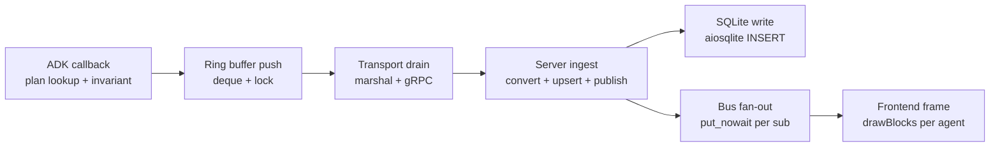
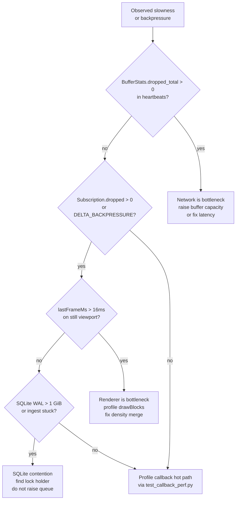

# Performance tuning

This chapter is for contributors who need to make harmonograf faster —
or, more often, stop it from getting slower. It assumes you have already
read [`architecture.md`](architecture.md), [`client-library.md`](client-library.md),
[`server.md`](server.md), and [`frontend.md`](frontend.md). Ground truth is
the code; every knob referenced here has a `file:LINE` citation so you
can read the actual defaults instead of trusting this document.

Harmonograf is a soft-realtime system: an agent running under ADK emits
events at ~30/s during a busy model turn, a single server fans them out
to a handful of browsers, and the Gantt redraws at 60 FPS. The end-to-end
budget from a span closing in the agent process to the corresponding
rectangle appearing on the canvas is "imperceptible" — roughly 100ms in
a healthy deployment. Every knob below exists because someone broke
that budget and had to claw it back.

## Where the time actually goes

Before you tune anything, build a mental model of the hot paths. They
are:

| Hot path | Location | Dominant cost |
|---|---|---|
| ADK callback fires → span enqueued | `client/harmonograf_client/telemetry_plugin.py` (ADK lifecycle callbacks) | `emit_span_*` marshal + ring push |
| Ring buffer push | `client/harmonograf_client/buffer.py:111` | One deque append under `threading.Lock` |
| Transport drain | `client/harmonograf_client/transport.py:478` (`_send_loop`) | `pop_batch` + proto marshal + gRPC queue put |
| Server ingest | `server/harmonograf_server/ingest.py:241` (`handle_message`) | `pb_span_to_storage` + `store.upsert_span` + `bus.publish_*` |
| SQLite write | `server/harmonograf_server/storage/sqlite.py:492` (`append_span`) | aiosqlite `INSERT` under a process-wide `asyncio.Lock` |
| Bus fan-out | `server/harmonograf_server/bus.py:98` (`publish`) | One `put_nowait` per subscriber |
| Frontend frame | `frontend/src/gantt/renderer.ts:508` (`frame`) | `drawBlocks` — per-agent `queryAgent` + `fillRect` loop |

The hot-path map, end to end, with the dominant cost at each hop:



If you do not know which of these is hot for the workload you are
tuning, you are tuning the wrong thing. Measure first. See "Profiling
the callback hot path" and "Frontend frame budget" below for how.

---

## Client-side tuning

### Heartbeat cadence vs stuckness detection

The client ships a `Heartbeat` message every `HEARTBEAT_INTERVAL_S`
seconds (default `5.0`, `client/harmonograf_client/transport.py:50`).
The server's stuckness detector compares three consecutive heartbeats
with the same `progress_counter` and, if they match, flips the agent
to `stuck` — see `STUCK_THRESHOLD_BEATS = 3` at
`server/harmonograf_server/ingest.py:64` and the timeout window
`HEARTBEAT_TIMEOUT_S = 15.0` at `ingest.py:62`.

These knobs are coupled and both live in code, not config, for v0:

| Knob | Default | Effect |
|---|---|---|
| `HEARTBEAT_INTERVAL_S` (client) | `5.0` s | How often the send loop builds a `Heartbeat` |
| `HEARTBEAT_TIMEOUT_S` (server) | `15.0` s | How long before the ingest pipeline declares a stream `DISCONNECTED` |
| `STUCK_THRESHOLD_BEATS` (server) | `3` | Consecutive unchanged `progress_counter` heartbeats before `is_stuck` flips |
| `HEARTBEAT_CHECK_INTERVAL_S` (server) | `5.0` s | How often the `heartbeat_sweeper` scans for expired streams (`ingest.py:63`) |

The invariants are:

- `HEARTBEAT_TIMEOUT_S >= 3 × HEARTBEAT_INTERVAL_S`. A single lost
  heartbeat due to GC pause or a brief TCP stall must not disconnect
  the agent. The 3× factor is what lets you lose two consecutive
  heartbeats and still survive.
- `STUCK_THRESHOLD_BEATS × HEARTBEAT_INTERVAL_S ≈ HEARTBEAT_TIMEOUT_S`.
  The stuck-detector watches for three unchanged heartbeats; that is
  ~15 s at the default cadence. If you halve the cadence, also halve
  the threshold or the UI will lag the real stuck signal by 30 s.

**When to retune.** Lower the interval (to, say, 2 s) if you are
debugging liveness bugs and want faster feedback in the UI. Raise it
(to 10 s) if you have hundreds of agents on one server and the
heartbeat volume itself is dominating ingest. Do not lower it below
1 s — the `_send_loop` wakes on either the event or the heartbeat
tick, and 1 s is a lower bound on how fast the thread can churn
without starving the rest of the loop.

### Ring buffer sizing

`EventRingBuffer(capacity=2000)` at `buffer.py:91`. Two thousand
envelopes is "about one minute of headroom at the design target of
30 events/second" — see the module docstring at `buffer.py:1-34`. The
sizing assumption is:

```
capacity ≈ (burst events per second) × (max network stall we should survive)
```

At 30 eps and a 60 s tolerance, 1800 envelopes is the floor; 2000 is
the round number above it.

The drop policy is **tiered**, not FIFO (`buffer.py:134`):

1. Tier 1: drop the oldest `SPAN_UPDATE`. Updates are coalescable —
   the end event still carries final state.
2. Tier 2: mark a span's `has_payload_ref` as stripped so the payload
   bytes drop but the span envelope survives.
3. Tier 3: drop the oldest whole span envelope.

**Critical spans never drop in tier 1 or tier 2.** This matters when
you are debugging buffer overflow: if `BufferStats.dropped_spans > 0`
after a burst, the network was so backed up that even after sacrificing
updates and payloads the tail of the buffer was still full of
span-starts and span-ends. The fix is capacity, not knob-twiddling.

**How to retune.** Raise capacity if you see `dropped_spans > 0` in
Heartbeats and you can afford the RAM (each envelope is a few hundred
bytes — 10 k envelopes ≈ a few MB). Lower it if you have a deeply
memory-constrained embedded agent and you are comfortable losing
update events during a network partition.

### Payload buffer sizing and chunk size

`PayloadBuffer(capacity_bytes=16 * 1024 * 1024)` at `buffer.py:181`.
16 MiB holds one full model context window's worth of text plus
headroom. Eviction is oldest-first by insertion order — there is no
tiering here because payloads are opportunistic anyway.

The chunk size is `payload_chunk_bytes = 256 * 1024` at
`transport.py:70`. 256 KiB is the default and it is interleaved with
span messages at `PAYLOAD_CHUNK_INTERLEAVE = 10` — one chunk per ten
span messages (`transport.py:54`). The trade-off:

| Chunk size | Upstream behavior |
|---|---|
| Smaller (64 KiB) | More gRPC message overhead per byte; span freshness wins because chunks interleave more aggressively |
| Default (256 KiB) | Span freshness and upload throughput both reasonable; the number everyone forgets to change |
| Larger (1 MiB) | Higher raw throughput; spans stall behind chunk uploads if the interleave ratio is not raised to match |

If you raise the chunk size, raise the interleave ratio too. One chunk
per ten spans at 256 KiB means a 2.5 MiB burst of payload bytes per
300 spans. At 1 MiB, the same ratio would mean a 10 MiB burst — enough
to stall the gRPC send queue for seconds.

The server enforces a hard ceiling of `PAYLOAD_MAX_BYTES = 64 * 1024 * 1024`
per digest (`ingest.py:65`). That is the cliff; do not touch it without
also auditing `_PayloadAssembler.add()` (`ingest.py:99`) for memory
safety.

### Orchestration performance: tune it in goldfive

After the goldfive migration, plan-walker cost, invariant-checker cost,
protocol-metric counters, and orchestration-mode trade-offs all live in
[goldfive](https://github.com/pedapudi/goldfive), not harmonograf. If
you are chasing a regression in how long a task takes to dispatch, how
often the planner refines, or how expensive the steerer's state machine
is under load, profile inside goldfive. Harmonograf's client sees each
goldfive `Event` exactly once and drops it on the ring buffer — that
cost is a handful of microseconds and is dominated by the proto
serialisation, not by anything harmonograf does.

### Profiling the span callback hot path

`HarmonografTelemetryPlugin` (`client/harmonograf_client/telemetry_plugin.py`)
is the only harmonograf code that runs on the ADK callback hot path.
Each callback wraps a proto build + one ring-buffer push. Target budget
is ~1 ms p95 per callback; regressions past that are usually a
consequence of payload growth or a misbehaving `attach_payload` caller.
Measure with `time.perf_counter_ns()` around the callback body; nothing
harmonograf-side should show up above a millisecond.

### Backpressure handling

The `FlowControl` message (`proto/harmonograf/v1/telemetry.proto:185`)
is **reserved and ignored in v0**. The comment is explicit: "v0 ingest
does not actually emit these — reserved for future use when the server
starts shedding load itself." The client reads `flow_control` and drops
it on the floor (`transport.py:431`):

```python
elif which == "flow_control":
    pass  # v0: ignore
```

Until FlowControl ships, backpressure is handled entirely by the client
ring buffer: tier-1 drops coalescable updates, tier-2 strips payload
refs, tier-3 drops span envelopes. The agent watches its own
`BufferStats` via the heartbeat. The server watches its own subscriber
queues via `Subscription.dropped` (`bus.py:54`) and fires a
`DELTA_BACKPRESSURE` event at the slow consumer (`bus.py:109`).

A decision tree for diagnosing backpressure:



**What to do today** when you see backpressure:

1. **Client-side drops** (`BufferStats.dropped_total > 0` in heartbeats):
   the network is the bottleneck. Raise buffer capacity if the run is
   short; investigate latency to the server if the run is long.
2. **Server-side fan-out drops** (`Subscription.dropped > 0` or a
   `DELTA_BACKPRESSURE` in the subscriber's stream): the **frontend**
   is the bottleneck, not the server. Check `renderer.ts` frame times
   (`metrics.lastFrameMs`) — a slow renderer backs up the WatchSession
   queue, which shows up as backpressure deltas, which the user sees
   as a banner. Do not raise the queue size unless you have confirmed
   the renderer is healthy.

---

## Server-side tuning

### SQLite PRAGMA choices

`SqliteStore.start()` (`server/harmonograf_server/storage/sqlite.py:180`)
sets these PRAGMAs before the schema is applied, in this exact order:

```python
await self._db.execute("PRAGMA journal_mode = WAL")        # sqlite.py:188
await self._db.execute("PRAGMA busy_timeout = 5000")       # sqlite.py:189
await self._db.execute("PRAGMA foreign_keys = ON")         # sqlite.py:190
await self._db.execute("PRAGMA synchronous = NORMAL")      # sqlite.py:191
```

The comment at line 185-187 explains why WAL and busy_timeout are set
before the schema: "so concurrent processes (e.g. a stale server left
running) don't immediately deadlock on startup writes".

| PRAGMA | Value | Why |
|---|---|---|
| `journal_mode` | `WAL` | Writers don't block readers; a busy dashboard can tail the DB while the ingest thread writes. |
| `busy_timeout` | `5000` ms | Survives a 5-second lock contention window without throwing `SQLITE_BUSY`. |
| `foreign_keys` | `ON` | The `tasks.plan_id → task_plans.id` FK with `ON DELETE CASCADE` only works if FKs are enabled at runtime. |
| `synchronous` | `NORMAL` | Trade: survive OS crash, not power loss. A `NORMAL` fsync happens at each WAL checkpoint instead of each commit; order-of-magnitude speedup for burst writes, acceptable durability for an observability tool. |

**When to retune:**

- If you are storing sessions you cannot afford to lose on a crash,
  switch `synchronous` to `FULL`. Expect ingest throughput to drop
  by a factor of 3-5.
- If a second writer is stealing locks (which should not happen —
  there is supposed to be exactly one server per deployment), raise
  `busy_timeout` to 15000. Better: find the rogue writer.
- Do not disable `foreign_keys`. The retention sweeper and task plan
  updates depend on cascade.

### VACUUM and schema growth

There is no background `VACUUM` in v0. The retention sweeper
(`server/harmonograf_server/retention.py:56`) deletes expired sessions
via `store.delete_session()`, which cascades rows via the FK — but it
does **not** reclaim disk space. WAL mode means the pages end up as
free space inside the DB file, ready to be reused on the next insert,
which is usually fine. It is only a problem if you delete a lot and
then stop writing.

**Manual vacuum:** stop the server, then run:

```bash
sqlite3 ~/.harmonograf/data/harmonograf.db "VACUUM;"
```

`VACUUM` rewrites the database file, which requires 2× the current
size as free disk. Do not run it against the live DB — SQLite will
block all writers for the duration, which is long enough that the
client heartbeat timeout (`15 s`) will fire and every agent will be
marked DISCONNECTED.

If you are running a multi-day deployment and expect sustained delete
churn, add a nightly cron that stops the server, runs `VACUUM`, and
restarts. Do not try to be clever with `PRAGMA auto_vacuum` — it has
to be set at DB creation time and the overhead on writes outweighs
the savings for our access pattern.

### Payload storage layout

Payloads are content-addressed and live on disk under
`data/payloads/{digest[:2]}/{digest}` (see the module docstring at
`sqlite.py:1-6`). The two-char shard prefix keeps any one directory
under a few thousand files at realistic payload counts. The SQLite
`payloads` table (`sqlite.py:161`) only stores metadata; the bytes
themselves are `path.write_bytes(data)` via the thread pool
(`sqlite.py:797`).

**Implications for tuning:**

- Deleting a payload row does not delete the file. `gc_payloads()`
  (`sqlite.py:848`) scans for orphans and unlinks them. Run it
  manually after a heavy delete, or schedule it alongside VACUUM.
- The per-payload `read_bytes`/`write_bytes` calls run through
  `loop.run_in_executor(None, ...)` so they don't block the event
  loop. If you start seeing payload writes back up, check the default
  thread pool size (Python's default is `min(32, os.cpu_count() + 4)`
  as of 3.8); bump it via `loop.set_default_executor` if needed.

### Retention sweeper cost

`retention_loop()` runs at `cfg.retention_interval_seconds` (default
`300.0`, `config.py:23`). Each pass calls `store.list_sessions()` and
then `store.delete_session()` per expired victim (`retention.py:42-49`).
`list_sessions()` is a full scan, so if you have thousands of
long-retained terminal sessions, the sweeper will get progressively
slower.

**Retune:** raise `retention_interval_seconds` if sessions live longer
than hours; lower it only if you have tight disk pressure and need
aggressive reclamation. Retention is zero-cost when
`retention_hours == 0` — the loop exits immediately.

### Bus fan-out cost

`SessionBus.publish()` (`bus.py:98`) snapshots the subscriber list and
calls `put_nowait` on each subscriber's `asyncio.Queue`. The queue
maxsize is `1024` (`bus.py:74`). Work is O(subscribers × queues) per
event, but the per-subscriber cost is a single `put_nowait`, so the
constant factor is tiny.

The interesting failure mode is not throughput — it's a **slow
subscriber** causing queue saturation. The publish path handles that
by incrementing `sub.dropped` and pushing a `DELTA_BACKPRESSURE` event
onto the same queue. That's a signal to the consumer, not a fix —
the *consumer* has to drain faster.

**If you raise `queue_maxsize`:** you are papering over a consumer
that is too slow, not making the system faster. Find the slow
consumer first.

---

## Frontend tuning

### Canvas frame budget

`GanttRenderer` targets 60 FPS → 16 ms per frame. The budget is
soft — frames sometimes take longer and nobody dies. The renderer
records every frame's wall time at `renderer.ts:465-473`:

```typescript
const start = performance.now();
this.frame();
const dur = performance.now() - start;
this.metrics.lastFrameMs = dur;
```

The rolling sample buffer is 600 frames (`renderer.ts:142`), roughly
ten seconds at 60 FPS, which is enough to catch a stutter without
drowning real data in history.

The frame is split into three layers (`renderer.ts:104-132`):

| Layer | Redraws when | Cost |
|---|---|---|
| `bg` (background) | Viewport, agents, theme, hidden set changes | Axis, row backgrounds — cheap |
| `blocks` | Any span delta, task delta, context-window delta, viewport change | Per-agent span loop — this is where 90% of frame time lives |
| `overlay` | Selection, hover, `now` cursor advance, viewport change | Thin line draws — cheap |

Only dirty layers redraw (`renderer.ts:530`). A still viewport with a
few new span-ends redraws `blocks` only; a pan or zoom redraws all
three.

**Retuning levers:**

- **Do not widen the sample buffer past 600.** It is a ring backed
  by a `Float32Array` and 600 is enough to show a ten-second stutter.
- **If `blocksDirty` fires every frame on a quiet session**, something
  upstream is publishing ghost deltas. Check the bus consumer for
  duplicate emits before touching the renderer.

### Span culling and density merge

`drawBlocks` (`renderer.ts:681`) calls `spanIndex.queryAgent(agent.id, vs, ve, scratch)`
at line 743 per visible agent. The spatial index (`spatialIndex.ts`)
uses a 64 ms bucket grid — see the comment at
`spatialIndex.ts:12-13`: "Grid size is chosen per-agent at 64ms —
small enough to cull tightly at 30-second zoom, large enough that
6-hour sessions only spend ~340k buckets."

After culling, the renderer runs a density merge per lane
(`renderer.ts:744-818`) that coalesces sub-pixel spans into a single
merged rect with a count. This is what makes a 100 k-span session
pannable at 60 FPS; without it, zoomed-out views would issue 100 k
`fillRect` calls per frame.

**When to retune:** never lower the bucket size below 32 ms — the
grid overhead exceeds the culling savings. Raise it to 128 ms only if
sessions are > 24 h and bucket memory is a real problem. The density
merge threshold is hard-coded at sub-pixel width; do not raise it
without a visual test because you will lose real spans.

### Minimap cost

The minimap is a second `GanttRenderer` style pass over a heavily
zoomed-out viewport. Because the main renderer already density-merges,
the minimap's per-frame cost is a small multiple of the main frame —
typically well inside budget. It redraws on the same dirty flag as
the main blocks layer, so a long pause in the session means zero
minimap cost.

**If the minimap is expensive**, you have too many spans in the
session and the main canvas is probably also expensive. Fix the main
canvas first.

### Context-window band

The context-window overlay (`renderer.ts:698-701`, drawn first inside
`drawBlocks`) is a per-agent line plot of `contextSeries`. Each agent
contributes one sample per non-zero heartbeat — the zero-sample skip
at `ingest.py:588-609` keeps the series signal-only. The band is
redrawn when `contextSeries` fires (`renderer.ts:207-211`), which is
once per heartbeat per agent.

**This is cheap unless you have many agents** (> 50) each emitting
samples. If you do, consider sampling the series client-side before
the renderer reads it — but do that inside the store, not inside the
renderer.

---

## End-to-end retuning recipe

You are running a real workload and something is slow. Follow this
order — do not skip steps.

1. **Check client heartbeats.** If `BufferStats.dropped_total > 0`,
   the client is the bottleneck. Go to "Client-side tuning".
2. **Check server ingest rate.** `make stats` (Makefile:218) fires
   the `GetStats` RPC and prints span counts + disk usage. If the
   span count is climbing slower than the client's emission rate,
   the server is losing events — check the bus and sqlite.
3. **Check frontend frame times.** Open the console in the browser
   and read `window.__hgraf_renderer.metrics.lastFrameMs` (or
   equivalent, depending on what `GanttCanvas.tsx` exposes). If it
   exceeds ~16 ms regularly on a still viewport, the renderer is
   the bottleneck.
4. **Check SQLite file size + WAL size.** If the WAL file has grown
   past 1 GiB without a checkpoint, writes are backing up. Usually
   this means the ingest loop is stuck on a lock — find the holder
   before tuning.
5. **Profile the callback hot path** using the pattern in
   `test_callback_perf.py`. Regressions show up first here because
   the test drives the state machine directly, without gRPC or
   ADK noise.

---

## Cross-links

- [`architecture.md`](architecture.md) — the end-to-end walk-through
  shows which component a span touches at each hop.
- [`client-library.md`](client-library.md) — orchestration modes in
  depth, walker internals, reporting-tool interception.
- [`server.md`](server.md) — ingest pipeline, bus, retention, stats
  RPC, auth interceptor.
- [`frontend.md`](frontend.md) — renderer, SessionStore, spatial
  index, zustand UI store.
- [`debugging.md`](debugging.md) — when performance symptoms actually
  turn out to be bugs.
- [`docs/protocol/telemetry-stream.md`](../protocol/telemetry-stream.md)
  — byte-level shape of `Heartbeat`, `FlowControl`, and everything
  else the tuning knobs affect.
- [`docs/protocol/payload-flow.md`](../protocol/payload-flow.md) —
  chunk interleave ordering and server reassembly rules.
