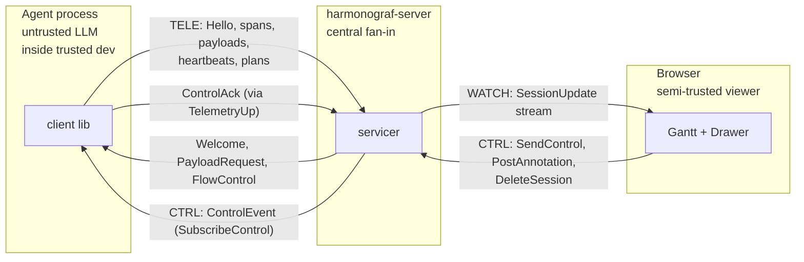
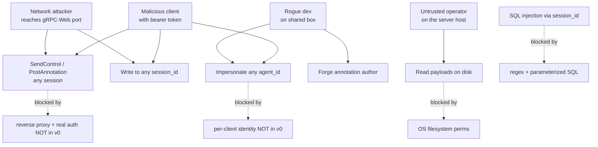

# Security model

This document is the honest account of what harmonograf v0 protects
against, what it trusts, and what a hardened deployment would need to
change. If you are operating harmonograf on anything beyond a single
developer's laptop, read the whole chapter — the defaults are safe for
loopback-only use and not much more.

The short version: harmonograf v0 has **no authentication**, no TLS,
no multi-tenant isolation, and no cryptographic signing of any message
on the wire. The only built-in control is an optional shared-secret
bearer token that is explicitly described in code as "not a real auth
system" (`server/harmonograf_server/auth.py:7-10`). Everything else is
an operational control — run it on loopback, put a proxy in front, don't
share the machine.

Read this alongside [`deployment.md`](deployment.md) (which covers
the operational controls) and [`migration.md`](migration.md) (which
covers forward-compatibility, because a wire format that can evolve
is a prerequisite for ever adding real auth).

## Trust boundaries

Three processes, three directions of trust.

```
┌─────────────────┐        ┌──────────────────┐        ┌──────────────────┐
│ agent process   │  TELE  │ harmonograf      │  WEB   │ browser frontend │
│ (client lib)    │──────▶│ server           │──────▶│ (Gantt, drawer)  │
│                 │◀──────│                  │◀──────│                  │
│                 │  CTRL  │                  │  CTRL  │                  │
└─────────────────┘        └──────────────────┘        └──────────────────┘
     untrusted LLM              central fan-in            semi-trusted
     inside a trusted           (trusts everything        viewer
     developer's process        it is told)
```

A structured view of the same boundaries, with what crosses each:



| Boundary | Direction | What crosses | Trust level today |
|---|---|---|---|
| Agent → server | Up | `TelemetryUp`: Hello, spans, payloads, heartbeats, task plans, task status updates, control acks, goodbye | Server trusts the client unconditionally |
| Server → agent | Down | `TelemetryDown`: Welcome, PayloadRequest, FlowControl, ServerGoodbye + `ControlEvent`s on SubscribeControl | Client verifies nothing beyond the stream being its own |
| Server → frontend | Watch | `SessionUpdate` deltas, RPC responses | Server does not authenticate the browser |
| Frontend → server | Control | `SendControl`, `PostAnnotation`, `DeleteSession` | Server accepts from anyone who can reach the port |

There are no cryptographic checks at any boundary. Everything is
plaintext over an insecure gRPC channel
(`transport.py:391` — `grpc.aio.insecure_channel`). The composition
root at `main.py:118` uses `add_insecure_port`. This is intentional
in v0 and documented in [`docs/overview.md`](../overview.md)
§"Non-goals": "No TLS, no multi-tenant auth. Local-loopback only by
default; non-loopback binds emit a warning."

## What the server trusts

Currently: **everything**. Specifically:

- **Session IDs are trusted from the client** — the server validates
  the *syntax* (`_SESSION_ID_RE = r"^[a-zA-Z0-9_-]{1,128}$"` at
  `ingest.py:67`) but not the *authorization*. Any client that
  connects can write to any session ID it names. If the session does
  not exist, the server creates it (`ingest.py:196-207`). If it
  does, the client's telemetry is merged in.
- **Agent IDs are trusted from the client** — `Hello.agent_id` is
  stored verbatim (`ingest.py:186-187, 209`). A client can claim to
  be any agent_id it wants. There is no registry of "which agent ids
  is this client allowed to use".
- **Per-span overrides are trusted** — `pb_span.agent_id` and
  `pb_span.session_id` override the stream's defaults
  (`ingest.py:341-343`). One client can emit spans on behalf of any
  number of sub-agents and any number of sessions without
  re-authenticating.
- **Task plans are trusted** — whatever `TaskPlan` the client sends,
  the server upserts (`ingest.py:628-667`).
- **Control acks are trusted** — the server forwards acks to the
  `ControlRouter` without verifying that the reporting client is the
  one that received the control event (`ingest.py:258`).
- **Annotations are trusted** — a frontend can `PostAnnotation` to
  any session without authentication and the server stores it
  (`server/harmonograf_server/rpc/frontend.py`).
- **Control events are trusted** — a frontend can `SendControl` to
  any agent in any session without authentication.

The only thing the server actively validates beyond syntax:

- **Payload digests** (`ingest.py:537-549`) — the server recomputes
  `sha256` of the assembled payload bytes and compares to the
  declared `digest`. On mismatch the upload is rejected. This is
  not authentication — it is **integrity**, which protects against
  transport corruption, not against a malicious client. A client
  that *wanted* to inject bad bytes would just supply the digest of
  the bad bytes.
- **Payload size ceiling** (`ingest.py:65, 99-102`) —
  `PAYLOAD_MAX_BYTES = 64 * 1024 * 1024` per digest. This is a DoS
  bound, not authentication.
- **STEER body validation** (`client/harmonograf_client/_control_bridge.py`) —
  the client-side bridge between harmonograf control delivery and
  goldfive rejects empty bodies and bodies larger than
  `STEER_BODY_MAX_BYTES = 8 * 1024` before forwarding, and strips
  ASCII control characters (`_sanitise_steer_body`). This defends
  against a pathological UI / scripted caller submitting a multi-MB
  "body" or smuggling escape sequences into an LLM prompt via
  control codes. Not authentication — it's input hygiene. Harmonograf
  #72 / goldfive #171.

### What the optional bearer token actually does

When `--auth-token <secret>` is set, both listeners enforce it:

- Native gRPC: `BearerTokenInterceptor` (`auth.py:44-64`) rejects
  any RPC whose metadata does not carry
  `authorization: bearer <secret>`.
- gRPC-Web: `asgi_bearer_guard` (`auth.py:80-118`) wraps the sonora
  app and returns 401 for any request without the header. `/healthz`
  and `/readyz` are exempt (`main.py:162-167`).

**What the token does not do:**

- It does not identify clients — any client that knows the secret is
  every other client. There is no per-agent token.
- It does not rotate — the server picks up the token at startup and
  holds it for the lifetime of the process. Rotating the secret
  means restarting the server and every client.
- It does not encrypt — the token is sent in plaintext over an
  insecure channel. Anyone on the network path can harvest it.
- It does not scope — a client with the token can write to any
  session and read from any session.

The comment at `auth.py:7-10` is the authoritative description:

> This is explicitly *not* a real auth system — there is no rotation,
> no TLS, no multi-tenant scoping. It exists to prevent accidental
> cross-machine leakage in shared dev environments.

Treat `--auth-token` as a **tripwire** against accidents, not a
security boundary against attackers.

## Payload content-addressing and integrity

Payloads (tool arguments, model responses, big strings) are
content-addressed by sha256 of their bytes. The path on disk is
`data/payloads/{digest[:2]}/{digest}` (see `sqlite.py:1-6`). The
client computes the digest before upload; the server recomputes on
reassembly (`ingest.py:537-549`):

```python
data = assembler.finalize()
actual = hashlib.sha256(data).hexdigest()
if actual != msg.digest:
    logger.warning(...)
    raise ValueError(...)
```

**What this guarantees:**

- The bytes at rest match the declared digest. A span that references
  `payload_digest=X` will, if the payload exists, always resolve to
  bytes whose sha256 is `X`.
- Duplicate payloads dedupe structurally — `put_payload` checks for
  an existing row before writing (`sqlite.py:779-805`). The system
  prompt uploaded by every agent is stored exactly once.

**What it does not guarantee:**

- That the payload bytes are what the *human observer* expected.
  The server trusts the client to provide the digest of whatever the
  client uploaded. A malicious or buggy client can upload lies; the
  lies will be internally consistent.
- Non-repudiation. There is no signature. You cannot prove who
  uploaded a given payload.

The payload directory is readable by whatever user runs the server
(see file mode discussion in [`deployment.md`](deployment.md) under
"Data directory"). Do not store payloads on a shared filesystem
without access controls.

## Annotations and control events

**Annotations** (`PostAnnotation` RPC, stored in the `annotations`
table at `sqlite.py:105-119`) carry a human `body` and an `author`
string. Both are client-supplied. Nothing verifies that the `author`
is the person running the browser. Two viewers on the same dev
server can impersonate each other's annotations by typing the other
name in the form field.

**Control events** (`SendControl` RPC → `ControlRouter` →
`SubscribeControl` stream → agent's on_control handler) route
messages from a frontend to an agent. There is no signature, no
tamper-evident record, and no audit log. The control path is
described in detail in [`docs/protocol/control-stream.md`](../protocol/control-stream.md).

**Threat**: a browser that can reach the gRPC-Web port can pause,
resume, cancel, or steer any agent in any session. With no auth
enabled (the default), that browser only needs network reachability
to the port. With bearer-token auth, it needs the secret.

**Mitigation today**: do not expose the web port to an untrusted
network. Put nginx or envoy in front with real auth if you need
remote access.

## SQL injection surface

All SQL in `storage/sqlite.py` uses **parameterized queries**. Grep
confirms: every `execute` call uses `?` placeholders, not
f-strings or `%` formatting. For example:

- `sqlite.py:244` — `INSERT INTO sessions (...) VALUES (?, ?, ?, ?, ?, ?)`
- `sqlite.py:800-803` — `INSERT INTO payloads (...) VALUES (?, ?, ?, ?, ?)`
- `sqlite.py:864-866` — `DELETE FROM payloads WHERE digest = ?`

The session ID regex check at `ingest.py:191` is belt-and-braces
(the parameterization alone already prevents injection) but also
prevents path traversal when the session id is interpolated into
the payload directory path (see `sqlite.py:_payload_path`).

**Do not add f-string SQL.** Any new query must go through
parameter binding. A lint rule enforcing this would be a reasonable
thing to add; in v0 it is a convention enforced by code review.

## Cross-site request forgery (frontend)

The frontend is a Vite-built SPA served by the Vite dev server
during development or by any static host in production. It talks to
the server via Connect-RPC over gRPC-Web (see
`frontend/src/rpc/transport.ts`). CORS is permitted by a middleware
at `server/harmonograf_server/_cors.py` that sits *outside* the
bearer-token guard (`main.py:164-166` — the comment explains:
"preflights succeed even before the browser attaches the bearer
token").

**CSRF posture**:

- The server has no cookie-based session state and does not read
  cookies for authentication. It reads the bearer token from an
  explicit `authorization` header. Browsers do not attach arbitrary
  headers on cross-origin requests without an explicit `fetch`
  call, so the classical cookie-CSRF attack (GET from a malicious
  page triggers state change on target) does not apply.
- With no auth token set, anyone who can reach the port can do
  anything regardless of origin. CSRF is moot because there is no
  authentication surface to forge.
- With an auth token set, an attacker would need to know the token
  to issue a cross-origin call. If the token has leaked, the
  attacker can just speak gRPC-Web directly; CSRF gives them no
  additional privilege.

The CORS middleware is deliberately permissive
(`_cors.py` — the allow-list is broad for dev ergonomics). If you
are hardening a deployment, narrow it to your exact frontend
origin.

## Threat model

Harmonograf's threat model assumes:

1. **The developer running the agent is trusted.** They have root
   on their own laptop; we are not defending against them.
2. **The LLM is untrusted.** Model outputs can contain prompt
   injection, misformatted reports, lies about task state,
   refusals dressed up as completions. The whole plan-execution
   protocol (see [`client-library.md`](client-library.md)) exists
   because we do not trust the LLM to announce its own state —
   we use structured reporting tools, intercepted in `before_tool_callback`,
   and treat the tool call as the source of truth, not the prose.
3. **The operator is semi-trusted.** The person running the server
   may not be the person running the agents. They can read
   everything the agents emit (that is the whole point) but they
   should not be able to forge agent state back at other viewers.
   In v0 this is an unsolved problem — if you can reach the
   gRPC-Web port you can `PostAnnotation` with any author string.

A map of the threat surface — what each actor can do today, and what would block them in a hardened deployment:



### Explicit non-threats (out of scope for v0)

- **A malicious client impersonating another agent.** Mitigation:
  run one server per trust boundary. A client with network access
  and the shared bearer token can impersonate any agent ID.
- **Eavesdropping on telemetry in transit.** Mitigation: bind to
  loopback, or front with a TLS proxy.
- **Stored-data confidentiality.** The sqlite file and payload
  directory are readable by the server's user. Use filesystem
  permissions.
- **Tampering with stored data at rest.** Anyone with write access
  to the data directory can rewrite sessions. Mitigation:
  filesystem permissions.
- **DoS from a misbehaving client.** The payload size ceiling at
  `ingest.py:65` is a bound, not a defense. A client that opens
  thousands of sessions or emits at 100× the expected rate can
  still exhaust the server. `HEARTBEAT_TIMEOUT_S` at `ingest.py:62`
  reaps dead streams but does nothing about live-and-spamming
  ones.

### In scope (the things v0 actually defends against)

- **Accidental cross-contamination between dev machines** — bind
  defaults to `127.0.0.1` + the optional bearer token
  (`ServerConfig.host = "127.0.0.1"` at `config.py:14`).
- **Transport-level byte corruption of payloads** — the sha256
  verification at `ingest.py:537-549` catches a corrupted wire or
  a bad disk.
- **Injection via session IDs and SQL** — regex validation +
  parameterized queries.
- **Runaway payload uploads** — the per-digest ceiling at
  `ingest.py:65`.

## Known v0 gaps

These are intentional holes, not TODOs we forgot. If your threat
model requires them, you are running harmonograf past its v0
envelope and you need to put infrastructure in front of it.

| Gap | What's missing | Workaround today |
|---|---|---|
| TLS at the server | Both listeners are plaintext; no cert loading | Reverse proxy (nginx/envoy) terminates TLS |
| Per-user identity | Bearer token is shared; no "which human is this" | None; one token per trust domain |
| Per-agent identity | `Hello.agent_id` is client-claimed | None; trust the client or run separate servers |
| Control event signing | Any browser with port access can steer any agent | Network controls + reverse-proxy auth |
| Annotation authorship | `author` is a free-form string | Train your viewers; don't cross-contaminate sessions |
| Audit log | No record of who did what | Read the logs; structured events are emitted, but there is no dedicated audit trail |
| Data-at-rest encryption | sqlite file and payload tree are plaintext | OS-level disk encryption |
| Multi-tenant isolation | One namespace for everything | Run one server per tenant |
| Session-level ACLs | Any client can read/write any session | Run one server per dev, or per team |
| Rate limiting | No per-client throttle beyond the buffer ring | `nginx limit_req`, or hope |
| CSRF scoping | CORS middleware is broad | Narrow `_cors.py` allow-list in production |
| Rotation | Bearer token is static | Restart the server to rotate |

## What a hardened deployment would need

If harmonograf ever grows a real security story, the minimum it would
need looks something like:

1. **TLS at the server.** The gRPC listener needs
   `grpc.aio.server(credentials=...)` and a cert-loading path. The
   gRPC-Web listener already has hypercorn underneath it, so a
   hypercorn TLS config would suffice — no code change needed for
   the web side.
2. **Per-client identity.** Replace the shared bearer token with
   per-client tokens (or mTLS certs) and stamp them into the `Hello`
   message. Validate that `Hello.agent_id` belongs to the caller's
   identity.
3. **Session ACLs.** An owner field on sessions + a check on every
   telemetry write and every frontend read. This means the `Hello`
   handler needs to know the caller's identity (see above).
4. **Control event signing.** A nonce + HMAC over the control
   envelope, verified by the client before dispatch, so a forged
   `SendControl` cannot steer an agent even if the server is
   compromised.
5. **Annotation authorship enforcement.** Stamp the author from the
   authenticated identity, not from the client-supplied string.
6. **Audit log.** A dedicated append-only log of identity-annotated
   events: session create/delete, agent register, annotation post,
   control send. Separate from the telemetry log so operators can
   archive it independently.
7. **Data-at-rest encryption.** The payload directory is the big
   one. SQLCipher for the DB file; a filesystem-level encrypted
   mount for the payload tree.
8. **Rate limiting.** A per-(identity, minute) cap on
   `TelemetryUp` messages that complements the ring-buffer drop
   policy.

None of these are hard to build. They are absent in v0 because the
product position is "a console for observing your own agents on your
own machine" — see [`docs/overview.md`](../overview.md) §"Non-goals".
If you are running harmonograf past that envelope, do not pretend
the defaults are enough; they are not, by design.

## Related reading

- [`deployment.md`](deployment.md) — operational controls
  (loopback bind, reverse proxy recipes, systemd hardening).
- [`migration.md`](migration.md) — wire-format evolution, which is
  the prerequisite for ever adding real auth without breaking
  existing clients.
- [`docs/protocol/telemetry-stream.md`](../protocol/telemetry-stream.md)
  — byte-level shape of Hello / Welcome and where a real auth
  handshake would plug in.
- [`docs/protocol/control-stream.md`](../protocol/control-stream.md)
  — control event routing and the ack path.
- [`server/harmonograf_server/auth.py`](../../server/harmonograf_server/auth.py)
  — the whole authentication module, including the honest comment at
  the top.
