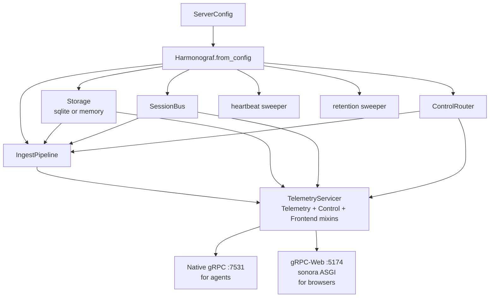
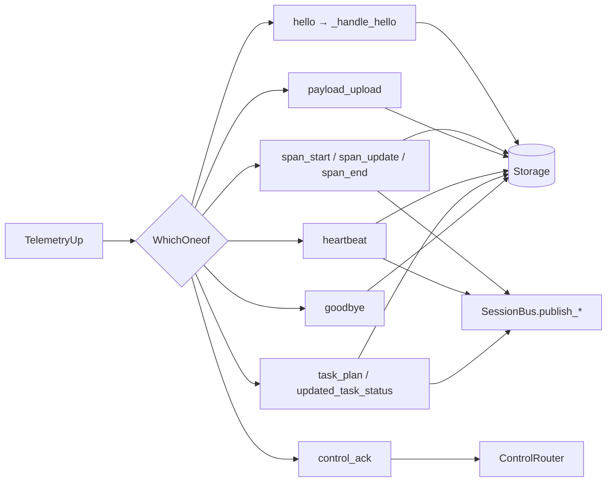
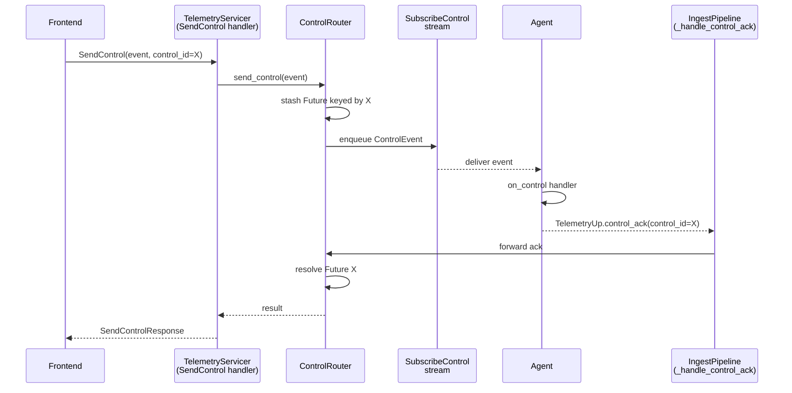

# Server internals

The server (`server/harmonograf_server/`) is the fan-in point and the only
process that owns the canonical timeline. It's smaller than the client
library — about 4,500 lines of Python plus storage — but a lot happens in
it, so read this chapter before touching anything under `server/`.

## Anatomy

| File | Lines | Purpose |
|---|---|---|
| `main.py` | ~237 | Composition root. `Harmonograf.from_config()` + `Harmonograf.start()`. Wires everything and runs two listeners. |
| `cli.py` | ~132 | CLI entry point; parses flags and calls `Harmonograf.from_config()`. Exposed via the `harmonograf-server` script. |
| `config.py` | ~25 | `ServerConfig` dataclass. |
| `ingest.py` | ~752 | `IngestPipeline` — consumes telemetry and drives store + bus + router. |
| `bus.py` | ~205 | `SessionBus` — in-process pub/sub for WatchSession fan-out. |
| `control_router.py` | ~349 | `ControlRouter` — routes control events, collects acks. |
| `convert.py` | ~454 | Proto ↔ storage dataclass converters. |
| `storage/base.py` | ~396 | `Storage` ABC + domain dataclasses + enums. |
| `storage/sqlite.py` | ~1,066 | Default backend (aiosqlite + WAL). |
| `storage/memory.py` | ~431 | In-memory backend (tests only). |
| `storage/factory.py` | ~18 | `make_store(kind, …)` helper. |
| `rpc/telemetry.py` | — | `TelemetryServicer` implementing `StreamTelemetry` + mixins. |
| `rpc/control.py` | — | `SubscribeControl` handler (mixin). |
| `rpc/frontend.py` | — | Frontend RPCs (mixin): `ListSessions`, `WatchSession`, `GetPayload`, `GetSpanTree`, `PostAnnotation`, `SendControl`, `DeleteSession`, `GetStats`. |
| `auth.py` | ~119 | Bearer-token auth for gRPC channels (optional). |
| `health.py` | ~64 | `grpc.health.v1.Health` implementation. |
| `_cors.py` | ~98 | CORS allow list for the gRPC-Web listener. |
| `_sonora_shim.py` | ~76 | Shim over sonora's ASGI app to attach the servicer. |
| `logging_setup.py` | ~57 | Rich-backed structured logger. |
| `metrics.py` | ~60 | In-process counters. |
| `retention.py` | ~72 | Background sweeper for old sessions. |
| `stress.py` | ~371 | Synthetic load generator (not wired into production). |

## Composition root

`server/harmonograf_server/main.py:48` defines `Harmonograf`, the composition
root. The construction path:

1. **`Harmonograf.from_config(cfg: ServerConfig)`** at `main.py:75`
   - Build a `Storage` via `storage.factory.make_store()`.
   - Build a `SessionBus`.
   - Build a `ControlRouter`.
   - Build an `IngestPipeline(store, bus, router)`.
   - Build a `TelemetryServicer(ingest, router, store, bus, data_dir)` at
     `rpc/telemetry.py:29`.

2. **`Harmonograf.start()`** at `main.py:107`
   - Open the sqlite store (or no-op for memory).
   - Register the servicer on the native gRPC listener at
     `cfg.grpc_port` (default 7531, env `SERVER_PORT`).
   - Register the same servicer on the sonora ASGI app and serve it on
     `cfg.web_port` (default 5174, env `FRONTEND_PORT`) for gRPC-Web.
   - Start background tasks: heartbeat sweeper (`rpc/telemetry.py:111`) and
     retention sweeper (`retention.py`).
   - Wait for shutdown signal.

The two listeners share one `TelemetryServicer` instance — so a session
opened by an agent (native gRPC) is visible to a browser (gRPC-Web)
immediately, without any cross-process hop.

**Port convention reminder:**

| Listener | Default port | Env | Used by |
|---|---|---|---|
| Native gRPC | 7531 | `SERVER_PORT`, `HARMONOGRAF_SERVER` | Agents via `harmonograf-client` |
| gRPC-Web (sonora) | 5174 | `FRONTEND_PORT` | Browser via Connect-RPC |
| Vite dev server | 5173 | — | Developer workflow only |

The composition root and its two listeners:



## The ingest pipeline

`IngestPipeline` at `server/harmonograf_server/ingest.py:135` is the engine.

### Per-stream context

Each `StreamTelemetry` invocation creates a `StreamContext` (`ingest.py:110`)
that holds:

- `session_id`, `agent_id`, `stream_id` (assigned at Hello).
- A `_PayloadAssembler` (`ingest.py:91`) for reassembling `PayloadUpload`
  chunks (see "Payloads" below).
- The subscription handle used to push control events back up the same
  bidi stream via `ControlAckSink` (`ingest.py:70`).

### Message dispatch

`IngestPipeline.handle_message(msg: TelemetryUp, ctx: StreamContext)` is the
main entry. It inspects the oneof and dispatches:

| `TelemetryUp` variant | Handler | What happens |
|---|---|---|
| `hello` | `_handle_hello` | Validate, allocate session/stream IDs (or honor resume token), upsert `Agent`, send `Welcome` response. |
| `span_start` | `_handle_span_start` | Convert via `pb_span_to_storage` (`convert.py:251`), `store.upsert_span`, `bus.publish_span`. |
| `span_update` | `_handle_span_update` | Fetch existing span, apply delta attributes + optional status, upsert, publish. |
| `span_end` | `_handle_span_end` | Finalize span, upsert, publish (end delta marks span as terminal so renderer can stop watching). |
| `payload_upload` | `_handle_payload_upload` | Append chunk to assembler; on `last=true`, digest-check and store. |
| `heartbeat` | `_handle_heartbeat` | Update agent's `last_heartbeat`, `buffer stats`, `current_activity`, `progress_counter`, `context_window_*`; publish agent delta. |
| `goodbye` | `_handle_goodbye` | Mark agent `DISCONNECTED`; do not close stream (client may reconnect with resume token). |
| `control_ack` | `_handle_control_ack` | Forward to `ControlRouter` so the waiting frontend RPC can return. |
| `task_plan` | `_handle_task_plan` | Upsert `TaskPlan`; publish `plan_delta` via the bus. |
| `updated_task_status` | `_handle_updated_task_status` | Upsert `Task`; publish `task_delta`. |

Ingest fans each `TelemetryUp` variant into the store and the bus:



### Payloads and deduplication

Large tool outputs, model prompts, and response bodies are carried as
payloads — out-of-band blobs addressed by content digest (sha256). The
protocol is:

1. Client computes a digest over the payload bytes.
2. Client emits `PayloadRef{digest, size, mime, summary, role}` on the span
   it belongs to.
3. Client sends `PayloadUpload{digest, total_size, mime, chunk, last, evicted}`
   frames, possibly chunked.
4. Server assembles via `_PayloadAssembler` (`ingest.py:91`) and stores the
   full blob in the `payloads` table keyed by digest.
5. Frontend calls `GetPayload(digest)` lazily (via `usePayload` at
   `frontend/src/rpc/hooks.ts:452`) when the user clicks a span.

**Deduplication:** the `payloads` table is keyed by digest. Two agents
producing the same output produce one row. The server can also request
re-upload via `PayloadRequest` if a referenced digest has been evicted
client-side (e.g., ring-buffer eviction). See `telemetry.proto` line 178.

**Eviction.** Clients with tight memory may evict a payload before upload
(reported via `Heartbeat.payloads_evicted`). Evicted payloads store a
`PayloadRef` with `evicted=true`; the frontend renders a greyed-out preview
so the user knows the span had an attachment but it's unrecoverable.

## The session bus

`SessionBus` at `server/harmonograf_server/bus.py:66` is an in-process
pub/sub over asyncio queues.

### Shapes

- `Delta` (`bus.py:40`): a discriminated union of delta kinds — span,
  agent, annotation, task report, plan delta.
- `Subscription` (`bus.py:51`): a per-subscriber handle with an async queue.

### Subscriber lifecycle

1. `WatchSession` RPC handler (in `rpc/frontend.py`) calls
   `bus.subscribe(session_id)` and gets a `Subscription`.
2. The handler streams `SessionUpdate` messages by pulling from the
   subscription's queue.
3. Meanwhile, the ingest pipeline calls `bus.publish_span()`,
   `publish_annotation()`, `publish_task_report()`, etc. (line 215+); each
   publish iterates all matching subscriptions and enqueues the delta.
4. When the frontend disconnects, the handler calls `bus.unsubscribe()`.

Subscriptions are **session-scoped, not session-and-agent-scoped**. A single
`WatchSession` gets every delta for every agent in the session. That
matches the frontend's needs (the Gantt shows all agents in one view) and
keeps the bus simple.

**Pitfall:** do *not* call `publish_*` from a sync context. The bus uses
asyncio queues and will deadlock if you `asyncio.run_coroutine_threadsafe`
incorrectly. All ingest handlers run on the asyncio loop already — keep it
that way.

## The control router

`ControlRouter` at `server/harmonograf_server/control_router.py:90` owns the
reverse path: frontend → agent.

### Flow

1. Frontend calls `SendControl(event)` (unary). The handler stashes an
   `asyncio.Future` keyed by `event.control_id` and calls
   `router.send_control(event)`.
2. Router finds the right `(session_id, agent_id, stream_id)` registration
   (agents register via `SubscribeControl` at startup) and pushes the event
   onto that agent's control-event queue.
3. Agent's `Transport` pops the event off its `SubscribeControl` stream and
   hands it to the registered `on_control` callback.
4. Agent processes and sends `ControlAck` back up the `StreamTelemetry`
   bidi stream.
5. Ingest receives the `control_ack`, forwards to router, router resolves
   the original Future, and `SendControl` returns to the frontend.

Control event ack correlation: the frontend's `SendControl` future is unblocked only when the agent's ack rides back up the telemetry stream.



Two control event kinds matter most today:

- **`STATUS_QUERY`** — the server (or a frontend user) pings the agent for
  a status summary. Response lands as a `TaskReport` published through the
  bus. See `control_router.py:97` and callback registration at
  `control_router.py:134`.
- **`REFINE`** — pushes a plan refinement directive. Agents treat this as an
  external drift signal (`DRIFT_KIND_EXTERNAL_SIGNAL` in the client).

Steering annotations posted via `PostAnnotation` also flow through the
router: the annotation is stored, then a `STEERING` control event is sent
through the router with the annotation ID. The frontend waits on the
`PostAnnotation` response future, which resolves when the agent acks.

## Storage

### The interface

`Storage` ABC at `server/harmonograf_server/storage/base.py:239`. Each
method is async. Interesting methods:

| Method | Role |
|---|---|
| `start() / stop()` | Lifecycle; open pool, run migrations. |
| `upsert_session` / `list_sessions` / `get_session` / `delete_session` | Session CRUD. |
| `upsert_agent` / `list_agents` / `update_agent_heartbeat` | Agent CRUD + liveness. |
| `upsert_span` / `get_span` / `query_spans` / `get_span_tree` | Span CRUD + queries. |
| `upsert_annotation` / `list_annotations` | Annotation CRUD. |
| `upsert_task_plan` / `upsert_task` / `list_task_plans` | Task + plan CRUD. |
| `put_payload` / `get_payload` / `payload_exists` / `evict_payload` | Payload CRUD. |
| `get_stats` | Snapshot counters for `GetStats`. |

All fields in the storage dataclasses are typed — if you add a column, update
both `storage/base.py` and `storage/sqlite.py` in lockstep.

### SQLite backend

`SqliteStore` at `server/harmonograf_server/storage/sqlite.py:161`. Backed
by `aiosqlite`.

Schema (see CREATE TABLE at `sqlite.py:46-160`):

| Table | Key columns | Notes |
|---|---|---|
| `sessions` | `id` | `title`, `created_at`, `ended_at`, `status`, `metadata` (JSON) |
| `agents` | `id` | `session_id`, `name`, `framework`, `framework_version`, `capabilities` (JSON), `metadata`, `connected_at`, `last_heartbeat`, `status` |
| `spans` | `id` | `session_id`, `agent_id`, `parent_span_id`, `kind`, `kind_string`, `status`, `name`, `start_time`, `end_time`, `attributes` (JSON), `error_type`, `error_message`, `error_stack` |
| `span_links` | `(span_id, target_span_id)` | `target_agent_id`, `relation` |
| `annotations` | `id` | `session_id`, `agent_id`, `span_id`, `kind`, `body`, `created_at` |
| `task_plans` | `id` | `session_id`, `agent_id`, `plan_id`, `tasks` (JSON), `edges` (JSON), `summary`, `revision_reason`, `revision_kind`, `revision_severity`, `revision_index` |
| `tasks` | `id` | `session_id`, `plan_id`, `task_id`, `title`, `description`, `assignee_agent_id`, `status`, `progress` |
| `payloads` | `digest` | `size`, `mime`, `content` (BLOB), `evicted`, `created_at` |

Pragmas set on open (`sqlite.py:175-181`):

```
PRAGMA journal_mode = WAL;
PRAGMA busy_timeout = 5000;
PRAGMA foreign_keys = ON;
PRAGMA synchronous = NORMAL;
```

**WAL is required.** Without it, the concurrent writers (ingest) and readers
(`WatchSession`, `GetSpanTree`, `ListSessions`) deadlock under load. Don't
change the journal mode without understanding this.

### Migrations

There is no formal migration framework. Schema evolution is done by
conditional `ALTER TABLE` at store start (grep for `ALTER TABLE` in
`sqlite.py`). When you add a new column:

1. Add it to the `CREATE TABLE` statement for fresh databases.
2. Add a conditional `ALTER TABLE ... ADD COLUMN ... DEFAULT NULL` for
   existing databases.
3. Teach the read and write code paths to handle both presence and absence
   (NULL) during the transition.

**Pitfall:** do not drop or rename columns in place. Add a new column, dual
write for a release, then stop writing the old. The in-memory backend is
forgiving; production sqlite databases on developer machines are not.

### In-memory backend

`InMemoryStore` at `storage/memory.py`. Same interface, hash-map backed,
used by tests to avoid the sqlite dance. Keep it in sync with `SqliteStore`
— diverging behavior here is a frequent source of test-only bugs.

## The RPC surface

`TelemetryServicer` at `server/harmonograf_server/rpc/telemetry.py:29`
composes three mixins:

| Mixin | File | RPCs |
|---|---|---|
| Telemetry | `rpc/telemetry.py` | `StreamTelemetry` (bidi) |
| Control | `rpc/control.py` | `SubscribeControl` (server-streaming) |
| Frontend | `rpc/frontend.py` | `ListSessions`, `WatchSession`, `GetPayload`, `GetSpanTree`, `PostAnnotation`, `SendControl`, `DeleteSession`, `GetStats` |

### `StreamTelemetry`

At `rpc/telemetry.py:51`. The bidi agent channel.

Flow:

1. Receive first message; assert it is a `Hello` (`telemetry.py:69`). Reject
   otherwise.
2. Call `ingest.open_stream(hello)` to allocate session/stream IDs.
3. Send `Welcome` with assigned IDs (`telemetry.py:82-91`).
4. Loop: drain subsequent `TelemetryUp` messages through
   `ingest.handle_message(msg, ctx)` (`telemetry.py:94-100`).
5. On stream close: `ingest.close_stream(ctx)` (`telemetry.py:107-108`).

The handler never sends `TelemetryDown` messages except `Welcome`,
`PayloadRequest`, `FlowControl` (currently unused), and `ServerGoodbye`.
Control events do *not* ride this stream — they go through
`SubscribeControl`.

### Heartbeat sweeper

Background task at `rpc/telemetry.py:111`. Runs periodically, marks agents
`DISCONNECTED` if `last_heartbeat` is older than a threshold. That's what
turns a Gantt row red when an agent freezes. See `debugging.md` for how to
adjust the threshold.

### `SubscribeControl`

At `rpc/control.py`. Server-streaming: agent subscribes `(session_id,
agent_id, stream_id)` and receives `ControlEvent` messages. Registration
happens once per agent connection; one subscription per agent.

### `WatchSession`

At `rpc/frontend.py`. Server-streaming: frontend subscribes to a session
and receives a snapshot (initial state) followed by live deltas. The
initial snapshot query reads from the store; subsequent deltas come from
the bus. There is a small ordering dance to make sure no deltas are lost
between the snapshot and the live subscription — see the handler code for
the exact sequence.

### `GetSpanTree`

Unary snapshot query for a time window. Used on init and when the user
jumps the viewport to a new region. Frontend always pulls the snapshot via
`GetSpanTree`, then layers live deltas from `WatchSession` on top.

### `PostAnnotation`

Unary. The handler stores the annotation, routes a `STEERING` control event
to the agent via `ControlRouter`, and awaits the ack before returning. The
return value includes the annotation ID.

### `SendControl`

Unary wrapper around `ControlRouter.send_control()`. Used by the frontend
for direct control events (pause, cancel, status query) that don't involve
a body annotation.

## Reading the code

If you are hunting a bug, this is the order I recommend:

1. **Symptom on the frontend.** Start at `frontend/src/rpc/hooks.ts` for the
   affected view. Find the RPC being called. Then…
2. **RPC handler.** Open `server/harmonograf_server/rpc/frontend.py` and
   find the matching method. Trace it into the store or bus.
3. **Store interaction.** `storage/sqlite.py` and `storage/base.py` show
   the data shape. If the data is wrong here, the bug is likely in the
   converters…
4. **Converters.** `server/harmonograf_server/convert.py`. Many subtle
   bugs live here because proto fields change shape.
5. **Ingest.** `server/harmonograf_server/ingest.py`. If data is missing
   from the store entirely, ingest dropped it. Check the handler for the
   message kind, and check `IngestPipeline.__init__` for any filter
   conditions.

## Stress testing

`server/harmonograf_server/stress.py` (371 lines) contains a synthetic
load generator. It's not wired into production or `make demo` — you run it
manually when you want to characterize throughput under N agents or
M spans/second. Usage docs live in the file's docstring. If you extend it,
keep it dependency-light — don't pull in pytest fixtures or anything that
would couple it to the test suite.

## Server-side testing

See [`testing.md`](testing.md). The key server test files:

| Test | What it demonstrates |
|---|---|
| `server/tests/test_ingest_extensive.py` | Full ingest pipeline coverage — every `TelemetryUp` variant. |
| `server/tests/test_bus_extensive.py` | Subscription lifecycle, ordering, backpressure. |
| `server/tests/test_control_router_extensive.py` | Control routing, ack futures, timeouts. |
| `server/tests/test_storage_extensive.py` | Both `SqliteStore` and `InMemoryStore` against the same test suite. |
| `server/tests/test_rpc_frontend.py` | End-to-end RPC tests through the servicer. |
| `server/tests/test_payload_gc.py` | Payload dedup and eviction. |
| `server/tests/test_retention.py` | Retention sweeper correctness. |
| `server/tests/test_task_plans.py` | `TaskPlan` ingestion + revision history. |

## Next

[`frontend.md`](frontend.md) — the other side of `WatchSession`.
