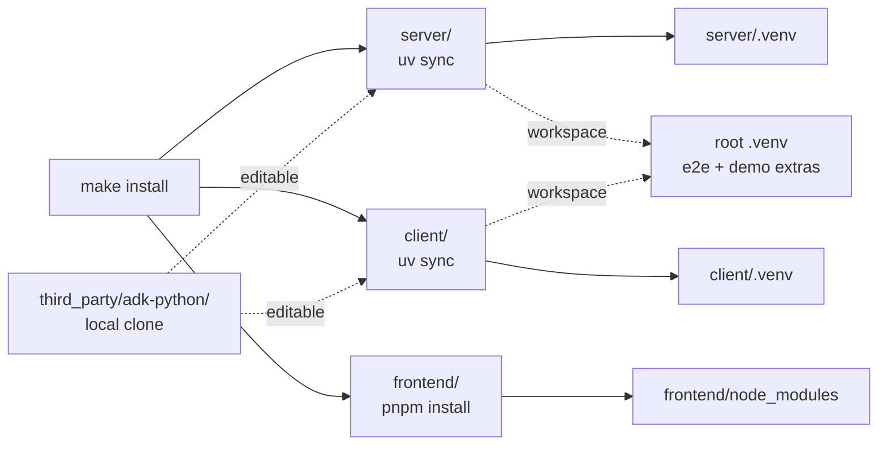
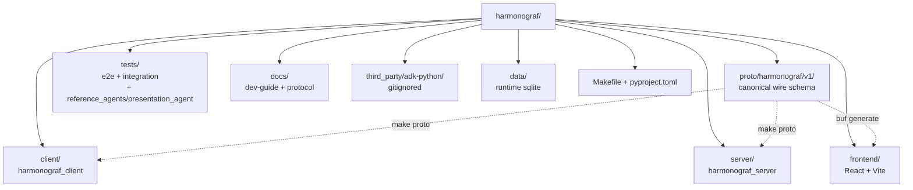

# Setup

From zero to a running `make demo` in under fifteen minutes on a clean Linux
or macOS box.

## Prerequisites

| Tool | Minimum version | Why | Install |
|---|---|---|---|
| Python | 3.12 | Server and client both require it (see `server/pyproject.toml`, `client/pyproject.toml`) | `pyenv` or distro package |
| [uv](https://docs.astral.sh/uv/) | 0.5+ | Monorepo Python workspace manager; replaces pip+venv | `curl -LsSf https://astral.sh/uv/install.sh \| sh` |
| [pnpm](https://pnpm.io/) | 9+ | Frontend package manager (npm/yarn will not work — `pnpm-lock.yaml` is authoritative) | `npm install -g pnpm` or `corepack enable pnpm` |
| Node | 20+ | Vite + TypeScript toolchain | `fnm`, `nvm`, or distro |
| [buf](https://buf.build/docs/installation) | 1.30+ | TypeScript proto codegen (`make proto-ts`) | `brew install bufbuild/buf/buf` |
| `protoc` | 25+ | Indirectly used by `grpc_tools` for Python stubs | Usually pulled in via `grpcio-tools`; no manual install needed |
| SQLite | 3.37+ (ships WAL, `JSON1`) | Default storage backend | OS package |
| git | — | Repo cloning | OS package |
| Google adk-python | matching upstream | Editable path dependency referenced by root `pyproject.toml` | Clone into `third_party/adk-python/` yourself — this repo does not vendor or track ADK |

You do **not** need Docker, Make 4, Bazel, or anything else. The whole thing is
a Python monorepo plus a Vite app.

## Clone

```bash
git clone git@github.com:pedapudi/harmonograf.git
cd harmonograf
git clone https://github.com/google/adk-python.git third_party/adk-python
```

harmonograf installs `google-adk` as an editable path dependency rooted at
`third_party/adk-python/` (see the `[tool.uv.sources]` entry in the root
`pyproject.toml`). This repo does **not** track or vendor ADK — the `third_party/`
directory is git-ignored. You are responsible for maintaining a local checkout
there. Treat it as a read-only third-party dependency: do not commit changes
into the ADK checkout as part of harmonograf work. If you forget to clone it,
`uv sync` will fail with a clear error about a missing path dependency.

## Install

A single `make install` fans out to all three components:

```bash
make install
```

Equivalent to (see `Makefile:71-81`):

```bash
cd server && uv sync
cd client && uv sync
cd frontend && pnpm install --frozen-lockfile
```

The fan-out from `make install` to the per-component installers:



`uv sync` is authoritative — it reads `uv.lock` and creates a `.venv` per
package. Never run `pip install` in this repo. If you need to add a dependency,
edit the relevant `pyproject.toml` and re-run `uv sync`; uv will rewrite the
lockfile.

### What gets installed where

| Path | Virtualenv | Lockfile | Notes |
|---|---|---|---|
| `/` (root) | root `.venv` (aggregator) | `uv.lock` | Only used for e2e tests with `[e2e]` / `[demo]` extras; depends on server + client as workspace members |
| `server/` | `server/.venv` | — | `harmonograf-server` package, grpcio, aiosqlite, sonora |
| `client/` | `client/.venv` | — | `harmonograf-client`, grpcio, protobuf |
| `frontend/` | `node_modules/` | `pnpm-lock.yaml` | React 19, Zustand, Connect-RPC, Vite |

The root `pyproject.toml` declares a uv workspace with `server` and `client` as
members, so the root venv sees both packages in editable mode. This is how
`tests/e2e/` imports `harmonograf_client` and `harmonograf_server` directly.

## Smoke test: `make demo`

The fastest way to prove your install is sane:

```bash
make demo
```

This runs three processes in parallel (see `Makefile:154-184`):

1. **`make server-run`** — the gRPC server on `HARMONOGRAF_SERVER=127.0.0.1:7531`
   plus the gRPC-Web bridge on `FRONTEND_PORT=5174`, with sqlite at `./data/`.
2. **`make frontend-dev`** — Vite dev server on `:5173`.
3. **`make demo-presentation`** — `adk web` hosting `tests/reference_agents/presentation_agent/`, which
   is already instrumented with the harmonograf client library, on
   `ADK_WEB_PORT=8080`.

Then:

1. Open `http://localhost:5173` → the harmonograf Gantt UI.
2. Open `http://localhost:8080` → ADK's web UI for the demo agent.
3. Ask the presentation agent something non-trivial. Watch spans appear in the
   Gantt within ~200 ms.

If all three processes come up and you see live spans, your install is good.
If the Gantt view loads but stays empty, open DevTools → Network and check
that `WatchSession` returned 200 and is streaming. See `debugging.md` if not.

### Running components individually

Sometimes you want one component in the foreground (for debugging) and the
others in the background.

| Target | What it runs | Foreground-friendly? |
|---|---|---|
| `make server-run` | `cd server && uv run python -m harmonograf_server --store sqlite --data-dir data` | Yes |
| `make frontend-dev` | `cd frontend && pnpm dev` | Yes |
| `make demo-presentation` | `adk web` with presentation_agent | Yes |

There's no restart-on-change for the Python server — it's a plain
long-running process. Kill and re-run it manually. Frontend has hot module
reloading through Vite.

## Repository layout tour

The top-level directories at a glance:



```
harmonograf/
├── proto/harmonograf/v1/      # Canonical wire schema (source of truth)
│   ├── service.proto          #   gRPC service definition
│   ├── telemetry.proto        #   TelemetryUp / TelemetryDown envelopes (+ goldfive_event variant)
│   ├── control.proto          #   SubscribeControl RPC
│   ├── types.proto            #   Span, Agent, Session, ControlEvent, enums (Plan/Task imported from goldfive)
│   └── frontend.proto         #   Frontend-only RPCs (WatchSession, GetSpanTree, …)
├── client/                    # Python client library (embedded in agents)
│   ├── harmonograf_client/
│   │   ├── sink.py            #   HarmonografSink (goldfive.EventSink adapter)
│   │   ├── telemetry_plugin.py #  HarmonografTelemetryPlugin (ADK BasePlugin)
│   │   ├── buffer.py          #   EventRingBuffer + PayloadBuffer
│   │   ├── transport.py       #   gRPC transport + reconnect + resume
│   │   ├── client.py          #   Client handle (non-blocking facade)
│   │   ├── heartbeat.py       #   Heartbeat dataclass
│   │   ├── identity.py        #   AgentIdentity (persisted to ~/.harmonograf)
│   │   ├── enums.py           #   SpanKind / SpanStatus / Capability wire mirrors
│   │   └── pb/                #   Generated protobuf stubs (committed; never edit)
│   └── tests/                 #   pytest suite (see testing.md)
├── server/                    # Python gRPC server
│   ├── harmonograf_server/
│   │   ├── main.py            #   Composition root (Harmonograf class)
│   │   ├── cli.py             #   CLI entry point (harmonograf-server script)
│   │   ├── ingest.py          #   IngestPipeline (StreamTelemetry handler)
│   │   ├── bus.py             #   SessionBus (pub/sub; WatchSession fan-out)
│   │   ├── control_router.py  #   ControlRouter (control events + acks)
│   │   ├── convert.py         #   proto ↔ storage dataclass converters
│   │   ├── storage/
│   │   │   ├── base.py        #   Storage ABC + domain dataclasses
│   │   │   ├── sqlite.py      #   Default backend (aiosqlite, WAL)
│   │   │   └── memory.py      #   In-memory backend (tests only)
│   │   ├── rpc/
│   │   │   ├── telemetry.py   #   TelemetryServicer (StreamTelemetry)
│   │   │   ├── control.py     #   SubscribeControl
│   │   │   └── frontend.py    #   ListSessions, WatchSession, GetPayload, …
│   │   ├── retention.py       #   Background sweeper (old sessions)
│   │   ├── metrics.py         #   Server metrics registry
│   │   ├── stress.py          #   Synthetic load generator for perf tests
│   │   └── pb/                #   Generated protobuf stubs
│   └── tests/                 #   pytest suite
├── frontend/                  # React + TypeScript + Vite
│   ├── src/
│   │   ├── main.tsx / App.tsx
│   │   ├── gantt/             #   Renderer, layout, viewport, spatial index
│   │   ├── components/
│   │   │   ├── shell/         #   Shell, AppBar, Drawer, NavRail
│   │   │   ├── Gantt/         #   Minimap and chart-specific UI
│   │   │   ├── Interaction/   #   SpanPopover, steering controls
│   │   │   ├── TransportBar/  #   Transport state indicator
│   │   │   └── …              #   LiveActivity, OrchestrationTimeline, etc.
│   │   ├── rpc/               #   Connect-RPC transport + hooks + converters
│   │   ├── state/uiStore.ts   #   Zustand UI state
│   │   └── pb/                #   Generated protobuf-es stubs
│   └── package.json
├── tests/
│   ├── reference_agents/      #   Reference ADK agents used by demos + e2e
│   │   └── presentation_agent/#   Example ADK agent, used by `make demo`
│   ├── e2e/                   #   Full-stack scenarios (real ADK + real server)
│   └── integration/           #   Playwright harness for frontend-server interop
├── docs/
│   ├── dev-guide/             #   You are here
│   ├── protocol/              #   Wire protocol reference
│   ├── design/                #   Design notes & ADRs
│   ├── research/              #   Exploratory docs
│   ├── milestones.md          #   Roadmap
│   ├── operator-quickstart.md #   End-user (not contributor) setup
│   └── reporting-tools.md     #   Reporting tool reference
├── third_party/adk-python/    # Local-only editable ADK checkout (gitignored)
├── data/                      # Runtime sqlite dbs (gitignored)
├── Makefile                   # All dev tasks
├── pyproject.toml             # Root uv workspace aggregator
└── uv.lock                    # Workspace-wide lockfile
```

### The four places to look first

| Looking for… | Start here |
|---|---|
| How a span ends up in sqlite | `client/harmonograf_client/adk.py` → `client/harmonograf_client/transport.py` → `server/harmonograf_server/ingest.py:135` → `server/harmonograf_server/storage/sqlite.py:161` |
| How a span reaches the Gantt | `server/harmonograf_server/bus.py:66` → `server/harmonograf_server/rpc/frontend.py` (WatchSession) → `frontend/src/rpc/hooks.ts` → `frontend/src/gantt/index.ts` (SessionStore) → `frontend/src/gantt/renderer.ts:99` |
| How the plan advances | `client/harmonograf_client/agent.py:207` (HarmonografAgent) → `client/harmonograf_client/adk.py` (`_AdkState`, callbacks) → `client/harmonograf_client/state_protocol.py` → `client/harmonograf_client/tools.py` |
| How a proto change propagates | `proto/harmonograf/v1/*.proto` → `make proto` → regenerated stubs in `server/harmonograf_server/pb/`, `client/harmonograf_client/pb/`, `frontend/src/pb/` |

## Regenerating protos

Whenever you edit any `.proto` file:

```bash
make proto
```

This runs `make proto-python` (grpc_tools for both server and client stubs) and
`make proto-ts` (buf). The generated files under `*/pb/` and `frontend/src/pb/`
are **checked into git**. Commit them alongside the `.proto` edit. See
`working-with-protos.md` for the full workflow and forward-compat rules.

## Environment variables

| Variable | Default | Used by |
|---|---|---|
| `HARMONOGRAF_SERVER` | `127.0.0.1:7531` | Client transport target, `make stats` |
| `SERVER_PORT` | `7531` | Native gRPC listener |
| `FRONTEND_PORT` | `5174` | gRPC-Web listener (sonora) — **not** the Vite dev server port |
| `ADK_WEB_PORT` | `8080` | `make demo-presentation` |
| `KIKUCHI_LLM_URL` | — | Shared LLM endpoint used by e2e suite (see `testing.md`) |
| `GOOGLE_API_KEY` / `GEMINI_API_KEY` | — | For real-LLM tests; not required for unit tests |

The Vite dev server itself listens on port 5173 and proxies nothing — it
reaches the backend via gRPC-Web on `FRONTEND_PORT`. If you see CORS errors in
the browser, you probably have a port mismatch; check `server/harmonograf_server/_cors.py`
for the allow list.

## Next

Once `make demo` is green, read [`architecture.md`](architecture.md).
