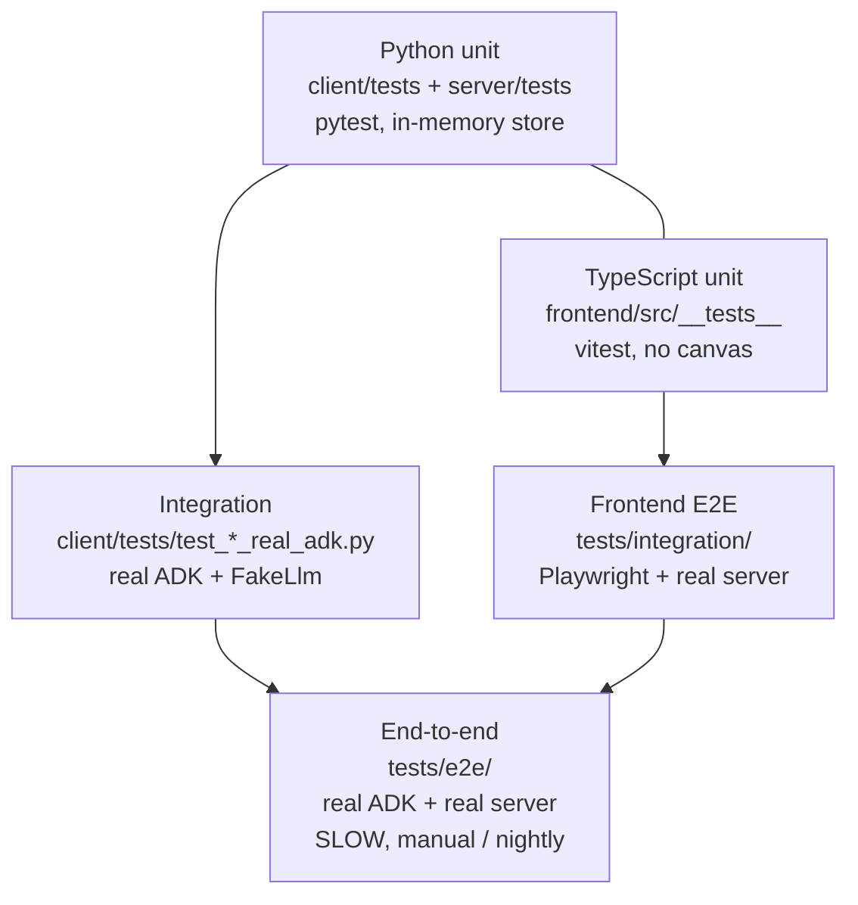
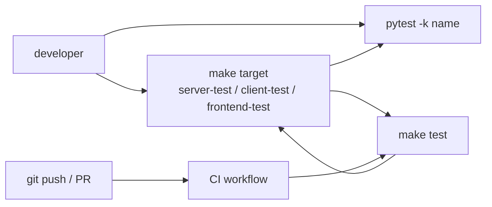

# Testing

Harmonograf has four tiers of tests. Each tier answers a different
question. Writing the wrong tier is the most common source of slow,
flaky, or useless tests.

## The four tiers

| Tier | Tool | Lives in | Runs | When to reach for it |
|---|---|---|---|---|
| Unit (Python) | `pytest` + `pytest-asyncio` | `client/tests/`, `server/tests/` | `make client-test`, `make server-test` | Pure logic. No network, no real LLM, no real DB unless you're testing the store itself. |
| Unit (TypeScript) | `vitest` + `@testing-library/react` | `frontend/src/__tests__/` | `pnpm test` (inside `frontend/`) | Pure TS logic: `SessionStore`, `computePlanDiff`, spatial index, viewport math, component render snapshots. |
| Integration (Python) | `pytest` with real ADK | `client/tests/test_dynamic_plans_real_adk.py`, `client/tests/test_orchestration_modes.py`, etc. | `make client-test` (with `google-adk` installed) | Exercise the ADK callback surface with a real `Runner`, but still with a scripted `FakeLlm`. |
| End-to-end | `pytest` + real server + real ADK | `tests/e2e/` | `cd tests/e2e && uv run --with google-adk pytest` (or `make e2e`) | Full stack. Client → gRPC → server → store → bus → (optional) frontend via Playwright. |
| Frontend E2E | Playwright | `tests/integration/` | `pnpm --dir tests/integration test` | UI interop with a live server. |

The test pyramid — wider tiers at the bottom run on every commit; narrower tiers at the top run only when the code they cover changes:



## Running tests

| Command | What it runs |
|---|---|
| `make test` | `server-test` + `client-test` + `frontend-test`. Default CI target. (See `Makefile:190`.) |
| `make server-test` | `cd server && uv run --with pytest pytest -q` (line 193) |
| `make client-test` | `cd client && uv run --with pytest pytest -q` (line 196) |
| `make frontend-test` | `cd frontend && pnpm build && pnpm lint` (line 199) — note: no vitest by default; run `pnpm test` manually |
| `make e2e` | `cd tests/e2e && uv run --with google-adk pytest` (line 202) |
| `cd frontend && pnpm test` | vitest one-shot |
| `cd frontend && pnpm test:watch` | vitest watch mode |

### Running a single test

```bash
# Python, one file
cd client && uv run pytest tests/test_orchestration_modes.py -q

# Python, one test
cd client && uv run pytest tests/test_orchestration_modes.py::test_parallel_mode_walker -q

# Python, match by substring
cd client && uv run pytest -k "parallel_mode" -q

# Frontend, one file
cd frontend && pnpm test -- src/__tests__/computePlanDiff.test.ts
```

## Writing client-side unit tests

Use `client/tests/test_orchestration_modes.py` as your reference. It shows:

- How to skip if `google-adk` isn't installed (`pytest.importorskip` at the
  top of the file).
- The `FakeClient` pattern: duck-type the `Client` interface instead of
  mocking the transport. Lets you assert exactly which envelopes would be
  emitted without spinning up a gRPC server.
- The scripted `FakeLlm` pattern: pre-bake a queue of `LlmResponse`s so
  each model call returns a deterministic response. Crucial for testing
  the callback dispatch path without real LLM nondeterminism.

### Fake LLM

`client/tests/_fixtures.py` defines the canonical `FakeLlm` builder. Use
it whenever you need ADK callbacks to fire without a real model. Example:

```python
from tests._fixtures import FakeLlm
llm = FakeLlm([response_1, response_2, response_3])
agent = LlmAgent(name="worker", model=llm, tools=[...])
```

Each response in the queue is returned in order. The test fails if the
agent runs out of responses (good — it means your test under-specified).

### Fixtures

`client/tests/conftest.py` provides common fixtures: event loops, temp
directories, scripted clients. Prefer existing fixtures over rolling your
own — it keeps tests consistent and makes refactors easier.

## Writing server-side unit tests

Key examples:

| Test | Demonstrates |
|---|---|
| `server/tests/test_ingest_extensive.py` | How to drive the ingest pipeline with synthetic `TelemetryUp` messages and assert on the resulting store contents. |
| `server/tests/test_bus_extensive.py` | Subscription lifecycle, ordering guarantees, clean-up. |
| `server/tests/test_control_router_extensive.py` | Control routing, ack futures, timeouts, missing-agent cases. |
| `server/tests/test_storage_extensive.py` | Runs the same suite against both `SqliteStore` and `InMemoryStore` to keep the two backends in sync. Add new storage tests here. |
| `server/tests/test_rpc_frontend.py` | End-to-end servicer tests — build a servicer, simulate RPC calls, assert responses. |
| `server/tests/test_payload_gc.py` | Payload dedup and eviction behavior. |
| `server/tests/test_retention.py` | Retention sweeper correctness. |
| `server/tests/test_task_plans.py` | `TaskPlan` ingestion + revision history. |

### The in-memory store for tests

Default to `storage.memory.InMemoryStore` in tests. It's fast, it has no
filesystem footprint, and it implements the same interface as
`SqliteStore`. Use sqlite only when you're specifically testing the sqlite
backend.

### Async testing

`asyncio_mode = auto` is set globally (grep `pyproject.toml`). Write
tests as `async def test_whatever(...)`; pytest-asyncio handles the rest.

## Writing frontend tests

`frontend/src/__tests__/` is where vitest tests live. Two flavors:

1. **Pure TS unit tests** for the hot path: `SessionStore`,
   `computePlanDiff`, `layout`, `viewport`, `spatialIndex`. No DOM needed.
2. **Component tests** using `@testing-library/react` for small components
   (Drawer tabs, SpanPopover, etc.). The canvas is not rendered in JSDOM
   — you cannot unit-test `GanttCanvas` itself. Integration tests cover
   that.

### Don't test the canvas in JSDOM

`GanttCanvas` draws to a real canvas element. JSDOM's canvas shim is a
no-op. Any test that asserts "pixel X is colored Y" will pass even if the
renderer is broken. Cover the renderer through:

- Pure TS unit tests on `layout`, `viewport`, `spatialIndex`, `renderer`
  helpers that do not depend on a real `CanvasRenderingContext2D`.
- Playwright integration tests that launch a real browser (see
  `tests/integration/`).

## Writing integration tests (client ↔ real ADK)

`client/tests/test_orchestration_modes.py` and
`client/tests/test_dynamic_plans_real_adk.py` exercise real ADK with a
scripted LLM. These are the most valuable tests in the repo because they
catch regressions in the callback dispatch contract with ADK itself.

Guidelines:

- Always use `FakeLlm` for deterministic response sequences.
- Always assert on `_AdkState` transitions, not on span content.
- Prefer asserting "task X is in state Y" over "agent said Z" — model
  output is fragile, state transitions are not.
- Clean up: ADK `Runner` holds goroutines/tasks. Use the fixtures in
  `conftest.py` to ensure cleanup between tests.

## Writing end-to-end tests

`tests/e2e/` has four entry points:

| File | What it tests |
|---|---|
| `tests/e2e/test_scenarios.py` | Scripted multi-task scenarios through a real harmonograf server. |
| `tests/e2e/test_adk_hello.py` | Basic ADK integration smoke — agent connects, emits one span, server stores it. |
| `tests/e2e/test_planner_e2e.py` | `LLMPlanner` + real ADK. Requires an LLM endpoint. |
| `tests/e2e/test_presentation_agent.py` | Full presentation agent demo under test harness. |

### Local LLM env for e2e

Some e2e tests require a real LLM. To avoid burning through hosted API
keys, point them at a local OpenAI-compatible endpoint via
`OPENAI_API_BASE` / `OPENAI_API_KEY` / `USER_MODEL_NAME`. See
`docs/operator-quickstart.md` for how to set it up. Tests that need a
real LLM use `pytest.mark.skipif` to bail if the env is missing.

**Guideline:** prefer `FakeLlm` over a real endpoint unless the test is
explicitly about real-LLM behavior (drift detection, prompt shape
assertions). Real-LLM tests are nondeterministic and expensive.

### `make demo` as a manual e2e

The fastest end-to-end smoke test is `make demo`. Spin it up, ask the
presentation agent something, watch the Gantt. If it works, the full
pipeline is intact. If not, `debugging.md` covers the usual suspects.

## Frontend integration tests

`tests/integration/` is a Playwright harness with its own `pnpm` workspace
(see the nested `package.json` and `playwright.config.ts`). It launches a
real server plus a real frontend build and drives the UI from a browser.

Use this for:

- Regressions in the render pipeline that can't be unit-tested in JSDOM.
- Interop tests where the frontend talks to a real server through the full
  Connect-RPC stack.
- Keyboard shortcut behaviors that need a real keyboard.

Don't use it for:

- Logic that can be tested in a vitest unit (too slow).
- Anything that doesn't require the full browser environment.

## Invariant checker as a test tool

`client/harmonograf_client/invariants.py` is useful in tests, not just in
production:

```python
from harmonograf_client.invariants import check_plan_state
check_plan_state(plan, span_history)  # raises InvariantViolation if bad
```

Drop this into any test that builds a plan + span history by hand and you
will catch illegal transitions, cycles, duplicate IDs, and forced-task
violations for free. See `client/tests/test_invariants.py` for the full
coverage of what it checks.

## When to write which tier

| You changed… | First test | Why |
|---|---|---|
| A pure helper in `state_protocol.py`, `planner.py`, `buffer.py` | Python unit | No external deps. |
| Callback dispatch in `adk.py` | Integration (real ADK + `FakeLlm`) | ADK's contract is the thing under test. |
| Ingest pipeline branching in `ingest.py` | Server unit with in-memory store | Hermetic, fast. |
| Bus fan-out in `bus.py` | Server unit | Subscription lifecycle is the thing. |
| Storage schema in `sqlite.py` | Server unit against `SqliteStore` | Only sqlite-specific behavior. |
| `computePlanDiff` or `SessionStore` | Frontend vitest unit | Pure TS. |
| A new RPC on the wire | Server unit via servicer + frontend mock | Both sides of the contract matter. |
| Plan state machine | Integration (real ADK + scripted LLM) + invariant checker | Multiple channels to test. |
| Drift taxonomy | `test_drift_taxonomy.py` unit | Table-driven. |
| UI render | vitest component test (if no canvas) or Playwright (if canvas) | — |
| Full pipeline regression | e2e scenario | Last-resort safety net. |

## Performance tests

Two perf tools exist:

1. **`client/tests/test_callback_perf.py`** — asserts that the ADK
   callback hot path stays below a per-callback time budget. If this test
   gets slower, the cost-to-observe ratio is slipping.
2. **`server/harmonograf_server/stress.py`** — synthetic load generator.
   Run manually:
   ```bash
   cd server && uv run python -m harmonograf_server.stress --agents 10 --spans-per-sec 100
   ```
   Not wired into CI.

## How a pytest invocation reaches CI

The path from a local pytest command to a CI job:



## CI expectations

CI runs `make test`, `make lint`, and `make proto && git diff --exit-code`.
It does not run `make e2e` by default (a real LLM endpoint is not guaranteed).
See [`contributing.md`](contributing.md) for the full CI contract.

## Flaky tests

If a test flakes:

1. **Don't mark it as `@pytest.mark.flaky`.** Flaky tests rot fast and
   hide real regressions. Fix the underlying nondeterminism instead.
2. **Nondeterminism usually comes from** real LLMs, wall-clock timing
   assertions, asyncio scheduler quirks, or uncleared `session.state`
   between tests.
3. **If you genuinely can't fix it**, file an issue tagged `flaky` and
   link it from the test's docstring. Do not commit a flake without that
   explanation.

## Next

[`debugging.md`](debugging.md) — once a test fails, how to figure out why.
