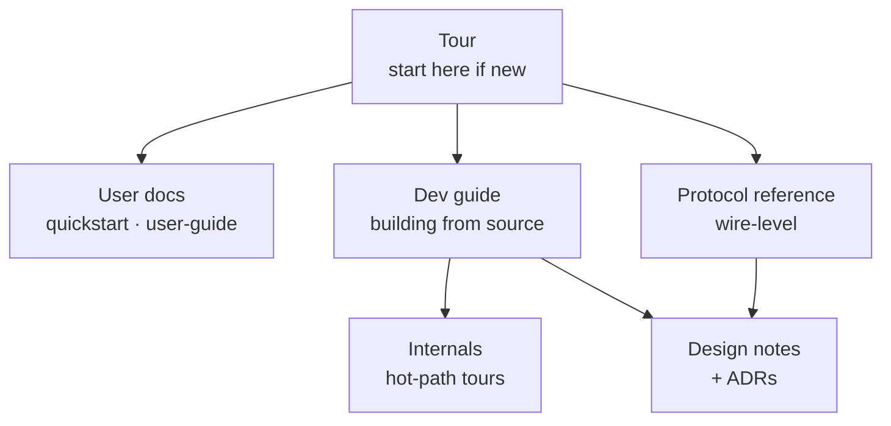

# Harmonograf documentation

Every document in the `docs/` tree, grouped by audience. If you're new,
start with the [tour](tour/index.md) and then come back here for
navigation.

Top-level entry points:

- **[README.md](../README.md)** — project tagline, architecture diagram,
  and five-step quickstart.
- **[AGENTS.md](../AGENTS.md)** — project vision, design principles, and
  the plan-execution protocol. Checked in as durable guidance for anyone
  contributing.
- **[docs/tour/](tour/index.md)** — newcomer tour: three doors, a
  15-minute walkthrough, a mental-model primer, and a terminology map.

The site is organized by audience. Pick a starting point based on what you came here to do; every section eventually cross-links into the others.

---

## Tour (start here if you're new)

The guided entry. Read top-down:

| File | What it is |
|---|---|
| [tour/index.md](tour/index.md) | Welcome page with three doors (user / dev / protocol) plus a link to the 15-minute tour. |
| [tour/15-minute-tour.md](tour/15-minute-tour.md) | Narrative walkthrough: problem, mental model, components, end-to-end rollout, ten-question self-check. |
| [tour/mental-model.md](tour/mental-model.md) | The primitives (sessions, agents, spans, tasks, plans, drift, refine, reporting tools, session.state, ContextVars, control events, annotations, payloads) explained as one cohesive model. |
| [tour/terminology-map.md](tour/terminology-map.md) | Mermaid maps from ADK / OpenTelemetry / agent-framework vocabulary into harmonograf terms, with common false friends. |

---

## Users — running and driving harmonograf

If you want to embed harmonograf into your own agents and drive the UI
to observe and steer them.

| File | What it is |
|---|---|
| [quickstart.md](quickstart.md) | Step-by-step from clone to running demo, with troubleshooting and local-LLM wiring. |
| [operator-quickstart.md](operator-quickstart.md) | Server flags, retention, health probes, bearer-token auth — the ops-facing reference. |
| [overview.md](overview.md) | Longer-form motivation and design principles; what ships today and what's deliberately out of scope. |
| [reporting-tools.md](reporting-tools.md) | The seven `report_*` tools your agents use to communicate task state; when to call each one. |
| [user-guide/index.md](user-guide/index.md) | UI reference hub — overview of regions of the shell and the contents list below. |
| [user-guide/sessions.md](user-guide/sessions.md) | Session picker, filters, attention badges. |
| [user-guide/gantt-view.md](user-guide/gantt-view.md) | Reading the Gantt: bars, colors, status glyphs, cross-agent edges. |
| [user-guide/graph-view.md](user-guide/graph-view.md) | The agent topology / sequence diagram view. |
| [user-guide/drawer.md](user-guide/drawer.md) | Inspector drawer: summary, task, payload, timeline, links, annotations, control tabs. |
| [user-guide/tasks-and-plans.md](user-guide/tasks-and-plans.md) | Current task strip, task panel, plan revisions. |
| [user-guide/control-actions.md](user-guide/control-actions.md) | Pause, resume, steer, rewind, approve — every way the UI talks back to agents. |
| [user-guide/annotations.md](user-guide/annotations.md) | Human notes on spans, tasks, agents; deliver-to-agent mode. |
| [user-guide/keyboard-shortcuts.md](user-guide/keyboard-shortcuts.md) | Keyboard map; source of truth is `frontend/src/lib/shortcuts.ts`. |
| [user-guide/troubleshooting.md](user-guide/troubleshooting.md) | Common UI failure modes and how to recover. |
| [user-guide/cookbook.md](user-guide/cookbook.md) | Recipes for common user tasks. |
| [user-guide/faq.md](user-guide/faq.md) | Frequently asked questions. |

---

## Developers — modifying harmonograf itself

If you're editing the client library, server, frontend, or protos.

| File | What it is |
|---|---|
| [dev-guide/index.md](dev-guide/index.md) | Developer guide hub; reading-order and conventions. |
| [dev-guide/setup.md](dev-guide/setup.md) | Day-one setup: clone, install, run `make demo`, smoke-test. |
| [dev-guide/architecture.md](dev-guide/architecture.md) | Three-component architecture and the end-to-end span walk-through. |
| [dev-guide/client-library.md](dev-guide/client-library.md) | `client/` internals: `Client` transport, `HarmonografSink`, `HarmonografTelemetryPlugin`, envelope kinds, reconnect. |
| [dev-guide/server.md](dev-guide/server.md) | `server/` internals: ingest pipeline, bus, storage, RPC surface. |
| [dev-guide/frontend.md](dev-guide/frontend.md) | `frontend/` internals: SessionStore, renderer, uiStore, Connect-RPC. |
| [dev-guide/working-with-protos.md](dev-guide/working-with-protos.md) | Proto codegen and forward-compat rules. |
| [dev-guide/testing.md](dev-guide/testing.md) | Pytest, vitest, end-to-end test matrix. |
| [dev-guide/debugging.md](dev-guide/debugging.md) | Logging, invariants, common failure modes. |
| [dev-guide/contributing.md](dev-guide/contributing.md) | Commit style, CI expectations, AGENTS.md rules. |

---

## Protocol — the wire reference

If you're writing a new client adapter, implementing a frontend against
the server, or debugging a wire-level issue.

| File | What it is |
|---|---|
| [protocol/index.md](protocol/index.md) | Protocol reference hub and reading order by role. |
| [protocol/overview.md](protocol/overview.md) | The three RPC tiers (telemetry / control / frontend RPCs), the first-connect flow, and versioning. |
| [protocol/telemetry-stream.md](protocol/telemetry-stream.md) | `StreamTelemetry` bidirectional stream, `Hello`/`Welcome`, resume tokens, goodbye. |
| [protocol/control-stream.md](protocol/control-stream.md) | `SubscribeControl` server-streaming RPC; control event / ack lifecycle; capability negotiation. |
| [protocol/frontend-rpcs.md](protocol/frontend-rpcs.md) | `ListSessions`, `WatchSession`, `GetPayload`, `GetSpanTree`, `PostAnnotation`, `SendControl`, `DeleteSession`, `GetStats`. |
| [protocol/data-model.md](protocol/data-model.md) | Harmonograf-owned `types.proto` messages (Session, Agent, Span, PayloadRef, ErrorInfo, Annotation, ControlEvent, ControlAck). Plan / Task / TaskEdge / DriftKind are imported from `goldfive/v1/types.proto`. |
| [protocol/task-state-machine.md](protocol/task-state-machine.md) | Redirect — plan / task / drift / reporting tools / invariant validator all live in goldfive after the migration. |
| [protocol/span-lifecycle.md](protocol/span-lifecycle.md) | SpanStart / SpanUpdate / SpanEnd, attribute merging, `hgraf.task_id` binding, cross-agent links. |
| [protocol/payload-flow.md](protocol/payload-flow.md) | Content-addressed payload uploads, chunked transport, eviction, server-side re-request. |
| [protocol/wire-ordering.md](protocol/wire-ordering.md) | Happens-before guarantees, control-ack colocation, duplicate span dedup on reconnect, resume_token semantics. |

---

## Internals — annotated tours of the hot paths

Narrative walk-throughs of the densest, most load-bearing subsystems.
Loaded before editing a hot path; link out to protocol where the wire
shape matters.

| File | What it is |
|---|---|
| [internals/index.md](internals/index.md) | Reading order, per-hot-path guide, source-reference conventions. |

Individual tours (per the reading order in `internals/index.md`):
`server-ingest-bus.md`, `storage-sqlite.md`,
`session-store-task-registry.md`, `renderer-pipeline.md`,
`drift-taxonomy-catalog.md`.

Tours of the pre-goldfive orchestration layer (HarmonografAgent, the
ADK state machine, invariants) were removed with the goldfive migration;
orchestration internals now live in [goldfive](https://github.com/pedapudi/goldfive).

---

## Design notes — per-component rationale

The original per-component design documents. These predate the
reference docs above and carry the "why" behind architectural
decisions. When a "why" in the reference docs gets long, the answer
usually lives here.

| File | What it is |
|---|---|
| [design/01-data-model-and-rpc.md](design/01-data-model-and-rpc.md) | Data model and RPC split. ACCEPTED. |
| [design/02-client-library.md](design/02-client-library.md) | Client library design (draft). |
| [design/03-server.md](design/03-server.md) | Server design (draft). |
| [design/04-frontend-and-interaction.md](design/04-frontend-and-interaction.md) | Frontend and human-interaction model (draft). |
| [design/10-frontend-architecture.md](design/10-frontend-architecture.md) | Frontend architecture deep-dive. |
| [design/11-server-architecture.md](design/11-server-architecture.md) | Server architecture deep-dive. |
| [design/12-client-library-and-adk.md](design/12-client-library-and-adk.md) | Client library + ADK integration (reporting tools, walker rationale). |
| [design/13-human-interaction-model.md](design/13-human-interaction-model.md) | Human interaction model — how intervention maps onto the protocol. |
| [design/14-information-flow.md](design/14-information-flow.md) | Information flow and telemetry schema. |

---

## Architecture Decision Records

Short, numbered "we decided X because Y" records. Load a specific one
when you want to understand why a given design choice exists.

| File | What it is |
|---|---|
| [adr/0001-why-harmonograf.md](adr/0001-why-harmonograf.md) | Why the project exists at all. |
| [adr/0002-three-component-architecture.md](adr/0002-three-component-architecture.md) | Why client library + server + frontend, instead of a monolith. |
| [adr/0003-adk-first.md](adr/0003-adk-first.md) | Why ADK is the first-class integration target. |
| [adr/0004-telemetry-control-split.md](adr/0004-telemetry-control-split.md) | Why telemetry and control have separate gRPC streams. |
| [adr/0005-acks-ride-telemetry.md](adr/0005-acks-ride-telemetry.md) | Why control acks ride upstream on the telemetry stream. |
| [adr/0006-grpc-over-other-transports.md](adr/0006-grpc-over-other-transports.md) | Why gRPC, not WebSockets or plain HTTP. |
| [adr/0007-sqlite-over-postgres.md](adr/0007-sqlite-over-postgres.md) | Why SQLite is the default store. |
| [adr/0008-canvas-gantt-over-svg.md](adr/0008-canvas-gantt-over-svg.md) | Why the Gantt is a canvas, not SVG. |
| [adr/0009-uuidv7-span-ids.md](adr/0009-uuidv7-span-ids.md) | Why span ids are UUIDv7. |
| [adr/0010-span-is-not-task.md](adr/0010-span-is-not-task.md) | Why spans are telemetry-only and not task state. |
| [adr/0011-reporting-tools-over-span-inference.md](adr/0011-reporting-tools-over-span-inference.md) | Why task state comes from explicit reporting tools. |
| [adr/0011a-span-lifecycle-inference-superseded.md](adr/0011a-span-lifecycle-inference-superseded.md) | Retirement record for the old span-lifecycle-inference approach. |
| [adr/0012-three-orchestration-modes.md](adr/0012-three-orchestration-modes.md) | Why sequential / parallel / delegated, and not one unified path. |
| [adr/0013-drift-as-first-class.md](adr/0013-drift-as-first-class.md) | Why drift is a first-class event with its own taxonomy and refine pipeline. |

---

## Research

| File | What it is |
|---|---|
| [research/hci-orchestration-paper.md](research/hci-orchestration-paper.md) | Orchestrating Autonomy — the HCI paper arguing for visual understandability and drill-down observability in multi-agent systems. The philosophical backing for harmonograf's interaction model. |

---

## Milestones

| File | What it is |
|---|---|
| [milestones.md](milestones.md) | The live incremental delivery plan. |

---

## Conventions across these docs

- **Ground truth is the code.** When a doc disagrees with the source,
  trust the source and file a patch to fix the doc.
- **`path/to/file.py:LINE`** references jump straight to the
  definition in most editors. Line numbers drift; symbol names are
  stable — grep if a reference rots.
- **Pitfalls and invariants** are called out inline with **Pitfall:**
  or **Invariant:** prefixes. Preserve them when you refactor.
- **Screenshots under `_screenshots/`** live beside the doc that uses
  them; every image has descriptive alt-text so you can follow without
  seeing the picture.
- **Cross-link aggressively.** Docs are a graph, not a tree. If you
  mention a concept that has a home page, link to it.
