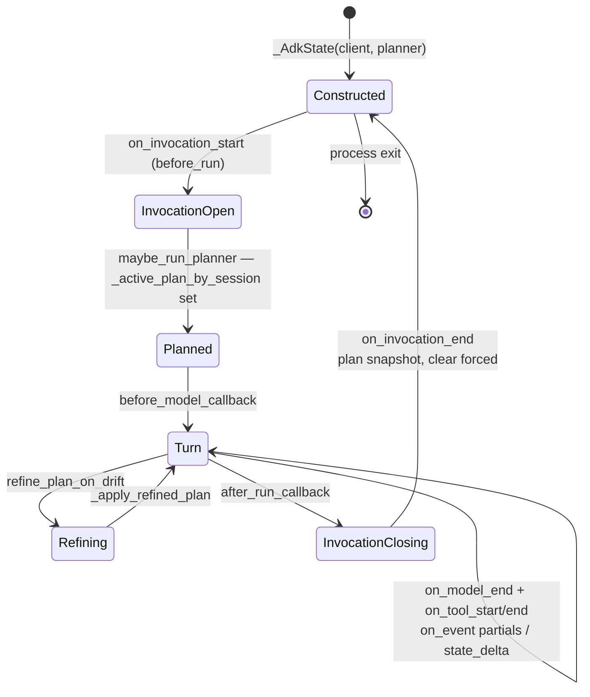
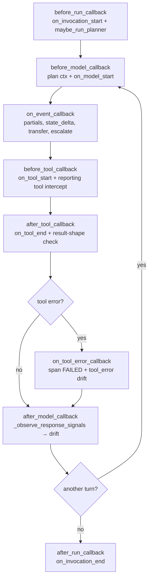
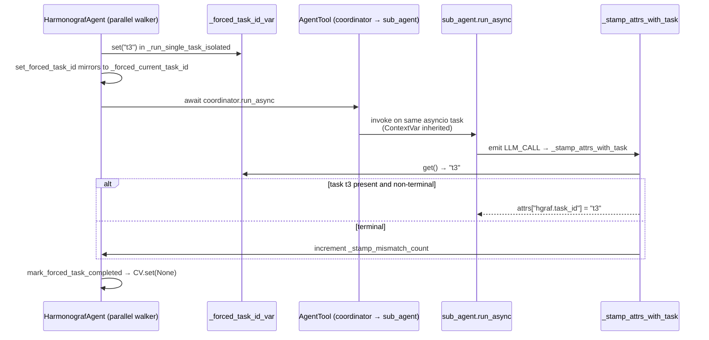
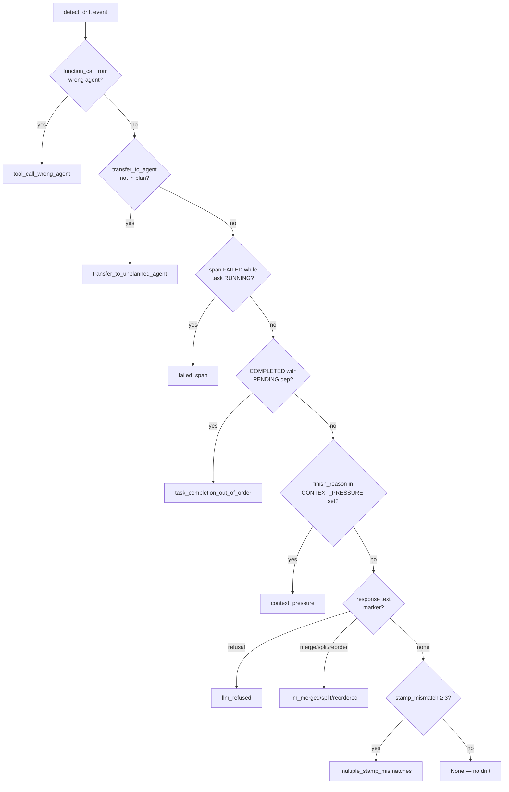
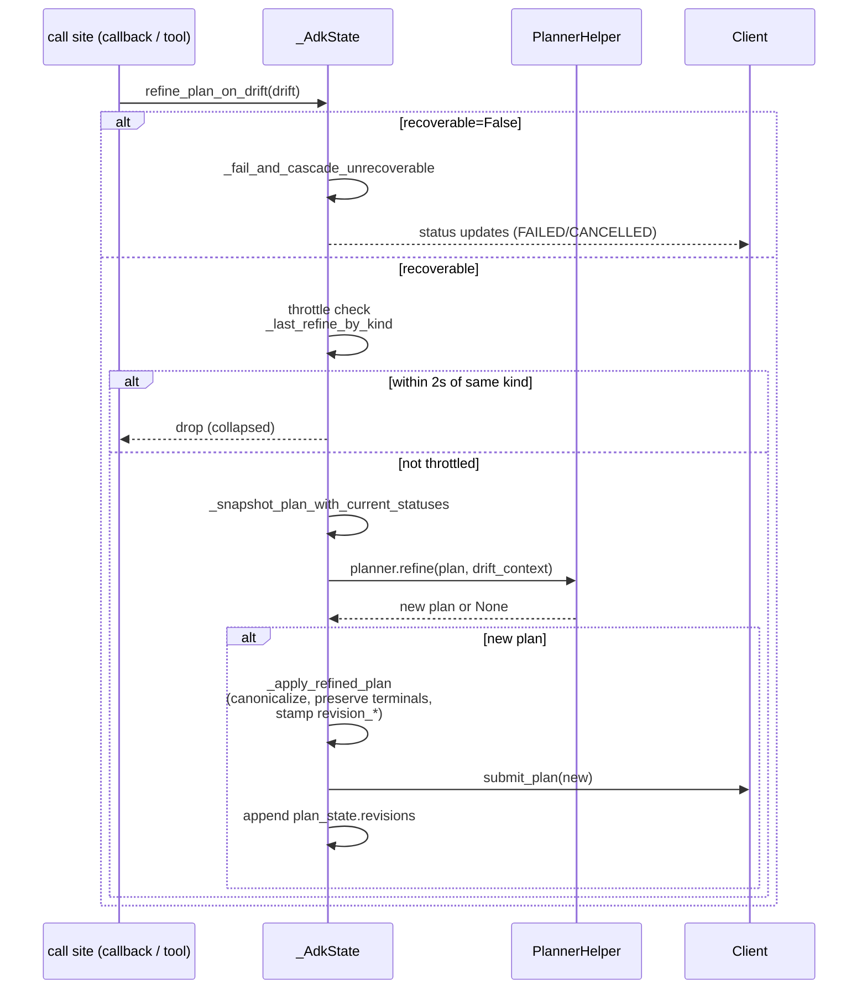

> **DEPRECATED (goldfive migration).** `client/harmonograf_client/adk.py` has
> been deleted. ADK integration now comes from goldfive's `ADKAdapter`
> (`goldfive.adapters.adk`) plus a slim `HarmonografTelemetryPlugin` that
> emits spans on the harmonograf side. See
> [../goldfive-integration.md](../goldfive-integration.md) and
> [../goldfive-migration-plan.md](../goldfive-migration-plan.md).

# An annotated tour of `adk.py`

`client/harmonograf_client/adk.py` is the single densest file in the repo, at
~5900 lines. It is the glue between Google ADK's agent runtime and
harmonograf's telemetry / plan-execution protocol. Almost every interesting
runtime behavior of the client library happens inside this one file.

The file has one central actor — `_AdkState` — wrapped by a small factory
`make_adk_plugin()` that installs ADK callbacks which all forward into the
state object. Everything else in the file is either a helper or a module-level
constant.

Read this doc with `adk.py` open in a second pane. Line references are
liberal; the goal is that you can trace every claim back to the source without
re-reading the file.

## Module-level constants

The constants live at the top of the file and you will see them referenced
throughout.

- **Drift kinds.** `adk.py:352-368` defines every `DRIFT_KIND_*` constant that
  has a named symbol. There are thirteen named constants; roughly the same
  number of drift kinds exist as bare string literals at their callsites. For
  the exhaustive enumeration with fire sites, severity, and recoverability,
  see [`drift-taxonomy-catalog.md`](drift-taxonomy-catalog.md).
- **Budgets and thresholds.** `_REINVOCATION_BUDGET = 3` (`adk.py:129`),
  `_STAMP_MISMATCH_THRESHOLD = 3` (`adk.py:373`),
  `_DRIFT_REFINE_THROTTLE_SECONDS = 2.0` (`adk.py:378`). Those three numbers
  control, respectively, how many times the coordinator can be re-nudged on a
  partial turn, how many consecutive forced-stamp rejections count as a
  structural drift, and how quickly the same drift kind can re-fire before it
  is collapsed.
- **Heuristic markers.** `_LLM_REFUSAL_MARKERS` (`adk.py:389`),
  `_LLM_MERGE_MARKERS` (`adk.py:404`), `_LLM_SPLIT_MARKERS` (`adk.py:416`),
  `_LLM_REORDER_MARKERS` (`adk.py:427`), and the
  `_CONTEXT_PRESSURE_FINISH_REASONS` frozenset (`adk.py:439`). These are
  surface-text heuristics for drift kinds where the model describes what it is
  doing in prose rather than calling a reporting tool.
- **Forced-task ContextVar.** `_forced_task_id_var` at `adk.py:320`. One of
  the most load-bearing five lines in the file — see the dedicated section
  below.

## `_AdkState`: the lifecycle

`_AdkState` accretes per-run state through a fixed sequence of
ADK-callback boundaries. The state-machine view of those boundaries —
construction, first invocation, the per-turn loop, and teardown:




`_AdkState` is defined at `adk.py:1591`. Its constructor (`adk.py:1597`)
takes the harmonograf `Client`, an optional `PlannerHelper`, a planner model
override, and a `refine_on_events` flag. Those four inputs are everything it
needs; all other state accretes during a run.

The fields worth knowing about (`adk.py:1605-1761`):

- `_client` (`1605`) is the telemetry sink. Every span this file emits goes
  through `self._client.submit_span_start / update / end` and related
  shortcuts. Do not grab the transport directly — the client adds buffering
  and ordering.
- `_active_plan_by_session: dict[str, PlanState]` (`1616`). **One plan per
  harmonograf session.** If you are looking up "the current plan", this is
  where it lives. Sub-invocations (AgentTool) do not get their own entry —
  they alias back to the parent's entry via the ContextVar routing described
  below.
- `_span_to_task` (`1619`). Which task each live span is currently bound to.
  Used to resolve status transitions when a span ends.
- `_lock = threading.Lock()` (`1620`). Serializes all dict mutations.
  Critical: `_AdkState` is not asyncio-native; it mixes sync locks with
  callbacks that run in the asyncio event loop. Do not hold `_lock` across
  `await` points. If you find yourself wanting to, extract the work to a
  helper that copies the data out first.
- `_invocations` (`1622`), `_llm_by_invocation` (`1624`), `_tools` (`1626`),
  `_tool_labels` (`1628`), `_long_running` (`1630`): the per-invocation span
  bookkeeping. Keys are ADK invocation/call ids; values are harmonograf span
  ids. This is how "close the currently open LLM_CALL for this invocation"
  works without the caller having to pass a span id around.
- `_current_root_hsession_var: ContextVar[str]` (`1656-1660`). Per-instance
  ContextVar that holds the *root* harmonograf session id for an asyncio task
  graph. Set at the start of a root invocation, inherited by AgentTool
  sub-runs because they execute on the same asyncio task.
- `_adk_to_h_session: dict[str, str]` (`1655`). Aliases ADK session ids onto
  harmonograf session ids. Sub-invocations run with a fresh ADK session id
  but we want them in the parent's timeline — this dict is how that
  happens.
- `_forced_current_task_id` (`1722`). The authoritative forced-task binding,
  owned by `HarmonografAgent` via `set_forced_task_id`. The ContextVar
  (`_forced_task_id_var`) is the per-asyncio-task scoped mirror.
- `_current_task_id / title / description / agent_id` (`1709-1712`). "What is
  the agent working on right now" — this is what the frontend banner reads.
  Updated every time a span binds to a task via `_stamp_attrs_with_task`.
- `_llm_streaming_text`, `_llm_thinking_text` (`1672-1675`). Rolling
  per-span accumulators for streaming partial content. The thinking text is
  windowed to ~600 chars so very long chain-of-thought runs do not blow
  memory.
- `_stamp_mismatch_count: int` (`1752`). Counter for the
  `multiple_stamp_mismatches` drift — incremented every time the forced
  binding path rejects a re-bind because the target is already terminal.
- `_metrics: ProtocolMetrics` (`1760`). Lightweight counters surfaced via
  `get_protocol_metrics()` (`1771`).
- `_recent_error_task_ids: set[str]` (`1737`), `_task_progress`,
  `_task_results`, `_task_blockers`, `_task_artifacts` (`1741-1744`). The
  side-channel the reporting tools write to — see "Reporting tools
  interception" below.

**Invocation boundaries.** `on_invocation_start(ic)` at `adk.py:1781` fires
from `before_run_callback` (`1141`); `on_invocation_end(ic)` at `adk.py:3792`
fires from `after_run_callback` (`1175`). The start hook does session
routing, registers the asyncio task handle, and may call
`maybe_run_planner()`. The end hook snapshots final plan state and clears
invocation tracking. Nothing special happens at class teardown — harmonograf
runs a single persistent `_AdkState` instance per Client process.

## The callback table

`make_adk_plugin(state)` (`adk.py:1138`) returns an `HarmonografAdkPlugin`
that implements the ADK plugin protocol. Every method is a thin forwarder:

| Callback | Line | What it adds |
| --- | --- | --- |
| `before_run_callback` | `adk.py:1141` | Calls `state.on_invocation_start(ic)`, registers reporting tools on the agent tree, calls `state.maybe_run_planner()` when the host agent is not a `HarmonografAgent` (the agent manages its own planner call otherwise). |
| `after_run_callback` | `adk.py:1175` | Calls `state.on_invocation_end(ic)`. |
| `before_model_callback` | `adk.py:1182` | Registers the asyncio task handle (for cancel), awaits any pending PAUSE, injects STEER text, writes plan context into `session.state`, and calls `state.on_model_start(cc, req)`. |
| `after_model_callback` | `adk.py:1227` | Calls `_observe_response_signals()` to parse markers out of the response text, routes outcome/divergence via `_route_after_model_signals()`, fires drift detection, and closes the LLM span via `state.on_model_end()`. |
| `before_tool_callback` | `adk.py:1299` | Opens a TOOL_CALL span via `state.on_tool_start()`. If the tool is one of the reporting tools, intercepts the call in `_dispatch_reporting_tool()` and returns a stub ACK — the tool body is never executed, the side effect is applied directly to `_AdkState`. |
| `after_tool_callback` | `adk.py:1318` | Closes the TOOL_CALL span via `state.on_tool_end()`. Inspects the return value for error shapes and may fire `tool_returned_error` / `tool_unexpected_result` drift. For `AgentTool` returns, captures the summary into `_task_results[forced_task_id]`. |
| `on_tool_error_callback` | `adk.py:1361` | Closes the span as FAILED and fires `DRIFT_KIND_TOOL_ERROR` with the exception message. |
| `on_event_callback` | `adk.py:1391` | Routes streaming partial ticks, state_delta writes, transfer_to_agent, and escalate flags via `state.on_event()`. |

The actual telemetry-emitting methods live on `_AdkState`:

- `on_model_start` (`adk.py:3845`) opens LLM_CALL, estimates context window,
  stamps the forced/assignee task id via `_stamp_attrs_with_task`.
- `on_model_end` (`adk.py:3930`) closes LLM_CALL, extracts thinking and
  response text separately, overwrites the context-window estimate with
  authoritative usage data, and may emit a `task_report` on the enclosing
  INVOCATION span.
- `on_tool_start` (`adk.py:4314`) opens TOOL_CALL, emits TRANSFER for
  AgentTool invocations, builds the tool_label used by STATUS_QUERY.
- `on_tool_end` (`adk.py:4411`) closes TOOL_CALL, records errors into
  `_recent_error_task_ids` for refine decisions.
- `on_event` (`adk.py:4466`) dispatches to `_on_event_partial`,
  `_on_event_state_delta`, `_on_event_transfer`, `_on_event_escalate`.

### Callback invocation order for one model turn

The eight callback hooks fire in a fixed order around a single LLM
turn, with `on_event_callback` interleaving partial / state_delta /
transfer events between `before_model_callback` and
`after_model_callback`.



## `_forced_task_id_var` and why AgentTool needs it

```python
_forced_task_id_var: contextvars.ContextVar[Optional[str]] = contextvars.ContextVar(
    "hgraf_forced_task_id", default=None
)
```
(`adk.py:320`)

This ContextVar solves a concurrency problem that only exists in ADK's
`AgentTool` pattern. When a coordinator calls another agent via `AgentTool`,
ADK runs the sub-agent inline on the parent asyncio task (via `await`). The
sub-agent's callbacks fire on the same task, so they see the parent's
`ContextVar` values. That is exactly what we want: if the parent is currently
working on task `t3`, any spans the sub-agent emits should also bind to `t3`
— not to some assignee fallback from the sub-agent's own metadata.

A module-level `dict[task_id, forced_id]` keyed by agent wouldn't work,
because the coordinator may have *concurrent* parallel-mode batches in
flight. `contextvars.ContextVar` gives per-asyncio-task scoping for free.

The forced id is set from `HarmonografAgent._run_single_task_isolated`
(`agent.py:1496`) just before dispatching the inner agent's run, and
`set_forced_task_id` (`adk.py:2436`) also mirrors into
`_forced_current_task_id` for the sync path. It is cleared at
`mark_forced_task_completed` (`adk.py:2557`), `clear_forced_task`
(`adk.py:2710`), the cancel control handler (`adk.py:2897`), and
`_fail_and_cascade_unrecoverable` (`adk.py:3602`).

Read sites that honor the forced binding:

- `_stamp_attrs_with_task` (`adk.py:3709`) — the primary enforcer.
- `on_tool_end` error tracking (`adk.py:4443`).
- The drift-detection site at `adk.py:1268` uses it to attribute drift to
  the right task when the coordinator's response does not name one.

### How AgentTool sub-runs inherit the forced id

The ContextVar inheritance is what makes a coordinator's forced binding
flow into a sub-agent's spans without explicit plumbing. The sequence
shows where the forced id is set, copied, and consumed.



## Task stamping: `_stamp_attrs_with_task`

Defined at `adk.py:3679-3790`. This is the single place where "which task
should this span be attributed to" gets decided. The contract: given a
span's attribute dict, an `agent_id`, a harmonograf session id, and a span
kind, it patches `attrs["hgraf.task_id"]` (and possibly the "current task"
tracker fields) to bind the span to a task, or leaves them unset if no task
matches.

The precedence order matters:

1. **Non-leaf spans are not stamped.** INVOCATION / TRANSFER spans skip
   binding entirely (`adk.py:3699-3708`). Only LLM_CALL and TOOL_CALL get
   stamped.
2. **Forced-task wins.** If `_forced_task_id_var.get()` (or
   `_forced_current_task_id`) resolves to a task present in the active
   `PlanState.tasks`, bind the span to it unconditionally — *unless* the
   target task is already terminal (COMPLETED/FAILED/CANCELLED). That guard
   at `adk.py:3717` is the structural fix for the old COMPLETED → RUNNING
   cycle bug. If the guard rejects, `_stamp_mismatch_count` is incremented
   (`adk.py:3728`), which eventually trips the
   `multiple_stamp_mismatches` drift.
3. **Assignee-fallback.** When no forced id is set, the stamping path walks
   `remaining_for_fallback` (`adk.py:3744-3768`), popping the first PENDING
   task whose assignee matches the current agent and whose dependencies are
   all COMPLETED (`_deps_satisfied`). This is what makes delegated mode work
   without an orchestrator explicitly naming tasks.

Both `on_model_start` (`adk.py:3906`) and `on_tool_start` (`adk.py:4354`)
call this before emitting the span, then record the binding into
`_span_to_task` via `_bind_span_to_task` so that span-end can transition the
task status. The "current task" fields (`_current_task_id` etc.) are also
updated here — that is what drives the frontend's "agent is working on X"
banner in real time.

## Drift detection

Drift detection has three surfaces:

1. **`detect_drift` (`adk.py:2916-3137`).** Runs on structural event
   signals: function_calls from the wrong agent, transfer_to_agent targets,
   FAILED spans, out-of-order completions, finish_reason token-pressure, and
   the surface-text markers for refusal/merge/split/reorder. Returns the
   first `DriftReason` found or `None`.
2. **`detect_semantic_drift` (`adk.py:3139-3253`).** Runs on completed task
   results. Parses the `result_summary` text for error markers, refusal,
   merge, split/reorder, empty result, "new work discovered" prose, and
   "contradicts plan" prose. This is the belt-and-suspenders layer for
   models that describe their work instead of calling reporting tools.
3. **Reporting-tool interception.** `_dispatch_reporting_tool` at
   `adk.py:4169` intercepts the seven reporting tool calls and creates
   drift entries directly (e.g. `report_task_blocked` fires a `task_blocked`
   drift at `adk.py:4257`).

Every drift kind — named constant or bare string — is enumerated in
[`drift-taxonomy-catalog.md`](drift-taxonomy-catalog.md). If you are adding
a new one, read that doc first to understand the severity/recoverability
conventions and the frontend icon mapping.

### Drift dispatch flowchart

`detect_drift` (`adk.py:2916-3137`) checks signals in priority order
and returns at the first match. The branch table:



See [`drift-taxonomy-catalog.md`](drift-taxonomy-catalog.md) for the
complete kind list and severity/recoverable matrix.

## The refine pipeline

`refine_plan_on_drift` (`adk.py:3255-3459`) is the single entry point every
drift flows through. Its job is:

1. **Throttle.** Recoverable drifts with `severity != "critical"` are
   collapsed per `(hsession_id, drift.kind)` via `_last_refine_by_kind`
   (`adk.py:1748`). If a refine for the same session+kind fired within
   `_DRIFT_REFINE_THROTTLE_SECONDS = 2.0`, the new drift is dropped
   (`adk.py:3324-3336`). This prevents a drift storm during a single
   broken turn from driving 200 planner calls.
2. **Unrecoverable cascade.** If `drift.recoverable=False` (currently only
   `user_cancel`), `_fail_and_cascade_unrecoverable` (`adk.py:3536`) takes
   over. It marks the current task FAILED, all other RUNNING tasks FAILED,
   BFS-walks the DAG and marks downstream PENDING tasks CANCELLED, clears
   the forced binding, and emits status updates for each transition. No
   planner call is made.
3. **Recoverable refine.** Build a `drift_context` dict (kind, detail,
   severity, recoverable, hint, current_task_id), snapshot the plan with
   current statuses via `_snapshot_plan_with_current_statuses`
   (`adk.py:3406`), call `planner.refine(plan, drift_context)` at
   `adk.py:3408`, and if the planner returns a new plan, hand it to
   `_apply_refined_plan`.

`_apply_refined_plan` (`adk.py:3461-3534`) canonicalizes assignees, stamps
revision metadata (`revision_reason`, `revision_kind`, `revision_severity`,
`revision_index`), **preserves terminal statuses from the old plan**
(`adk.py:3494-3498` — this is crucial; refine must never un-complete a
task), rebuilds `tasks_by_id`, swaps `plan_state.plan` and
`plan_state.tasks`, appends to `plan_state.revisions`, and submits the new
plan via `client.submit_plan`. The frontend then receives the diff via the
WatchSession stream and paints the banner.

### Refine pipeline sequence

The full path from a fired drift through throttle, planner call, and
plan apply, including the unrecoverable cascade fork:



## Planner integration

`maybe_run_planner` (`adk.py:1863-2020`) is the planner entry point on the
plugin side. It early-returns in several cases:

- No planner configured.
- No invocation id on the context.
- `host_agent is None` **and** the invocation's agent is a
  `HarmonografAgent`. The agent owns its own planner call and passes
  `host_agent` explicitly when it calls through.
- The session already has an entry in `_active_plan_by_session` (the
  one-plan-per-session guard at `adk.py:1898-1914`). Sub-invocations via
  AgentTool reuse the parent's plan through the ContextVar route.

Otherwise it extracts the user request
(`_extract_user_request_from_ic`), collects available agents, resolves the
planner model (preferring `_planner_model`, then `planner.model`, then the
host agent's model), calls `planner.generate(...)`, canonicalizes assignees
via `_canonicalize_plan_assignees` (`adk.py:1966`) to smooth out LLM
hallucinations like `"Research_Agent"` → `"research-agent"`, submits the
plan, and builds a fresh `PlanState` with a `tasks_by_id` dict, a
`remaining_for_fallback` list, and metadata.

**`session.state` hydration.** `_write_plan_context_to_session_state`
(`adk.py:761-836`) uses the `state_protocol` module to write
`harmonograf.plan_id`, `harmonograf.plan_summary`,
`harmonograf.available_tasks`, `harmonograf.completed_task_results`, and
the current task fields before each model call. It also snapshots the
pre-turn state so that after-model-callback can diff agent-written writes
via `state_protocol.extract_agent_writes`. See
[`../reporting-tools.md`](../reporting-tools.md) for the reporting-tool
contract and `state_protocol.py` for the key definitions.

## Sub-invocation routing: `_route_from_context`

Defined at `adk.py:5009-5052`. Given an invocation context (and an optional
`opening_root=True` flag for the first call), it returns
`(agent_id, harmonograf_session_id)`. The decision tree:

1. If the ADK session id is already in `_adk_to_h_session`, reuse the
   mapped harmonograf session. Covers repeat callbacks on an established
   session.
2. Else consult `_current_root_hsession_var`. If set, this invocation is
   nested (AgentTool sub-run); alias to the parent's hsession.
3. Else if `opening_root=True`, mint a fresh harmonograf session via
   `_harmonograf_session_id_for_adk`.

This is why two concurrent top-level `/run` calls land in independent
sessions (each asyncio task sees an empty ContextVar) while a coordinator's
AgentTool call shares the parent's session (the ContextVar is inherited).

## Thinking capture

There are two paths. The `on_model_end` path (`adk.py:3939-3957`) walks
`resp.content.parts`, uses `_part_is_thought(p)` to split thought parts from
response parts, and emits them into the LLM_CALL span as separate
attributes: `response_preview` (≤300 char), `thinking_preview` (≤300 char),
`thinking_text` (full text), and `has_thinking` (bool). The frontend
extracts these via `thinking.ts` to render the brain badge on the
LLM_CALL block and the full thinking in the popover.

The `on_event_partial` path (`adk.py:4514-4556`) is for live streaming:
partial content events accumulate into `_llm_thinking_text[llm_span_id]`
under a rolling 600-character window, and each tick pushes an updated
`thinking_text` attribute plus calls
`emit_thinking_as_task_report(llm_span_id, accumulated)`. This is what
powers live thinking display while a model is still producing.

## Context window capture

Provisional estimate at `on_model_start` (`adk.py:3890-3901`):
`_estimate_request_tokens(req)` (a ~chars/4 heuristic) plus
`_lookup_context_window_limit(model)` for the model-specific max. The
estimate is pushed via `client.set_context_window(tokens, limit)`. This is
best-effort — the point is to have *something* to render before the model
replies.

Authoritative update at `on_model_end` (`adk.py:3966-3982`): reads
`resp.usage_metadata.prompt_token_count` and overwrites the estimate. If
the response's `model_version` doesn't resolve to a known limit, it
preserves the earlier limit rather than dropping to `None` — otherwise the
context-window overlay would flicker to empty on the first response.

## Metrics and invariants

Metrics are cheap atomic counters on `ProtocolMetrics` (imported at
`adk.py:115`, instantiated at `adk.py:1760`). Every callback bumps
`_metrics.callbacks_fired["<name>"]`; every refine bumps
`_metrics.refine_fires[drift.kind]`; every reporting tool bumps
`_metrics.reporting_tools_invoked[tool_name]`. These are exposed via
`get_protocol_metrics()` (`adk.py:1771`) and `format_protocol_metrics()`
(`adk.py:1774`), and the server scrapes them over the telemetry channel.

Invariant validation is not called from `adk.py` directly — it runs from
`HarmonografAgent._validate_invariants` at turn boundaries. See
[`harmonograf-agent-tour.md`](harmonograf-agent-tour.md) and
[`invariant-validator.md`](invariant-validator.md).

## Gotchas that bit prior iterations

- **Do not hold `_lock` across an `await`.** Several early bugs came from
  doing so and deadlocking the asyncio loop.
- **The forced-task terminal guard is load-bearing.** Removing it
  re-introduces the COMPLETED → RUNNING cycle bug. If you need to re-run
  a terminal task, explicitly clear the terminal status first and then
  re-set the forced id; do not bypass the guard.
- **Sub-invocations must route via ContextVar, not ADK session id.** ADK
  mints a fresh session id for sub-runs; relying on it as the key into
  `_active_plan_by_session` will fragment the plan across the parent and
  the sub-run. Always route through `_route_from_context`.
- **The refine throttle key is `(session, kind)` not just `kind`.**
  Two different sessions can legitimately drift on the same kind within
  the 2-second window.
- **`_stamp_attrs_with_task` mutates the dict in place and returns it.**
  Callers rely on the patched dict — do not pass a copy.
- **Terminal statuses in the refined plan must be preserved.** If the
  planner returns a plan that moves a COMPLETED task back to PENDING,
  `_apply_refined_plan` rewrites it to COMPLETED. This is by design;
  see [`invariant-validator.md`](invariant-validator.md) for the
  monotonic-status rule.
