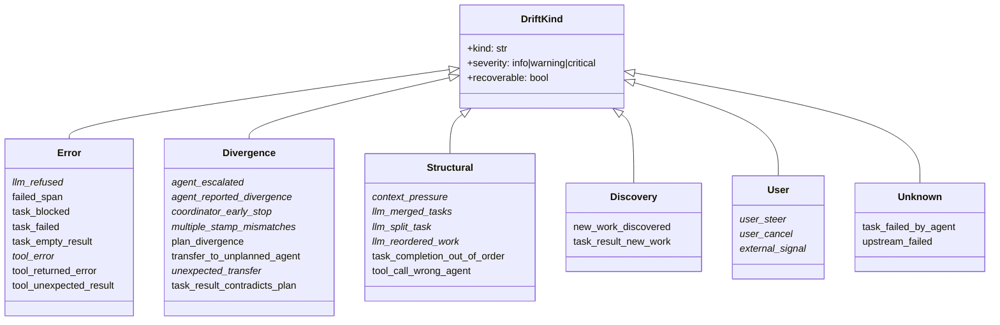
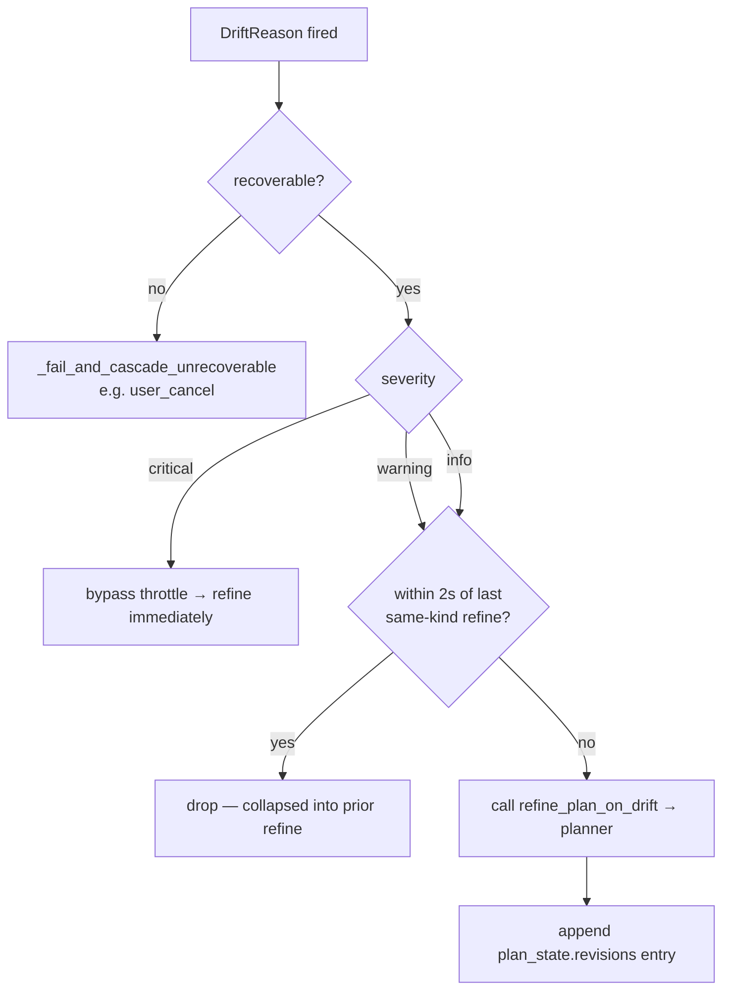

# Drift taxonomy catalog

Every drift kind that harmonograf fires during a run. A drift is a
structured observation that the execution has diverged from the plan in
some way — ranging from minor ("the LLM merged two tasks into one") to
critical ("the user cancelled"). Every drift flows through one central
path, `refine_plan_on_drift` at `adk.py:3255`, which decides whether to
throttle, refine, or cascade-fail.

This document enumerates every drift kind. Each entry gives:

- **Constant / string value** — the stable identifier.
- **Definition line / fire site(s)** — where it's declared and raised.
- **Trigger condition** — what state makes it fire.
- **Severity / recoverable** — the fields on the `DriftReason` at fire
  time.
- **Example data** — what `hint` or `detail` is attached.
- **Frontend metadata** — icon, color, label, category from
  `frontend/src/gantt/driftKinds.ts`.

Keep this catalog updated when adding a new drift kind. The frontend
metadata (`frontend/src/gantt/driftKinds.ts:30-58`) must be updated in
the same change; otherwise the frontend shows a fallback "Plan revised"
badge for the new kind.

All 29 kinds, grouped by the frontend `category` from
`frontend/src/gantt/driftKinds.ts`. Kinds whose constant lives in
`adk.py` are marked with `*`; bare-string kinds are unmarked. The two
"unknown" entries fall back to the "Plan revised" badge because they
have no explicit `driftKinds.ts` row.



## Central mechanics

Before the catalog, some mechanics that every entry depends on.

### The `DriftReason` shape

```python
@dataclass
class DriftReason:
    kind: str                             # e.g. "tool_error"
    detail: str                           # human one-liner
    event_id: str = ""                    # source event when applicable
    severity: str = "info"                # info | warning | critical
    recoverable: bool = True              # cascade-fail if False
    hint: dict[str, Any] = field(...)     # structured context for refiner
```

Severity is one of three strings. "info" is the default for every drift
that doesn't explicitly specify; "warning" is used for structural
problems that are still recoverable; "critical" is reserved for
unrecoverable situations. There is no central `DRIFT_KIND_SEVERITIES`
mapping — severity is set per-call at the fire site.

### The throttle

In `refine_plan_on_drift`, recoverable non-critical drifts are
collapsed per `(hsession_id, drift.kind)` pair within
`_DRIFT_REFINE_THROTTLE_SECONDS = 2.0` (`adk.py:378`). The last-refine
timestamps are kept in `_last_refine_by_kind`. Critical or
unrecoverable drifts bypass the throttle.

### The revision record

Every successful refine appends an entry to `plan_state.revisions`
with `revised_at`, `kind`, `detail`, `severity`, `reason`, and
`drift_kind`. `plan.revision_reason` is stamped as
`"{drift.kind}: {detail[:200]}"` (`adk.py:3352`) and the
`revision_kind` / `revision_severity` / `revision_index` fields are
updated. The frontend reads these to render the "Plan revised"
banner.

### Severity × recoverable decision matrix

The two fields determine what `refine_plan_on_drift` does on receipt.
`recoverable=False` is the only path that bypasses the planner entirely
and runs `_fail_and_cascade_unrecoverable`. The 2-second per-kind
throttle only applies when both fields are "soft": recoverable AND
non-critical.



### The unrecoverable cascade

When `recoverable=False`, `_fail_and_cascade_unrecoverable`
(`adk.py:3536`) marks the current task FAILED, marks all RUNNING
tasks FAILED, BFS-walks the DAG to mark downstream PENDING tasks
CANCELLED, clears the forced binding, and emits status updates.
No planner call happens.

## The catalog

### 1. `agent_escalated`

- **Constant:** `DRIFT_KIND_AGENT_ESCALATED` at `adk.py:361`.
- **Fire site:** `adk.py:4755` in `_on_event_escalate`.
- **Trigger:** A sub-agent set the `escalate` action flag on an
  Event, signaling it cannot handle the current work and needs the
  coordinator or a different sub-agent to take over.
- **Severity / recoverable:** info / recoverable.
- **Example data:**
  ```python
  DriftReason(
      kind="agent_escalated",
      detail="sub-agent escalated — likely needs different handling",
  )
  ```
- **Frontend:** `⚠` / `#f59e0b` / "Escalated" / divergence.

### 2. `agent_reported_divergence`

- **Constant:** `DRIFT_KIND_AGENT_REPORTED_DIVERGENCE` at `adk.py:362`.
- **Fire sites:** `adk.py:920` (model_callbacks when state_delta sets
  the flag) and `adk.py:4675` (event-level divergence flag).
- **Trigger:** The agent explicitly set `harmonograf.divergence_flag`
  in a state_delta write, indicating the plan is stale and needs
  replanning.
- **Severity / recoverable:** info / recoverable.
- **Example data:** detail defaults to the agent's note if present,
  else `"agent set harmonograf.divergence_flag"`.
- **Frontend:** `⟷` / `#f59e0b` / "Agent flagged divergence" /
  divergence.

### 3. `context_pressure`

- **Constant:** `DRIFT_KIND_CONTEXT_PRESSURE` at `adk.py:356`.
- **Fire site:** `adk.py:3064` in `detect_drift`.
- **Trigger:** An event's `finish_reason` is in
  `_CONTEXT_PRESSURE_FINISH_REASONS` (`adk.py:439`) — MAX_TOKENS,
  LENGTH, and similar reasons indicating the response was
  truncated because the model hit a length cap.
- **Severity / recoverable:** warning / recoverable.
- **Example data:**
  ```python
  DriftReason(
      kind=DRIFT_KIND_CONTEXT_PRESSURE,
      detail=f"response truncated (finish_reason={finish_reason})",
      severity="warning",
      hint={"finish_reason": finish_reason},
  )
  ```
- **Refine implication:** The refiner typically splits the current
  task into smaller sub-steps or budgets fewer tokens per sub-call.
- **Frontend:** `⚡` / `#f59e0b` / "Context limit" / structural.

### 4. `coordinator_early_stop`

- **Constant:** `DRIFT_KIND_COORDINATOR_EARLY_STOP` at `adk.py:368`.
- **Fire site:** `agent.py:993` in
  `HarmonografAgent._fire_coordinator_early_stop`.
- **Trigger:** The sequential coordinator closed its turn with
  tasks still in PENDING — they were never even started.
- **Severity / recoverable:** warning / recoverable (explicit
  flags at `agent.py:988-989`).
- **Example data:**
  ```python
  DriftReason(
      kind=DRIFT_KIND_COORDINATOR_EARLY_STOP,
      detail=f"coordinator ended turn with {n} task(s) still PENDING: {ids}",
      severity="warning",
      recoverable=True,
      hint={"pending_task_ids": list(pending_ids)},
  )
  ```
- **Note:** Fires once per sequential run, after the re-invocation
  budget has been exhausted.
- **Frontend:** `⏸` / `#f59e0b` / "Early stop" / divergence.

### 5. `external_signal`

- **Constant:** `DRIFT_KIND_EXTERNAL_SIGNAL` at `adk.py:364`.
- **Fire site:** None — reserved for future use.
- **Trigger:** Not currently wired. The constant exists for an
  anticipated integration with external event sources (webhooks,
  cron-driven steering).
- **Frontend:** `⟶` / `#8d9199` / "External" / user.

### 6. `failed_span`

- **Constant:** None (bare string at `adk.py:3036`).
- **Fire site:** `adk.py:3036` in `detect_drift` (Signal 3).
- **Trigger:** A span ended with FAILED status while its bound
  task was in RUNNING state. Indicates an unexpected failure
  during execution (not a tool error caught at the plugin level).
- **Severity / recoverable:** info / recoverable.
- **Example data:**
  ```python
  DriftReason(
      kind="failed_span",
      detail=f"task {bound_tid} span ended FAILED while RUNNING",
      event_id=ev_id,
  )
  ```
- **Frontend:** `✗` / `#e06070` / "Failed span" / error.

### 7. `llm_merged_tasks`

- **Constant:** `DRIFT_KIND_LLM_MERGED_TASKS` at `adk.py:353`.
- **Fire sites:** `adk.py:3094` (from text markers in response) and
  `adk.py:3211` (from result summary in `detect_semantic_drift`).
- **Trigger:** LLM response or task result text matches one of
  `_LLM_MERGE_MARKERS` ("merging tasks", "combined task",
  "consolidating", "fold into one task", etc.).
- **Severity / recoverable:** info / recoverable.
- **Example data:**
  ```python
  DriftReason(
      kind=DRIFT_KIND_LLM_MERGED_TASKS,
      detail=f"LLM merge marker {m!r}: {text[:140]!r}",
      severity="info",
      hint={"marker": m, "text": text[:500]},
  )
  ```
- **Refine implication:** Refine is given the marker and the
  surrounding text, and is expected to either (a) update the plan
  to reflect the merge or (b) instruct the coordinator not to
  merge if the dependency graph requires the tasks to stay
  separate.
- **Frontend:** `⊕` / `#5b8def` / "Merged tasks" / structural.

### 8. `llm_refused`

- **Constant:** `DRIFT_KIND_LLM_REFUSED` at `adk.py:352`.
- **Fire sites:** `adk.py:3085` (from response text) and
  `adk.py:3200` (from result summary).
- **Trigger:** Response text matches one of `_LLM_REFUSAL_MARKERS`
  ("i cannot", "i refuse", "i'm unable", "cannot assist", etc.).
- **Severity / recoverable:** warning / recoverable.
- **Example data:**
  ```python
  DriftReason(
      kind=DRIFT_KIND_LLM_REFUSED,
      detail=f"LLM refusal marker {m!r}: {text[:140]!r}",
      severity="warning",
      hint={"marker": m, "text": text[:500]},
  )
  ```
- **Refine implication:** Usually the refiner rewrites the task
  description to be less ambiguous or splits it, or escalates to
  the user.
- **Frontend:** `🚫` / `#e06070` / "Refused" / error.

### 9. `llm_reordered_work`

- **Constant:** `DRIFT_KIND_LLM_REORDERED_WORK` at `adk.py:355`.
- **Fire site:** `adk.py:3112` in `detect_drift`.
- **Trigger:** Response text matches one of `_LLM_REORDER_MARKERS`
  ("reordering the plan", "out of order", "doing this first",
  "switching the order").
- **Severity / recoverable:** info / recoverable.
- **Example data:** detail includes the marker and excerpt; hint
  has `marker` and `text`.
- **Frontend:** `⇄` / `#5b8def` / "Reordered" / structural.

### 10. `llm_split_task`

- **Constant:** `DRIFT_KIND_LLM_SPLIT_TASK` at `adk.py:354`.
- **Fire site:** `adk.py:3103` in `detect_drift`.
- **Trigger:** Response text matches one of `_LLM_SPLIT_MARKERS`
  ("splitting task", "break this task into", "divide this
  task").
- **Severity / recoverable:** info / recoverable.
- **Frontend:** `⊗` / `#5b8def` / "Split task" / structural.

### 11. `multiple_stamp_mismatches`

- **Constant:** `DRIFT_KIND_MULTIPLE_STAMP_MISMATCHES` at
  `adk.py:357`.
- **Fire site:** `adk.py:3128` in `detect_drift`.
- **Trigger:** `_stamp_mismatch_count >= _STAMP_MISMATCH_THRESHOLD`
  (3). Every time the forced-task stamping path rejects a re-bind
  because the target is already terminal, the counter increments.
  Reaching three is the signal that the plan has drifted far
  enough from actual execution that refine is warranted.
- **Severity / recoverable:** warning / recoverable.
- **Example data:**
  ```python
  DriftReason(
      kind=DRIFT_KIND_MULTIPLE_STAMP_MISMATCHES,
      detail=f"{mismatches} forced-task stamp rejections — plan likely out of sync",
      severity="warning",
      hint={"count": mismatches},
  )
  ```
- **Reset:** The counter is reset after a successful refine
  (`adk.py:3415-3416`).
- **Frontend:** `≠` / `#f59e0b` / "Plan drift" / divergence.

### 12. `new_work_discovered`

- **Constant:** None (bare string).
- **Fire site:** `adk.py:4284` in
  `_handle_report_new_work_discovered`.
- **Trigger:** The agent explicitly calls the
  `report_new_work_discovered` reporting tool. Execution
  revealed previously unknown work that should be added under a
  parent task.
- **Severity / recoverable:** info / recoverable.
- **Example data:**
  ```python
  DriftReason(
      kind="new_work_discovered",
      detail=f"new work under {parent_id}: {title}: {description}",
  )
  ```
- **Frontend:** `✨` / `#4caf50` / "New work" / discovery.

### 13. `plan_divergence`

- **Constant:** None (bare string).
- **Fire site:** `adk.py:4307` in `_handle_report_plan_divergence`.
- **Trigger:** The agent explicitly calls the
  `report_plan_divergence` reporting tool with a freeform note.
- **Severity / recoverable:** info / recoverable.
- **Example data:**
  ```python
  DriftReason(
      kind="plan_divergence",
      detail=f"{note} (suggested: {suggested})" if suggested else note,
  )
  ```
- **Frontend:** `⟷` / `#f59e0b` / "Divergence" / divergence.

### 14. `task_blocked`

- **Constant:** None (bare string).
- **Fire sites:** `adk.py:4257` (reporting tool) and `adk.py:4657`
  (state_delta event path).
- **Trigger:** The agent calls `report_task_blocked` or writes a
  blocked marker into state_delta. The task cannot proceed
  without external action.
- **Severity / recoverable:** info / recoverable.
- **Example data:**
  ```python
  DriftReason(
      kind="task_blocked",
      detail=f"task {task_id} blocked: {blocker} (needed: {needed})",
  )
  ```
- **Frontend:** `⛔` / `#f59e0b` / "Blocked" / error.

### 15. `task_completion_out_of_order`

- **Constant:** None (bare string).
- **Fire site:** `adk.py:3047` in `detect_drift` (Signal 4).
- **Trigger:** An event marks a task COMPLETED but at least one of
  that task's dependencies is not yet COMPLETED. Violates the
  plan's dependency graph.
- **Severity / recoverable:** info / recoverable.
- **Example data:**
  ```python
  DriftReason(
      kind="task_completion_out_of_order",
      detail=f"task {completed_tid} marked COMPLETED but dependencies are not all COMPLETED",
      event_id=ev_id,
  )
  ```
- **Invariant implication:** This drift and the
  `dependency_consistency` invariant check the same condition
  from two angles. The drift fires first (at event time); the
  invariant runs at turn boundary and catches cases the drift
  detector missed.
- **Frontend:** `≠` / `#f59e0b` / "Out of order" / structural.

### 16. `task_empty_result`

- **Constant:** None (bare string).
- **Fire site:** `adk.py:3220` in `detect_semantic_drift`.
- **Trigger:** A task completed with a `result_summary` that is
  empty or < 20 characters after stripping whitespace. The agent
  produced no meaningful output.
- **Severity / recoverable:** info / recoverable.
- **Example data:**
  ```python
  DriftReason(
      kind="task_empty_result",
      detail=f"task {tid} produced empty/stub result (len={n}): {text!r}",
  )
  ```
- **Frontend:** `○` / `#8d9199` / "Empty result" / error.

### 17. `task_failed`

- **Constant:** None (bare string).
- **Fire sites:** `adk.py:2753` (in `_refine_after_task_failure`),
  and three sites inside `detect_semantic_drift` —
  `adk.py:3172` (event FAILED), `adk.py:3179` (event error
  attribute), `adk.py:3189` (error markers in result text).
- **Trigger:** Any of: event-level FAILED status, event-level
  error attribute, or error markers in the result text
  ("error:", "exception:", "traceback", "failed to", etc.).
- **Severity / recoverable:** info / recoverable.
- **Example data:**
  ```python
  DriftReason(
      kind="task_failed",
      detail=f"task {tid} event reported status FAILED",
      event_id=str(...),
  )
  ```
- **Frontend:** `✗` / `#e06070` / "Task failed" / error.

### 18. `task_failed_by_agent`

- **Constant:** None (bare string).
- **Fire sites:** `adk.py:901` (model_callbacks / state_delta),
  `adk.py:954` (text marker "Task failed: tN"), `adk.py:4636`
  (on_event state_delta path).
- **Trigger:** The agent explicitly marked a task FAILED via
  state_delta or via a text marker, as opposed to external span
  failure.
- **Severity / recoverable:** info / recoverable.
- **Example data:**
  ```python
  DriftReason(
      kind="task_failed_by_agent",
      detail=f"agent reported task {tid} failed via state_delta",
  )
  ```
- **Frontend:** No explicit entry; falls back to UNKNOWN
  ("Plan revised").

### 19. `task_result_contradicts_plan`

- **Constant:** None (bare string).
- **Fire site:** `adk.py:3249` in `detect_semantic_drift`.
- **Trigger:** Task result text matches a contradiction marker —
  "was wrong", "is incorrect", "mistake", "contradicts",
  "reconsider".
- **Severity / recoverable:** info / recoverable.
- **Example data:**
  ```python
  DriftReason(
      kind="task_result_contradicts_plan",
      detail=f"task {tid} contradicts plan ({marker!r}): {text[:140]!r}",
  )
  ```
- **Frontend:** `⟷` / `#f59e0b` / "Contradicts plan" / divergence.

### 20. `task_result_new_work`

- **Constant:** None (bare string).
- **Fire site:** `adk.py:3237` in `detect_semantic_drift`.
- **Trigger:** Result text has a "new work" marker — "need to",
  "requires", "blocked by", "should also", "further
  investigation". The semantic-layer counterpart to the
  tool-reported `new_work_discovered` drift.
- **Severity / recoverable:** info / recoverable.
- **Frontend:** `✨` / `#4caf50` / "New work" / discovery.

### 21. `tool_call_wrong_agent`

- **Constant:** None (bare string).
- **Fire sites:** `adk.py:2986` (orchestration mode) and
  `adk.py:3003` (delegated mode), both inside `detect_drift`.
- **Trigger:** An event reports a function_call from an agent
  that is not the expected assignee. In orchestration mode, the
  caller's agent id doesn't match the current task's assignee.
  In delegated mode, the caller's agent id doesn't match any
  currently-eligible task.
- **Severity / recoverable:** info / recoverable.
- **Example data (orch mode):**
  ```python
  DriftReason(
      kind="tool_call_wrong_agent",
      detail=f"tool {fc_name!r} called by {author!r} but current task assignee is {current_assignee!r}",
      event_id=ev_id,
  )
  ```
- **Frontend:** `↪` / `#f59e0b` / "Wrong agent" / structural.

### 22. `tool_error`

- **Constant:** `DRIFT_KIND_TOOL_ERROR` at `adk.py:360`.
- **Fire site:** `adk.py:1381` in `on_tool_error_callback`.
- **Trigger:** A tool call raised an exception. The callback
  closes the span FAILED and fires this drift.
- **Severity / recoverable:** info / recoverable.
- **Example data:**
  ```python
  DriftReason(
      kind="tool_error",
      detail=f"{tool_name}: {error}",
  )
  ```
- **Frontend:** `⚠` / `#e06070` / "Tool error" / error.

### 23. `tool_returned_error`

- **Constant:** None (bare string).
- **Fire sites:** `adk.py:5092`, `5098`, `5106`, `5111` inside
  `_check_tool_response`.
- **Trigger:** The tool returned a response that indicates
  failure via one of four shapes: None return, dict with an
  "error" key, dict with a status key of "failed"/"error", or
  dict with `ok=False`.
- **Severity / recoverable:** info / recoverable.
- **Frontend:** `🔻` / `#e06070` / "Bad result" / error.

### 24. `tool_unexpected_result`

- **Constant:** None (bare string).
- **Fire sites:** `adk.py:5116`, `5122`, `5127` inside
  `_check_tool_response`.
- **Trigger:** The tool returned a structurally valid but
  semantically empty response — empty dict, empty list/tuple/set,
  or empty/whitespace string.
- **Severity / recoverable:** info / recoverable.
- **Frontend:** `❓` / `#f59e0b` / "Odd result" / error.

### 25. `transfer_to_unplanned_agent`

- **Constant:** None (bare string).
- **Fire site:** `adk.py:3022` in `detect_drift` (Signal 2).
- **Trigger:** An event's `actions.transfer_to_agent` targets an
  agent that is not assigned any task in the current plan.
- **Severity / recoverable:** info / recoverable.
- **Example data:**
  ```python
  DriftReason(
      kind="transfer_to_unplanned_agent",
      detail=f"transfer to {tgt!r} which is not assigned any plan task",
      event_id=ev_id,
  )
  ```
- **Frontend:** `↪` / `#f59e0b` / "Unplanned transfer" /
  divergence.

### 26. `unexpected_transfer`

- **Constant:** `DRIFT_KIND_UNEXPECTED_TRANSFER` at `adk.py:363`.
- **Fire site:** `adk.py:4731` in `_on_event_transfer`.
- **Trigger:** An agent's transfer action targets a different
  agent than the plan expected next. Distinct from
  `transfer_to_unplanned_agent`, which fires when the target
  isn't in the plan at all — this one fires when the target is
  in the plan but in the wrong order.
- **Severity / recoverable:** info / recoverable.
- **Frontend:** `↪` / `#f59e0b` / "Unexpected transfer" /
  divergence.

### 27. `upstream_failed`

- **Constant:** None (bare string).
- **Fire site:** `adk.py:2763` in `_refine_after_task_failure`.
- **Trigger:** A task failed and has one or more PENDING tasks
  depending on it. This drift gives the refiner a chance to
  reroute the downstream work — for example, by dropping the
  dependents or assigning them to a different agent.
- **Severity / recoverable:** info / recoverable.
- **Example data:**
  ```python
  DriftReason(
      kind="upstream_failed",
      detail=f"task {failed_tid} failed; {n} downstream pending: {ids}",
  )
  ```
- **Frontend:** No explicit entry; falls back to UNKNOWN.

### 28. `user_cancel`

- **Constant:** `DRIFT_KIND_USER_CANCEL` at `adk.py:359`.
- **Fire site:** `adk.py:1536` in `_handle_cancel`.
- **Trigger:** A user issues a CANCEL control action, requesting
  immediate termination of the active task and plan.
- **Severity / recoverable:** **critical / unrecoverable**
  (explicit at `adk.py:1538-1539`). This is the only drift kind
  currently marked unrecoverable.
- **Example data:**
  ```python
  DriftReason(
      kind=DRIFT_KIND_USER_CANCEL,
      detail=f"user cancel: {detail}",
      severity="critical",
      recoverable=False,
      hint={"cancelled_running": bool(cancelled)},
  )
  ```
- **Effect:** Triggers `_fail_and_cascade_unrecoverable`. Current
  task FAILED, all RUNNING tasks FAILED, downstream PENDING
  tasks CANCELLED, forced binding cleared. No planner call.
- **Frontend:** `⏹` / `#e06070` / "User cancelled" / user.

### 29. `user_steer`

- **Constant:** `DRIFT_KIND_USER_STEER` at `adk.py:358`.
- **Fire site:** `adk.py:1439` in `_handle_steer`.
- **Trigger:** A user issues a STEER control action with a
  free-form instruction, requesting that the plan incorporate
  the user's guidance. Two modes: "append" (add the instruction
  as new work) and "cancel" (stop current work and replace it).
- **Severity / recoverable:** warning / recoverable.
- **Example data:**
  ```python
  DriftReason(
      kind=DRIFT_KIND_USER_STEER,
      detail=f"user steer: {body[:200]}",
      severity="warning",
      hint={"user_text": body, "mode": mode},
  )
  ```
- **Note:** Steering is deferential — the planner may decide
  the user's instruction is already covered by the plan and
  return None, in which case no refinement happens.
- **Frontend:** `👆` / `#a8c8ff` / "User steered" / user.

## Summary table

| # | Kind | Constant? | Definition | Severity | Recoverable |
|---|---|---|---|---|---|
| 1 | agent_escalated | YES | adk.py:361 | info | yes |
| 2 | agent_reported_divergence | YES | adk.py:362 | info | yes |
| 3 | context_pressure | YES | adk.py:356 | warning | yes |
| 4 | coordinator_early_stop | YES | adk.py:368 | warning | yes |
| 5 | external_signal | YES | adk.py:364 | — | (unused) |
| 6 | failed_span | no | adk.py:3036 | info | yes |
| 7 | llm_merged_tasks | YES | adk.py:353 | info | yes |
| 8 | llm_refused | YES | adk.py:352 | warning | yes |
| 9 | llm_reordered_work | YES | adk.py:355 | info | yes |
| 10 | llm_split_task | YES | adk.py:354 | info | yes |
| 11 | multiple_stamp_mismatches | YES | adk.py:357 | warning | yes |
| 12 | new_work_discovered | no | adk.py:4284 | info | yes |
| 13 | plan_divergence | no | adk.py:4307 | info | yes |
| 14 | task_blocked | no | adk.py:4257,4657 | info | yes |
| 15 | task_completion_out_of_order | no | adk.py:3047 | info | yes |
| 16 | task_empty_result | no | adk.py:3220 | info | yes |
| 17 | task_failed | no | adk.py:2753,3172,3179,3189 | info | yes |
| 18 | task_failed_by_agent | no | adk.py:901,954,4636 | info | yes |
| 19 | task_result_contradicts_plan | no | adk.py:3249 | info | yes |
| 20 | task_result_new_work | no | adk.py:3237 | info | yes |
| 21 | tool_call_wrong_agent | no | adk.py:2986,3003 | info | yes |
| 22 | tool_error | YES | adk.py:360 | info | yes |
| 23 | tool_returned_error | no | adk.py:5092+ | info | yes |
| 24 | tool_unexpected_result | no | adk.py:5116+ | info | yes |
| 25 | transfer_to_unplanned_agent | no | adk.py:3022 | info | yes |
| 26 | unexpected_transfer | YES | adk.py:363 | info | yes |
| 27 | upstream_failed | no | adk.py:2763 | info | yes |
| 28 | user_cancel | YES | adk.py:359 | **critical** | **NO** |
| 29 | user_steer | YES | adk.py:358 | warning | yes |

29 distinct drift kinds. 14 have named DRIFT_KIND_* constants; 15
are bare strings at the fire site. `external_signal` is defined
but not yet wired.

## Invariant implications

A few drift kinds overlap with the invariant validator's rules —
they describe the same condition from different perspectives and
fire at different points:

- `task_completion_out_of_order` (drift, at event time) ↔
  `dependency_consistency` (invariant, at turn boundary). Both
  detect "task COMPLETED while a predecessor is still PENDING".
- `multiple_stamp_mismatches` (drift) ↔ monotonic status
  transitions (invariant). The drift is a forward signal from
  the stamping path; the invariant is the backstop at turn
  boundary.
- `task_failed_by_agent` (drift) ↔ (no matching invariant). The
  invariant validator does not track who caused a status
  transition, only that it is legal.

See [`invariant-validator.md`](invariant-validator.md) for the
full list of invariants.

## Adding a new drift kind

1. **Pick a constant or inline string.** Use a named
   `DRIFT_KIND_*` constant for drift kinds that fire from
   multiple call sites or that other modules need to reference.
   Inline strings are fine for one-off fire sites (most of the
   semantic detectors use them).
2. **Set severity correctly.** Use warning for structural
   drifts that should surface in the UI. Reserve critical for
   truly unrecoverable situations — right now only
   `user_cancel` qualifies.
3. **Decide recoverable.** Unrecoverable means
   `_fail_and_cascade_unrecoverable` runs and no planner call
   happens. Be very sure before setting this to False.
4. **Populate the `hint` dict.** The refiner reads it as
   structured context. Put the marker, the text excerpt, any
   ids — anything the refiner could usefully know.
5. **Add to `frontend/src/gantt/driftKinds.ts:30-58`.** Pick an
   icon (try to match the category), a color, a label, and a
   category ("error", "divergence", "discovery", "user",
   "structural"). Without this, the frontend renders the fallback
   "Plan revised" badge which is identical for every unrecognized
   kind.
6. **Add an entry to this catalog.** Follow the template above.
7. **Consider the throttle.** If the new drift can fire many
   times in quick succession for the same root cause, make sure
   the 2-second throttle is acceptable. If not, you may need to
   add per-kind throttle tuning.
