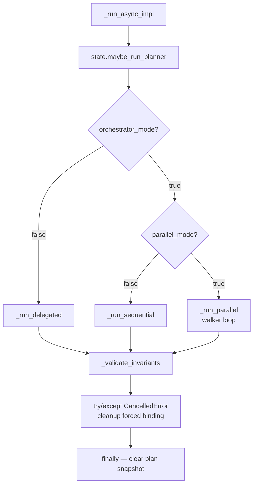
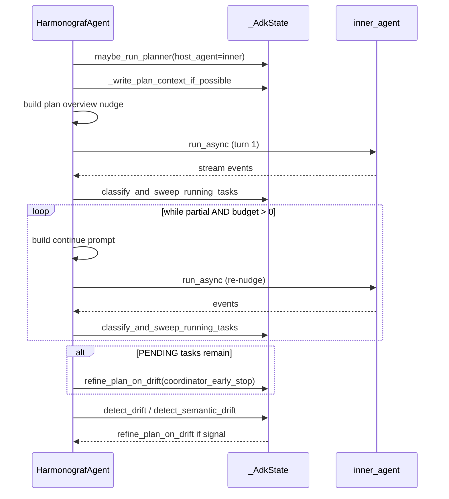
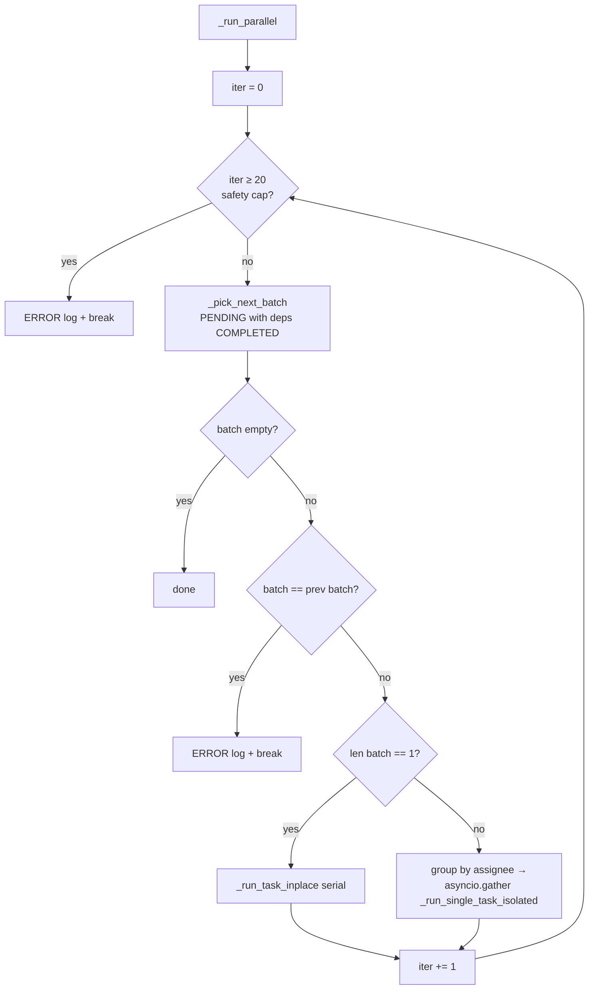
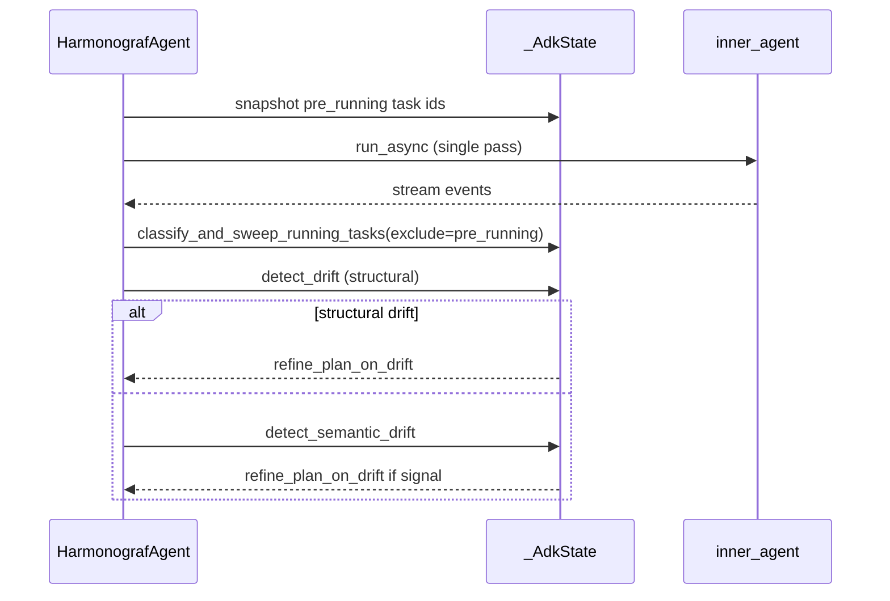

# An annotated tour of `HarmonografAgent`

`client/harmonograf_client/agent.py` (~1900 lines) is the thin orchestration
wrapper that owns the three execution modes — sequential, parallel,
delegated — and the turn-boundary invariant checks. It sits on top of
`_AdkState` from [`adk.py`](adk-plugin-tour.md); almost every side effect
happens inside the ADK plugin, and this file just decides *when* and *how*
to drive the inner agent's `run_async`.

## Construction and auto-registration

`HarmonografAgent` is a Pydantic BaseAgent subclass at `agent.py:205`. Its
fields are defined at `agent.py:266-287`:

```python
inner_agent: BaseAgent
harmonograf_client: Optional[Client] = None
planner: Optional[PlannerHelper] = None
planner_model: str = ""
refine_on_events: bool = True
enforce_plan: bool = True
max_plan_reinvocations: int = _DEFAULT_MAX_PLAN_REINVOCATIONS  # 3
orchestrator_mode: bool = True
parallel_mode: bool = False
```

Three Pydantic validators wire the instance into the ADK tree before
`_run_async_impl` ever executes:

- `_wire_inner_agent_as_subagent` (`agent.py:289-305`, mode="before") — mirrors
  the `inner_agent` into the `sub_agents` list so ADK's parent/child
  bookkeeping treats it as a subtree. Required because ADK does not know
  about `inner_agent` natively.
- `_publish_execution_mode` (`agent.py:307-333`, mode="after") — writes
  `harmonograf.execution_mode` metadata on the client so the frontend can
  render which mode was used.
- `_auto_register_reporting_tools` (`agent.py:335-356`, mode="after") —
  walks the entire descendant subtree at construction time and injects the
  seven reporting tools plus the instruction appendix into every LlmAgent.
  Idempotent: if an agent already has the tool registered it is skipped.

The auto-registration is what lets agent authors write a plain ADK subtree
and have every node pick up harmonograf reporting without manual wiring.
If you are debugging "my sub-agent is not reporting", check that validator
first — a non-LlmAgent in the tree is silently skipped.

## `_run_async_impl` dispatch

The dispatch is a literal three-way branch on the two boolean fields
`orchestrator_mode` and `parallel_mode`. Every branch is followed by
the same invariant check + cancellation safety block.




The entry point is at `agent.py:379`. The flow:

1. `state.maybe_run_planner()` at `agent.py:408`. This produces the initial
   plan and seeds `_active_plan_by_session`. The explicit call with
   `host_agent=self.inner_agent` is what differentiates
   `HarmonografAgent`'s planner invocation from the plugin's generic
   `before_run_callback` path — the latter is skipped for
   `HarmonografAgent` nodes (see `adk.py:1876-1894`) precisely because the
   agent itself takes responsibility here.
2. Dispatch on mode (`agent.py:419-427`):
   - `orchestrator_mode=True, parallel_mode=False` → `_run_sequential`
   - `orchestrator_mode=True, parallel_mode=True` → `_run_parallel`
   - `orchestrator_mode=False` → `_run_delegated`
3. After the dispatch returns, `_validate_invariants(state, hsession_id)`
   runs at `agent.py:433`. Violations are logged; under pytest, error-level
   violations raise `AssertionError`.
4. Cancellation safety block (`agent.py:438-455`) catches
   `asyncio.CancelledError` and `GeneratorExit`, cleans up open spans, and
   clears the forced-task binding so the next run starts clean.
5. The `finally` at `agent.py:456-464` clears any plan snapshot attached
   to the invocation.

## `_run_sequential`: single pass with re-nudge

At `agent.py:576-802`. Sequential mode feeds the entire plan as one user
turn and lets the coordinator LLM drive the per-task lifecycle through
reporting tools. The structure:

1. **Degrade to delegated** if there is no `plan_state` (`agent.py:600-608`).
2. **Write plan context** into `session.state` via
   `_write_plan_context_if_possible` (`agent.py:622`) so the before-model
   callback sees fresh `harmonograf.*` keys.
3. **Inject a plan overview nudge** as a synthetic user Content event via
   `_build_plan_overview_prompt` (`agent.py:874`). The overview lists every
   task with id, title, assignee, and dependencies, and includes the
   instruction appendix explaining the reporting-tool lifecycle.
4. **Run the inner agent once** and collect events
   (`agent.py:635-651`).
5. **Sweep RUNNING tasks** via `classify_and_sweep_running_tasks`
   (`agent.py:664`). This inspects the events, groups by task id, and
   classifies each into one of {`completed`, `partial`, `failed`,
   `untouched`}. The classifier is the thing that knows how to handle
   models that reported progress in prose without using the tools.
6. **Early-stop re-invocation loop** (`agent.py:687-767`). If any outcome
   came back `partial`, or if there are PENDING tasks with at least one
   terminal task already completed, the agent re-nudges with
   `_build_continue_prompt` (`agent.py:931`) and runs again. The loop is
   bounded by `state.reinvocation_budget()` (`agent.py:696`), which
   defaults to `_PARTIAL_REINVOCATION_BUDGET` = 3.
7. **Fire `coordinator_early_stop` drift** once per run if PENDING tasks
   remain after the loop exhausts (`agent.py:715`). See the drift-catalog
   entry for
   [`coordinator_early_stop`](drift-taxonomy-catalog.md#4-coordinator_early_stop).
8. **Post-run drift scan** (`agent.py:769-802`) — tries structural
   `detect_drift` first, then `detect_semantic_drift`, and calls
   `refine_plan_on_drift` if either signals.

The full sequential pass, with the partial-retry loop and the final
drift scan:



## `_run_parallel`: rigid DAG walker

At `agent.py:1068-1268`. Parallel mode drives the plan by topological
stages instead of letting the coordinator choose. At each iteration it
picks all PENDING tasks whose dependencies are satisfied and runs them
concurrently, grouping by assignee so that an agent only runs one task at
a time but different agents can run simultaneously.

Key pieces:

- **Safety cap.** `_ORCHESTRATOR_WALKER_SAFETY_CAP = 20` (`agent.py:68`)
  bounds the walker iteration count. If a plan takes more than 20 stages
  to drain, something is wrong. Checked at `agent.py:1107-1117`.
- **Batch picking.** `_pick_next_batch` (`agent.py:1569-1626`) returns all
  PENDING tasks whose predecessors are all COMPLETED, in plan order. The
  status authority is `plan_state.tasks[tid].status`, not the walker's
  local `completed_results` dict — this matters because other code paths
  (reporting tools, state_delta) can mutate statuses between iterations.
- **Cycle / repeat-batch guard.** `cur_batch_ids == prev_batch_ids`
  triggers an ERROR log and break (`agent.py:1127-1139`). Two consecutive
  iterations returning the same batch means nothing advanced — either a
  bug or a stuck model.
- **Single-task batches are serial.** `_run_task_inplace` (`agent.py:1269`)
  is used for stages of size 1, to preserve the exact semantics of the
  sequential path when concurrency is irrelevant.
- **Multi-task batches dispatch concurrently.** Tasks grouped by assignee
  (`agent.py:1173-1176`), each group serialized, and
  `asyncio.gather(*groups)` dispatched at `agent.py:1192`. Events stream
  back through a shared `asyncio.Queue` so the parent run_async can
  re-yield them in deterministic order.
- **Per-task isolation.** `_run_single_task_isolated` (`agent.py:1465`) is
  the concurrent-safe path. It sets the `_forced_task_id_var` ContextVar
  at `agent.py:1496` so that all spans emitted by the sub-run bind to the
  right task, resolves the assignee agent at `agent.py:1498`, runs the
  inner agent, pushes events to the shared queue, and marks completion
  at `agent.py:1535`. The ContextVar scoping is essential — the assignee
  sub-run shares the parent's asyncio task graph, so any non-ContextVar
  mechanism would cause spans from concurrent tasks to clobber each
  other's bindings.

The walker loop, including the safety cap, the repeat-batch guard, and
the per-stage size-1-vs-multi branch:



## `_run_delegated`: single pass, observer only

At `agent.py:470-570`. Delegated mode is the lightest — it runs the inner
agent once and observes drift afterwards. The noteworthy part is the
pre-running-task exclusion: before the run, it snapshots the set of tasks
that were already RUNNING (`agent.py:492-502`), then passes that set as
`exclude=pre_running` to `classify_and_sweep_running_tasks`
(`agent.py:544`). Without the exclusion, tasks that were mid-run from a
previous invocation would get classified as `untouched` this turn and
incorrectly fail.

Drift detection at `agent.py:558-570` runs the same two-layer check
(structural then semantic) as sequential.



## The `Aclosing` wrapper

`aclosing` is imported conditionally from
`google.adk.utils.context_utils` at `agent.py:56`. It is a context manager
that guarantees an async generator's `aclose()` is called when the
`async with` block exits, regardless of exception. It wraps every inner
agent run:

```python
async with aclosing(self.inner_agent.run_async(ctx)) as events:
    async for ev in events:
        ...
```

This matters because OpenTelemetry context is attached to async
generators, and if a generator is abandoned without `aclose()` (e.g. on
cancellation), the context stays pinned and leaks into the next
generator. The leak manifests as spans being nested under an unrelated
parent, which in turn corrupts the frontend's waterfall. The fallback at
`agent.py:517-521` handles ADK versions that do not export `aclosing`.

## Invariant validation at turn boundaries

`_validate_invariants` (`agent.py:805-823`) is a static method that calls
`invariants.check_plan_state(state, hsession_id)` and logs each violation
at its severity level. Under pytest, error-severity violations raise
`AssertionError` (via `invariants.enforce`). This is called from
`_run_async_impl` after every dispatch mode returns. See
[`invariant-validator.md`](invariant-validator.md) for the eight rules.

The validation is cheap enough that running it on every turn in production
is fine — most checks are O(tasks in plan) dict lookups.

## Re-invocation budget

Two budgets coexist:

- **Sequential partial budget.** `_PARTIAL_REINVOCATION_BUDGET = 3`
  (`agent.py:71`) controls how many times `_run_sequential` will re-nudge
  the coordinator after a partial outcome. Accessed via
  `state.reinvocation_budget()` (`agent.py:696`).
- **Per-task retry budget.** `_run_task_inplace` (`agent.py:1348-1427`)
  and `_run_single_task_isolated` enforce the same budget on a per-task
  basis. Exhaustion marks the task FAILED via `mark_task_failed`
  (`agent.py:1365`).

The two budgets exist independently — a sequential run with three
retries for the whole turn, and a parallel task with three retries for
itself, can both be in flight at once without interfering.

## Helpers worth knowing

- `_build_plan_overview_prompt` (`agent.py:874`) — first-turn user nudge.
- `_build_continue_prompt` (`agent.py:931`) — re-nudge after partial.
- `_fire_coordinator_early_stop` (`agent.py:962`) — records the drift
  entry for sequential mode exiting with pending tasks.
- `_pending_task_ids` (`agent.py:1003`).
- `_any_task_terminal` (`agent.py:1019`).
- `_resolve_assignee_agent` (`agent.py:1549`) — maps an assignee string
  to a concrete `BaseAgent`, preferring exact-name matches in
  `sub_agents`, then falling back to `inner_agent`.
- `_extract_result_summary` (`agent.py:1733`) — pulls the trailing
  non-thought text from the last model event, truncated to 500 chars.
- `_append_nudge_event` (`agent.py:1840`) — appends a synthetic user
  Content to the session so the next `run_async` sees it.

## Gotchas that bit prior iterations

- **Do not skip the `aclosing` wrapper.** Earlier iterations had bare
  `async for` without aclosing and saw spans from the next run appear as
  children of the previous run's generator. The leak is subtle because
  it only shows up under cancellation paths.
- **Plan-context writes before model call, diff after.** Do not move the
  `_write_plan_context_if_possible` call below the run — the whole point
  is that the before-model callback reads a fresh state and the
  after-model callback diffs against the snapshot. Reordering breaks the
  agent-write detection path.
- **Parallel mode requires assignee-grouping.** Letting two concurrent
  tasks use the same agent at once has triggered ADK's own assumptions
  about single-threaded agent execution and produced wedged runs.
- **The safety cap is not arbitrary.** Removing or raising
  `_ORCHESTRATOR_WALKER_SAFETY_CAP` has historically masked actual
  infinite-refine bugs by letting them run for thousands of iterations.
  If you hit it, look for an underlying plan-state mutation issue rather
  than raising the cap.
- **Auto-registration is silent on non-LlmAgent nodes.** Custom agents
  that subclass BaseAgent directly (rather than LlmAgent) will be walked
  past without reporting tools. This is usually the root cause of "my
  agent runs but doesn't report anything".
