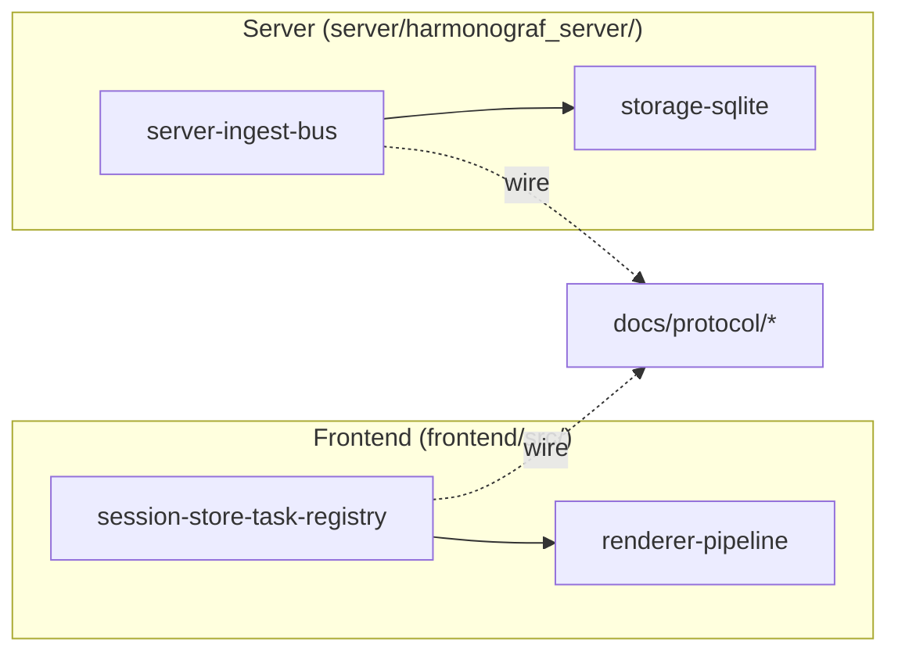

# Harmonograf internals: annotated tours

These documents go beyond the reference-style dev guide. They are narrative
walkthroughs of the hottest, most load-bearing subsystems — the kind of docs
you load when you are about to edit a hot path and do not want to spend three
hours reading source to build the mental model first.

> **Post-goldfive-migration scope.** Harmonograf no longer owns orchestration,
> planning, drift detection, invariant checking, or the ADK state machine —
> those live in [goldfive](https://github.com/pedapudi/goldfive). The tours
> below cover what *stayed* in harmonograf: server ingest, storage, frontend
> rendering, and the session store. For the split of responsibilities and
> how the two projects compose, see [../goldfive-integration.md](../goldfive-integration.md).

The wire protocol, data model, and RPC surface are documented separately under
[`docs/protocol/`](../protocol/index.md). These internals docs link to
protocol docs where the wire shape matters and never duplicate them. When in
doubt about what a field *means* on the wire, read protocol; when in doubt
about *why* a file on one side of the wire does what it does at runtime, read
internals.

## Reading order

1. [`server-ingest-bus.md`](server-ingest-bus.md) — the server fan-in for all
   telemetry, the pub/sub bus with drop-oldest backpressure, the
   control-router that correlates acks from multiple live streams per agent,
   the per-session drift ring used for late-subscribe replay, and the
   intervention aggregator that merges annotations + drifts + plan
   revisions into one chronological list.
2. [`storage-sqlite.md`](storage-sqlite.md) — the SQLite backing store.
   Schema with inline commentary, the idempotent migration pattern, PRAGMAs,
   and the cascade-delete paths.
3. [`session-store-task-registry.md`](session-store-task-registry.md) — the
   mutable frontend hot path. `SessionStore` with `AgentRegistry`,
   `SpanIndex`, `TaskRegistry`, `ContextSeriesRegistry`, `DriftRegistry`,
   and `DelegationRegistry` deliberately sidestep React/Zustand and run
   direct subscriptions into the canvas renderer. Read before adding any new
   field to the frontend data model.
4. [`renderer-pipeline.md`](renderer-pipeline.md) — how the Gantt canvas
   actually draws. Triple-buffered canvas layers, span bucketing for batch
   fill, binary-searched context-window overlay, and the hit-test path that
   powers selection.
5. [`drift-taxonomy-catalog.md`](drift-taxonomy-catalog.md) — pointer
   into goldfive's `DriftKind` taxonomy. The mapping of drift strings to
   UI badges lives in `frontend/src/gantt/driftKinds.ts`.

## When to read which doc

| If you are about to… | Read |
| --- | --- |
| Touch frontend rendering, hit-test, or minimap | [`renderer-pipeline.md`](renderer-pipeline.md), [`session-store-task-registry.md`](session-store-task-registry.md) |
| Wire a new RPC or change a Delta kind | [`server-ingest-bus.md`](server-ingest-bus.md), and [`docs/protocol/frontend-rpcs.md`](../protocol/frontend-rpcs.md) |
| Debug a dropped-event / backpressure issue | [`server-ingest-bus.md`](server-ingest-bus.md) |
| Change the storage schema | [`storage-sqlite.md`](storage-sqlite.md) |
| Investigate orchestration-side behaviour (plan, drift, steering) | Goldfive's docs — orchestration is no longer a harmonograf concern. |

## Source-reference conventions

Every doc references source as `path/file.ext:LINE`. These are intended to be
click-through jumps in your editor. They were written against a specific
snapshot of the repo — if a line has drifted, search for the surrounding
symbol name in the reference rather than assume the doc is wrong. Symbol
names are more stable than line numbers.
