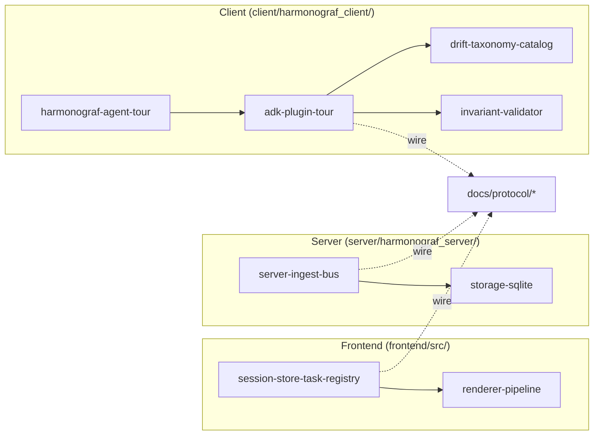

# Harmonograf internals: annotated tours

These documents go beyond the reference-style dev guide. They are narrative
walkthroughs of the hottest, most load-bearing subsystems — the kind of docs
you load when you are about to edit a hot path and do not want to spend three
hours reading source to build the mental model first.

The wire protocol, data model, and RPC surface are documented separately under
[`docs/protocol/`](../protocol/index.md). These internals docs link to
protocol docs where the wire shape matters and never duplicate them. When in
doubt about what a field *means* on the wire, read protocol; when in doubt
about *why* a file on one side of the wire does what it does at runtime, read
internals.

The map below shows which subsystem each tour describes and how the docs
relate to one another and to the wire-protocol docs.

## Reading order

If you are new to the codebase, read in this order:

1. [`adk-plugin-tour.md`](adk-plugin-tour.md) — the ADK callback plugin is the
   single densest file in the repo (`client/harmonograf_client/adk.py` at
   ~5900 lines). It owns task stamping, drift detection, refine, and every
   telemetry span the client emits. Most of the plan-execution protocol lives
   inside one class, `_AdkState`.
2. [`harmonograf-agent-tour.md`](harmonograf-agent-tour.md) — `HarmonografAgent`
   is the thin wrapper in `agent.py` that chooses between sequential, parallel,
   and delegated orchestration and handles the re-invocation budget. It
   delegates almost everything to `_AdkState` but owns the walker loop for the
   parallel mode.
3. [`drift-taxonomy-catalog.md`](drift-taxonomy-catalog.md) — the complete
   catalogue of every drift kind harmonograf fires, with trigger condition,
   severity, recoverable flag, fire site, and frontend badge. Treat this as
   the living index of "what can go wrong during a run and what we do about
   it".
4. [`invariant-validator.md`](invariant-validator.md) — the eight invariants
   that run at every turn boundary and catch state-machine violations before
   they cascade. Short file, high leverage. Read before editing anything that
   touches `PlanState.tasks[...].status` transitions.
5. [`session-store-task-registry.md`](session-store-task-registry.md) — the
   mutable frontend hot path. `SessionStore` / `TaskRegistry` deliberately
   sidestep React/Zustand and run direct subscriptions into the canvas
   renderer. Read before adding any new field to the frontend data model.
6. [`renderer-pipeline.md`](renderer-pipeline.md) — how the Gantt canvas
   actually draws. Triple-buffered canvas layers, span bucketing for batch
   fill, binary-searched context-window overlay, and the hit-test path that
   powers selection. Read before touching anything in
   `frontend/src/gantt/renderer.ts`.
7. [`server-ingest-bus.md`](server-ingest-bus.md) — the server fan-in for all
   telemetry, the pub/sub bus with drop-oldest backpressure, and the
   control-router that correlates acks from multiple live streams per agent.
8. [`storage-sqlite.md`](storage-sqlite.md) — the SQLite backing store.
   Schema with inline commentary, the idempotent migration pattern, PRAGMAs,
   and the cascade-delete paths.

## When to read which doc

| If you are about to… | Read |
| --- | --- |
| Add a new ADK callback hook, change stamping, or add a drift kind | [`adk-plugin-tour.md`](adk-plugin-tour.md), [`drift-taxonomy-catalog.md`](drift-taxonomy-catalog.md) |
| Change orchestration behavior (sequential / parallel / delegated) | [`harmonograf-agent-tour.md`](harmonograf-agent-tour.md) |
| Add a field to `PlanState`, `Task`, or `Span` | [`invariant-validator.md`](invariant-validator.md), [`session-store-task-registry.md`](session-store-task-registry.md), [`storage-sqlite.md`](storage-sqlite.md) |
| Touch frontend rendering, hit-test, or minimap | [`renderer-pipeline.md`](renderer-pipeline.md), [`session-store-task-registry.md`](session-store-task-registry.md) |
| Wire a new RPC or change a Delta kind | [`server-ingest-bus.md`](server-ingest-bus.md), and [`docs/protocol/frontend-rpcs.md`](../protocol/frontend-rpcs.md) |
| Debug a dropped-event / backpressure issue | [`server-ingest-bus.md`](server-ingest-bus.md) |
| Change the storage schema | [`storage-sqlite.md`](storage-sqlite.md) |
| Investigate why a run kept refining | [`drift-taxonomy-catalog.md`](drift-taxonomy-catalog.md) |

## Source-reference conventions

Every doc references source as `path/file.ext:LINE`. These are intended to be
click-through jumps in your editor. They were written against a specific
snapshot of the repo — if a line has drifted, search for the surrounding
symbol name in the reference rather than assume the doc is wrong. Symbol
names are more stable than line numbers.
