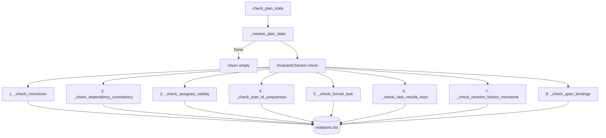
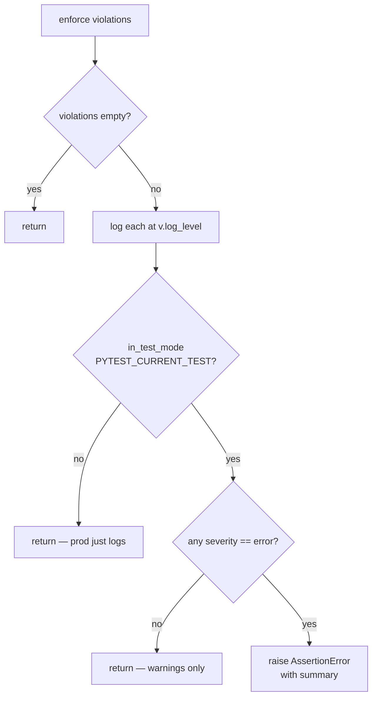

> **DEPRECATED (goldfive migration).** `client/harmonograf_client/invariants.py`
> has been deleted. Invariant checking is a goldfive responsibility now. See
> [../goldfive-integration.md](../goldfive-integration.md) and
> [../goldfive-migration-plan.md](../goldfive-migration-plan.md).

# The invariant validator

`client/harmonograf_client/invariants.py` (427 lines) is a small, high-leverage
file that runs a fixed set of consistency checks against `_AdkState` at every
turn boundary. The goal is to catch state-machine violations as close to
their cause as possible, rather than letting a bad status transition cascade
into a corrupted plan ten minutes later.

It is intentionally standalone — no imports from `adk.py`, no I/O, no async.
A single entry point (`check_plan_state`) returns a list of violations. The
caller decides whether to log, raise, or escalate.

## Entry points

- `check_plan_state(state, hsession_id)` (`invariants.py:369`) — runs all
  eight invariants via the module-level default checker
  (`_DEFAULT_CHECKER`, `invariants.py:366`). Returns `list[InvariantViolation]`.
- `reset_default_checker()` (`invariants.py:383`) — clears the
  cross-turn `_last_status` history. Used in tests to avoid leaking state
  between cases.
- `enforce(violations, context="")` (`invariants.py:402`) — logs each
  violation at its severity level; under pytest raises `AssertionError`
  for any error-severity violation.
- `in_test_mode()` (`invariants.py:395`) — true iff `PYTEST_CURRENT_TEST`
  is in the environment (`invariants.py:399`).

The normal call path from `HarmonografAgent._validate_invariants`
(`agent.py:805-823`) is: `check_plan_state` → `enforce` → logged
violations.

## The InvariantViolation record

Defined at `invariants.py:58`. Four fields:

```python
@dataclass
class InvariantViolation:
    rule: str       # stable tag, e.g. "monotonic_state"
    severity: str   # "warning" or "error"
    detail: str     # human one-liner
```

The `rule` is deliberately a stable string and not an enum — telemetry
dashboards key off it, and adding a new rule should not require a coordinated
constant update. `log_level()` (`invariants.py:74`) returns
`logging.ERROR` or `logging.WARNING` based on severity.

## The eight invariants

All eight run in a fixed order from `InvariantChecker.check`
(`invariants.py:93`). The fan-out below is the literal call order — each
arm independently appends to the shared `violations` list.



### 1. Monotonic status transitions (`_check_monotonic`, line 124)

The core state-machine rule. Uses `_last_status: dict[(hsession, tid), str]`
(`invariants.py:156`) to track the previous status for every task across
turns, and `_ALLOWED_TRANSITIONS` (`invariants.py:49-55`) as the edge list:

```python
_VALID_STATUSES = frozenset({"PENDING","RUNNING","COMPLETED","FAILED","CANCELLED"})
_TERMINAL_STATUSES = frozenset({"COMPLETED","FAILED","CANCELLED"})
_ALLOWED_TRANSITIONS = {
    "PENDING":   {"PENDING","RUNNING","CANCELLED","FAILED"},
    "RUNNING":   {"RUNNING","COMPLETED","FAILED","CANCELLED"},
    "COMPLETED": {"COMPLETED"},
    "FAILED":    {"FAILED"},
    "CANCELLED": {"CANCELLED"},
}
```

Terminal states loop only to themselves. Any edge outside this graph is an
error-severity violation with rule `"monotonic_state"`.

**Worked example.** The COMPLETED → RUNNING cycle bug that drove the
`_stamp_attrs_with_task` terminal guard: a forced-task stamp attempted to
re-bind a completed task back to RUNNING. Even with the guard in place, the
invariant would still catch it at the next turn boundary, raising in pytest
and logging a clear error in prod. The two defenses are layered on purpose.

### 2. Dependency consistency (`_check_dependency_consistency`, line 159)

A task cannot be COMPLETED while one of its predecessors is still PENDING.
Warning, not error — dependency graphs can legitimately get out of order
during refine, and the planner is expected to clean it up within a turn or
two. Rule: `"dependency_consistency"`.

**Worked example.** `t1 → t2`. The sub-agent goes rogue and completes t2
before t1 finished. The invariant fires a warning, the drift detector
raises `task_completion_out_of_order`, and refine rewrites the plan.

### 3. Assignee validity (`_check_assignee_validity`, line 188)

Every task's assignee must be in the `known_agents` list derived from the
plan state. Warning, rule `"assignee_validity"`.

**Worked example.** The planner LLM hallucinates `"Research_Agent"` when
the actual agent is `"research-agent"`. The canonicalizer
(`_canonicalize_plan_assignees` in adk.py:1966) tries to fix this, but if
canonicalization can't resolve a close match, the invariant surfaces the
violation so you know why no span is binding to that task.

### 4. Plan id uniqueness (`_check_plan_id_uniqueness`, line 211)

Every `plan_id` in `_active_plan_by_session` must be unique across
sessions. Error severity, rule `"plan_id_uniqueness"`.

**Worked example.** Two concurrent sessions accidentally get the same
plan id because of a bad hash seed or a replayed request. This would
confuse the frontend's cross-session plan lookup, so it is treated as an
error.

### 5. Forced task validity (`_check_forced_task`, line 240)

The current forced task id must exist in the active plan *and* must not
be terminal. Error severity, rule `"forced_task_validity"`.

**Worked example.** A race between `mark_forced_task_completed` and an
AgentTool return path leaves the forced id pointing at a now-COMPLETED
task. Without this check the next span would try to re-bind and hit the
terminal guard; with the check, we catch it at the turn boundary and
fail loudly in tests.

### 6. Task results keys (`_check_task_results_keys`, line 275)

Every key in `_task_results` must correspond to a task in the active plan.
Warning, rule `"task_results_keys"`. Catches the case where a reporting
tool wrote a result for a task id that was dropped by a later refine —
the orphaned entry should be cleaned up.

### 7. Revision history monotone (`_check_revision_history_monotone`, line 297)

`plan_state.revisions` must be in monotonically increasing timestamp
order. Warning, rule `"revision_history"`. A backslip would indicate
either a clock reset or an out-of-order refine application.

### 8. Span-binding validity (`_check_span_bindings`, line 324)

Every task id referenced in `_span_to_task` must exist in the active
plan. Warning, rule `"span_bindings"`. This catches the situation where
refine drops a task that still has live spans bound to it, which would
leave the frontend with dangling references.

## `_last_status` and why it is process-wide

`_last_status` is a field on `InvariantChecker`, but because
`_DEFAULT_CHECKER` (`invariants.py:366`) is a module-level singleton, the
dict effectively has process scope. This is intentional: the monotonic
check needs to observe transitions *across* turns of the same session, not
just within one turn. A per-call checker would lose the prior-status
memory and miss any violation that spans a turn boundary.

The dict keys are `(hsession_id, task_id)` tuples, so two sessions cannot
interfere with each other. The only cleanup mechanism is
`reset_default_checker()`, which tests call via a pytest fixture.

In production the dict grows unboundedly per long-lived process — one
entry per task per session. This is tiny in practice (tens of thousands
of entries max) but if you ever run harmonograf as a truly long-running
daemon you may want to add periodic eviction for terminated sessions.
There is no eviction currently.

## The `PYTEST_CURRENT_TEST` sentinel

`in_test_mode()` (`invariants.py:395-399`) checks for the
`PYTEST_CURRENT_TEST` environment variable, which pytest sets for every
running test. When present, `enforce()` raises `AssertionError` on any
error-severity violation. When absent (production), it just logs.

This pattern lets the same code run in two modes without branching: the
checker is always on, and the severity of the response escalates in
tests. It also means test failures are loud and structural — if a test
runs the coordinator and an invariant catches a bad transition, the
test fails on the invariant, not on the downstream symptom.

## `enforce()` decision tree

`enforce()` (`invariants.py:402`) is the policy gate that turns a list of
violations into either "log and continue" or "raise and crash the test".



## Performance: cheap enough for production

The whole check is O(tasks + revisions + span_bindings + task_results)
with constant-time dict lookups per task. A typical plan has 5-20 tasks
and maybe 100 live span bindings; the whole eight-invariant run takes
well under a millisecond. It is called once per turn, and turns are
measured in hundreds of milliseconds at minimum. Running it in
production costs less than the logging statements around it.

Because it is cheap, there is no debounce or sampling. Every turn gets
validated. If you add a new invariant, keep it O(n) — O(n²) would
eventually matter on large plans.

## False-positive scenarios and tuning

The assignee-validity check is the most common source of false
positives. Known failure modes:

- **Stale plan refine.** A refine produced a plan that dropped a subagent
  that is still in the sub_agents list. Not really a violation, but the
  check will warn until the next refine cleans it up.
- **Dynamically created agents.** If your agent factory adds subagents
  mid-run, the `known_agents` list will lag. The invariant doesn't
  observe runtime agent creation; if this is a pattern in your setup,
  either gather `known_agents` from the live subtree or downgrade this
  rule to informational.

The dependency-consistency rule can produce noisy warnings during the
window between "agent completed task t2 eagerly" and "refine updated
t1's status to COMPLETED". The warning is correct in that window but
self-healing on the next turn. The pragmatic approach is to ignore
warnings of this rule that are followed by a warning-free turn within
a few seconds.

If you need to add a new invariant, the checklist:

1. Add a `_check_*` method on `InvariantChecker` that returns
   `list[InvariantViolation]`.
2. Call it from `check()` (`invariants.py:93`) in the fixed order.
3. Pick a stable string `rule` tag — dashboards will key on it.
4. Default to warning severity unless the violation would corrupt the
   plan machine or the frontend. Errors should be reserved for things
   that would require code changes to fix.
5. Add a test that constructs a `_AdkState` (or the subset the invariant
   reads) in the violating shape and asserts the check fires.
6. Document the rule here, with a worked example of what triggers it.

## Gotchas

- **Do not raise from inside a `_check_*` method.** Return violations;
  let `enforce` decide. Raising breaks the fixed-order contract and
  skips later checks.
- **`_last_status` memory outlives `_AdkState`.** If you write a test
  that constructs two independent states with overlapping session ids,
  the monotonic check will treat them as continuations of each other.
  Always call `reset_default_checker()` in a pytest fixture.
- **Rule names are API.** Once a dashboard keys off a rule, renaming it
  silently breaks downstream tooling. Treat additions as free and
  renames as breaking.
