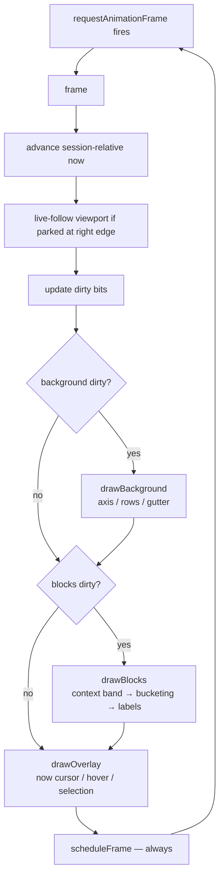
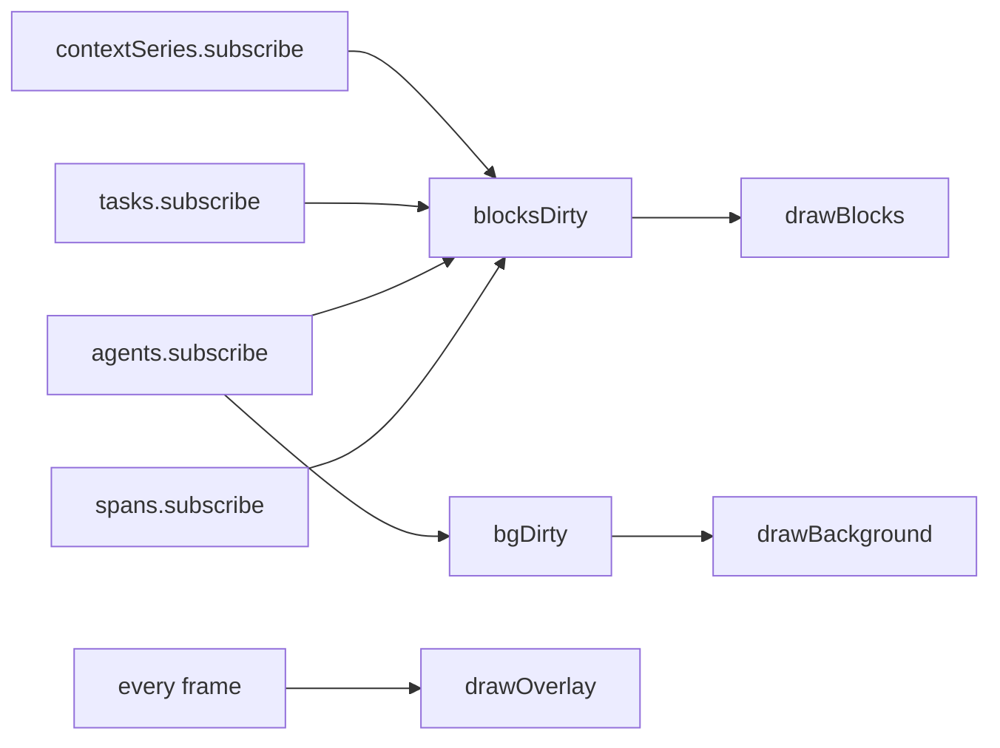

# The Gantt renderer pipeline

`frontend/src/gantt/renderer.ts` (~1830 lines) is the draw loop that owns
every pixel inside the Gantt area. `frontend/src/gantt/GanttCanvas.tsx`
(~400 lines) is the thin React shell that mounts three stacked canvases and
forwards pointer events. The two files are tightly coupled but separated for
a specific reason: React drives mounting and prop wiring, but React never
re-renders the data path. The renderer runs its own `requestAnimationFrame`
loop, subscribes to `SessionStore` directly, and mutates canvas state
outside React's reconciler.

This separation is the single most performance-critical decision in the
frontend. A 60 Hz draw loop on a React-controlled canvas would allocate
thousands of VDOM nodes per second; by contrast, the renderer allocates
almost nothing per frame.

## Three canvas layers

Explained at `renderer.ts:1-14`. The three layers are stacked at
`z-index: 0 / 1 / 2`, all sharing the same CSS size:

- **Background (layer 0).** Rows, gridlines, time axis, agent gutter.
  Redraws on viewport change, agent list change, theme change, or session
  advance. Rarely redraws inside a still frame.
- **Blocks (layer 1).** Span rectangles, context-window bands, task chips,
  edge links. Redraws when the spans layer is dirty or when viewport
  changed. This is where the bulk of the drawing time goes.
- **Overlay (layer 2).** Hover rect, selection border, now cursor,
  animated span shimmer. Redraws every frame if animated spans are in
  view; otherwise redraws on interaction only.

The layers are attached via `renderer.attach()` from
`GanttCanvas.useLayoutEffect` at `GanttCanvas.tsx:176`. Detach on unmount
(`GanttCanvas.tsx:189`) stops the rAF loop and releases subscriptions.

## The frame loop

`frame()` (`renderer.ts:508-533`) drives the three layers in a fixed
phase order. Each phase only runs work for layers whose dirty bit is
set, except for the overlay which always redraws to keep interactive
feedback responsive.




`frame()` at `renderer.ts:508-533` is the per-frame entry point, scheduled
via `scheduleFrame()` (`renderer.ts:461`). Each frame does:

1. **Advance session-relative now** from wall clock
   (`renderer.ts:512-517`). The session clock is monotonic within the
   run and drives the "now cursor" position.
2. **Live-follow viewport advancement** (`renderer.ts:520`). When the user
   is parked at the right edge, the viewport slides forward with the
   now cursor so live spans stay visible.
3. **Dirty-flag bookkeeping** (`renderer.ts:524-527`). If `nowMs` changed,
   mark the affected layers.
4. **Draw phases in order** (`renderer.ts:529-532`):
   - `drawBackground()` — time axis, row bands, gutter.
   - `drawBlocks()` — context-window overlay, task chips (pre-strip or
     ghost), span bucketing / flush, labels, tick marks, brain badges,
     dependency links.
   - `drawOverlay()` — now cursor, animated spans, hover / selection /
     edge highlights.
5. **Schedule next frame** unconditionally so interactive responsiveness
   is guaranteed even when no data changed.

The draw order matters: context band is drawn *first* inside the clipped
data area (`renderer.ts:701`) so spans visually foreground the band. The
clip prevents the band bleeding into the gutter.

## Row layout math

`rowHeight(agentId)` at `renderer.ts:1669-1672`:

- 18 px if the agent row is collapsed.
- 48 px if the agent is "focused" (used when the user double-clicks an
  agent to expand it).
- 28 px normal.

Rows stack vertically starting at `TOP_MARGIN_PX = 42` (`renderer.ts:584`),
in stable join-time order (maintained by `AgentRegistry.upsert`, which
sorts by `connectedAtMs` — see
[`session-store-task-registry.md`](session-store-task-registry.md)).

Inside each row, span rectangles can occupy up to three sub-lanes. The
lane height is `laneH = max(8, rowH / 3)` (`renderer.ts:753`), and each
span rect is positioned at
`laneTop = rowY + 2 + span.lane * laneH`
with
`rectH = max(6, laneBot - laneTop)` (`renderer.ts:754-756`).

`getRowLayout()` at `renderer.ts:390-399` exposes the same math to DOM
overlays that need to pin React elements to an agent row without
duplicating logic — for example, the per-agent popover arrows.

## Span bucketing and flush

Large sessions have thousands of spans; naïve
`ctx.fillStyle = x; ctx.fillRect(...)` per span saturates the canvas
driver. The bucketing pass at `renderer.ts:709-857` solves this by
grouping spans by visual style, then batch-flushing each bucket with a
single fillStyle change.

**Gather phase (`renderer.ts:708-828`).** Iterate agents, query span
ranges within the current viewport
(`store.spans.range(agentId, vs, ve)` — this is the culling step),
compute `(x, w)` via `msToPx`, resolve lane and lane height, and push
the rect into the bucket keyed by the span's style tuple
(fill color, opacity, hatching, dashing).

**Density merge (`renderer.ts:745-773`).** Sub-pixel spans (width < 4 px)
are not drawn as individual rects. Instead they accumulate into a
per-lane density map; the lane renders a single stripe whose intensity
encodes how many spans were collapsed into it. This keeps zoomed-out
views readable without blowing the fill budget.

**Flush phase (`renderer.ts:831-857`).** For each bucket, set fillStyle
once, then loop `fillRect` / `roundRect` on the rects list. Dashed
styles get a second pass with `setLineDash` for stroke.

**Labels pass (`renderer.ts:859-880`).** Wide blocks (typically > 60 px)
get an icon and a name. Narrow blocks skip the label entirely —
rendering truncated text per span would dominate the frame budget.

**Liveness ticks (`renderer.ts:882-899`).** Live LLM_CALL spans have a
`streaming_tick` attribute that counts partial-response arrivals. The
renderer draws that many 1 px vertical marks evenly spaced across the
block width, giving a quick visual sense of "this model is actually
responding".

**Brain badges (`renderer.ts:904-916`).** LLM_CALL spans with
`has_thinking=true` get a 10×10 glyph in the top-right corner. Gated on
`width >= 14` (`renderer.ts:812`) so it doesn't collide with the kind
icon on narrow blocks.

## Hit-testing

`hitTest(px, py)` at `renderer.ts:1608-1643` is the "what is under the
cursor" query. Walks agents top-to-bottom, finds the row whose vertical
range contains `py`, then queries that row's spans and iterates back to
front (topmost lane wins) comparing each span's rect against the point
with a ±4 px hit-zone expansion. Returns the first match's id.

`rectForSpan(spanId)` at `renderer.ts:1645-1667` is the inverse: given a
span id, reconstruct its rect from the agent row and the span's
lane/startMs/endMs. Used by DOM overlays that need to position React
elements over a known span (e.g. the selection highlight border and
the popover anchor).

`contextSampleAt(px, py)` at `renderer.ts:1121-1161` implements the
context-window tooltip. It:

1. Locates the agent row under `py` (`renderer.ts:1130-1135`).
2. Looks up cached samples and band geometry for that agent
   (`renderer.ts:1136-1137`).
3. Converts `px` to `tMs` via `pxToMs` (`renderer.ts:1138`).
4. **Binary-searches** the samples array for the largest `tMs <= pointer
   time` (`renderer.ts:1139-1150`):

   ```ts
   while (lo <= hi) {
     const mid = (lo + hi) >>> 1;
     if (samples[mid].tMs <= tMs) { idx = mid; lo = mid + 1; }
     else { hi = mid - 1; }
   }
   ```

5. Returns the sample at `idx`. This gives step-function semantics:
   between two samples, the tooltip shows the value of the most recent
   one, not a linear interpolation.

Binary search matters here because context-window series can have
thousands of samples and the tooltip query runs on every pointer move.

## Culling and zoom

Wheel handling at `renderer.ts:269-280`. The decision is:

- If Ctrl/Cmd is held, or if `|deltaY| > |deltaX|`, it's a zoom.
- Otherwise it's a pan.

Zoom uses pointer position as the focus (`renderer.ts:272`) so the block
under the cursor stays under the cursor. Zoom factor is
`Math.exp(-deltaY * 0.001)` (`renderer.ts:273`) — a non-linear curve that
feels right with mouse wheels and trackpads.

Pan converts `deltaX` to a viewport fraction:
`fraction = deltaX / (widthCss - GUTTER_WIDTH_PX)` (`renderer.ts:277`).

Culling is implicit: the span bucketing gather phase queries
`store.spans.range(agentId, vs, ve)` at `renderer.ts:743` with the
current viewport bounds, so spans outside the viewport are never
considered. This is O(log n) via the span index's spatial lookup, not a
linear scan.

Zoom bounds (`ZOOM_MIN_MS` / `ZOOM_MAX_MS`) are enforced inside
`viewport.ts::zoomAround`. `fitAll()` at `renderer.ts:368-378` computes
the smallest zoom that shows all spans plus 5% padding.

## Subscription model

Each child registry on `SessionStore` gets its own subscriber. The
callback's only job is to set the appropriate dirty bit and return —
the actual draw happens in the next `frame()`. This decouples mutation
volume from frame rate: a hundred mutations in one microtask still
result in a single redraw on the next animation frame.

```mermaid
sequenceDiagram
  participant H as useSessionWatch
  participant SS as SessionStore
  participant R as Renderer
  participant RAF as rAF loop
  H->>SS: store.spans.append(...)
  SS->>R: subscriber fires
  R->>R: blocksDirty = true
  H->>SS: store.tasks.upsertPlan(...)
  SS->>R: subscriber fires
  R->>R: blocksDirty = true
  H->>SS: store.agents.upsert(...)
  SS->>R: subscriber fires
  R->>R: bgDirty = true; blocksDirty = true
  Note over R: callbacks return immediately —<br/>no draw work yet
  RAF->>R: frame()
  R->>R: drawBackground (bgDirty)
  R->>R: drawBlocks (blocksDirty)
  R->>R: drawOverlay (always)
  R->>R: clear dirty bits
```

### Three-layer subscribe → repaint fan-out

A second view of the same machinery, focused on which subscribers mark
which canvas layers and how that fans into the per-frame draw calls:



`attach()` at `renderer.ts:197-211` subscribes to four `SessionStore`
sub-stores in order:

1. `store.spans.subscribe` — marks blocks layer dirty.
2. `store.agents.subscribe` — marks background layer dirty (row layout
   changed) and blocks layer dirty.
3. `store.tasks.subscribe` — marks blocks layer dirty (task chip and edge
   overlays).
4. `store.contextSeries.subscribe` — marks blocks layer dirty
   (context-window band).

Each subscription returns an unsubscribe function; `detach()` calls them
all. Multiple mutations in the same microtask coalesce into one redraw
because the dirty bit is idempotent and the next frame reads it once.

## Context-window overlay integration

`computeContextBandGeom()` at `renderer.ts:1069-1079` builds the polygon
for each agent's context-window band: a sequence of `{x, y}` points
along the top edge, a shared `baselineY` at the row bottom, and a
`maxRatio` that drives the fill color. The polygon is cached per agent
so the band doesn't get recomputed every frame.

The fill color comes from the peak ratio within the window
(`renderer.ts:1084`). A full context window shows bright red; a
comfortable window shows neutral gray. The color scale is stepwise, not
continuous, because continuous color changes within a frame sequence
look like flickering.

Tooltip behavior: when the pointer is in a data area but no span is
under it, `GanttCanvas.tsx:214-228` calls `renderer.contextSampleAt` and
renders a React tooltip showing tokens/limit/ratio at that time.

## Thinking badge rendering

Already described above in the bucketing section, but the full pipeline
is:

1. `HarmonografTelemetryPlugin.after_model_callback` writes
   `has_thinking=true` and `thinking_text` onto the LLM_CALL span's
   attributes.
2. Server forwards the attributes on the wire.
3. Frontend `SessionStore.spans` stores the span with its attrs.
4. During the gather phase, the bucketing pass checks
   `span.attributes['has_thinking'].value === true` at
   `renderer.ts:813-814` and pushes a brain-badge overlay record.
5. After the spans flush, the badge overlay pass
   (`renderer.ts:904-916`) draws a 10×10 glyph in the top-right corner
   of each flagged block.

Clicking a block with thinking opens the SpanPopover, which extracts the
full `thinking_text` via a dedicated `thinking.ts` extractor and renders
it in the Trajectory tab.

## The React shell (`GanttCanvas.tsx`)

The component at `GanttCanvas.tsx:42-388` takes a `SessionStore`, an
optional height, and an optional `renderOverlay` render prop for the
DOM overlay layer. Its own React state tracks hover info, context-menu
state, and canvas size — none of which affect the hot draw path.

Three `<canvas>` refs (`bgRef`, `blocksRef`, `overlayRef`,
`GanttCanvas.tsx:43-46`) are passed into `renderer.attach()` inside
`useLayoutEffect`. Detach runs in the cleanup.

Pointer events are forwarded from the container div to the renderer:

- `onClick` → `renderer.handleClick()` → hit test → selection side
  effect (`GanttCanvas.tsx:203-206, 282-294`). On a span hit, the
  frontend also searches `TaskRegistry` for a task whose `boundSpanId`
  matches and selects that task if found (`GanttCanvas.tsx:77-92`).
- `onMove` → `renderer.handlePointerMove()` → hover rect + edge hover.
  If there's no span hit but the context overlay is visible, falls
  through to `renderer.contextSampleAt()` for the tooltip
  (`GanttCanvas.tsx:214-228`).
- `onLeave` → clear hover/edge/context state.
- `onContextMenu` → `renderer.spanAt()` → open context menu.
- `onWheel` → `renderer.handleWheel()` (with `preventDefault`).

Task selection reconciliation at `GanttCanvas.tsx:149-167` subscribes to
`store.tasks` and re-resolves the span matching `selectedTaskId`
whenever the task registry mutates. This is how the Drawer and the
Canvas stay in sync.

## InterventionsTimeline insertion

The strip is not part of the canvas renderer's draw loop — it's a
separate React component
(`components/Interventions/InterventionsTimeline.tsx`) that mounts
above the Gantt in the planning and trajectory views. Data flow:

- `ListInterventions(session_id)` unary RPC on view open returns the
  full merged history.
- Live updates come through the existing `WatchSession` deltas.
  `lib/interventions.ts` mirrors the server aggregator (dedup by
  `annotation_id`, outcome attribution) so rows reconcile without
  a second RPC.

Stability contract (harmonograf #76): the component captures
`endMs` as an internal `spanEndMs` snapshot on mount and advances
it on a coarse 1s tick via `useStableSpanEnd`. Hovering a marker
never recomputes X positions from the outer `endMs`, so markers
don't jitter mid-hover.

Three visual channels encode the row (see
[ADR 0025](../adr/0025-intervention-timeline-viz.md)):

- Source (user / drift / goldfive) → color from `SOURCE_COLOR` in
  `lib/interventions.ts`.
- Kind → glyph (diamond / circle / chevron / square; distinct per
  source).
- Severity (warning / critical) → dashed amber or solid red ring.

Density clustering kicks in at
`max(14px, 2% of strip width)`; popover anchors deterministically
to the marker center. Axis ticks auto-select from a fixed ladder
(10s / 30s / 1m / 5m / 10m / 30m).

## Gotchas that bit prior iterations

- **Do not fold bucketing into the subscription callbacks.** Bucketing
  runs in the draw loop. Running it inside a subscription callback
  would allocate per-mutation and stall the UI when many mutations
  arrive at once (e.g. during a burst replay).
- **Do not set canvas size via CSS alone.** The renderer uses
  device-pixel-ratio scaling; resizing must go through
  `renderer.resize(widthCss, heightCss)` to keep the scratch buffers in
  sync. CSS-only resize produces blurry text.
- **The forced-follow rightward scroll must be gated on "user is parked
  at the right edge".** Auto-scrolling while the user is panning
  backwards is infuriating. The gate is in `viewport.ts`, not the
  renderer itself.
- **Hit-test iterates back-to-front.** If you add a new lane convention,
  keep the topmost lane first in the iteration order or selection will
  silently favor the wrong span.
- **The sub-pixel density stripe is not a "performance optimization you
  can remove".** Without it, zooming out to show an hour of activity
  rate-limits the frame loop below 10 FPS.
- **Brain-badge and liveness-tick gather happen during the span bucket
  pass, not as a separate pass.** Extracting them to a second iteration
  would double the cost of the gather phase. Keep them inline.
